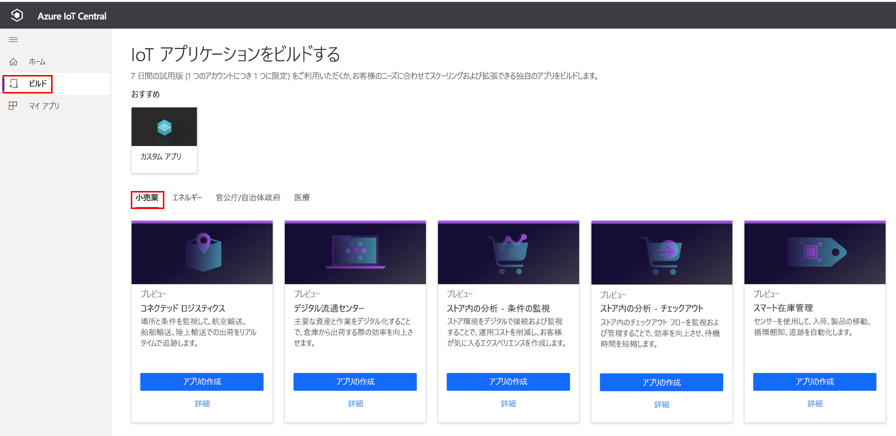
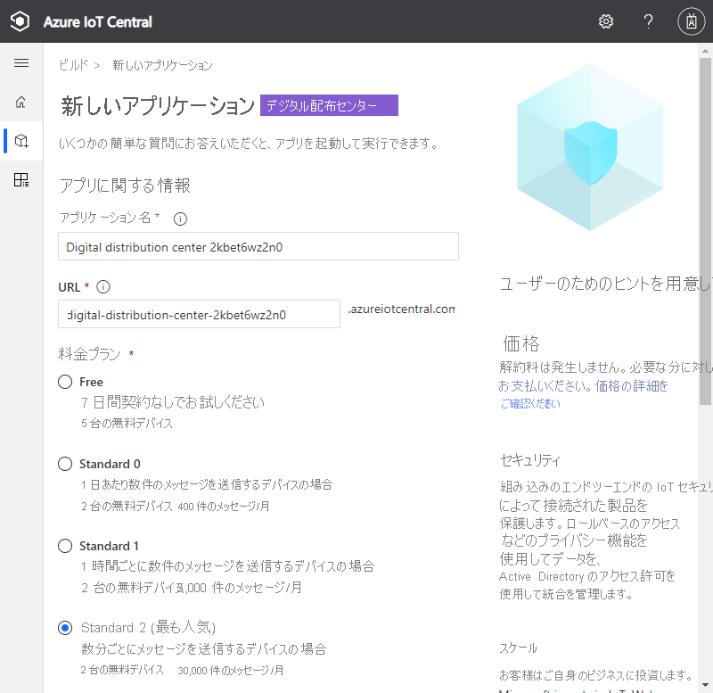
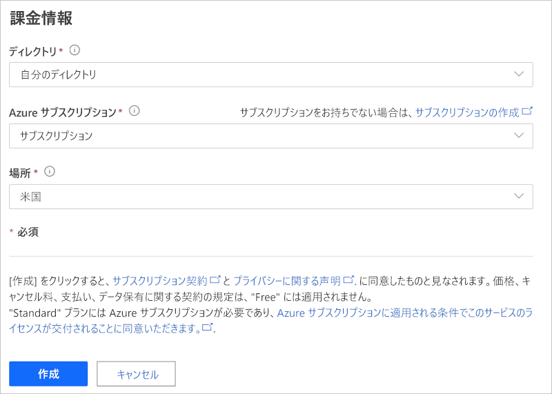
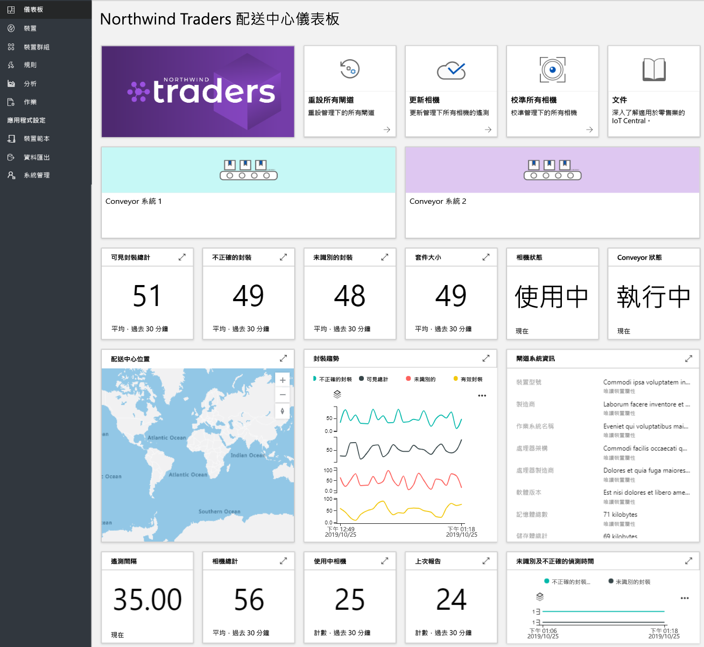
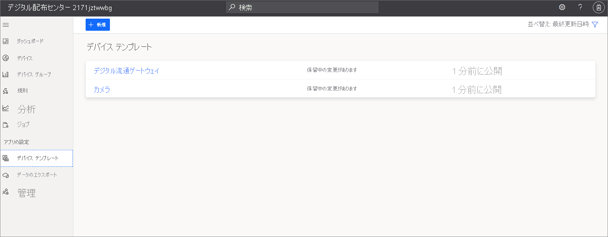
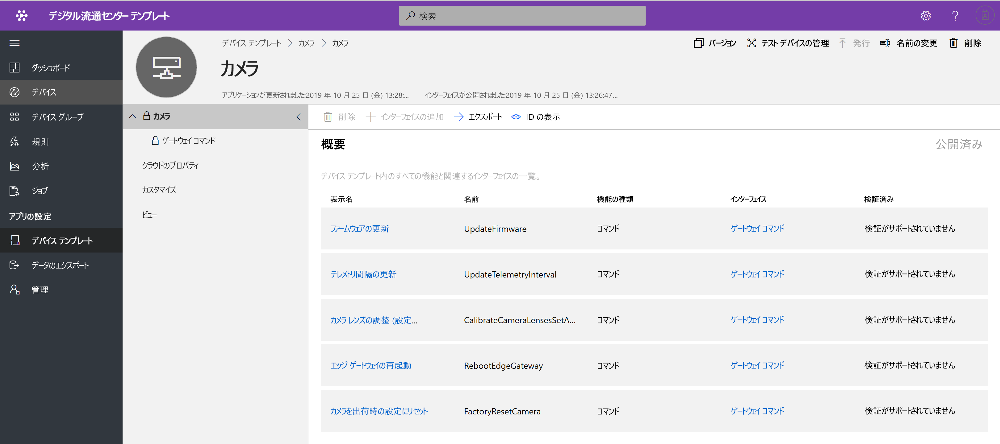
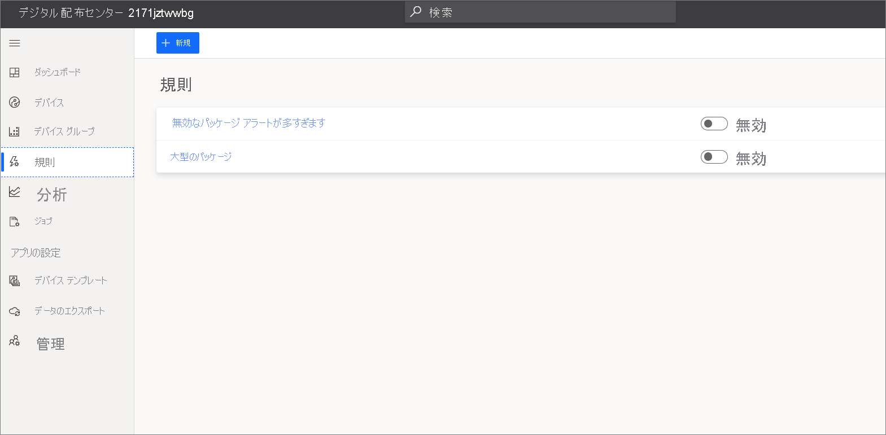
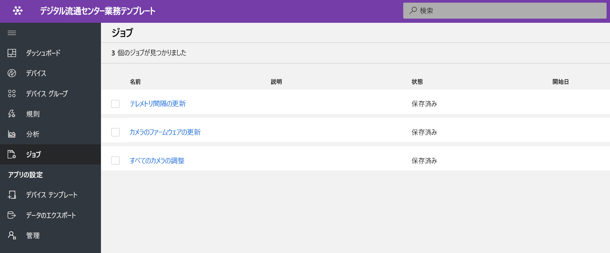
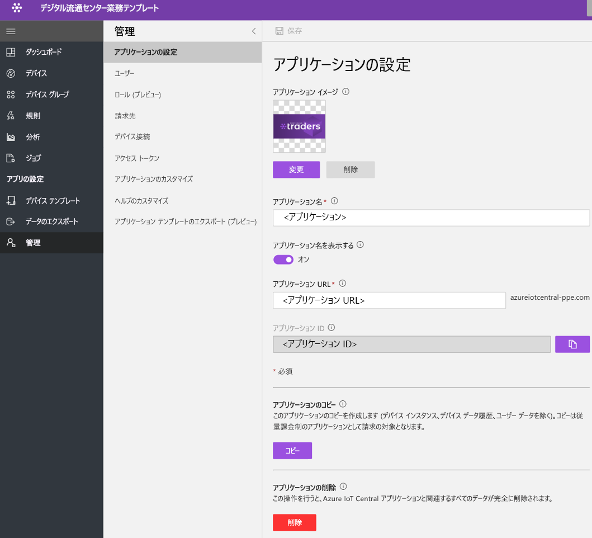

# チュートリアル:デジタル配布センター アプリケーション テンプレートを展開して調べる

このチュートリアルでは、IoT Central の**デジタル配布センター** アプリケーション テンプレートをデプロイする方法について説明します。 テンプレートをデプロイする方法、既定で含まれるもの、次にできることについて説明します。

このチュートリアルで学習する内容は次のとおりです。 
* デジタル配布センター アプリケーションを作成する 
* アプリケーションを調べる 

## 前提条件
* このアプリをデプロイするために必要な特定の前提条件はありません
* Azure サブスクリプションを用意することをお勧めしますが、なくても試してみることはできます

## デジタル配布センター アプリケーション テンプレートを作成する

以下の手順でアプリケーションを作成できます

1. Azure IoT Central のアプリケーション マネージャー Web サイトに移動します。 左側のナビゲーションバーから **[ビルド]** を選択し、 **[Retail]\(小売り\)** タブをクリックします。

    > [!div class="mx-imgBorder"]
    > 

2. **[小売業]** タブを選択し、 **[デジタル流通センター]** の下にある **[アプリの作成]** を選択します

3. **[アプリの作成]** を選択すると、[新しいアプリケーション] フォームが開き、次のように要求された詳細が設定されます。
   **[アプリケーション名]** : 既定の推奨名を使用するか、わかりやすいアプリケーション名を入力できます。
   **[URL]** : 既定の推奨 URL を使用するか、わかりやすい一意の URL を入力できます。 次に、Azure サブスクリプションが既にある場合は、既定の設定をお勧めします。 7 日間の無料試用版料金プランから始め、無料試用版が期限切れになる前に、いつでも標準の料金プランに変換することもできます。
   **課金情報**:リソースをプロビジョニングするには、ディレクトリ、Azure サブスクリプション、リージョンの詳細が必要です。
   **作成**:ページの下部にある [作成] を選択して、アプリケーションをデプロイします。

    > [!div class="mx-imgBorder"]
    > 

    > [!div class="mx-imgBorder"]
    > 

## アプリケーション ダッシュボードを調べる 

アプリ テンプレートが正常にデプロイされると、既定のダッシュボードが配布センターのオペレーターを対象とするポータルになります。 Northwind Traders 社は、コンベヤ システムを管理する架空の配布センター ソリューション プロバイダーです。 

このダッシュボードには、1 つのゲートウェイと、IoT デバイスとして機能している 1 つのカメラが表示されます。 ゲートウェイでは、有効、無効、不明、サイズなどのパッケージに関するテレメトリと共に、関連付けられたデバイス ツイン プロパティが提供されています。 すべてのダウンストリーム コマンドは、カメラなどの IoT デバイスで実行されます。 このダッシュボードは、配布センターの重要なデバイス操作アクティビティが表示されるように事前に構成されています。

ダッシュボードは、Azure IoT ゲートウェイと IoT デバイスのデバイス管理機能が表示されるように、論理的に編成されています。  
   * ゲートウェイ コマンドと制御タスクを実行できます
   * ソリューションの一部であるすべてのカメラを管理します。 

> [!div class="mx-imgBorder"]
> 

## デバイス テンプレート

[デバイス テンプレート] タブをクリックすると、ゲートウェイ機能モデルが表示されます。 機能モデルは、 **[Camera]\(カメラ\)** と **[Digital Distribution Gateway]\(デジタル配布ゲートウェイ\)** という 2 つの異なるインターフェイスを中心に構成されています

> [!div class="mx-imgBorder"]
> 

**[Camera]\(カメラ\)** - このインターフェイスには、すべてのカメラ固有のコマンド機能が整理されています 

> [!div class="mx-imgBorder"]
> 

**[Digital Distribution Gateway]\(デジタル配布ゲートウェイ\)** - このインターフェイスは、カメラから送られてくるすべてのテレメトリ、クラウドで定義されているデバイス ツインのプロパティ、ゲートウェイ情報を表します。

> [!div class="mx-imgBorder"]
> 

## ゲートウェイ コマンド
このインターフェイスには、すべてのゲートウェイ コマンド機能が整理されています

> [!div class="mx-imgBorder"]
> 

## ルール
[Rules]\(規則\) タブを選択して、このアプリケーション テンプレートに存在する 2 つの異なる規則を表示します。 これらの規則は、詳細な調査のためオペレーターにメールで通知するように構成されています。

 **[Too many invalid packages alert]\(多すぎる無効パッケージ アラート\)** - この規則は、コンベヤ システムを通過する無効なパッケージの数が多いことがカメラによって検出されるとトリガーされます。
 
**[Large package]\(大きいパッケージ\)** - この規則は、品質を検査できない大きなパッケージをカメラが検出するとトリガーされます。 

> [!div class="mx-imgBorder"]
> 

## ジョブ
[ジョブ] タブを選択すると、このアプリケーション テンプレートの一部として存在する 5 つの異なるジョブが表示されます。ジョブ機能を利用して、ソリューション全体の操作を実行できます。 このデジタル配布センター ジョブでは、デバイス コマンドとツイン機能を使用して、次のようなタスクが実行されます。
   * パッケージ検出を開始する前にカメラを調整します 
   * カメラのファームウェアを定期的に更新します
   * テレメトリの間隔を変更して、データのアップロードを管理します

> [!div class="mx-imgBorder"]
> 

## リソースをクリーンアップする
このアプリケーションをもう使わない場合は、 **[管理]**  >  **[アプリケーションの設定]** に移動し、 **[削除]** をクリックすることによって、アプリケーション テンプレートを削除します。

> [!div class="mx-imgBorder"]
> 

## 次のステップ
* デジタル配布センター ソリューション アーキテクチャの[デジタル配布センターの概念](./architecture-digital-distribution-center-pnp.md)についてさらに詳しく学習します
* 他の [IoT Central 小売りテンプレート](./overview-iot-central-retail-pnp.md)についてさらに詳しく学習します
* [IoT Central の概要](../core/overview-iot-central.md)に関する記事を参照し、IoT Central についてさらに詳しく学習します
