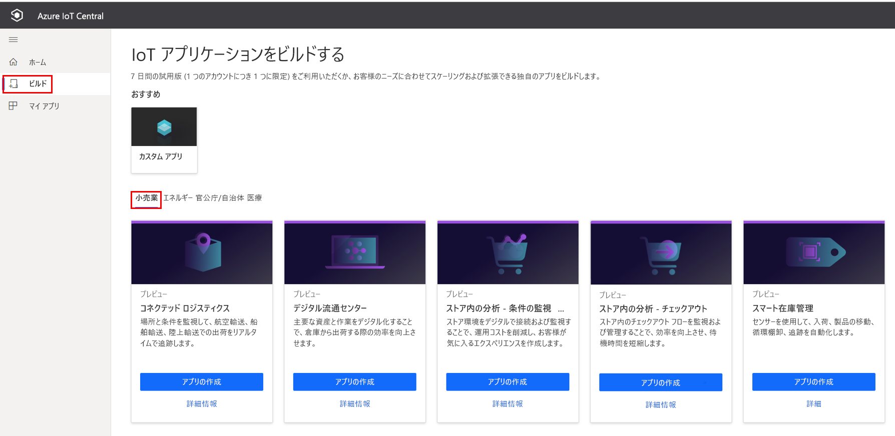
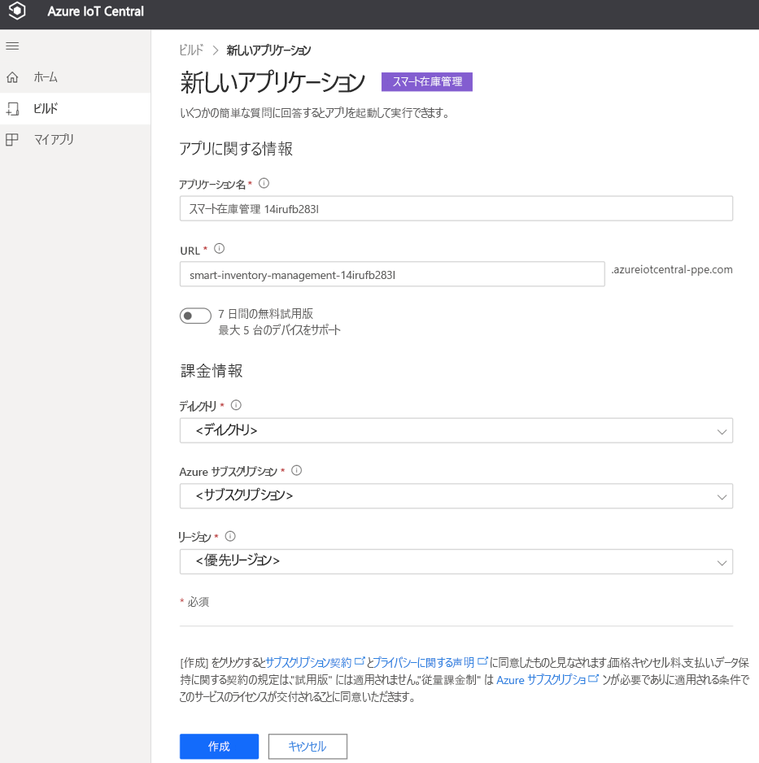
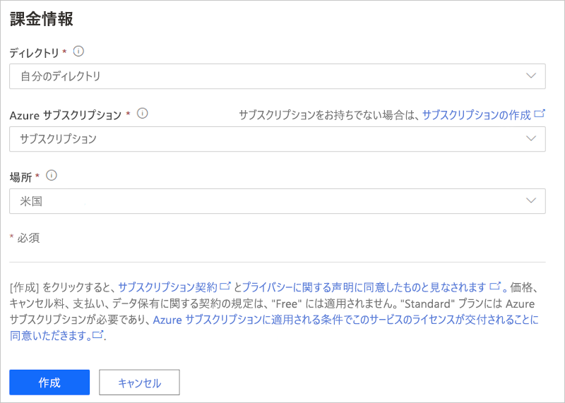
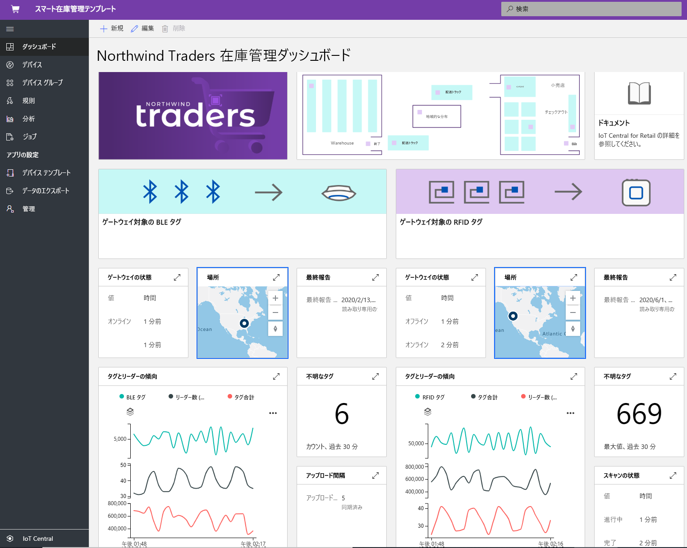
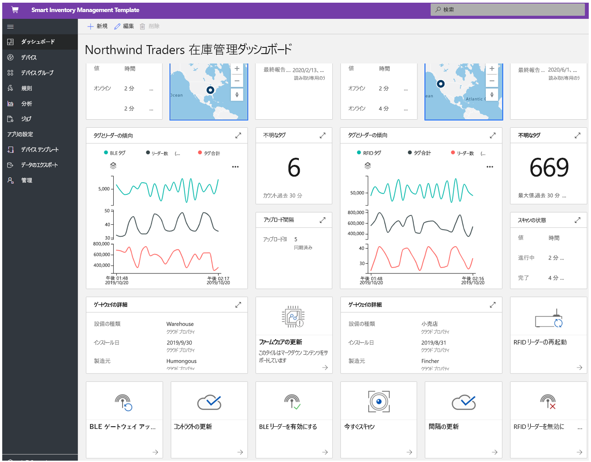
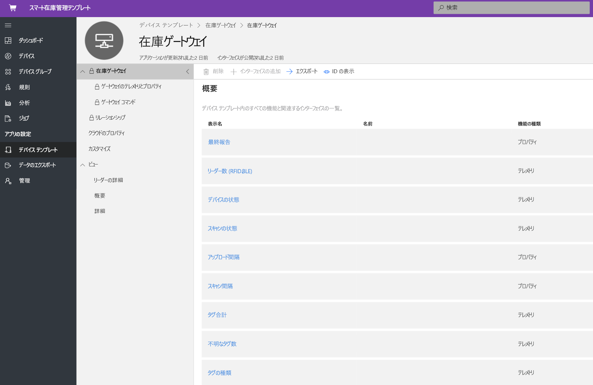
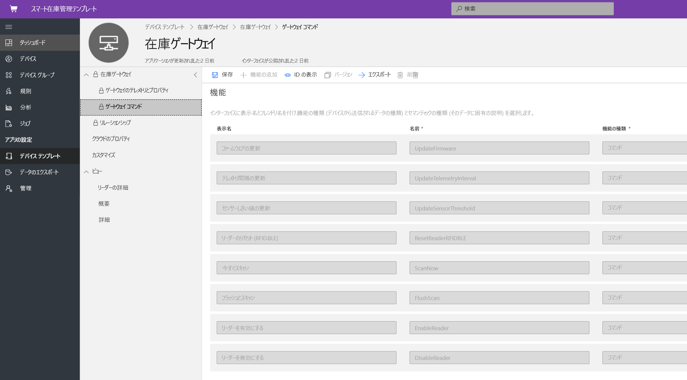
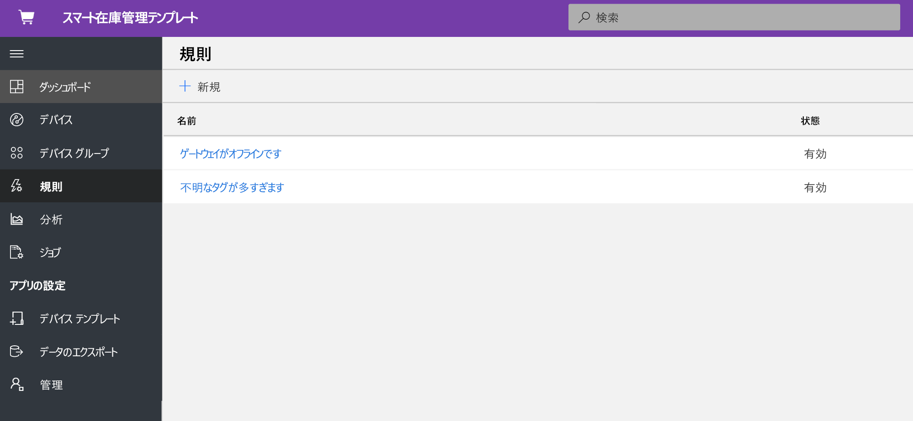
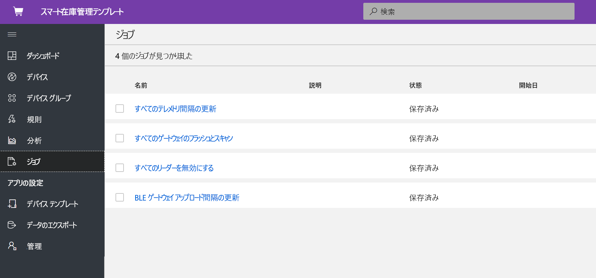
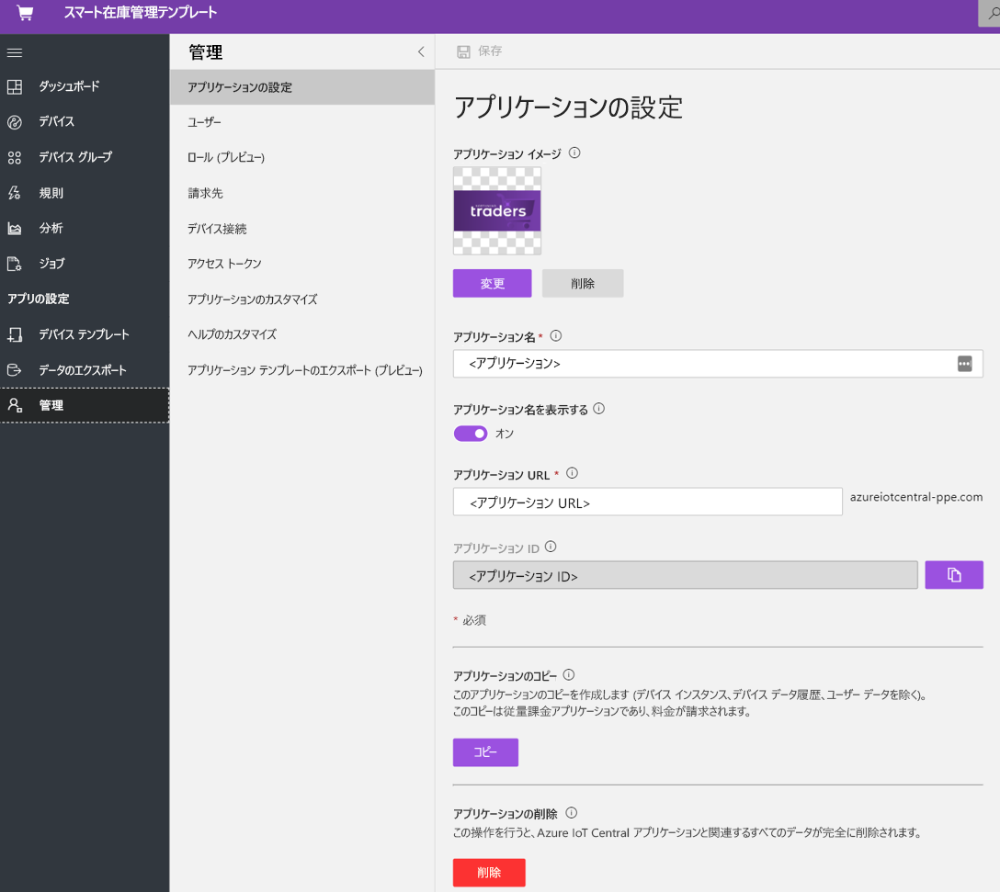

# チュートリアル:スマート インベントリの管理アプリケーション テンプレートをデプロイして調べる

このチュートリアルでは、IoT Central の**スマート インベントリの管理**アプリケーション テンプレートをデプロイする方法について説明します。 テンプレートをデプロイする方法、既定で含まれるもの、次にできることについて説明します。

このチュートリアルで学習する内容は次のとおりです。 
* スマート インベントリの管理アプリケーションを作成する 
* アプリケーションを調べる 

## 前提条件

* このアプリをデプロイするために必要な特定の前提条件はありません
* Azure サブスクリプションを用意することをお勧めしますが、なくても試してみることはできます

## スマート インベントリの管理アプリケーション テンプレートを作成する

以下の手順でアプリケーションを作成できます

1. Azure IoT Central のアプリケーション マネージャー Web サイトに移動します。 左側のナビゲーションバーから **[ビルド]** を選択し、 **[Retail]\(小売り\)** タブをクリックします。

    > [!div class="mx-imgBorder"]
    > 

2. **[小売業]** タブを選択し、 **[スマート在庫管理]** の下にある **[アプリの作成]** を選択します

3. **[アプリの作成]** を選択すると、[新しいアプリケーション] フォームが開き、次のように要求された詳細が設定されます。
   **[アプリケーション名]** : 既定の推奨名を使用するか、わかりやすいアプリケーション名を入力できます。
   **[URL]** : 既定の推奨 URL を使用するか、わかりやすい一意の URL を入力できます。 次に、Azure サブスクリプションが既にある場合は、既定の設定をお勧めします。 7 日間の無料試用版料金プランから始め、無料試用版が期限切れになる前に、いつでも標準の料金プランに変換することもできます。
   **課金情報**:リソースをプロビジョニングするには、ディレクトリ、Azure サブスクリプション、リージョンの詳細が必要です。
   **作成**:ページの下部にある [作成] を選択して、アプリケーションをデプロイします。

    > [!div class="mx-imgBorder"]
    > 

    > [!div class="mx-imgBorder"]
    > 

## アプリケーションを調べる 

### ダッシュボード 

アプリ テンプレートが正常にデプロイされると、既定のダッシュボードがスマート インベントリの管理のオペレーターを対象とするポータルになります。 Northwind Traders 社は、Bluetooth Low Energy (BLE) による倉庫管理と無線自動識別 (RFID) による小売店管理を行っている架空のスマート インベントリ プロバイダーです。 このダッシュボードには、インベントリに関するテレメトリを提供する 2 つの異なるゲートウェイと、関連するコマンド、ジョブ、アクションが表示されます。 このダッシュボードは、スマート インベントリ管理の重要なデバイス操作アクティビティが表示されるように事前に構成されています。
ダッシュボードは、2 つの異なるゲートウェイ デバイス管理操作に論理的に分割されています。 
   * 倉庫については、大きな施設のインベントリを追跡およびトレースするために、固定の BLE ゲートウェイと BLE タグがパレットにデプロイされています
   * 小売店については、店舗の在庫を追跡およびトレースするために、個々のアイテム レベルで固定の RFID ゲートウェイと RFID タグが実装されています
   * ゲートウェイの場所、状態、関連する詳細を表示します 

> [!div class="mx-imgBorder"]
> 

   * ゲートウェイ、アクティブなタグ、不明なタグの合計数を簡単に追跡できます。
   * ファームウェアの更新、センサーの無効化、センサーの有効化、センサーしきい値の更新、テレメトリ間隔の更新、デバイス サービス コントラクトの更新などのデバイス管理操作を実行できます
   * ゲートウェイ デバイスでは、完全スキャンまたは増分スキャンを使用してオンデマンドのインベントリ管理を実行できます。

> [!div class="mx-imgBorder"]
> 

## デバイス テンプレート
[デバイス テンプレート] タブをクリックすると、ゲートウェイ機能モデルが表示されます。 機能モデルは、 **[Gateway Telemetry & Property]\(ゲートウェイ テレメトリとプロパティ\)** と **[Gateway Commands]\(ゲートウェイ コマンド\)** という 2 つの異なるインターフェイスを中心に構成されています

**[ゲートウェイのテレメトリとプロパティ]** - このインターフェイスには、センサーに関連するすべてのテレメトリ、場所、デバイス情報と、ゲートウェイのしきい値や更新間隔などのデバイス ツイン プロパティ機能が表示されます。

> [!div class="mx-imgBorder"]
> 

**[Gateway Commands]\(ゲートウェイ コマンド\)** - このインターフェイスには、すべてのゲートウェイ コマンド機能が整理されています

> [!div class="mx-imgBorder"]
> 

## ルール
[Rules]\(規則\) タブを選択して、このアプリケーション テンプレートに存在する 2 つの異なる規則を表示します。 これらの規則は、詳細な調査のためオペレーターにメールで通知するように構成されています。

**[Gateway offline]\(ゲートウェイがオフライン\)** : この規則は、長期間にわたってゲートウェイからクラウドへのレポートがない場合にトリガーされます。 バッテリ低下モード、接続喪失、デバイス正常性といった原因により、ゲートウェイが応答しないことがあります。

**[Unknown tags]\(不明なタグ\)** : 資産に関連付けられているすべての RFID タグと BLE タグを追跡することが重要です。 ゲートウェイで検出される不明タグの数が多すぎる場合は、タグ ソーシング アプリケーションとの同期に問題があることを示します。

> [!div class="mx-imgBorder"]
> 

## ジョブ
[ジョブ] タブを選択すると、このアプリケーション テンプレートの一部として存在する 5 つの異なるジョブが表示されます。ジョブ機能を使用して、ソリューション全体の操作を実行できます。 この在庫管理ジョブでは、デバイス コマンドとツイン機能を使用して、次のようなタスクが実行されます。
   * すべてのゲートウェイのリーダーを無効にします
   * テレメトリのしきい値を変更します 
   * ソリューション全体でオンデマンド インベントリ スキャンを実行します。

> [!div class="mx-imgBorder"]
> 

## リソースをクリーンアップする

このアプリケーションをもう使わない場合は、 **[管理]**  >  **[アプリケーションの設定]** に移動し、 **[削除]** をクリックすることによって、アプリケーション テンプレートを削除します。

> [!div class="mx-imgBorder"]
> 

## 次のステップ
* [スマート インベントリの管理の概念](./architecture-smart-inventory-management.md)についてさらに詳しく学習します
* 他の [IoT Central 小売りテンプレート](./overview-iot-central-retail.md)についてさらに詳しく学習します
* [IoT Central の概要](../core/overview-iot-central.md)に関する記事を参照し、IoT Central についてさらに詳しく学習します
