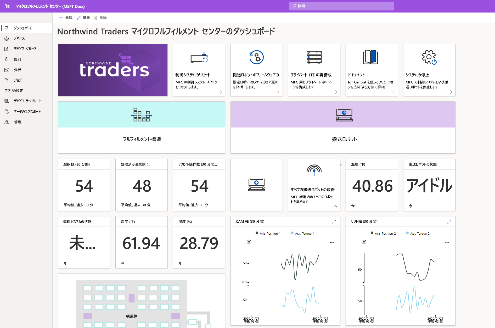
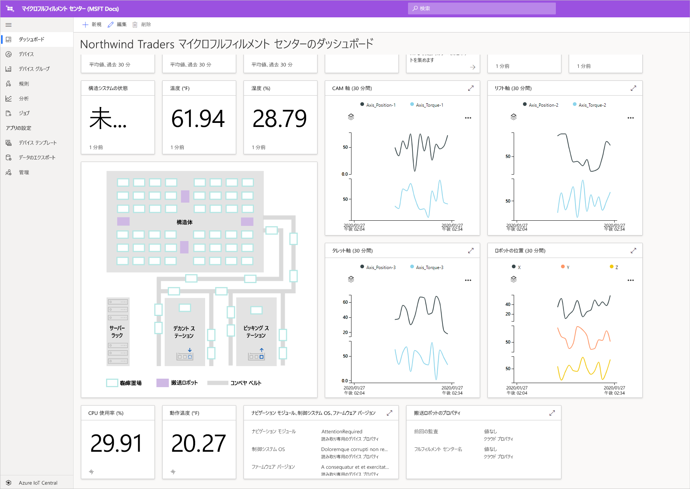
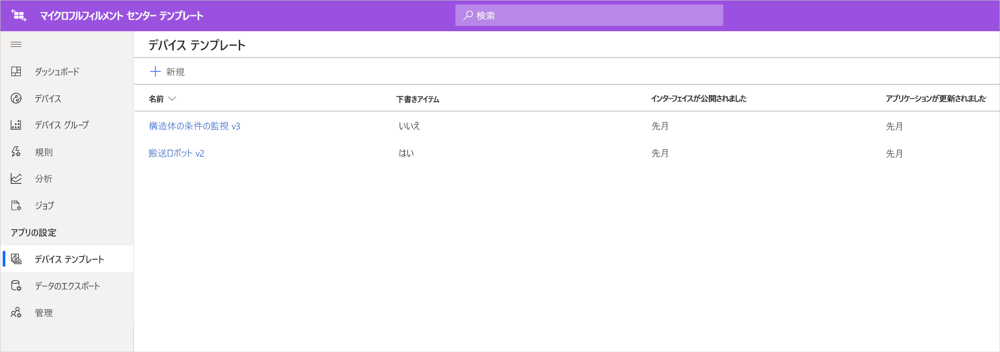

# チュートリアル:マイクロフルフィルメント センター アプリケーション テンプレートを展開して調べる

このチュートリアルでは、Azure IoT Central のマイクロフルフィルメント センター アプリケーション テンプレートを使用して、小売業ソリューションを構築します。 テンプレートのデプロイ方法、テンプレートに含まれている内容、および次に実行できることについて説明します。

## 前提条件
このチュートリアル シリーズを完了するには、Azure サブスクリプションが必要です。 必要に応じて、7 日間無料の試用版を使用することもできます。 Azure サブスクリプションがない場合は、[Azure サインアップ ページ](https://aka.ms/createazuresubscription)で作成できます。

## アプリケーションの作成 
このセクションでは、テンプレートから新しい Azure IoT Central アプリケーションを作成します。 チュートリアル シリーズ全体でこのアプリケーションを使用して、完全なソリューションを構築します。

新しい Azure IoT Central アプリケーションを作成するには:

1. [Azure IoT Central アプリケーション マネージャー](https://aka.ms/iotcentral)の Web サイトに移動します。
1. Azure サブスクリプションを持っている場合は、そのサブスクリプションへのアクセス用の資格情報を使用してサインインします。 持っていない場合は、Microsoft アカウントを使用してサインインします。

   

1. 新しい Azure IoT Central アプリケーションの作成を開始するには、 **[New Application]\(新しいアプリケーション\)** を選択します。

1. **[小売]** を選択します。  小売ページに、いくつかの小売アプリケーション テンプレートが表示されます。

プレビュー機能を使用する新しいマイクロフルフィルメント センター アプリケーションを作成するには、次のようにします。  
1. **[マイクロフルフィルメント センター]** アプリケーション テンプレートを選択します。 このテンプレートには、チュートリアルで使用するすべてのデバイス用のデバイス テンプレートが含まれています。 また、このテンプレートには、フルフィルメント センター内の状態だけでなく、搬送ロボットの状態を監視するためのオペレーター ダッシュボードが用意されています。 

    ![Azure IoT Central の [IoT アプリケーションをビルドする] ページのスクリーンショット](./media/tutorial-micro-fulfillment-center-app-pnp/iotc-retail-homepage-mfc.png)
    
1. 必要に応じて、わかりやすい**アプリケーション名**を選びます。 アプリケーション テンプレートは、Northwind Traders という架空の会社に基づいています。 

    >[!NOTE]
    >わかりやすいアプリケーション名を使用する場合でも、アプリケーションの URL には一意の値を使用する必要があります。

1. Azure サブスクリプションをお持ちの場合は、ディレクトリ、Azure サブスクリプション、リージョンを入力します。 サブスクリプションをお持ちでない場合は、7 日間の無料試用版を有効にし、必須の連絡先情報を入力できます。  

    ディレクトリとサブスクリプションの詳細については、[アプリケーションの作成のクイック スタート](../preview/quick-deploy-iot-central.md)に関するページを参照してください。

1. **作成** を選択します。

    ![Azure IoT Central の [新しいアプリケーション] ページのスクリーンショット](./media/tutorial-micro-fulfillment-center-app-pnp/iotc-retail-create-app-mfc.png)

## アプリケーションを調べる 

アプリケーション テンプレートのデプロイが正常に完了したら、**Northwind Traders マイクロフルフィルメント センター ダッシュボード**が表示されます。 Northwind Traders は、この Azure IoT Central アプリケーションでマイクロフルフィルメント センターを管理している架空の小売業者です。 このオペレーター ダッシュボードには、このテンプレートのデバイスに関する情報とテレメトリ、および実行可能な一連のコマンド、ジョブ、アクションが表示されます。 ダッシュボードは、論理的に 2 つのセクションに分かれています。 左側ではフルフィルメント建造物内の環境条件を監視でき、右側では施設内の搬送ロボットの正常性を監視することができます。  

ダッシュボードからは、次のことができます。
   * デバイス テレメトリ (ピック数、処理された注文の数など) やプロパティ (建造物のシステムの状態など) を確認する。  
   * フルフィルメント建造物内の見取り図や搬送ロボットの場所を表示する。
   * 制御システムのリセット、搬送機のファームウェアの更新、ネットワークの再構成などのコマンドをトリガーする。

     
   * オペレーターがフルフィルメント センター内の状態を監視するために使用できるダッシュボードの例を確認する。 
   * フルフィルメント センター内のゲートウェイ デバイスで実行されているペイロードの正常性を監視する。    

     

## デバイス テンプレート
[デバイス テンプレート] タブを選択すると、このテンプレートには 2 種類のデバイスが含まれていることがわかります。 
   * **搬送ロボット**: このデバイス テンプレートはフルフィルメントの建造物内に配置されている機能的な搬送ロボットの定義を表します。このロボットは、適切な保管および検索操作を実行します。 テンプレートを選択すると、ロボットがさまざまなデバイス データ (温度、軸の位置など) やプロパティ (搬送ロボットの状態など) を送信していることがわかります。 
   * **建造物の状態の監視**: このデバイス テンプレートは、環境の状態を監視できるようにする一連のデバイスと、フルフィルメント センターを強化するさまざまなエッジ ワークロードをホストするゲートウェイ デバイスを表します。 デバイスは、温度、ピック数、注文の数などのテレメトリ データを送信します。 また、環境内で実行されているコンピューティング ワークロードの状態と正常性に関する情報も送信します。 

     

[デバイス グループ] タブを選択すると、これらのデバイス テンプレートによって自動的にデバイス グループが作成されていることも確認できます。

## ルール
**[規則]** タブには、アプリケーション テンプレートに存在するサンプル規則が表示されます。この規則を使用して搬送ロボットの温度状態を監視します。 この規則を使用することで、施設内の特定のロボットが過熱状態になり、点検のためにオフラインにする必要がある場合に、オペレーターにアラートを発することができます。 

このサンプル規則を下敷きとして使用して、実際のビジネス機能にふさわしい規則を定義してください。

![[規則] タブのスクリーンショット](./media/tutorial-micro-fulfillment-center-app-pnp/rules.png)

## リソースをクリーンアップする

このアプリケーションを引き続き使用しない場合は、アプリケーション テンプレートを削除します。 **[管理]**  >  **[アプリケーションの設定]** に移動し、 **[削除]** を選択します。

![マイクロフルフィルメント センターの [アプリケーションの設定] ページのスクリーンショット](./media/tutorial-micro-fulfillment-center-app-pnp/delete.png)

## 次のステップ
* [マイクロフルフィルメント センター ソリューション アーキテクチャ](./architecture-micro-fulfillment-center-pnp.md)について詳細を確認する。
* 他の [Azure IoT Central 小売りテンプレート](./overview-iot-central-retail-pnp.md)について詳細を確認する。
* [Azure IoT Central の概要](../preview/overview-iot-central.md)を読む。
