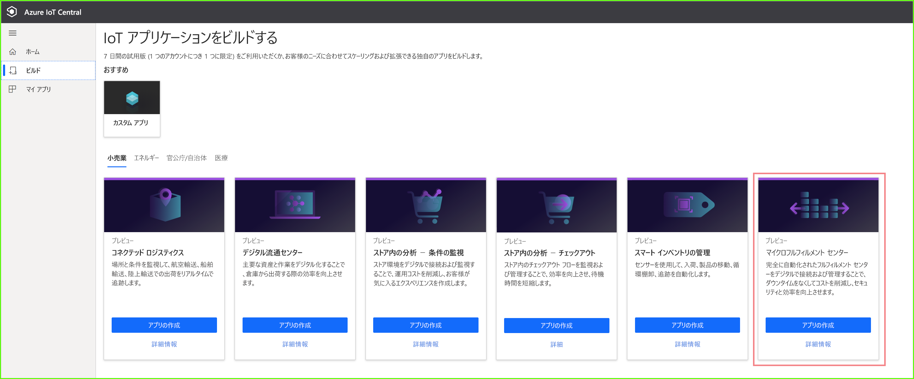
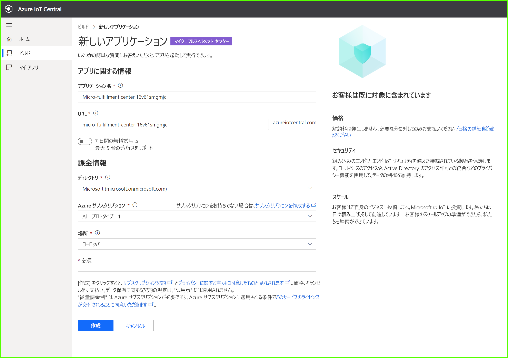
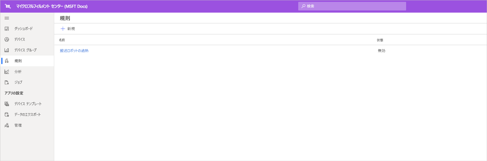
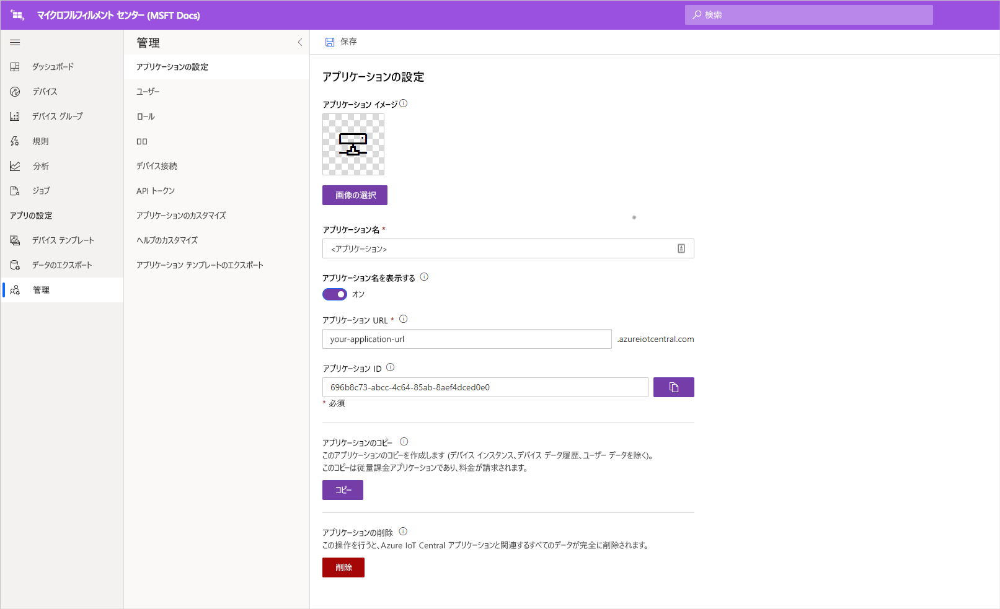

# チュートリアル:マイクロフルフィルメント センター アプリケーション テンプレートを展開して調べる

このチュートリアルでは、Azure IoT Central の "***マイクロフルフィルメント センター***" アプリケーション テンプレートを活用して、小売業ソリューションを構築する方法を説明します。 MFC テンプレートを展開する方法、既定で含まれるもの、次にできることについて説明します。

このチュートリアルでは、以下の内容を学習します。 
> [!div class="checklist"]
> * Azure IoT Central の**マイクロフルフィルメント センター** テンプレートを使用して、小売業アプリケーションを作成する
> * アプリケーションを調べる 

## 前提条件
このチュートリアル シリーズを完了するには、以下が必要です。
* Azure サブスクリプション。 必要に応じて、7 日間無料の試用版を使用することもできます。 Azure サブスクリプションがない場合は、[Azure サインアップ ページ](https://aka.ms/createazuresubscription)で作成できます。

## アプリケーションの作成 
このセクションでは、テンプレートから新しい Azure IoT Central アプリケーションを作成します。 チュートリアル シリーズ全体でこのアプリケーションを使用して、完全なソリューションを構築します。

新しい Azure IoT Central アプリケーションを作成するには:

1. [Azure IoT Central のアプリケーション マネージャー](https://aka.ms/iotcentral) Web サイトに移動します。
1. Azure サブスクリプションを持っている場合は、そのサブスクリプションへのアクセス用の資格情報を使用してサインインします。持っていない場合は、Microsoft アカウントを使用してサインインします。

   

1. 新しい Azure IoT Central アプリケーションの作成を開始するには、 **[New Application]\(新しいアプリケーション\)** を選択します。

1. **[小売]** を選択します。  小売ページに、いくつかの小売アプリケーション テンプレートが表示されます。

プレビュー機能を使用する新しいマイクロフルフィルメント センター アプリケーションを作成するには、次のようにします。  
1. **[マイクロフルフィルメント センター]** アプリケーション テンプレートを選択します。 このテンプレートには、チュートリアルで使用するすべてのデバイス用のデバイス テンプレートが含まれています。 また、このテンプレートには、フルフィルメント センター内の状態だけでなく、搬送ロボットの状態を監視するためのオペレーター ダッシュボードが用意されています。 

    > [!div class="mx-imgBorder"]
    > 
    
1. 必要に応じて、わかりやすい**アプリケーション名**を選びます。  アプリケーション テンプレートは、Northwind Traders という架空の会社に基づいています。 

    > [!NOTE]
    > わかりやすい**アプリケーション名**を使用する場合でも、アプリケーションの **URL** には一意の値を使用する必要があります。

1. Azure サブスクリプションをお持ちの場合は、"*ディレクトリ、Azure サブスクリプション、リージョン*" を入力します。 サブスクリプションをお持ちでない場合は、**7 日間の無料試用版**を有効にし、必須の連絡先情報を入力できます。  

    ディレクトリとサブスクリプションの詳細については、[アプリケーションの作成のクイック スタート](../preview/quick-deploy-iot-central.md)に関するページを参照してください。

1. **作成** を選択します。

> [!div class="mx-imgBorder"]
> 

## アプリケーションを調べる 

### ダッシュボード 

アプリ テンプレートの展開が正常に完了したら、まず、**Northwind Traders マイクロフルフィルメント センター ダッシュボード**に移動します。 Northwind Traders は、この IoT Central アプリケーションでマイクロフルフィルメント センターを管理している架空の小売業者です。 このオペレーター ダッシュボードには、このテンプレートのデバイスに関する情報とテレメトリ、および一連のコマンド、ジョブ、実行可能なアクションが表示されます。 ダッシュボードは、論理的に 2 つのセクション (左右) に分かれています。 左側にはフルフィルメント建造物内の環境条件を監視する機能があり、右側では施設内の搬送ロボットの正常性を監視することができます。  

ダッシュボードからは、次のことができます。
   * デバイス テレメトリ (選択数、処理された注文の数など) やプロパティ (建造物のシステムの状態など) を確認する。  
   * フルフィルメント建造物内の**見取り図**や搬送ロボットの場所を表示する。
   * 制御システムのリセット、搬送機のファームウェアの更新、ネットワークの再構成などのコマンドをトリガーする。

> [!div class="mx-imgBorder"]
> 
   * オペレーターがフルフィルメント センター内の状態を監視するために利用できるダッシュボードの例を確認する。 
   * フルフィルメント センター内のゲートウェイ デバイスで実行されているペイロードの正常性を監視する。    

> [!div class="mx-imgBorder"]
> 

## デバイス テンプレート
[デバイス テンプレート] タブをクリックすると、このテンプレートには 2 種類のデバイスが含まれていることがわかります。 
   * **搬送ロボット**: このデバイス テンプレートは、フルフィルメントの建造物に展開され、適切な保管および検索操作を実行する機能的な搬送ロボットの定義を表します。 テンプレートをクリックすると、ロボットがさまざまなデバイス データ (温度、軸の位置など) やプロパティ (搬送ロボットの状態など) を送信していることがわかります。 
   * **建造物の状態の監視**: このデバイス テンプレートは、環境の状態を監視できるようにする一連のデバイスと、フルフィルメント センターを強化するさまざまなエッジ ワークロードをホストするゲートウェイ デバイスを表します。 デバイスは、環境内で実行されているコンピューティング ワークロードの状態と正常性に加えて、温度、選択数、注文数などのテレメトリ データを送信します。 

> [!div class="mx-imgBorder"]
> 

[デバイス グループ] タブをクリックすると、これらのデバイス テンプレートに対応するデバイス グループが自動的に作成されていることも確認できます。

## ルール
[規則] タブに移動すると、搬送ロボットの温度状態を監視するためのサンプル規則がアプリケーション テンプレートに表示されます。 この規則を使用することで、施設内の特定のロボットが過熱状態になり、点検のためにオフラインにする必要がある場合に、オペレーターにアラートを発することができます。 

サンプル規則を下敷きとして活用して、実際のビジネス機能にふさわしい規則を定義してください。

   - **[Robotic carrier too warm]\(搬送ロボットの過熱\)** : この規則は、搬送ロボットが一定期間内に温度のしきい値に達した場合にトリガーされます。 

> [!div class="mx-imgBorder"]
> 

## リソースをクリーンアップする

このアプリケーションをもう使わない場合は、 **[管理]**  >  **[アプリケーションの設定]** に移動し、 **[削除]** をクリックすることによって、アプリケーション テンプレートを削除します。

> [!div class="mx-imgBorder"]
> 

## 次のステップ
* [マイクロフルフィルメント センター ソリューション アーキテクチャ](./architecture-micro-fulfillment-center-pnp.md)についてさらに詳しく学習します
* 他の [IoT Central 小売りテンプレート](./overview-iot-central-retail-pnp.md)についてさらに詳しく学習します
* [IoT Central の概要](../preview/overview-iot-central.md)に関する記事を参照し、IoT Central についてさらに詳しく学習します