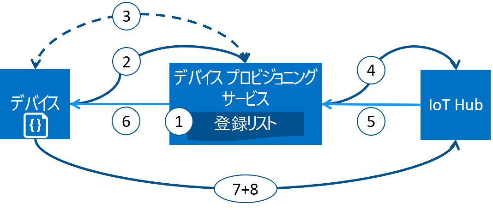

# Azure IoT Hub Device Provisioning Service を使用したデバイスのプロビジョニング
Microsoft Azure には、すべての IoT ソリューションのニーズに合う豊富な統合されたパブリック クラウド サービス セットがあります。 IoT Hub Device Provisioning Service は、適切な IoT ハブへのゼロタッチでジャストインタイムなプロビジョニングを可能にする、IoT Hub のヘルパー サービスです。人間の介入を必要とせず、安全かつスケーラブルな方法で何百万というデバイスをプロビジョニングできます。

## Device Provisioning Service を使用する場合
デバイスを IoT Hub に接続し、構成する際に Device Provisioning Service が最適な選択肢になるプロビジョニング シナリオは多数あります。次に例を示します。

* 工場 (初期設定) で IoT Hub 接続情報をハードコーディングすることなく、ゼロタッチで単一の IoT ソリューションにプロビジョニングできます
* 複数のハブ間でデバイスの負荷を分散します
* 販売トランザクション データに基づいて、デバイスをデバイス所有者の IoT ソリューションに接続します (マルチテナント)
* ユースケースに応じて特定の IoT ソリューションにデバイスを接続します (ソリューションの分離)
* 最低限の待機時間でデバイスを IoT ハブに接続します (geo シャーディング)
* デバイスの変化に基づいて再プロビジョニングします
* デバイスが IoT Hub に接続するときに使用するキーをローリングします (接続に X.509 証明書を使用しない場合)

## バックグラウンド処理
前のセクションに記載したすべてのシナリオは、ゼロタッチ プロビジョニングのプロビジョニング サービスを使用して、同じフローで実行できます。 プロビジョニングに従来必要だった手動の手順の多くは Device Provisioning Service で自動化されるので、IoT デバイスのデプロイにかかる時間を短縮し、手動によるエラーのリスクを軽減できます。 次のセクションでは、デバイスをプロビジョニングする処理の背後でどのような処理が行われているかについて説明します。 最初の手順は手動ですが、残りのすべての手順は自動です。

1. デバイスの製造元は、デバイスの登録情報を Azure Portal の登録一覧に追加しています。
2. デバイスは、工場でプロビジョニング サービス エンドポイント セットに接続しています。 デバイスは、プロビジョニング サービスに識別情報を渡し、ID を証明しています。
3. プロビジョニング サービスは、nonce チャレンジ ([トラステッド プラットフォーム モジュール](https://trustedcomputinggroup.org/work-groups/trusted-platform-module/)) または標準の X.509 検証 (X.509) を使用して、登録一覧のエントリに対して登録 ID とキーを確認することで、デバイスの ID を検証します。
4. プロビジョニング サービスはデバイスを IoT ハブに登録し、デバイスの[望ましいツイン状態](../iot-hub/iot-hub-devguide-device-twins.md)を設定します。
5. IoT ハブは、デバイスの ID 情報をプロビジョニング サービスに返します。
6. プロビジョニング サービスは IoT ハブの接続情報をデバイスに返します。 これで、デバイスは IoT ハブにデータを直接送信できるようになります。
7. デバイスは IoT ハブに接続します。
8. デバイスは、IoT ハブのデバイス ツインから望ましい状態を取得します。

## プロビジョニング プロセス
Device Provisioning Service が関係するデバイスのデプロイ プロセスには 2 つの手順があり、個別に実行できます。

* **製造手順**では、工場でデバイスが作成され、準備されます。
* **クラウドのセットアップ手順**では、Device Provisioning Service が自動プロビジョニング用に構成されます。

これらの手順はどちらも、既存の製造プロセスとデプロイ プロセスにシームレスに適応します。 デバイスで接続情報を取得するために多くの手動作業が必要な一部のデプロイ プロセスが、Device Provisioning Service によってさらに簡易化されます。

### 製造手順
この手順は、製造ラインで実行されるすべての作業です。 この手順にかかわる役割には、シリコン デザイナー、シリコンの製造元、インテグレーター、デバイスの最終製造元などがあります。 この手順は、ハードウェア自体の作成に関係しています。

Device Provisioning Service によって製造プロセスに新しい手順が加わることはありませんが、初期ソフトウェアと (理想的には) HSM をデバイスにインストールする既存の手順に関係しています。 この手順ではデバイス ID は作成されず、プロビジョニング サービス情報がデバイスにプログラミングされます。これにより、デバイスの電源を入れたときに、プロビジョニング サービスを呼び出して接続情報や IoT ソリューションの割り当てを取得することができます。

また、この手順では、製造元がデバイスのデプロイ担当者やオペレーターに識別キー情報を提供します。 この情報提供は、デバイスのデプロイ担当者やオペレーターによって指定された署名証明書から生成された X.509 証明書がすべてのデバイスにインストールされていることを確認するだけの単純な処理であることもあれば、各 TPM デバイスから TPM 保証キーの公開部分を抽出するほどの複雑な処理であることもあります。 現在、多くのシリコン製造元がこれらのサービスを提供しています。

### クラウドのセットアップ手順
これは、適切な自動プロビジョニングのためにクラウドを構成する手順です。 通常、クラウドのセットアップ手順には 2 種類のユーザーが関係します。初期段階でデバイスをどのようにセットアップする必要があるかを把握しているユーザー (デバイス オペレーター) と、デバイスを IoT ハブ間で分割する方法を把握しているユーザー (ソリューション オペレーター) です。

実行する必要があるプロビジョニングの 1 回限りの初期セットアップがあります。通常、これはソリューション オペレーターが処理します。 プロビジョニング サービスを構成した後は、ユース ケースが変わらない限り、構成を変更する必要はありません。

自動プロビジョニング用にサービスを構成した後は、デバイスの登録を準備する必要があります。 この手順は、デバイス オペレーターが実行します。デバイス オペレーターは、デバイスの望ましい構成を把握し、IoT ハブを検索するときにプロビジョニング サービスがデバイスの ID を適切に証明できるようにする処理を担当します。 デバイス オペレーターは、製造元から識別キー情報を取得し、登録一覧に追加します。 以降、新しいエントリが追加されたときや、デバイスに関する最新情報があり、既存のエントリが更新されたときに、登録が更新される可能性があります。

## 登録とプロビジョニング
*プロビジョニング*とは、この用語が使用される業界によって意味する処理が異なります。 IoT デバイスをクラウド ソリューションにプロビジョニングするという文脈では、プロビジョニングには 2 つのプロセスがあります。

1. 最初のプロセスでは、デバイスを登録することで、デバイスと IoT ソリューション間の初期接続を確立します。
2. 2 つ目のプロセスでは、登録先のソリューションが持つ特定の要件に基づいて、デバイスに適切な構成を適用します。

この 2 つのステップを両方とも完了すると、デバイスが完全にプロビジョニングされたことになります。 一部のクラウド サービスは、プロビジョニング プロセスの最初の手順 (デバイスを IoT ソリューション エンドポイントに登録する) のみを提供していますが、初期構成は提供していません。 Device Provisioning Service では、両方の手順を自動化し、デバイスのシームレスなプロビジョニング エクスペリエンスを提供しています。

## Device Provisioning Service の機能
Device Provisioning Service は多くの機能を備えているため、デバイスのプロビジョニングに最適です。

* **安全な構成証明**。X.509 と TPM ベースの ID の両方をサポートしています。
* **登録一覧**。任意の時点で登録できるデバイスまたはデバイス グループの完全なレコードが含まれます。 登録一覧には、デバイスが登録されたときのデバイスの望ましい構成に関する情報が含まれています。いつでも更新することができます。
* **複数の割り当てポリシー**。実際のシナリオに合わせて Device Provisioning Service がデバイスを IoT ハブに割り当てる方法を制御できます。
* **監視および診断ログ**。すべての機能が正常に動作していることを確認できます。
* **マルチハブのサポート**。Device Provisioning Service でデバイスを複数の IoT ハブに割り当てることができます。 Device Provisioning Service は、複数の Azure サブスクリプションにわたってハブと対話できます。
* **リージョン間のサポート**。Device Provisioning Service でデバイスを他のリージョンの IoT ハブに割り当てることができます。

デバイスのプロビジョニングに関係する概念と機能の詳細については、[デバイスの概念](concepts-device.md)、[サービスの概念](concepts-service.md)、[セキュリティの概念](concepts-security.md)に関する記事を参照してください。

## クロスプラットフォームのサポート
Device Provisioning Service は、他のすべての Azure IoT サービスと同様に、多様なオペレーティング システムとクロスプラットフォームで動作します。 Azure ではさまざまな[言語](https://github.com/Azure/azure-iot-sdks)でオープン ソース SDK が提供されており、容易にデバイスを接続して、サービスを管理できます。 Device Provisioning Service は、次のプロトコルを使ったデバイスの接続をサポートしています。

* HTTPS
* AMQP
* Web ソケット経由の AMQP
* MQTT
* WebSocket 経由の MQTT

Device Provisioning Service は、サービス操作の HTTPS 接続のみをサポートしています。

## リージョン
Device Provisioning Service は、多くのリージョンで利用可能です。 すべてのサービスの既存リージョンと新規発表リージョンの最新の一覧は、「[Azure リージョン](https://azure.microsoft.com/regions/)」にあります。 Device Provisioning Service の状態は、[[Azure の状態]](https://azure.microsoft.com/status/) ページで確認できます。

> [!NOTE]
> Device Provisioning Service はグローバルであり、場所にバインドされてはいません。 ただし、Device Provisioning Service プロファイルに関連付けられたメタデータが存在するリージョンを指定する必要があります。

## 可用性
Device Provisioning Service では、99.9% のサービス レベル アグリーメントが維持されています。[SLA についてはこちら](https://azure.microsoft.com/support/legal/sla/iot-hub/)をご覧ください。 完全な [Azure SLA](https://azure.microsoft.com/support/legal/sla/) では、全体としての Azure の可用性の確保について説明します。

## Quotas (クォータ)
各 Azure サブスクリプションには既定のクォータ制限が設けられており、IoT ソリューションの範囲に影響する可能性があります。 サブスクリプションごとの現在の上限は、サブスクリプションあたり 10 個の Device Provisioning Service です。

[!INCLUDE [azure-iotdps-limits](../../includes/iot-dps-limits.md)]

クォータ制限の詳細については、次を参照してください。
* [Azure サブスクリプション サービスの制限](../azure-subscription-service-limits.md)

## 関連する Azure のコンポーネント
Device Provisioning Service は Azure IoT Hub を使用してデバイスのプロビジョニングを自動化しています。 詳細については、「[IoT Hub のドキュメント](https://docs.microsoft.com/azure/iot-hub/)」を参照してください。

## 次の手順
ここでは、Azure で IoT デバイスをプロビジョニングする方法の概要について説明しました。 次の手順では、エンドツーエンドの IoT シナリオを試します。
> [!div class="nextstepaction"]
> [Azure Portal を使用した IoT Hub Device Provisioning Service のセットアップ](quick-setup-auto-provision.md)
> [シミュレートしたデバイスの作成とプロビジョニング](quick-create-simulated-device.md)
> [プロビジョニングに備えたデバイスのセットアップ](tutorial-set-up-device.md)
