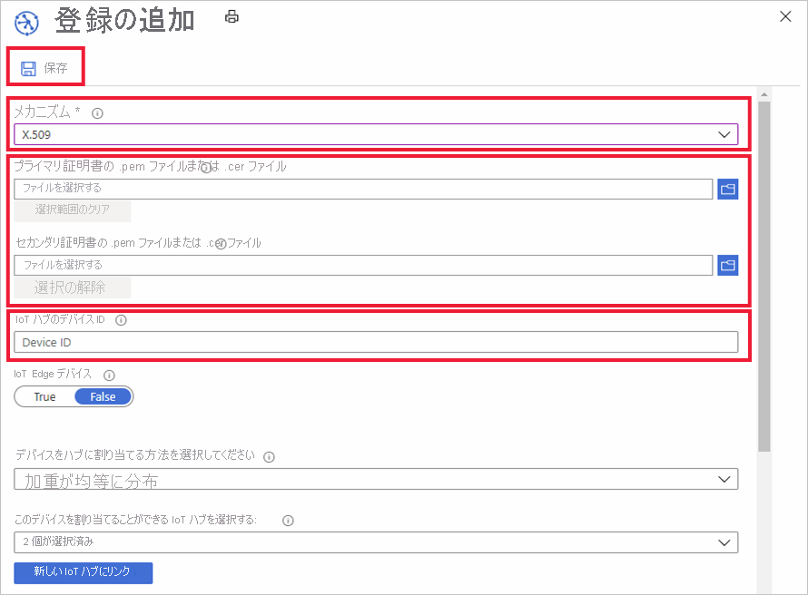

# Azure Portal でデバイス登録を管理する方法

"*デバイス登録*" では、1 つのデバイスまたはデバイス グループのレコードを作成して、ある時点で Azure IoT Hub Device Provisioning Service に登録できるようにします。 登録レコードには、必要な IoT ハブを含む、目的のデバイス初期構成がその登録の一部として含まれます。 この記事では、プロビジョニング サービス用にデバイス登録を管理する方法を説明します。

## デバイス登録を作成する

プロビジョニング サービスにデバイスを登録する方法には次の 2 つがあります。

* **登録グループ**は、X.509 証明書の共通の構成証明メカニズムを共有するデバイス グループのエントリです。同じ署名証明書 ([ルート証明書](https://docs.microsoft.com/azure/iot-dps/concepts-security#root-certificate)または[中間証明書](https://docs.microsoft.com/azure/iot-dps/concepts-security#intermediate-certificate)になる場合があります) によって署名され、物理デバイスのデバイス証明書を生成するために使用されます。 必要な初期構成を共有する多数のデバイスがある場合や、すべてのデバイスが同じテナントに配置される場合は、登録グループを使用することをお勧めします。 "*登録グループ*" として X.509 構成証明メカニズムを使用するデバイスのみを登録することができます。 

    次の手順を使用して、任意のデバイス グループ用に、ポータルで登録グループを作成できます。

    1. Azure Portal にログインし、左側のメニューにある **[すべてのリソース]** をクリックします。  
    1. リソースの一覧から、デバイスを登録する Device Provisioning Service をクリックします。  
    1. 目的のプロビジョニング サービスで、次の手順を実行します。  
       a. **[登録を管理します]** をクリックし、**[登録グループ]** タブを選択します。  
       b. 上部にある **[追加]** をクリックします。  
       c. [Add Enrollment Group]\(登録グループの追加\) パネルが表示されたら、登録リストのエントリ情報を入力します。  **グループ名**は必須です。 **[証明書の種類]** に "[CA] または [中間]" を選択し、デバイス グループのルートの **[Primary certificate]/(プライマリ証明書/)** をアップロードします。  
       d. **[Save]** をクリックします。 登録グループの作成に成功すると、**[Enrollment Groups]\(登録グループ\)** タブにグループ名が表示されます。  

       []  (./media/how-to-manage-enrollments/group-enrollment.png#lightbox)
    

* **個別登録**は、登録する単一のデバイスのエントリです。 個別登録では、構成証明メカニズムとして x509 証明書または (実際の TPM または仮想 TPM の) SAS トークンを使用できます。 固有の初期構成を必要とするデバイスや、TPM または仮想 TPM を介した SAS トークンのみを構成証明メカニズムとして使用できるデバイスには、個別登録を使用することをお勧めします。 個別登録では、必要な IoT ハブ デバイス ID が指定されている場合があります。

    個別登録は、次の手順を使用してポータルで作成できます。

    1. Azure Portal にログインし、左側のメニューにある **[すべてのリソース]** をクリックします。
    1. リソースの一覧から、デバイスを登録する Device Provisioning Service をクリックします。
    1. 目的のプロビジョニング サービスで、次の手順を実行します。  
       a. **[登録を管理します]** をクリックし、**[個々の登録]** タブを選択します。  
       b. 上部にある **[追加]** をクリックします。   
       c. [Add Enrollment]\(登録の追加\) パネルが表示されたら、登録リストのエントリ情報を入力します。 まず、デバイスの構成証明の **[メカニズム]** を選択します (X.509 または TPM)。 X.509 証明書では、デバイスのリーフ **プライマリ証明書**をアップロードする必要があります。 TPM では、デバイスの**構成証明キー**と**登録 ID** を入力する必要があります。  
       d. **[Save]** をクリックします。 登録グループの作成に成功すると、**[Individual Enrollments]\(個別登録)** タブにデバイスが表示されます。  

       

## 登録エントリを更新する
既存の登録エントリは、次の手順を使用して、ポータルで更新できます。

1. Azure Portal で目的の Device Provisioning Service を開き、**[Manage enrollments]\(登録の管理\)** をクリックします。 
1. 変更する登録エントリに移動します。 エントリをクリックすると、デバイス登録に関する概要情報が表示されます。 
1. このページで、デバイスのリンク先となる IoT ハブやデバイス ID など、セキュリティの種類および資格情報以外の項目を変更することができます。 初期のデバイス ツインの状態を変更することもできます。 
1. 完了したら、**[保存]** をクリックしてデバイス登録を更新します。 

    

## デバイス登録を削除する
デバイスをどの IoT ハブにもプロビジョニングする必要がない場合は、ポータルで次の手順を使用して、関連する登録エントリを削除できます。

1. Azure Portal で目的の Device Provisioning Service を開き、**[Manage enrollments]\(登録の管理\)** をクリックします。 
1. 削除する登録エントリを見つけて選択します。 
1. 上部にある **[削除]** をクリックして、確認を求められたら **[はい]** を選択します。 
1. アクションが完了すると、デバイス登録の一覧からエントリが削除されたことがわかります。 
 
    

