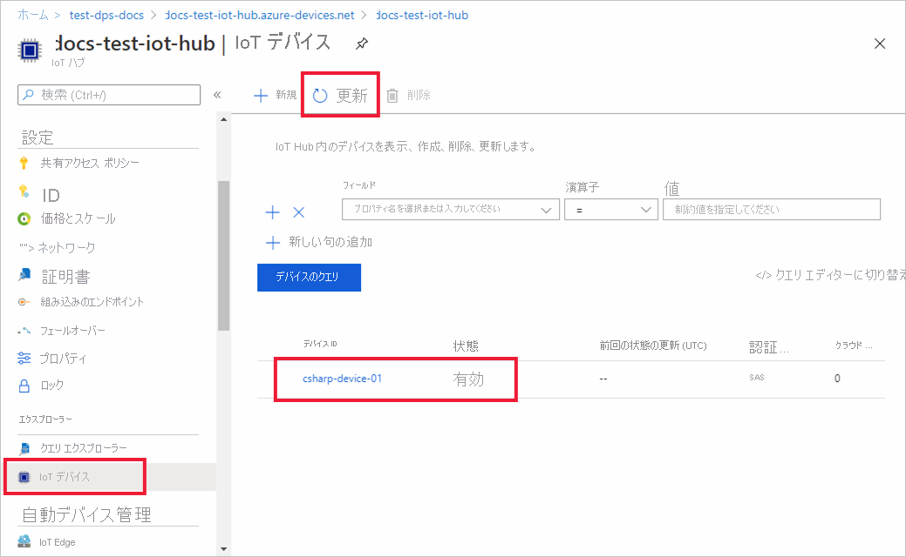

# <a name="quickstart-provision-a-symmetric-key-device-using-c"></a>クイックスタート: C# を使用して対称キー デバイスをプロビジョニングする

このクイックスタートでは、C# を使用して、Windows 開発マシンをデバイスとして IoT ハブにプロビジョニングする方法を学習します。 このデバイスを IoT ハブに割り当てるために、ここでは、対称キーと個別登録を使用して Device Provisioning Service (DPS) インスタンスに対する認証を行います。 デバイスのプロビジョニングには、[C# 用 Azure IoT サンプル](https://github.com/Azure-Samples/azure-iot-samples-csharp)のページにあるサンプル コードを使用します。 

この記事では、個々の登録を使用したプロビジョニングについて説明しますが、登録グループを使用することもできます。 登録グループを使用する場合は、いくつかの違いがあります。 たとえば、デバイスの一意の登録 ID を持つ派生デバイス キーを使用する必要があります。 「[対称キーを使用してデバイスをプロビジョニングする](how-to-legacy-device-symm-key.md)」には、登録グループの例が紹介されています。 登録グループの詳細については、[対称キーの構成証明のグループ登録](concepts-symmetric-key-attestation.md#group-enrollments)に関する記事を参照してください。

自動プロビジョニングの処理に慣れていない場合は、[プロビジョニング](about-iot-dps.md#provisioning-process)の概要を確認してください。 

また、このクイック スタートを続行する前に、[Azure portal での IoT Hub Device Provisioning Service の設定](./quick-setup-auto-provision.md)に関するページの手順も済ませておいてください。 このクイック スタートでは、Device Provisioning Service インスタンスを既に作成している必要があります。

この記事は、Windows ベースのワークスペース向けです。 ただし、Linux でもこの手順を実行できます。 Linux の例については、[マルチテナント用にプロビジョニングする方法](how-to-provision-multitenant.md)に関するページを参照してください。


[!INCLUDE [quickstarts-free-trial-note](../../includes/quickstarts-free-trial-note.md)]


## <a name="prerequisites"></a>前提条件

* Windows ベースのマシンに [.NET Core 2.1 SDK](https://dotnet.microsoft.com/download) 以降がインストールされていることを確認する。

* [Git](https://git-scm.com/download/) の最新バージョンがインストールされている。

<a id="setupdevbox"></a>


## <a name="create-a-device-enrollment"></a>デバイス登録を作成する

1. [Azure portal](https://portal.azure.com) にサインインし、左側のメニューの **[すべてのリソース]** を選択して、Device Provisioning Service (DPS) インスタンスを開きます。

2. **[登録を管理します]** タブを選択し、上部にある **[個別登録の追加]** を選択します。 

3. **[登録の追加]** パネルで次の情報を入力して、**[保存]** を押します。

   - **メカニズム:** ID 構成証明の *メカニズム* として **[対称キー]** を選択します。

   - **[キーの自動生成]**: このボックスをオンにします。

   - **登録 ID**: 登録を識別する登録 ID を入力します。 小文字の英字、数字、ダッシュ ('-') 文字のみを使用します。 たとえば、「**symm-key-csharp-device-01**」とします。

   - **IoT Hub のデバイス ID:** デバイス識別子を入力します。 たとえば、「**csharp-device-01**」とします。

     

4. 登録を保存したら、**主キー** と **セカンダリ キー** が生成され、登録エントリに追加されます。 対称キーのデバイス登録は、 *[個々の登録]* タブの *[登録 ID]* 列に **symm-key-csharp-device-01** と表示されます。 

5. 登録を開き、生成された **主キー** の値をコピーします。 このキーの値と **登録 ID** は、後でデバイス プロビジョニングのサンプル コードを実行するときに使用します。


## <a name="prepare-the-c-environment"></a>C# 環境を準備する 

1. Git CMD または Git Bash コマンド ライン環境を開きます。 次のコマンドを使用して、[C# 用 Azure IoT サンプル](https://github.com/Azure-Samples/azure-iot-samples-csharp)の GitHub リポジトリをクローンします。

    ```cmd
    git clone https://github.com/Azure-Samples/azure-iot-samples-csharp.git
    ```


<a id="firstbootsequence"></a>

## <a name="run-the-device-provisioning-code"></a>デバイス プロビジョニング コードを実行する

このセクションでは、デバイス プロビジョニングのサンプル コードを、DPS リソースに登録する対称キー デバイスとして認証する 3 つのパラメーターを使用して、デバイス プロビジョニング サンプルを実行します。 この 3 つのパラメーターは次のとおりです。

* ID スコープ
* 個々の登録 ID。
* 個々の登録のプライマリ対称キー。

プロビジョニング コードでは、デバイスを認証するために、これらのパラメーターを使用して DPS リソースと接続します。 その後、デバイスは、個々の登録構成に基づいて、DPS インスタンスに既にリンクされている IoT ハブに割り当てられます。 プロビジョニングが完了すると、サンプル コードによってテスト テレメトリ メッセージが IoT ハブに送信されます。

1. [Azure portal](https://portal.azure.com) の Device Provisioning Service メニューで、 **[概要]** を選択し、 **[ID スコープ]** の値をコピーします。 サンプル コードを実行するときに、`IdScope` パラメーターとしてこの値を使用します。

2. コマンド プロンプトを開き、クローンしたサンプル リポジトリ内の *SymmetricKeySample* に移動します。

    ```cmd
    cd azure-iot-samples-csharp\provisioning\Samples\device\SymmetricKeySample
    ```

3. *SymmetricKeySample* フォルダーの *Parameters.cs* をテキスト エディターで開きます。 このファイルは、サンプルでサポートされているパラメーターを示しています。 この記事では、サンプルを実行するときに、最初の 3 つの必須パラメーターのみを使用します。 このファイルのコードを確認します。 変更は不要です。
 
    | パラメーター                         | 必須 | 説明     |
    | :-------------------------------- | :------- | :-------------- |
    | `--s` または `--IdScope`              | ○     | DPS インスタンスの ID スコープ |
    | `--i` または `--Id`                   | ○     | 個別登録を使用する場合は登録 ID、グループ登録を使用する場合は目的のデバイス ID。 |
    | `--p` または `--PrimaryKey`           | ○     | 個別登録またはグループ登録の主キー。 |
    | `--e` または `--EnrollmentType`       | ×    | 登録の種類: `Individual` または `Group`。 既定値は `Individual` です |
    | `--g` または `--GlobalDeviceEndpoint` | ×    | デバイスの接続先となるグローバル エンドポイント。 既定値は `global.azure-devices-provisioning.net` です |
    | `--t` または `--TransportType`        | ×    | デバイス プロビジョニング インスタンスとの通信に使用するトランスポート。 既定値は `Mqtt` です。 指定できる値は、`Mqtt`、`Mqtt_WebSocket_Only`、`Mqtt_Tcp_Only`、`Amqp`、`Amqp_WebSocket_Only`、`Amqp_Tcp_only`、および `Http1` です。|
     
4. *SymmetricKeySample* フォルダーの *ProvisioningDeviceClientSample.cs* をテキスト エディターで開きます。 このファイルは、[SecurityProviderSymmetricKey](/dotnet/api/microsoft.azure.devices.shared.securityprovidersymmetrickey?view=azure-dotnet&preserve-view=true) クラスを [ProvisioningDeviceClient](/dotnet/api/microsoft.azure.devices.provisioning.client.provisioningdeviceclient?view=azure-dotnet&preserve-view=true) クラスと共に使用して、対称キー デバイスをプロビジョニングする方法を示しています。 このファイルのコードを確認します。  変更は不要です。
 
5. 次のコマンドで例として使用されている 3 つのパラメーターを置き換えてから、サンプル コードをビルドして実行します。 ID スコープ、登録 ID、および登録主キーに正しい値を使用してください。
    
    ```console
    dotnet run --s 0ne00000A0A --i symm-key-csharp-device-01 --p sbDDeEzRuEuGKag+kQKV+T1QGakRtHpsERLP0yPjwR93TrpEgEh/Y07CXstfha6dhIPWvdD1nRxK5T0KGKA+nQ==
    ```    


6. 予想される出力は次のようになります。これは、個別登録の設定に基づいてデバイスが割り当てられている、リンクされた IoT ハブを示しています。 サンプルの "TestMessage" という文字列がテストとしてハブに送信されます。

    ```output
    D:\azure-iot-samples-csharp\provisioning\Samples\device\SymmetricKeySample>dotnet run --s 0ne00000A0A --i symm-key-csharp-device-01 --p sbDDeEzRuEuGKag+kQKV+T1QGakRtHpsERLP0yPjwR93TrpEgEh/Y07CXstfha6dhIPWvdD1nRxK5T0KGKA+nQ==

    Initializing the device provisioning client...
    Initialized for registration Id symm-key-csharp-device-01.
    Registering with the device provisioning service...
    Registration status: Assigned.
    Device csharp-device-01 registered to ExampleIoTHub.azure-devices.net.
    Creating symmetric key authentication for IoT Hub...
    Testing the provisioned device with IoT Hub...
    Sending a telemetry message...
    Finished.
    Enter any key to exit.
    ```
    
7. Azure portal で、ご利用のプロビジョニング サービスにリンクされている IoT ハブに移動し、**[IoT デバイス]** ブレードを開きます。 対称キー デバイスがハブに正常にプロビジョニングされた後、デバイス ID が表示され、*[状態]* は **[有効]** となります。 デバイスのサンプル コードを実行する前に既にブレードを開いている場合は、上部にある **[最新の情報に更新]** ボタンを押す必要がある場合があります。 

     

> [!NOTE]
> *[Initial device twin state]\(初期のデバイス ツインの状態\)* をデバイスの登録エントリの既定値から変更した場合、デバイスはハブから目的のツインの状態をプルし、それに従って動作することができます。 詳細については、「[IoT Hub のデバイス ツインの理解と使用](../iot-hub/iot-hub-devguide-device-twins.md)」を参照してください。
>


## <a name="clean-up-resources"></a>リソースをクリーンアップする

引き続きデバイス クライアント サンプルを使用する場合は、このクイックスタートで作成したリソースをクリーンアップしないでください。 使用する予定がない場合は、次の手順を使用して、このクイックスタートで作成したすべてのリソースを削除してください。

1. Azure portal の左側のメニューで **[すべてのリソース]** を選択し、Device Provisioning Service を選択します。 サービスの **[登録を管理します]** を開き、 **[個々の登録]** タブを選択します。このクイックスタートで登録したデバイスの "*登録 ID*" の隣にあるチェック ボックスをオンにして、ペイン上部の **[削除]** を押します。 
1. Azure portal の左側のメニューにある **[すべてのリソース]** を選択し、IoT ハブを選択します。 ハブの **[IoT デバイス]** を開き、このクイックスタートで登録したデバイスの "*デバイス ID*" の隣にあるチェック ボックスをオンにして、ペイン上部の **[削除]** を押します。

## <a name="next-steps"></a>次のステップ

このクイック スタートでは、IoT Hub Device Provisioning Service を使用して、Windows ベースの対称キー デバイスを IoT ハブにプロビジョニングしました。 C# を使用して X.509 証明書デバイスをプロビジョニングする方法を学習する場合は、X.509 デバイスの以下のクイックスタートを続行してください。 

> [!div class="nextstepaction"]
> [Azure クイックスタート - DPS と C# を使用して X.509 デバイスをプロビジョニングする](quick-create-simulated-device-x509-csharp.md)
