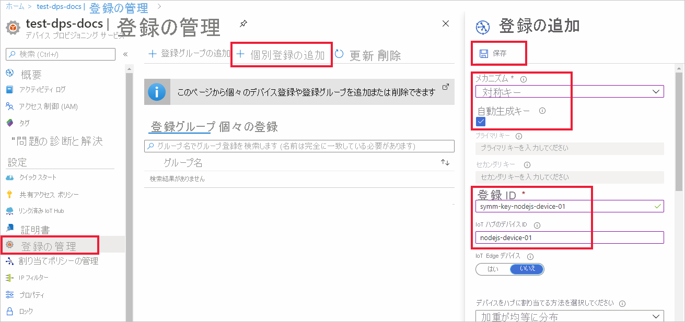
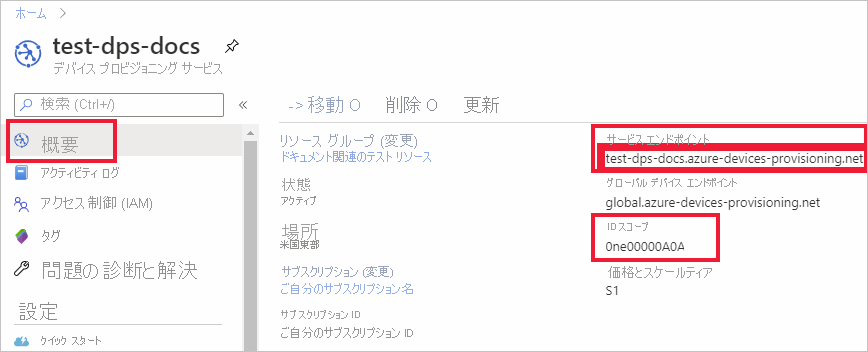

# <a name="quickstart-provision-a-symmetric-key-device-using-nodejs"></a>クイックスタート: Node.js を使用して対称キー デバイスをプロビジョニングする

このクイックスタートでは、Node.js を使用し、Windows 開発マシンをデバイスとして IoT ハブにプロビジョニングする方法を学習します。 このデバイスを IoT ハブに割り当てるために、ここでは、対称キーと個別登録を使用して Device Provisioning Service (DPS) インスタンスに対する認証を行います。 [Azure IoT SDK for Node.js](https://github.com/Azure/azure-iot-sdk-node.git) のサンプル コードは、デバイスのプロビジョニングに使用されます。 

この記事では、個々の登録を使用したプロビジョニングについて説明しますが、登録グループを使用することもできます。 登録グループを使用する場合は、いくつかの違いがあります。 たとえば、デバイスの一意の登録 ID を持つ派生デバイス キーを使用する必要があります。 「[対称キーを使用してデバイスをプロビジョニングする](how-to-legacy-device-symm-key.md)」には、登録グループの例が紹介されています。 登録グループの詳細については、[対称キーの構成証明のグループ登録](concepts-symmetric-key-attestation.md#group-enrollments)に関する記事を参照してください。

自動プロビジョニングの処理に慣れていない場合は、[プロビジョニング](about-iot-dps.md#provisioning-process)の概要を確認してください。 

また、このクイック スタートを続行する前に、[Azure portal での IoT Hub Device Provisioning Service の設定](./quick-setup-auto-provision.md)に関するページの手順も済ませておいてください。 このクイック スタートでは、Device Provisioning Service インスタンスを既に作成している必要があります。

この記事は、Windows ベースのワークスペース向けです。 ただし、Linux でもこの手順を実行できます。 Linux の例については、[マルチテナント用にプロビジョニングする方法](how-to-provision-multitenant.md)に関するページを参照してください。


[!INCLUDE [quickstarts-free-trial-note](../../includes/quickstarts-free-trial-note.md)]


## <a name="prerequisites"></a>前提条件

- [プロビジョニング](about-iot-dps.md#provisioning-process)の概念を理解していること。
- [Azure portal での IoT Hub Device Provisioning Service の設定](./quick-setup-auto-provision.md)が完了していること。
- アクティブなサブスクリプションが含まれる Azure アカウント。 [無料で作成できます](https://azure.microsoft.com/free/?ref=microsoft.com&utm_source=microsoft.com&utm_medium=docs&utm_campaign=visualstudio)。
- [Node.js v4.0 以上](https://nodejs.org)。
- [Git](https://git-scm.com/download/).


## <a name="create-a-device-enrollment"></a>デバイス登録を作成する

1. [Azure portal](https://portal.azure.com) にサインインし、左側のメニューの **[すべてのリソース]** を選択して、Device Provisioning Service (DPS) インスタンスを開きます。

2. **[登録を管理します]** タブを選択し、上部にある **[個別登録の追加]** を選択します。 

3. **[登録の追加]** パネルで次の情報を入力して、**[保存]** を押します。

   - **メカニズム:** ID 構成証明の *メカニズム* として **[対称キー]** を選択します。

   - **[キーの自動生成]**: このボックスをオンにします。

   - **登録 ID**: 登録を識別する登録 ID を入力します。 小文字の英字、数字、ダッシュ ('-') 文字のみを使用します。 たとえば、「**symm-key-nodejs-device-01**」とします。

   - **IoT Hub のデバイス ID:** デバイス識別子を入力します。 たとえば、「**nodejs-device-01**」とします。

     

4. 登録を保存したら、**主キー** と **セカンダリ キー** が生成され、登録エントリに追加されます。 対称キーのデバイス登録は、 *[個々の登録]* タブの *[登録 ID]* 列に "**symm-key-nodejs-device-01**" と表示されます。 

5. 登録を開き、生成された **主キー** の値をコピーします。 このキーの値と **登録 ID** は、後でデバイス プロビジョニングのサンプル コードで使用する環境変数を追加するときに使用します。


## <a name="prepare-the-nodejs-environment"></a>Node.js 環境を準備する 

1. Git CMD または Git Bash コマンド ライン環境を開きます。 次のコマンドを使用して、[Azure IoT SDK for Node.js](https://github.com/Azure/azure-iot-sdk-node.git) の GitHub リポジトリをクローンします。

    ```cmd
    git clone https://github.com/Azure/azure-iot-sdk-node.git --recursive
    ```


<a id="firstbootsequence"></a>

## <a name="prepare-the-device-provisioning-code"></a>デバイス プロビジョニング コードを準備する

このセクションでは、次の 4 つの環境変数を追加します。これらの変数は、対称キー デバイスをプロビジョニングするサンプル コードのパラメーターとして使用されます。 

* `PROVISIONING_HOST`
* `PROVISIONING_IDSCOPE`
* `PROVISIONING_REGISTRATION_ID`
* `PROVISIONING_SYMMETRIC_KEY`

プロビジョニング コードでは、デバイスを認証するために、これらの変数に基づいて DPS インスタンスを接続します。 その後、デバイスは、個々の登録構成に基づいて、DPS インスタンスに既にリンクされている IoT ハブに割り当てられます。 プロビジョニングが完了すると、サンプル コードでは何らかのテスト テレメトリを IoT ハブに送信します。

1. [Azure portal](https://portal.azure.com) の Device Provisioning Service メニューで、**[概要]** を選択し、"_サービス エンドポイント_" と "_ID スコープ_" をコピーします。 これらの値は、`PROVISIONING_HOST` および `PROVISIONING_IDSCOPE` 環境変数に使用します。

    

2. Node.js コマンドを実行するためのコマンド プロンプトを開き、次の *provisioning/device/samples* ディレクトリに移動します。

    ```cmd
    cd azure-iot-sdk-node/provisioning/device/samples
    ```

3. *provisioning/device/samples* フォルダーの *register_symkey.js* を開いて、コードを確認します。 

    サンプル コードを見ると、カスタム ペイロードが設定されていることがわかります。

    ```nodejs
    provisioningClient.setProvisioningPayload({a: 'b'});
    ```

    このクイック スタートにこのコードは必要ありません。 このコードは、カスタム ペイロードを設定する例です。カスタム割り当て関数を使用して IoT ハブにデバイスを割り当てる場合に使用します。 詳細については、[カスタム割り当てポリシーの使用に関するチュートリアル](tutorial-custom-allocation-policies.md)を参照してください。

    `provisioningClient.register()` は、デバイスの登録を試行するメソッドです。

    デバイスを登録するためのサンプル コードに変更を加える必要はありません。

4. コマンド プロンプトで、前のセクションの個別登録からコピーしたプロビジョニング ホスト、ID スコープ、登録 ID、プライマリ対称キーの環境変数を追加します。  

    次のコマンドは、コマンドの構文を示すための例です。 正しい値を使用していることを確認してください。

    ```console
    set PROVISIONING_HOST=test-dps-docs.azure-devices-provisioning.net
    ```

    ```console
    set PROVISIONING_IDSCOPE=0ne00000A0A
    ```

    ```console
    set PROVISIONING_REGISTRATION_ID=symm-key-nodejs-device-01
    ```

    ```console
    set PROVISIONING_SYMMETRIC_KEY=sbDDeEzRuEuGKag+kQKV+T1QGakRtHpsERLP0yPjwR93TrpEgEh/Y07CXstfha6dhIPWvdD1nRxK5T0KGKA+nQ==
    ```


4. 次のコマンドを使用してサンプル コードをビルドし、実行します。

    ```console
    npm install
    ```

    ```console
    node register_symkey.js
    ```

5. 予想される出力は次のようになります。これは、個別登録の設定に基づいてデバイスが割り当てられている、リンクされた IoT ハブを示しています。 テスト メッセージとして "Hello World" という文字列がハブに送信されます。

    ```output
    D:\Docs\test\azure-iot-sdk-node\provisioning\device\samples>node register_symkey.js
    registration succeeded
    assigned hub=docs-test-iot-hub.azure-devices.net
    deviceId=nodejs-device-01
    payload=undefined
    Client connected
    send status: MessageEnqueued    
    ```
    
6. Azure portal で、ご利用のプロビジョニング サービスにリンクされている IoT ハブに移動し、**[IoT デバイス]** ブレードを開きます。 対称キー デバイスがハブに正常にプロビジョニングされた後、デバイス ID が表示され、*[状態]* は **[有効]** となります。 デバイスのサンプル コードを実行する前に既にブレードを開いている場合は、上部にある **[最新の情報に更新]** ボタンを押す必要がある場合があります。 

     

> [!NOTE]
> *[Initial device twin state]\(初期のデバイス ツインの状態\)* をデバイスの登録エントリの既定値から変更した場合、デバイスはハブから目的のツインの状態をプルし、それに従って動作することができます。 詳細については、「[IoT Hub のデバイス ツインの理解と使用](../iot-hub/iot-hub-devguide-device-twins.md)」を参照してください。
>


## <a name="clean-up-resources"></a>リソースをクリーンアップする

引き続きデバイス クライアント サンプルを使用する場合は、このクイックスタートで作成したリソースをクリーンアップしないでください。 使用する予定がない場合は、次の手順を使用して、このクイックスタートで作成したすべてのリソースを削除してください。

1. Azure portal の左側のメニューで **[すべてのリソース]** を選択し、Device Provisioning Service を選択します。 サービスの **[登録を管理します]** を開き、 **[個々の登録]** タブを選択します。このクイックスタートで登録したデバイスの "*登録 ID*" の隣にあるチェック ボックスをオンにして、ペイン上部の **[削除]** を押します。 
1. Azure portal の左側のメニューにある **[すべてのリソース]** を選択し、IoT ハブを選択します。 ハブの **[IoT デバイス]** を開き、このクイックスタートで登録したデバイスの "*デバイス ID*" の隣にあるチェック ボックスをオンにして、ペイン上部の **[削除]** を押します。

## <a name="next-steps"></a>次のステップ

このクイック スタートでは、IoT Hub Device Provisioning Service を使用して、Windows ベースの対称キー デバイスを IoT ハブにプロビジョニングしました。 Node.js を使用して X.509 証明書デバイスをプロビジョニングする方法を学習する場合は、X.509 デバイスの以下のクイックスタートを続行してください。 

> [!div class="nextstepaction"]
> [Azure クイックスタート - DPS と Node.js を使用して X.509 デバイスをプロビジョニングする](quick-create-simulated-device-x509-node.md)
