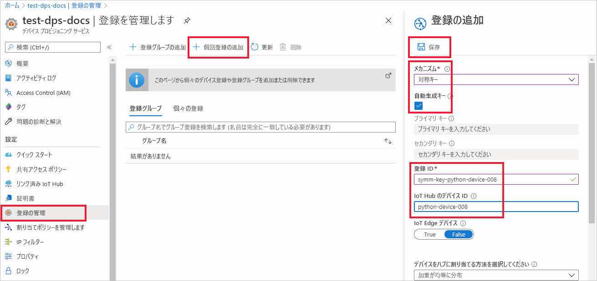
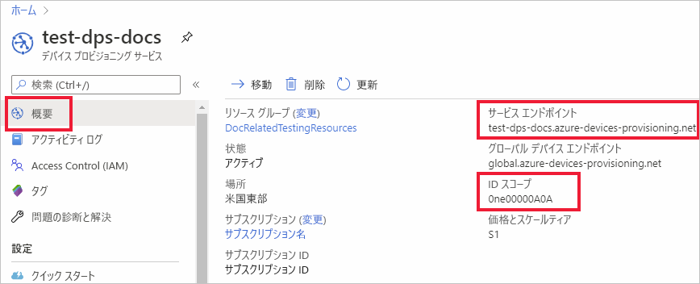
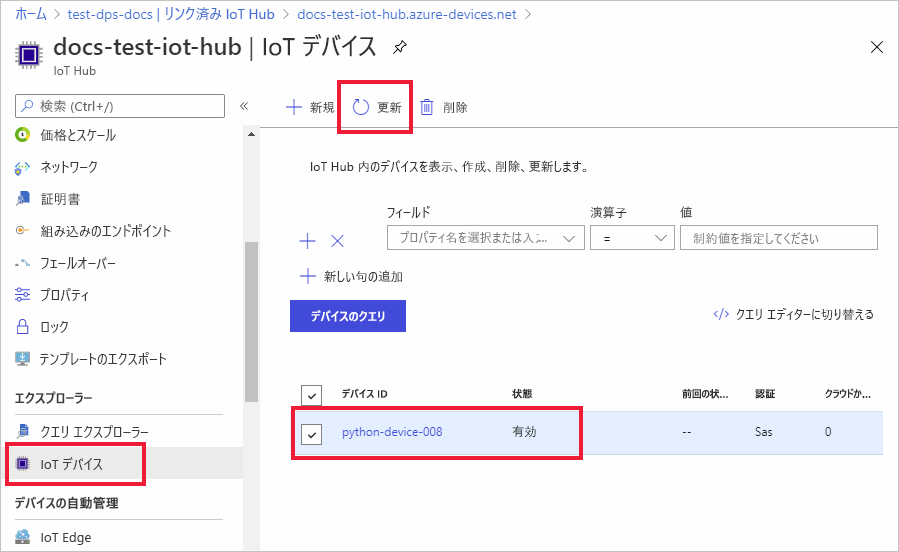

# <a name="quickstart-provision-a-python-device-with-symmetric-keys"></a>対称キーを使用して Python デバイスをプロビジョニングする

このクイック スタートでは、Python を使用して、Windows 開発マシンをデバイスとして IoT ハブにプロビジョニングする方法を学習します。 このデバイスを IoT ハブに割り当てるために、ここでは、対称キーと個別登録を使用して Device Provisioning Service (DPS) インスタンスに対する認証を行います。 [Azure IoT Python SDK](https://github.com/Azure/azure-iot-sdk-python) のサンプル コードは、デバイスのプロビジョニングに使用されます。 

この記事では、個々の登録を使用したプロビジョニングについて説明しますが、登録グループを使用することもできます。 登録グループを使用する場合は、いくつかの違いがあります。 たとえば、デバイスの一意の登録 ID を持つ派生デバイス キーを使用する必要があります。 対称キー登録グループはレガシ デバイスのみには限定されませんが、[対称キーの構成証明を使用してレガシ デバイスをプロビジョニングする方法](how-to-legacy-device-symm-key.md)に関する記事に登録グループの例が記載されています。 詳細については、[対称キーの構成証明のグループ登録](concepts-symmetric-key-attestation.md#group-enrollments)に関する記事を参照してください。

自動プロビジョニングの処理に慣れていない場合は、[プロビジョニング](about-iot-dps.md#provisioning-process)の概要を確認してください。 

また、このクイック スタートを続行する前に、[Azure portal での IoT Hub Device Provisioning Service の設定](./quick-setup-auto-provision.md)に関するページの手順も済ませておいてください。 このクイック スタートでは、Device Provisioning Service インスタンスを既に作成している必要があります。

この記事は、Windows ベースのワークスペース向けです。 ただし、Linux でもこの手順を実行できます。 Linux の例については、「[How to provision for multitenancy](how-to-provision-multitenant.md)」(マルチテナント方式のプロビジョニング) を参照してください。


[!INCLUDE [quickstarts-free-trial-note](../../includes/quickstarts-free-trial-note.md)]


## <a name="prerequisites"></a>前提条件

* Windows ベースのコンピューターに [Python 3.7](https://www.python.org/downloads/) 以降がインストールされていることを確認する。 `python --version` を実行して、使用している Python のバージョンを確認できます。

* [Git](https://git-scm.com/download/) の最新バージョンがインストールされている。

<a id="setupdevbox"></a>

## <a name="prepare-the-python-sdk-environment"></a>Python SDK 環境を準備する 

1. マシンに Git がインストールされ、コマンド ウィンドウからアクセスできる環境変数に追加されていることを確認します。 **Git Bash** (ローカル Git リポジトリと対話する際に使用するコマンドライン アプリ) など、インストールする各種 `git` ツールの最新バージョンについては、[Software Freedom Conservancy の Git クライアント ツール](https://git-scm.com/download/)に関するページを参照してください。 

2. コマンド プロンプトを開きます。 次のようにして、Azure IoT Python SDK の GitHub リポジトリをクローンします。
    
    ```console
    git clone https://github.com/Azure/azure-iot-sdk-python.git --recursive
    ```
3. サンプル ファイルの _provision_symmetric_key.py_ がある `azure-iot-sdk-python\azure-iot-device\samples\async-hub-scenarios` ディレクトリに移動します。
   
   ```console
   cd azure-iot-sdk-python\azure-iot-device\samples\async-hub-scenarios
   ```
4. 次のコマンドを実行して、_azure-iot-device_ ライブラリをインストールします。

    ```console
    pip install azure-iot-device
    ```


## <a name="create-a-device-enrollment"></a>デバイス登録を作成する

1. [Azure portal](https://portal.azure.com) にサインインし、左側のメニューの **[すべてのリソース]** を選択して、Device Provisioning Service (DPS) インスタンスを開きます。

2. **[登録を管理します]** タブを選択し、上部にある **[個別登録の追加]** を選択します。 

3. **[登録の追加]** パネルで次の情報を入力して、**[保存]** を押します。

   - **メカニズム:** ID 構成証明の *メカニズム* として **[対称キー]** を選択します。

   - **[キーの自動生成]**: このボックスをオンにします。

   - **登録 ID**: 登録を識別する登録 ID を入力します。 小文字の英字、数字、ダッシュ ('-') 文字のみを使用します。 たとえば、**symm-key-python-device-008** です。

   - **IoT Hub のデバイス ID:** デバイス識別子を入力します。 たとえば、**python-device-008** です。

     

4. 登録を保存したら、**主キー** と **セカンダリ キー** が生成され、登録エントリに追加されます。 対称キーのデバイス登録は、*[個々の登録]* タブの *[登録 ID]* 列に **symm-key-python-device-008** と表示されます。 

5. 登録を開き、生成された **主キー** の値をコピーします。 このキーの値と **登録 ID** は、後でデバイス プロビジョニングのサンプル コードで使用する環境変数を追加するときに使用します。


<a id="firstbootsequence"></a>

## <a name="prepare-the-device-provisioning-code"></a>デバイス プロビジョニング コードを準備する

このセクションでは、対称キー デバイス用のデバイス プロビジョニング サンプル コードのパラメーターとして使用される、次の 4 つの環境変数を追加します。 

* `PROVISIONING_HOST`
* `PROVISIONING_IDSCOPE`
* `PROVISIONING_REGISTRATION_ID`
* `PROVISIONING_SYMMETRIC_KEY`

プロビジョニング コードでは、デバイスを認証するために、これらの変数に基づいて DPS インスタンスを接続します。 その後、デバイスは、個々の登録構成に基づいて、DPS インスタンスに既にリンクされている IoT ハブに割り当てられます。 プロビジョニングが完了すると、サンプル コードでは何らかのテスト テレメトリを IoT ハブに送信します。

1. [Azure portal](https://portal.azure.com) の Device Provisioning Service メニューで、**[概要]** を選択し、"_サービス エンドポイント_" と "_ID スコープ_" をコピーします。 これらの値は、`PROVISIONING_HOST` および `PROVISIONING_IDSCOPE` 環境変数に使用します。

    

2. Python コマンド プロンプトで、コピーした値を使用して環境変数を追加します。 

    次のコマンドは、コマンドの構文を示すための例です。 正しい値を使用していることを確認してください。

    ```console
    set PROVISIONING_HOST=test-dps-docs.azure-devices-provisioning.net
    ```

    ```console
    set PROVISIONING_IDSCOPE=0ne00000A0A
    ```

3. Python コマンド プロンプトで、前のセクションの個々の登録からコピーした登録 ID と対称キーの環境変数を追加します。 

    次のコマンドは、コマンドの構文を示すための例です。 正しい値を使用していることを確認してください。

    ```console
    set PROVISIONING_REGISTRATION_ID=symm-key-python-device-008
    ```

    ```console
    set PROVISIONING_SYMMETRIC_KEY=sbDDeEzRuEuGKag+kQKV+T1QGakRtHpsERLP0yPjwR93TrpEgEh/Y07CXstfha6dhIPWvdD1nRxK5T0KGKA+nQ==
    ```

4. _provision_symmetric_key.py_ の python サンプル コードを実行します。

    ```console
    D:\azure-iot-sdk-python\azure-iot-device\samples\async-hub-scenarios>python provision_symmetric_key.py
    ```

5. 予想される出力は次のようになります。これは、個々の登録設定に基づいてデバイスが割り当てられている、リンクされた IoT ハブを示しています。 一部の風速テレメトリ メッセージも、テストとしてハブに送信されます。

    ```output
    D:\azure-iot-sdk-python\azure-iot-device\samples\async-hub-scenarios>python provision_symmetric_key.py
    RegistrationStage(RequestAndResponseOperation): Op will transition into polling after interval 2.  Setting timer.
    The complete registration result is
    python-device-008
    docs-test-iot-hub.azure-devices.net
    initialAssignment
    null
    Will send telemetry from the provisioned device
    sending message #8
    sending message #9
    sending message #3
    sending message #10
    sending message #4
    sending message #2
    sending message #6
    sending message #7
    sending message #1
    sending message #5
    done sending message #8
    done sending message #9
    done sending message #3
    done sending message #10
    done sending message #4
    done sending message #2
    done sending message #6
    done sending message #7
    done sending message #1
    done sending message #5
    ```
    
6. Azure portal で、ご利用のプロビジョニング サービスにリンクされている IoT ハブに移動し、**[IoT デバイス]** ブレードを開きます。 対称キー デバイスがハブに正常にプロビジョニングされた後、デバイス ID が表示され、*[状態]* は **[有効]** となります。 デバイスのサンプル コードを実行する前に既にブレードを開いている場合は、上部にある **[最新の情報に更新]** ボタンを押す必要がある場合があります。 

     

> [!NOTE]
> *[Initial device twin state]\(初期のデバイス ツインの状態\)* をデバイスの登録エントリの既定値から変更した場合、デバイスはハブから目的のツインの状態をプルし、それに従って動作することができます。 詳細については、「[IoT Hub のデバイス ツインの理解と使用](../iot-hub/iot-hub-devguide-device-twins.md)」を参照してください。
>


## <a name="clean-up-resources"></a>リソースをクリーンアップする

引き続きデバイス クライアント サンプルを使用する場合は、このクイックスタートで作成したリソースをクリーンアップしないでください。 使用する予定がない場合は、次の手順を使用して、このクイックスタートで作成したすべてのリソースを削除してください。

1. Azure portal の左側のメニューで **[すべてのリソース]** を選択し、Device Provisioning Service を選択します。 サービスの **[登録を管理します]** を開き、 **[個々の登録]** タブを選択します。このクイックスタートで登録したデバイスの "*登録 ID*" の隣にあるチェック ボックスをオンにして、ペイン上部の **[削除]** を押します。 
1. Azure portal の左側のメニューにある **[すべてのリソース]** を選択し、IoT ハブを選択します。 ハブの **[IoT デバイス]** を開き、このクイックスタートで登録したデバイスの "*デバイス ID*" の隣にあるチェック ボックスをオンにして、ペイン上部の **[削除]** を押します。

## <a name="next-steps"></a>次のステップ

このクイック スタートでは、IoT Hub Device Provisioning Service を使用して、Windows ベースの対称キー デバイスを IoT ハブにプロビジョニングしました。 Python を使用して X.509 証明書デバイスをプロビジョニングする方法を学習する場合は、X.509 デバイスの以下のクイック スタートを続行してください。 

> [!div class="nextstepaction"]
> [Azure クイック スタート - DPS と Python を使用して X.509 デバイスをプロビジョニングする](quick-create-simulated-device-x509-python.md)
