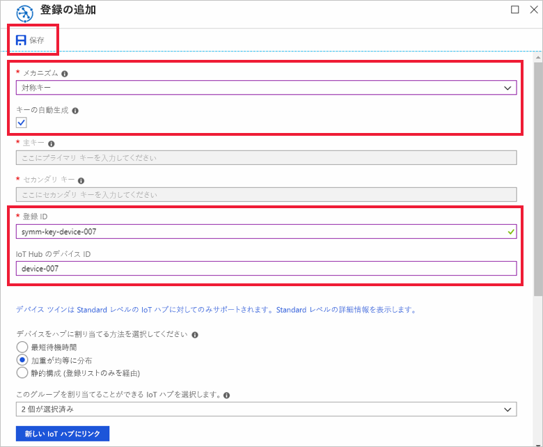
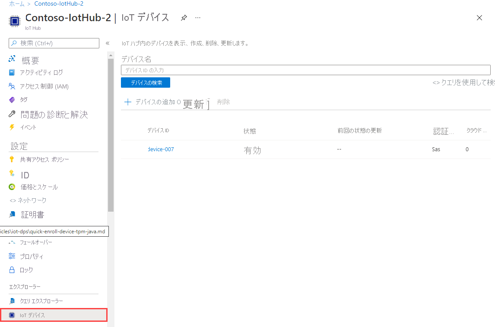

# <a name="quickstart-provision-a-simulated-device-with-symmetric-keys"></a>クイック スタート:対称キーを使用してシミュレートされたデバイスをプロビジョニングする

このクイック スタートでは、Windows 開発マシン上でデバイス シミュレーターを作成して実行する方法について説明します。 ここでは、Device Provisioning Service インスタンスとの認証と IoT ハブへの割り当てに対称キーを使用するように、このシミュレートされたデバイスを構成します。 [Azure IoT C SDK](https://github.com/Azure/azure-iot-sdk-c) のサンプル コードを使用して、プロビジョニングを開始するデバイスのブート シーケンスをシミュレートします。 デバイスは、プロビジョニング サービス インスタンスへの個々の登録に基づいて認識され、IoT ハブに割り当てられます。

この記事では、個々の登録を使用したプロビジョニングについて説明しますが、登録グループと同じ手順を使用できます。 唯一の違いは、デバイスの一意の登録 ID を持つ派生デバイス キーを使用する必要がある点です。 登録グループの場合、登録の対称キーは直接使用されません。 対称キー登録グループはレガシ デバイスのみには限定されませんが、[対称キーの構成証明を使用してレガシ デバイスをプロビジョニングする方法](how-to-legacy-device-symm-key.md)に関する記事に登録グループの例が記載されています。 詳細については、[対称キーの構成証明のグループ登録](concepts-symmetric-key-attestation.md#group-enrollments)に関する記事を参照してください。

自動プロビジョニングの処理に慣れていない場合は、「[自動プロビジョニングの概念](concepts-auto-provisioning.md)」を確認してください。 

また、このクイック スタートを続行する前に、[Azure portal での IoT Hub Device Provisioning Service の設定](./quick-setup-auto-provision.md)に関するページの手順も済ませておいてください。 このクイック スタートでは、Device Provisioning Service インスタンスを既に作成している必要があります。

この記事は、Windows ベースのワークスペース向けです。 ただし、Linux でもこの手順を実行できます。 Linux の例については、「[How to provision for multitenancy](how-to-provision-multitenant.md)」(マルチテナント方式のプロビジョニング) を参照してください。


[!INCLUDE [quickstarts-free-trial-note](../../includes/quickstarts-free-trial-note.md)]


## <a name="prerequisites"></a>前提条件

Windows 開発環境の前提条件は次のとおりです。 Linux または macOS については、SDK ドキュメントの「[開発環境を準備する](https://github.com/Azure/azure-iot-sdk-c/blob/master/doc/devbox_setup.md)」の該当するセクションを参照してください。

* [C++ によるデスクトップ開発](https://docs.microsoft.com/cpp/?view=vs-2019#pivot=workloads)ワークロードを有効にした [Visual Studio](https://visualstudio.microsoft.com/vs/) 2019。 Visual Studio 2015 と Visual Studio 2017 もサポートされています。

* [Git](https://git-scm.com/download/) の最新バージョンがインストールされている。

<a id="setupdevbox"></a>

## <a name="prepare-an-azure-iot-c-sdk-development-environment"></a>Azure IoT C SDK の開発環境を準備する

このセクションでは、[Azure IoT C SDK](https://github.com/Azure/azure-iot-sdk-c) のビルドに使用する開発環境を準備します。 

この SDK には、シミュレートされたデバイスのサンプル コードが含まれています。 このシミュレートされたデバイスでは、デバイスのブート シーケンス中にプロビジョニングを試行します。

1. [CMake ビルド システム](https://cmake.org/download/)をダウンロードします。

    `CMake` のインストールを開始する**前に**、Visual Studio の前提条件 (Visual Studio と "C++ によるデスクトップ開発" ワークロード) が マシンにインストールされていることが重要です。 前提条件を満たし、ダウンロードを検証したら、CMake ビルド システムをインストールします。

2. SDK の[最新リリース](https://github.com/Azure/azure-iot-sdk-c/releases/latest)のタグ名を見つけます。

3. コマンド プロンプトまたは Git Bash シェルを開きます。 次のコマンドを実行して、最新リリースの [Azure IoT C SDK](https://github.com/Azure/azure-iot-sdk-c) GitHub リポジトリを複製します。 `-b` パラメーターの値として、前の手順で見つけたタグを使用します。

    ```cmd/sh
    git clone -b <release-tag> https://github.com/Azure/azure-iot-sdk-c.git
    cd azure-iot-sdk-c
    git submodule update --init
    ```

    この操作は、完了するまでに数分かかります。

4. git リポジトリのルート ディレクトリに `cmake` サブディレクトリを作成し、そのフォルダーに移動します。 `azure-iot-sdk-c` ディレクトリから次のコマンドを実行します。

    ```cmd/sh
    mkdir cmake
    cd cmake
    ```

5. 次のコマンドを実行して、開発クライアント プラットフォームに固有の SDK のバージョンをビルドします。 シミュレートされたデバイスの Visual Studio ソリューションが `cmake` ディレクトリに生成されます。 

    ```cmd
    cmake -Dhsm_type_symm_key:BOOL=ON -Duse_prov_client:BOOL=ON  ..
    ```
    
    `cmake` で C++ コンパイラが見つからない場合は、上記のコマンドの実行中にビルド エラーが発生している可能性があります。 これが発生した場合は、[Visual Studio コマンド プロンプト](https://docs.microsoft.com/dotnet/framework/tools/developer-command-prompt-for-vs)でこのコマンドを実行してください。 

    ビルドが成功すると、最後のいくつかの出力行は次のようになります。

    ```cmd/sh
    $ cmake -Dhsm_type_symm_key:BOOL=ON -Duse_prov_client:BOOL=ON  ..
    -- Building for: Visual Studio 15 2017
    -- Selecting Windows SDK version 10.0.16299.0 to target Windows 10.0.17134.
    -- The C compiler identification is MSVC 19.12.25835.0
    -- The CXX compiler identification is MSVC 19.12.25835.0

    ...

    -- Configuring done
    -- Generating done
    -- Build files have been written to: E:/IoT Testing/azure-iot-sdk-c/cmake
    ```

## <a name="create-a-device-enrollment-entry-in-the-portal"></a>ポータルでデバイス登録エントリを作成する

1. Azure portal にサインインし、左側のメニューの **[すべてのリソース]** を選択して、Device Provisioning Service を開きます。

2. **[登録を管理します]** タブを選択し、上部にある **[個別登録の追加]** を選択します。 

3. **[登録の追加]** パネルで次の情報を入力して、 **[保存]** を押します。

   - **メカニズム**:ID 構成証明の*メカニズム*として **[対称キー]** を選択します。

   - **自動生成キー**:このボックスをオンにします。

   - **登録 ID**:登録を識別する登録 ID を入力します。 小文字の英字、数字、ダッシュ ('-') 文字のみを使用します。 たとえば、**symm-key-device-007** のようにします。

   - **IoT Hub のデバイス ID**:デバイス識別子を入力します。 たとえば、「**device-007**」と入力します。

     

4. 登録を保存したら、**主キー**と**セカンダリ キー**が生成され、登録エントリに追加されます。 対称キーのデバイス登録は、 *[個々の登録]* タブの *[登録 ID]* 列に **symm-key-device-007** と表示されます。 

    登録を開き、生成された**主キー**の値をコピーします。


<a id="firstbootsequence"></a>

## <a name="simulate-first-boot-sequence-for-the-device"></a>デバイスの初回ブート シーケンスのシミュレーション

このセクションでは、デバイスのブート シーケンスを Device Provisioning Service インスタンスに送信するようにサンプル コードを更新します。 このブート シーケンスにより、デバイスが認識され、Device Provisioning Service インスタンスにリンクされた IoT ハブに割り当てられます。


1. Azure portal で、Device Provisioning Service の **[概要]** タブを選択し、**[_ID スコープ_]** の値をメモします。

     

2. CMake を実行して生成された **azure_iot_sdks.sln** ソリューション ファイルを Visual Studio で開きます。 ソリューション ファイルは次の場所にあります。

    ```
    \azure-iot-sdk-c\cmake\azure_iot_sdks.sln
    ```

3. Visual Studio の "*ソリューション エクスプローラー*" ウィンドウで、**Provision\_Samples** フォルダーに移動します。 **prov\_dev\_client\_sample** という名前のサンプル プロジェクトを展開します。 **Source Files** を展開し、**prov\_dev\_client\_sample.c** を開きます。

4. 定数 `id_scope` を探し、以前にコピーした **ID スコープ**の値で置き換えます。 

    ```c
    static const char* id_scope = "0ne00002193";
    ```

5. 同じファイル内で `main()` 関数の定義を探します。 以下に示すように `hsm_type` 変数が `SECURE_DEVICE_TYPE_SYMMETRIC_KEY` に設定されていることを確認します。

    ```c
    SECURE_DEVICE_TYPE hsm_type;
    //hsm_type = SECURE_DEVICE_TYPE_TPM;
    //hsm_type = SECURE_DEVICE_TYPE_X509;
    hsm_type = SECURE_DEVICE_TYPE_SYMMETRIC_KEY;
    ```

6. **prov\_dev\_client\_sample.c** で、コメントになっている `prov_dev_set_symmetric_key_info()` の呼び出しを探します。

    ```c
    // Set the symmetric key if using they auth type
    //prov_dev_set_symmetric_key_info("<symm_registration_id>", "<symmetric_Key>");
    ```

    関数呼び出しのコメントを解除し、プレースホルダーの値 (山かっこを含む) を、自分の登録 ID と主キーの値に置き換えます。

    ```c
    // Set the symmetric key if using they auth type
    prov_dev_set_symmetric_key_info("symm-key-device-007", "your primary key here");
    ```
   
    ファイルを保存します。

7. **prov\_dev\_client\_sample** プロジェクトを右クリックし、 **[スタートアップ プロジェクトに設定]** を選択します。 

8. Visual Studio のメニューで **[デバッグ]**  >  **[デバッグなしで開始]** の順に選択して、ソリューションを実行します。 プロジェクトをリビルドするよう求められたら、 **[はい]** を選択して、プロジェクトをリビルドしてから実行します。

    次の出力は、シミュレートされたデバイスが正常に起動し、IoT ハブに割り当てられるプロビジョニング サービス インスタンスに接続する例です。

    ```cmd
    Provisioning API Version: 1.2.8

    Registering Device

    Provisioning Status: PROV_DEVICE_REG_STATUS_CONNECTED
    Provisioning Status: PROV_DEVICE_REG_STATUS_ASSIGNING
    Provisioning Status: PROV_DEVICE_REG_STATUS_ASSIGNING

    Registration Information received from service: 
    test-docs-hub.azure-devices.net, deviceId: device-007    
    Press enter key to exit:
    ```

9. ポータルで、シミュレートされたデバイスが割り当てられた IoT ハブに移動し、 **[IoT デバイス]** タブを選択します。シミュレートされたデバイスがハブに正常にプロビジョニングされると、そのデバイス ID は、**有効**な*状態*で **[IoT デバイス]** ブレードに表示されます。 場合によっては、一番上にある **[最新の情報に更新]** を押す必要があります。 

     


## <a name="clean-up-resources"></a>リソースをクリーンアップする

引き続きデバイス クライアント サンプルを使用する場合は、このクイックスタートで作成したリソースをクリーンアップしないでください。 使用する予定がない場合は、次の手順を使用して、このクイックスタートで作成したすべてのリソースを削除してください。

1. マシンに表示されているデバイス クライアント サンプルの出力ウィンドウを閉じます。
1. Azure portal の左側のメニューで **[すべてのリソース]** を選択し、Device Provisioning Service を選択します。 サービスの **[登録を管理します]** を開き、 **[個々の登録]** タブを選択します。このクイックスタートで登録したデバイスの "*登録 ID*" の隣にあるチェック ボックスをオンにして、ペイン上部の **[削除]** を押します。 
1. Azure portal の左側のメニューにある **[すべてのリソース]** を選択し、IoT ハブを選択します。 ハブの **[IoT デバイス]** を開き、このクイックスタートで登録したデバイスの "*デバイス ID*" の隣にあるチェック ボックスをオンにして、ペイン上部の **[削除]** を押します。

## <a name="next-steps"></a>次のステップ

このクイックスタートでは、シミュレートされたデバイスを Windows マシン上に作成し、ポータル上の Azure IoT Hub Device Provisioning Service で対称キーを使用して IoT ハブにプロビジョニングしました。 プログラムでデバイスを登録する方法については、X.509 デバイスのプログラミングによる登録のクイックスタートに進みます。 

> [!div class="nextstepaction"]
> [Azure クイックスタート - X.509 デバイスを Azure IoT Hub Device Provisioning Service に登録する](quick-enroll-device-x509-java.md)
