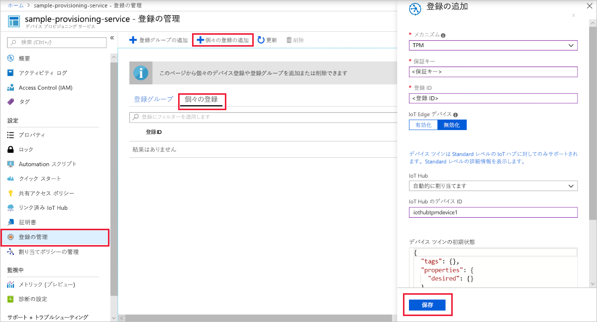
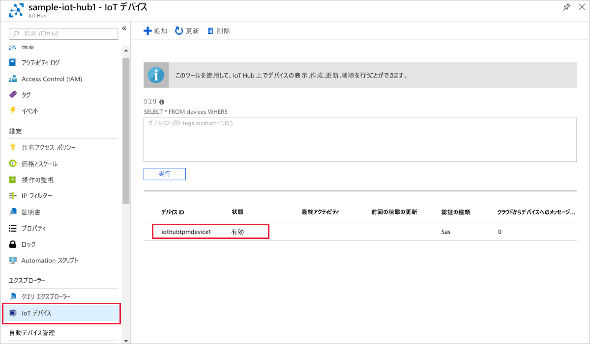

# <a name="quickstart-create-and-provision-a-simulated-tpm-device-using-c-device-sdk-for-iot-hub-device-provisioning-service"></a>クイック スタート:IoT Hub Device Provisioning Service 対応の C# デバイス SDK を使用して、シミュレートされた TPM デバイスを作成してプロビジョニングする

[!INCLUDE [iot-dps-selector-quick-create-simulated-device-tpm](../../includes/iot-dps-selector-quick-create-simulated-device-tpm.md)]

これらの手順では、[C# 用の Azure IoT サンプル](https://github.com/Azure-Samples/azure-iot-samples-csharp)を使用して、Windows OS を実行中の開発用コンピューター上で TPM デバイスをシミュレートします。 サンプルでは、Device Provisioning Service を使用して、シミュレートされたデバイスを IoT ハブに接続する操作も行います。 

このサンプル コードでは、デバイスの[ハードウェア セキュリティ モジュール (HSM)](https://azure.microsoft.com/blog/azure-iot-supports-new-security-hardware-to-strengthen-iot-security/) として Windows TPM シミュレーターを使用しています。 

自動プロビジョニングの処理に慣れていない場合は、「[自動プロビジョニングの概念](concepts-auto-provisioning.md)」も確認してください。 また、先に進む前に、[Azure Portal での IoT Hub Device Provisioning Service の設定](./quick-setup-auto-provision.md)に関するページの手順も済ませておいてください。 

Azure IoT Device Provisioning Service では、次の 2 種類の登録がサポートされています。

- [登録グループ](concepts-service.md#enrollment-group)：複数の関連するデバイスを登録するために使用します。
- [個々の登録](concepts-service.md#individual-enrollment):単一デバイスを登録するために使用します。

この記事では、個別登録の使用方法を示します。

[!INCLUDE [IoT Device Provisioning Service basic](../../includes/iot-dps-basic.md)]

<a id="setupdevbox"></a>
## <a name="prepare-the-development-environment"></a>開発環境の準備 

1. お使いのマシンに [.NET Core 2.1 SDK 以降](https://www.microsoft.com/net/download/windows)がインストールされていることを確認します。 

1. マシンに `git` がインストールされ、コマンド ウィンドウからアクセスできる環境変数に追加されていることを確認します。 **Git Bash** (ローカル Git リポジトリと対話する際に使用するコマンドライン アプリ) など、インストールする各種 `git` ツールの最新バージョンについては、[Software Freedom Conservancy の Git クライアント ツール](https://git-scm.com/download/)に関するページを参照してください。 

1. コマンド プロンプトまたは Git Bash を開きます。 C# の GitHub リポジトリ用の Azure IoT サンプルを複製します。

    ```cmd
    git clone https://github.com/Azure-Samples/azure-iot-samples-csharp.git
    ```

## <a name="provision-the-simulated-device"></a>シミュレーションされたデバイスをプロビジョニングする

1. Azure ポータルにサインインします。 左側のメニューの **[すべてのリソース]** を選択して、Device Provisioning Service を開きます。 **[概要]** ブレードから、 **_[ID スコープ]_** の値をメモします。

     

1. コマンド プロンプトで、ディレクトリを TPM デバイス プロビジョニング サンプルのプロジェクト ディレクトリに変更します。

    ```cmd
    cd .\azure-iot-samples-csharp\provisioning\Samples\device\TpmSample
    ```

1. 次のコマンドを入力して、TPM デバイス プロビジョニング サンプルをビルドして実行します。 `<IDScope>` 値をプロビジョニング サービスの ID スコープに置き換えます。 

    ```cmd
    dotnet run <IDScope>
    ```

    このコマンドにより、別のコマンド プロンプトで TPM チップのシミュレーターが起動します。 Windows の場合、Simulator.exe がパブリック ネットワーク経由で通信するのを許可するかどうかをお客様に確認する Windows セキュリティ アラートが発生する場合があります。 このサンプルでは、要求を取り消してもかまいません。

1. 元のコマンド ウィンドウには、デバイスの登録に必要な **_保証キー_** 、 **_登録 ID_** 、提案される **_デバイス ID_** が表示されます。 これらの値を書き留めておきます。 これらの値を使用して、Device Provisioning Service インスタンスで個々の登録を作成します。 
   > [!NOTE]
   > コマンド出力が表示されるウィンドウと、TPM シミュレーターの出力が表示されるウィンドウを混同しないでください。 必要に応じて、元のコマンド ウィンドウを選択してウィンドウを前面に表示します。

     

1. Azure portal の Device Provisioning Service のメニューで、 **[登録を管理します]** を選択します。 **[個々の登録]** タブを選択したうえで、上部にある **[個別登録の追加]** を選択します。 

1. **[登録の追加]** パネルで、次の情報を入力します。
   - ID 構成証明の "*メカニズム*" として **[TPM]** を選択します。
   - 前にメモしておいた値を基に、TPM デバイスの "*登録 ID*" と "*保証キー*" を入力します。
   - プロビジョニング サービスにリンクされた IoT ハブを選択します。
   - 必要に応じて、次の情報を入力することができます。
       - 一意の*デバイス ID* を入力します (推奨されるものを使用するか、独自のものを指定できます)。 デバイスに名前を付ける際に機密データを含めないようにしてください。 指定しない場合には、デバイスを識別するために登録 ID が代わりに使用されます。
       - **[Initial device twin state]\(初期のデバイス ツインの状態\)** をデバイスの目的の初期構成で更新します。
   - 作業が完了したら、 **[保存]** を押します。 

       

   登録に成功すると、 *[Individual Enrollments]\(個々の登録\)* タブの一覧に、対象デバイスの "*登録 ID*" が表示されます。 

1. コマンド ウィンドウで *Enter* キーを押します。コマンド ウィンドウには、シミュレートされたデバイスの登録に必要な " **_保証キー_** "、" **_登録 ID_** "、提案される " **_デバイス ID_** " が表示されます。 デバイスが起動して Device Provisioning Service に接続し、IoT ハブの情報を取得する動作がシミュレートされるので、そのメッセージに注目してください。 

1. デバイスがプロビジョニングされたことを確認します。 プロビジョニング サービスにリンクされた IoT ハブに対してシミュレートされたデバイスが正常にプロビジョニングされると、ハブの **[IoT デバイス]** ブレードにデバイス ID が表示されます。 

     

    *[Initial device twin state]\(初期のデバイス ツインの状態\)* をデバイスの登録エントリの既定値から変更した場合、デバイスはハブから目的のツインの状態をプルし、それに従って動作することができます。 詳細については、「[IoT Hub のデバイス ツインの理解と使用](../iot-hub/iot-hub-devguide-device-twins.md)」を参照してください。

## <a name="clean-up-resources"></a>リソースのクリーンアップ

引き続きデバイス クライアント サンプルを使用する場合は、このクイックスタートで作成したリソースをクリーンアップしないでください。 使用する予定がない場合は、次の手順を使用して、このクイックスタートで作成したすべてのリソースを削除してください。

1. マシンに表示されているデバイス クライアント サンプルの出力ウィンドウを閉じます。
1. マシンに表示されている TPM シミュレーター ウィンドウを閉じます。
1. Azure portal の左側のメニューで **[すべてのリソース]** を選択し、Device Provisioning Service を選択します。 **[概要]** ブレードの上部で、ペインの上部にある **[削除]** をクリックします。  
1. Azure portal の左側のメニューにある **[すべてのリソース]** を選択し、IoT ハブを選択します。 **[概要]** ブレードの上部で、ペインの上部にある **[削除]** をクリックします。  

## <a name="next-steps"></a>次の手順

このクイックスタートでは、TPM のシミュレートされたデバイスをマシン上に作成し、IoT Hub Device Provisioning Service を使用して IoT ハブにプロビジョニングしました。 TPM デバイスをプログラムで登録する方法については、プログラムによる TPM デバイスの登録のクイックスタートに進みます。 

> [!div class="nextstepaction"]
> [Azure クイック スタート - TPM デバイスを Azure IoT Hub Device Provisioning Service に登録する](quick-enroll-device-tpm-csharp.md)
