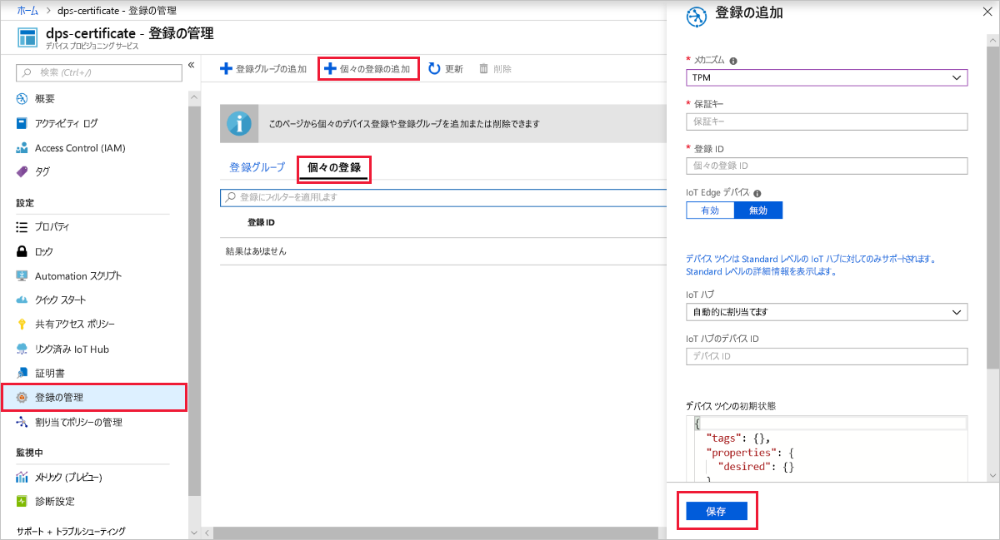
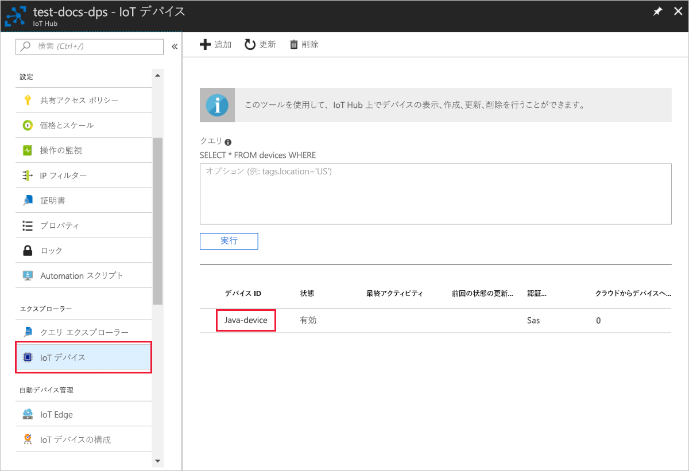

# <a name="quickstart-create-and-provision-a-simulated-tpm-device-using-java-device-sdk-for-azure-iot-hub-device-provisioning-service"></a>クイック スタート:Azure IoT Hub Device Provisioning Service 対応の Java デバイス SDK を使い、シミュレートされた TPM デバイスを作成してプロビジョニングする

[!INCLUDE [iot-dps-selector-quick-create-simulated-device-tpm](../../includes/iot-dps-selector-quick-create-simulated-device-tpm.md)]

以下の手順では、Windows OS を実行する開発マシンにシミュレートされたデバイスを作成し、そのデバイスの[ハードウェア セキュリティ モジュール (HSM)](https://azure.microsoft.com/blog/azure-iot-supports-new-security-hardware-to-strengthen-iot-security/) として Windows TPM シミュレーターを実行します。その後、コード サンプルを使って、そのシミュレートされたデバイスを Device Provisioning Service および IoT ハブに接続します。 

自動プロビジョニングの処理に慣れていない場合は、「[自動プロビジョニングの概念](concepts-auto-provisioning.md)」も確認してください。 また、先に進む前に、[Azure Portal での IoT Hub Device Provisioning Service の設定](./quick-setup-auto-provision.md)に関するページの手順も済ませておいてください。 

Azure IoT Device Provisioning Service では、次の 2 種類の登録がサポートされています。
- [登録グループ](concepts-service.md#enrollment-group)：複数の関連するデバイスを登録するために使用します。
- [個々の登録](concepts-service.md#individual-enrollment):単一デバイスを登録するために使用します。

この記事では、個別登録の使用方法を示します。

[!INCLUDE [IoT Device Provisioning Service basic](../../includes/iot-dps-basic.md)]

## <a name="prepare-the-environment"></a>環境の準備 

1. [Java SE Development Kit 8](https://aka.ms/azure-jdks) がマシンにインストールされていることを確認します。

1. [Maven](https://maven.apache.org/install.html) をダウンロードし、インストールします。

1. マシンに `git` がインストールされ、コマンド ウィンドウからアクセスできる環境変数に追加されていることを確認します。 **Git Bash** (ローカル Git リポジトリと対話する際に使用するコマンドライン アプリ) など、インストールする各種 `git` ツールの最新バージョンについては、[Software Freedom Conservancy の Git クライアント ツール](https://git-scm.com/download/)に関するページを参照してください。 

1. コマンド プロンプトを開きます。 デバイス シミュレーション コード サンプルの GitHub リポジトリを複製します。
    
    ```cmd/sh
    git clone https://github.com/Azure/azure-iot-sdk-java.git --recursive
    ```

1. [TPM](https://docs.microsoft.com/windows/device-security/tpm/trusted-platform-module-overview) シミュレーターを実行します。 **[アクセスを許可]** をクリックし、 _[Windows ファイアウォール]_ 設定への変更を許可します。 これは、ソケットでポート 2321 とポート 2322 をリッスンします。 このウィンドウを閉じないでください。このクイックスタート ガイドの終了まで、このシミュレーターを実行状態にしておく必要があります。 

    ```cmd/sh
    .\azure-iot-sdk-java\provisioning\provisioning-tools\tpm-simulator\Simulator.exe
    ```

    

1. 別のコマンド プロンプトでルート フォルダーに移動し、サンプルの依存関係を作成します。

    ```cmd/sh
    cd azure-iot-sdk-java
    mvn install -DskipTests=true
    ```

1. サンプル フォルダーに移動します。

    ```cmd/sh
    cd provisioning/provisioning-samples/provisioning-tpm-sample
    ```

1. Azure portal にサインインし、左側のメニューの **[すべてのリソース]** を選択して、Device Provisioning Service を開きます。 "_ID スコープ_" と "_プロビジョニング サービス グローバル エンドポイント_" をメモします。

    

1. `src/main/java/samples/com/microsoft/azure/sdk/iot/ProvisioningTpmSample.java` を編集して、メモした "_ID スコープ_" と "_プロビジョニング サービス グローバル エンドポイント_" を含めます。  

    ```java
    private static final String idScope = "[Your ID scope here]";
    private static final String globalEndpoint = "[Your Provisioning Service Global Endpoint here]";
    private static final ProvisioningDeviceClientTransportProtocol PROVISIONING_DEVICE_CLIENT_TRANSPORT_PROTOCOL = ProvisioningDeviceClientTransportProtocol.HTTPS;
    ```
    ファイルを保存します。

1. プロジェクトをビルドしてターゲット フォルダーに移動し、作成した jar ファイルを実行するには、次のコマンドを実行します。 プレースホルダー `version` は、Java の実際のバージョンに置き換えてください。

    ```cmd/sh
    mvn clean install
    cd target
    java -jar ./provisioning-tpm-sample-{version}-with-deps.jar
    ```

1. プログラムの実行が始まっています。 次のセクションのために "_保証キー_" と "_登録 ID_" をメモします。プログラムは実行したままにしておいてください。

    
    

## <a name="create-a-device-enrollment-entry"></a>デバイス登録エントリを作成する

1. Azure portal にサインインし、左側のメニューの **[すべてのリソース]** を選択して、Device Provisioning Service を開きます。

1. Device Provisioning Service のメニューで、 **[登録を管理します]** を選択します。 **[個々の登録]** タブを選択したうえで、上部にある **[個別登録の追加]** を選択します。 

1. **[登録の追加]** パネルで、次の情報を入力します。
   - ID 構成証明の "*メカニズム*" として **[TPM]** を選択します。
   - 前にメモしておいた値を基に、TPM デバイスの "*登録 ID*" と "*保証キー*" を入力します。
   - プロビジョニング サービスにリンクされた IoT ハブを選択します。
   - 必要に応じて、次の情報を入力することができます。
       - 一意の "*デバイス ID*" を入力します。 デバイスに名前を付ける際に機密データを含めないようにしてください。 指定しない場合には、デバイスを識別するために登録 ID が代わりに使用されます。
       - **[Initial device twin state]\(初期のデバイス ツインの状態\)** をデバイスの目的の初期構成で更新します。
   - 作業が完了したら、 **[保存]** を押します。 

       

   登録に成功すると、 *[個々の登録]* タブの一覧に、対象デバイスの "*登録 ID*" が表示されます。 


## <a name="simulate-the-device"></a>デバイスをシミュレートする

1. ご使用のマシン上の Java サンプル コードを実行しているコマンド ウィンドウで、*Enter* キーを押してアプリケーションの実行を続けます。 デバイスが起動して Device Provisioning Service に接続し、IoT ハブの情報を取得する動作がシミュレートされるので、そのメッセージに注目してください。  

    

1. プロビジョニング サービスにリンクされた IoT ハブに対してシミュレートされたデバイスが正常にプロビジョニングされると、ハブの **[IoT デバイス]** ブレードにデバイス ID が表示されます。

     

    *[Initial device twin state]\(初期のデバイス ツインの状態\)* をデバイスの登録エントリの既定値から変更した場合、デバイスはハブから目的のツインの状態をプルし、それに従って動作することができます。 詳細については、「[IoT Hub のデバイス ツインの理解と使用](../iot-hub/iot-hub-devguide-device-twins.md)」を参照してください。


## <a name="clean-up-resources"></a>リソースのクリーンアップ

引き続きデバイス クライアント サンプルを使用する場合は、このクイックスタートで作成したリソースをクリーンアップしないでください。 使用する予定がない場合は、次の手順を使用して、このクイックスタートで作成したすべてのリソースを削除してください。

1. マシンに表示されているデバイス クライアント サンプルの出力ウィンドウを閉じます。
1. マシンに表示されている TPM シミュレーター ウィンドウを閉じます。
1. Azure portal の左側のメニューで **[すべてのリソース]** を選択し、Device Provisioning Service を選択します。 サービスの **[登録を管理します]** ブレードを開き、 **[個々の登録]** タブを選択します。このクイックスタートで登録したデバイスの "*登録 ID*" の隣にあるチェック ボックスをオンにして、ペイン上部の **[削除]** を押します。 
1. Azure portal の左側のメニューにある **[すべてのリソース]** を選択し、IoT ハブを選択します。 ハブの **[IoT デバイス]** ブレードを開き、このクイックスタートで登録したデバイスの "*デバイス ID*" の隣にあるチェック ボックスをオンにして、ペイン上部の **[削除]** を押します。

## <a name="next-steps"></a>次の手順

このクイックスタートでは、TPM のシミュレートされたデバイスをマシン上に作成し、IoT Hub Device Provisioning Service を使用して IoT ハブにプロビジョニングしました。 TPM デバイスをプログラムで登録する方法については、プログラムによる TPM デバイスの登録のクイックスタートに進みます。 

> [!div class="nextstepaction"]
> [Azure クイック スタート - TPM デバイスを Azure IoT Hub Device Provisioning Service に登録する](quick-enroll-device-tpm-java.md)
