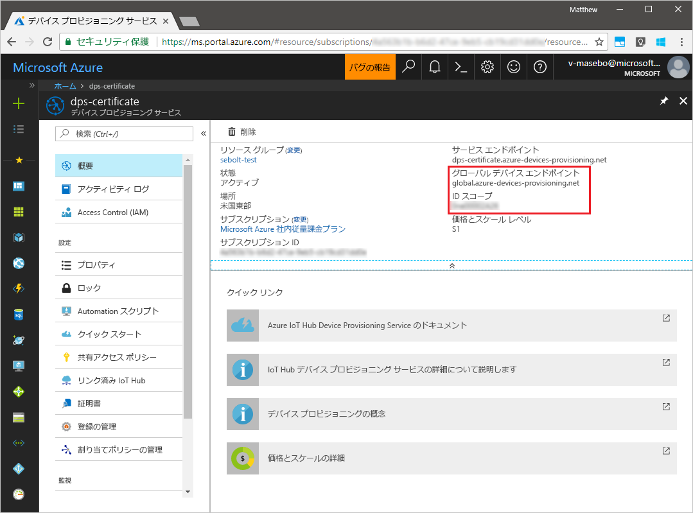
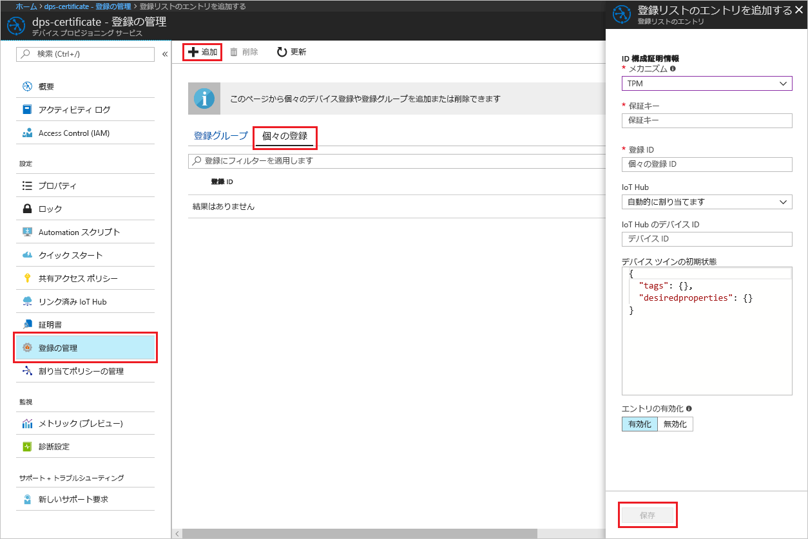
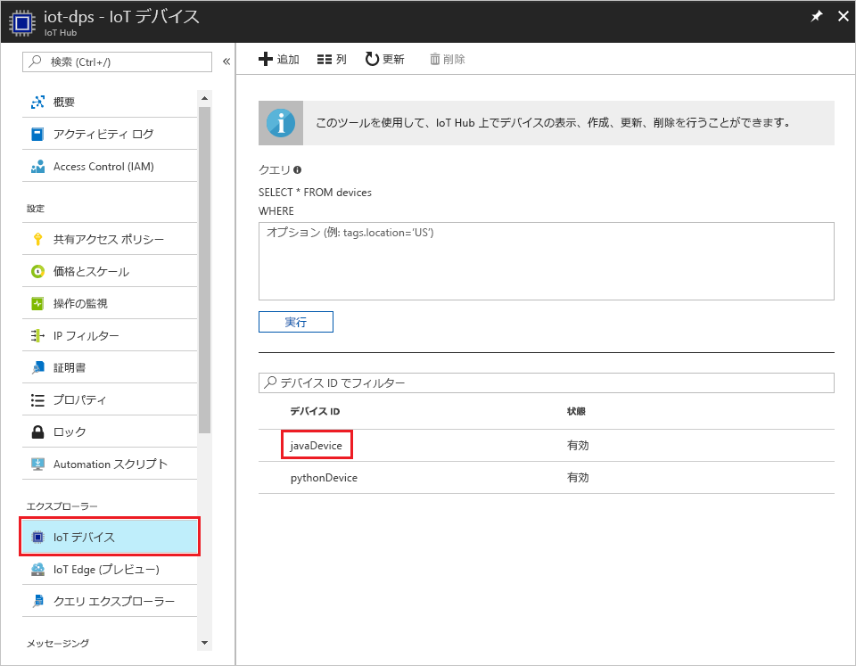

# <a name="create-and-provision-a-simulated-tpm-device-using-java-device-sdk-for-azure-iot-hub-device-provisioning-service"></a>Azure IoT Hub Device Provisioning Service 対応の Java デバイス SDK を使い、シミュレートされた TPM デバイスを作成してプロビジョニングする

[!INCLUDE [iot-dps-selector-quick-create-simulated-device-tpm](../../includes/iot-dps-selector-quick-create-simulated-device-tpm.md)]

以下の手順では、Windows OS を実行する開発マシンにシミュレートされたデバイスを作成し、そのデバイスの[ハードウェア セキュリティ モジュール (HSM)](https://azure.microsoft.com/blog/azure-iot-supports-new-security-hardware-to-strengthen-iot-security/) として Windows TPM シミュレーターを実行します。その後、コード サンプルを使って、そのシミュレートされたデバイスを Device Provisioning Service および IoT ハブに接続します。 

自動プロビジョニングの処理に慣れていない場合は、「[自動プロビジョニングの概念](concepts-auto-provisioning.md)」も確認してください。 また、先に進む前に、[Azure Portal での IoT Hub Device Provisioning Service の設定](./quick-setup-auto-provision.md)に関するページの手順も済ませておいてください。 

[!INCLUDE [IoT DPS basic](../../includes/iot-dps-basic.md)]

## <a name="prepare-the-environment"></a>環境の準備 

1. [Java SE Development Kit 8](http://www.oracle.com/technetwork/java/javase/downloads/jdk8-downloads-2133151.html) がマシンにインストールされていることを確認します。

1. [Maven](https://maven.apache.org/install.html) をダウンロードし、インストールします。

1. マシンに `git` がインストールされ、コマンド ウィンドウからアクセスできる環境変数に追加されていることを確認します。 **Git Bash** (ローカル Git リポジトリと対話する際に使用するコマンドライン アプリ) など、インストールする各種 `git` ツールの最新バージョンについては、[Software Freedom Conservancy の Git クライアント ツール](https://git-scm.com/download/)に関するページを参照してください。 

1. コマンド プロンプトを開きます。 デバイス シミュレーション コード サンプルの GitHub リポジトリを複製します。
    
    ```cmd/sh
    git clone https://github.com/Azure/azure-iot-sdk-java.git --recursive
    ```

1. [TPM](https://docs.microsoft.com/windows/device-security/tpm/trusted-platform-module-overview) シミュレーターを実行します。 **[アクセスを許可]** をクリックし、_[Windows ファイアウォール]_ 設定への変更を許可します。 これは、ソケットでポート 2321 とポート 2322 をリッスンします。 このウィンドウを閉じないでください。このクイックスタート ガイドの終了まで、このシミュレーターを実行状態にしておく必要があります。 

    ```cmd/sh
    .\azure-iot-sdk-java\provisioning\provisioning-tools\tpm-simulator\Simulator.exe
    ```

    

1. 別のコマンド プロンプトでルート フォルダーに移動し、サンプルの依存関係を作成します。

    ```cmd/sh
    cd azure-iot-sdk-java
    mvn install -DskipTests=true
    ```

1. サンプル フォルダーに移動します。

    ```cmd/sh
    cd provisioning/provisioning-samples/provisioning-tpm-sample
    ```

1. Azure Portal にログインし、左側のメニューの **[すべてのリソース]** をクリックして、Device Provisioning Service を開きます。 "_ID スコープ_" と "_プロビジョニング サービス グローバル エンドポイント_" をメモします。

    

1. `src/main/java/samples/com/microsoft/azure/sdk/iot/ProvisioningTpmSample.java` を編集して、メモした _ID スコープ_と _Provisioning Service のグローバル エンドポイント_を含めます。  

    ```java
    private static final String idScope = "[Your ID scope here]";
    private static final String globalEndpoint = "[Your Provisioning Service Global Endpoint here]";
    private static final ProvisioningDeviceClientTransportProtocol PROVISIONING_DEVICE_CLIENT_TRANSPORT_PROTOCOL = ProvisioningDeviceClientTransportProtocol.HTTPS;
    ```

1. プロジェクトをビルドします。 ターゲット フォルダーに移動し、作成した jar ファイルを実行します。

    ```cmd/sh
    mvn clean install
    cd target
    java -jar ./provisioning-tpm-sample-{version}-with-deps.jar
    ```

1. プログラムの実行が始まっています。 次のセクションのために "_保証キー_" と "_登録 ID_" をメモします。プログラムは実行したままにしてください。

    
    

## <a name="create-a-device-enrollment-entry"></a>デバイス登録エントリを作成する

1. Azure Portal にログインし、左側のメニューの **[すべてのリソース]** をクリックして、Device Provisioning Service を開きます。

1. Device Provisioning Service の概要ブレードで、**[Manage enrollments]\(登録の管理\)** を選択します。 **[Individual Enrollments]\(個々の登録\)** タブの上部にある **[追加]** ボタンをクリックします。 

1. **[Add enrollment list entry]\(登録リスト エントリの追加\)** で、次の情報を入力します。
    - ID 構成証明の "*メカニズム*" として **[TPM]** を選択します。
    - 前にメモした TPM デバイスの "*登録 ID*" と "*保証キー*" を入力します。 
    - プロビジョニング サービスにリンクされた IoT ハブを選択します。
    - 一意のデバイス ID を入力します。 デバイスに名前を付ける際に機密データを含めないようにしてください。
    - **[Initial device twin state]\(初期のデバイス ツインの状態\)** をデバイスの目的の初期構成で更新します。
    - 作業が完了したら、**[保存]** をクリックします。 

      

   登録に成功すると、*[個々の登録]* タブの一覧に、対象デバイスの "*登録 ID*" が表示されます。 


## <a name="simulate-the-device"></a>デバイスのシミュレート

1. ご使用のマシンで Java サンプル コードを実行しているコマンド ウィンドウで、Enter キーを押してアプリケーションの実行を続けます。 デバイスが起動して Device Provisioning Service に接続し、IoT ハブの情報を取得する動作がシミュレートされるので、そのメッセージに注目してください。  

    

1. プロビジョニング サービスにリンクされた IoT ハブに対し、シミュレートされたデバイスが正常にプロビジョニングされると、ハブの **[デバイス エクスプローラー]** ブレードにデバイス ID が表示されます。

     

    *[Initial device twin state]\(初期のデバイス ツインの状態\)* をデバイスの登録エントリの既定値から変更した場合、デバイスはハブから目的のツインの状態をプルし、それに従って動作することができます。 詳細については、「[IoT Hub のデバイス ツインの理解と使用](../iot-hub/iot-hub-devguide-device-twins.md)」を参照してください。


## <a name="clean-up-resources"></a>リソースのクリーンアップ

引き続きデバイス クライアント サンプルを使用する場合は、このクイックスタートで作成したリソースをクリーンアップしないでください。 使用する予定がない場合は、次の手順を使用して、このクイックスタートで作成したすべてのリソースを削除してください。

1. マシンに表示されているデバイス クライアント サンプルの出力ウィンドウを閉じます。
1. マシンに表示されている TPM シミュレーター ウィンドウを閉じます。
1. Azure Portal の左側のメニューにある **[すべてのリソース]** をクリックし、Device Provisioning サービスを選択します。 サービスの **[登録を管理します]** ブレードを開き、**[個々の登録]** タブをクリックします。このクイックスタートで登録したデバイスの*登録 ID* を選択し、上部の **[削除]** ボタンをクリックします。 
1. Azure Portal の左側のメニューにある **[すべてのリソース]** をクリックし、IoT ハブを選択します。 ハブの **[IoT Devices]\(IoT デバイス\)** ブレードを開き、このクイックスタートで登録したデバイスの "*デバイス ID*" を選択し、一番上の **[削除]** ボタンをクリックします。

## <a name="next-steps"></a>次の手順

このクイックスタートでは、TPM のシミュレートされたデバイスをコンピューター上に作成し、IoT Hub Device Provisioning Service を使用して IoT ハブにプロビジョニングしました。 プログラミングによって TPM デバイスを登録する方法については、TPM デバイスのプログラミングによる登録のクイックスタートに進みます。 

> [!div class="nextstepaction"]
> [Azure クイックスタート - Azure IoT Hub Device Provisioning Service への TPM デバイスの登録](quick-enroll-device-tpm-java.md)
