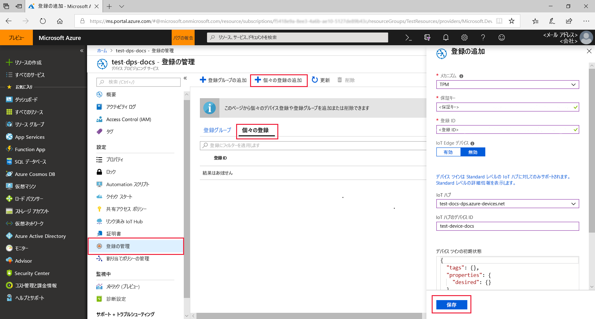
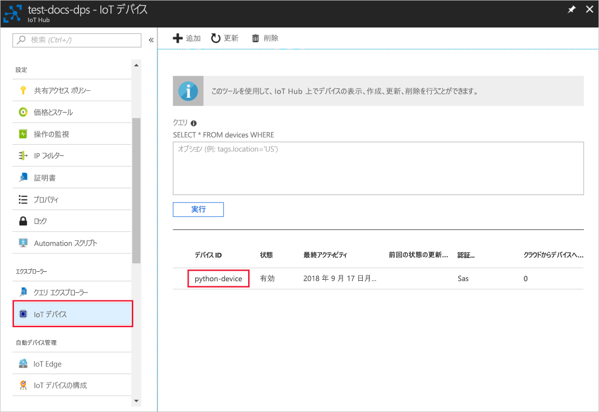

# <a name="quickstart-create-and-provision-a-simulated-tpm-device-using-python-device-sdk-for-iot-hub-device-provisioning-service"></a>クイック スタート:IoT Hub Device Provisioning Service 対応の Python デバイス SDK を使用して、シミュレートされた TPM デバイスを作成してプロビジョニングする

[!INCLUDE [iot-dps-selector-quick-create-simulated-device-tpm](../../includes/iot-dps-selector-quick-create-simulated-device-tpm.md)]

このクイックスタートでは、シミュレートされた IoT デバイスを Windows コンピューターに作成します。 シミュレートされたデバイスには、ハードウェア セキュリティ モジュール (HSM) としての TPM シミュレーターが含まれます。 デバイス サンプル Python コードから、Device Provisioning Service (DPS) への個別登録を使用して、このシミュレートされたデバイスを IoT ハブに接続します。

## <a name="prerequisites"></a>前提条件

- [自動プロビジョニングの概念](concepts-auto-provisioning.md)の確認。
- [Azure portal での IoT Hub Device Provisioning Service の設定](./quick-setup-auto-provision.md)が完了していること。
- アクティブなサブスクリプションが含まれる Azure アカウント。 [無料で作成できます](https://azure.microsoft.com/free/?ref=microsoft.com&utm_source=microsoft.com&utm_medium=docs&utm_campaign=visualstudio)。
- [Visual Studio 2015 以上](https://visualstudio.microsoft.com/vs/) (C++ によるデスクトップ開発が有効であること)。
- [CMake ビルド システム](https://cmake.org/download/)
- [Git](https://git-scm.com/download/).

> [!IMPORTANT]
> この記事は、非推奨となっている V1 Python SDK にのみ適用されます。 V2 では、Iot Hub Device Provisioning Service 用のデバイス クライアントとサービス クライアントはまだ利用できません。 チームは現在、V2 を機能パリティに移行する作業に取り組んでいます。

[!INCLUDE [IoT Device Provisioning Service basic](../../includes/iot-dps-basic.md)]

## <a name="prepare-the-environment"></a>環境の準備 

1. 'C++ によるデスクトップ開発' ワークロードが Visual Studio インストールに対して有効になった [Visual Studio](https://visualstudio.microsoft.com/vs/) 2015 以降がインストールされていることを確認してください。

1. [CMake ビルド システム](https://cmake.org/download/)をダウンロードしてインストールします。

1. マシンに `git` がインストールされ、コマンド ウィンドウからアクセスできる環境変数に追加されていることを確認します。 **Git Bash** (ローカル Git リポジトリと対話する際に使用するコマンドライン アプリ) など、インストールする各種 `git` ツールの最新バージョンについては、[Software Freedom Conservancy の Git クライアント ツール](https://git-scm.com/download/)に関するページを参照してください。 

1. コマンド プロンプトまたは Git Bash を開きます。 デバイス シミュレーション コード サンプルの GitHub リポジトリを複製します。
    
    ```cmd/sh
    git clone --single-branch --branch v1-deprecated https://github.com/Azure/azure-iot-sdk-python.git --recursive
    ```

1. この GitHub リポジトリのローカル コピーに、CMake ビルド プロセス用のフォルダーを作成します。 

    ```cmd/sh
    cd azure-iot-sdk-python/c
    mkdir cmake
    cd cmake
    ```

1. このコード サンプルでは、Windows TPM シミュレーターを使用します。 次のコマンドを実行して、SAS トークン認証を有効にしてください。 これにより、シミュレートされたデバイスの Visual Studio ソリューションも生成されます。

    ```cmd/sh
    cmake -Duse_prov_client:BOOL=ON -Duse_tpm_simulator:BOOL=ON ..
    ```

1. 別のコマンド プロンプトで TPM シミュレーター フォルダーに移動し、シミュレートされたデバイスの [HSM](https://azure.microsoft.com/blog/azure-iot-supports-new-security-hardware-to-strengthen-iot-security/) として [TPM](https://docs.microsoft.com/windows/device-security/tpm/trusted-platform-module-overview) シミュレーターを実行します。 **[アクセスを許可]** をクリックします。 これは、ソケットでポート 2321 とポート 2322 をリッスンします。 このコマンド ウィンドウを閉じないでください。このクイックスタート ガイドの終了まで、このシミュレーターを実行状態にしておく必要があります。 

    ```cmd/sh
    .\azure-iot-sdk-python\c\provisioning_client\deps\utpm\tools\tpm_simulator\Simulator.exe
    ```

    


## <a name="create-a-device-enrollment-entry"></a>デバイス登録エントリを作成する

Azure IoT Device Provisioning Service では、次の 2 種類の登録がサポートされています。

- [登録グループ](concepts-service.md#enrollment-group)：複数の関連するデバイスを登録するために使用します。
- [個別登録](concepts-service.md#individual-enrollment): 単一デバイスを登録するために使用します。

この記事では、個別登録の使用方法を示します。

1. *cmake* フォルダーに生成されたソリューション (`azure_iot_sdks.sln`) を開き、Visual Studio でビルドします。

1. **tpm_device_provision** プロジェクトを右クリックし、 **[スタートアップ プロジェクトに設定]** を選択します。 ソリューションを実行する デバイス登録に必要な **_保証キー_** と **_登録 ID_** が出力ウィンドウに表示されます。 これらの値を書き留めておいてください。 

    

1. Azure portal にサインインし、左側のメニューの **[すべてのリソース]** を選択して、Device Provisioning Service を開きます。

1. Device Provisioning Service のメニューで、 **[登録を管理します]** を選択します。 **[個々の登録]** タブを選択したうえで、上部にある **[個別登録の追加]** を選択します。 

1. **[登録の追加]** パネルで、次の情報を入力します。
   - ID 構成証明の "*メカニズム*" として **[TPM]** を選択します。
   - 前にメモしておいた値を基に、TPM デバイスの "*登録 ID*" と "*保証キー*" を入力します。
   - プロビジョニング サービスにリンクされた IoT ハブを選択します。
   - 必要に応じて、次の情報を入力することができます。
       - 一意の "*デバイス ID*" を入力します。 デバイスに名前を付ける際に機密データを含めないようにしてください。 指定しない場合には、デバイスを識別するために登録 ID が代わりに使用されます。
       - **[Initial device twin state]\(初期のデバイス ツインの状態\)** をデバイスの目的の初期構成で更新します。
   - 作業が完了したら、 **[保存]** を押します。 

       

   登録に成功すると、 *[Individual Enrollments]\(個々の登録\)* タブの一覧に、対象デバイスの "*登録 ID*" が表示されます。 


## <a name="simulate-the-device"></a>デバイスをシミュレートする

1. [Python 2.x または 3.x](https://www.python.org/downloads/) をダウンロードしてインストールします。 必ず、セットアップに必要な 32 ビットまたは 64 ビットのインストールを使用してください。 インストール中に求められた場合は、プラットフォーム固有の環境変数に Python を追加します。
    - Windows OS を使用している場合は、[Visual C++ 再頒布可能パッケージ](https://support.microsoft.com/help/2977003/the-latest-supported-visual-c-downloads)によって、Python からネイティブ DLL を使用できます。

1. [これらの手順](https://github.com/Azure/azure-iot-sdk-python/blob/v1-deprecated/doc/python-devbox-setup.md)に従って、Python パッケージをビルドします。

   > [!NOTE]
   > `build_client.cmd` を実行する場合は、必ず `--use-tpm-simulator` フラグを使用してください。
   > 
   > [!NOTE]
   > `pip` を使用する場合は、`azure-iot-provisioning-device-client` パッケージもインストールされていることを確認してください。 リリースされている PIP パッケージでは、シミュレーターではなく実際の TPM が使用されています。 シミュレーターを使用するには、`--use-tpm-simulator` フラグを使用してソースからコンパイルする必要があります。

1. samples フォルダーに移動します。

    ```cmd/sh
    cd azure-iot-sdk-python/provisioning_device_client/samples
    ```

1. Python IDE を使用して、**provisioning\_device\_client\_sample.py** という名前の Python スクリプトを編集します。 *GLOBAL\_PROV\_URI* 変数と *ID\_SCOPE* 変数を前述の値に変更します。 また、*SECURITY\_DEVICE\_TYPE* が `ProvisioningSecurityDeviceType.TPM` に設定されていることを確認します

    ```python
    GLOBAL_PROV_URI = "{globalServiceEndpoint}"
    ID_SCOPE = "{idScope}"
    SECURITY_DEVICE_TYPE = ProvisioningSecurityDeviceType.TPM
    PROTOCOL = ProvisioningTransportProvider.HTTP
    ```

    

1. サンプルを実行します。 

    ```cmd/sh
    python provisioning_device_client_sample.py
    ```

1. デバイスが起動して Device Provisioning Service に接続し、IoT ハブの情報を取得する動作がシミュレートされるので、そのメッセージに注目してください。 

    

1. プロビジョニング サービスにリンクされた IoT ハブに対してシミュレートされたデバイスが正常にプロビジョニングされると、ハブの **[IoT デバイス]** ブレードにデバイス ID が表示されます。

     

    *[Initial device twin state]\(初期のデバイス ツインの状態\)* をデバイスの登録エントリの既定値から変更した場合、デバイスはハブから目的のツインの状態をプルし、それに従って動作することができます。 詳細については、「[IoT Hub のデバイス ツインの理解と使用](../iot-hub/iot-hub-devguide-device-twins.md)」を参照してください。


## <a name="clean-up-resources"></a>リソースをクリーンアップする

引き続きデバイス クライアント サンプルを使用する場合は、このクイックスタートで作成したリソースをクリーンアップしないでください。 使用する予定がない場合は、次の手順を使用して、このクイックスタートで作成したすべてのリソースを削除してください。

1. マシンに表示されているデバイス クライアント サンプルの出力ウィンドウを閉じます。
1. マシンに表示されている TPM シミュレーター ウィンドウを閉じます。
1. Azure portal の左側のメニューで **[すべてのリソース]** を選択し、Device Provisioning Service を選択します。 サービスの **[登録を管理します]** ブレードを開き、 **[個々の登録]** タブを選択します。このクイックスタートで登録したデバイスの "*登録 ID*" の隣にあるチェック ボックスをオンにして、ペイン上部の **[削除]** を押します。 
1. Azure portal の左側のメニューにある **[すべてのリソース]** を選択し、IoT ハブを選択します。 ハブの **[IoT デバイス]** ブレードを開き、このクイックスタートで登録したデバイスの "*デバイス ID*" の隣にあるチェック ボックスをオンにして、ペイン上部の **[削除]** を押します。

## <a name="next-steps"></a>次のステップ

このクイックスタートでは、TPM のシミュレートされたデバイスをマシン上に作成し、IoT Hub Device Provisioning Service を使用して IoT ハブにプロビジョニングしました。 TPM デバイスをプログラムで登録する方法については、プログラムによる TPM デバイスの登録のクイックスタートに進みます。 

> [!div class="nextstepaction"]
> [Azure クイック スタート - TPM デバイスを Azure IoT Hub Device Provisioning Service に登録する](quick-enroll-device-tpm-python.md)
