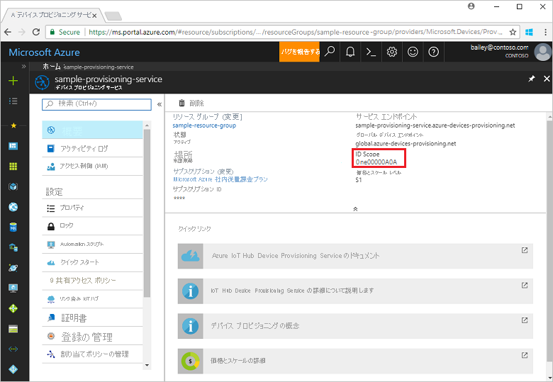
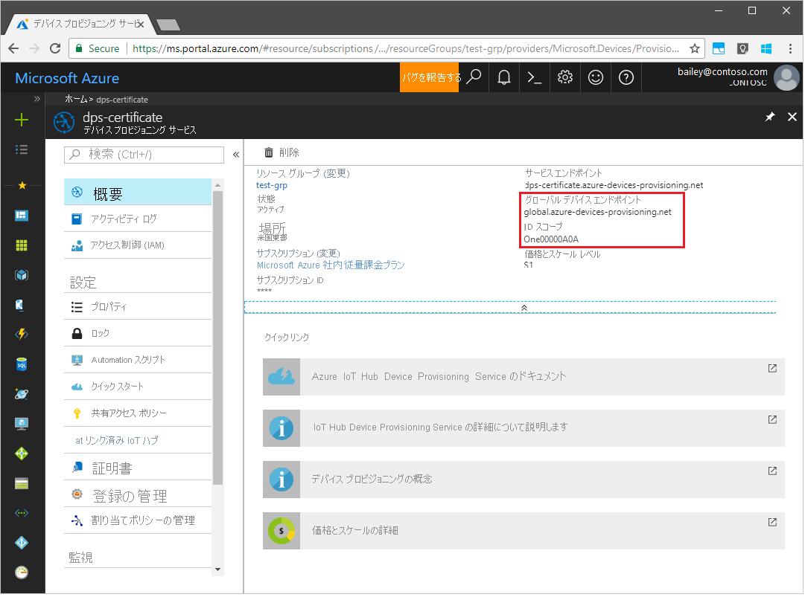
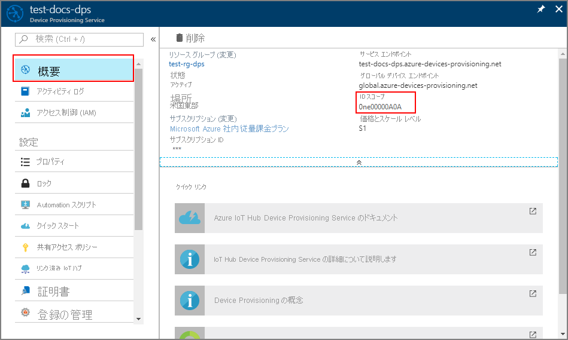
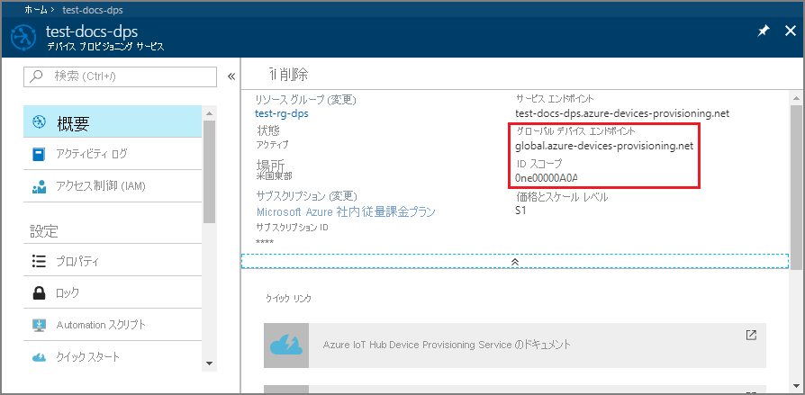
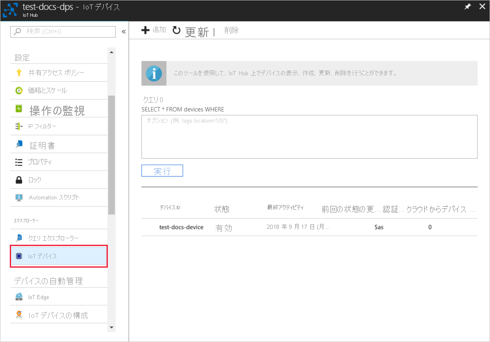
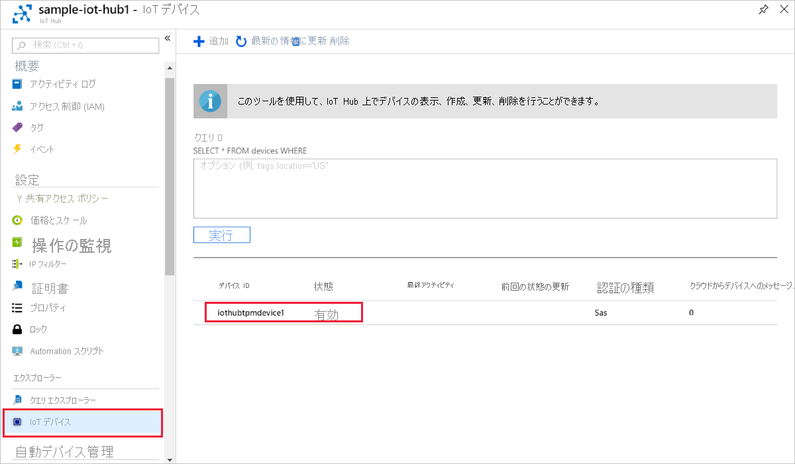
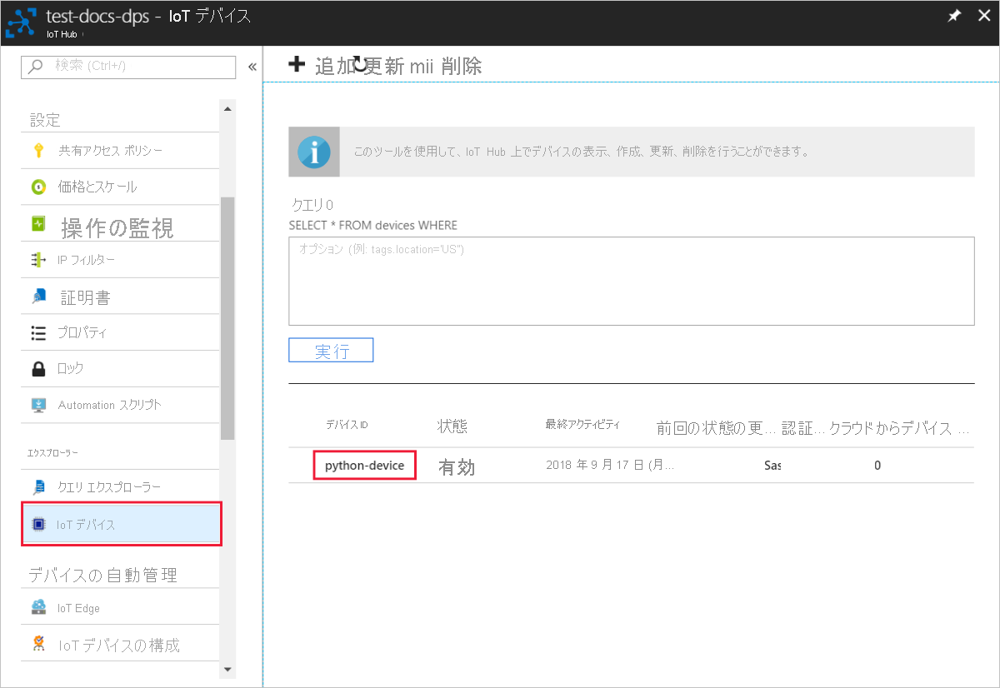
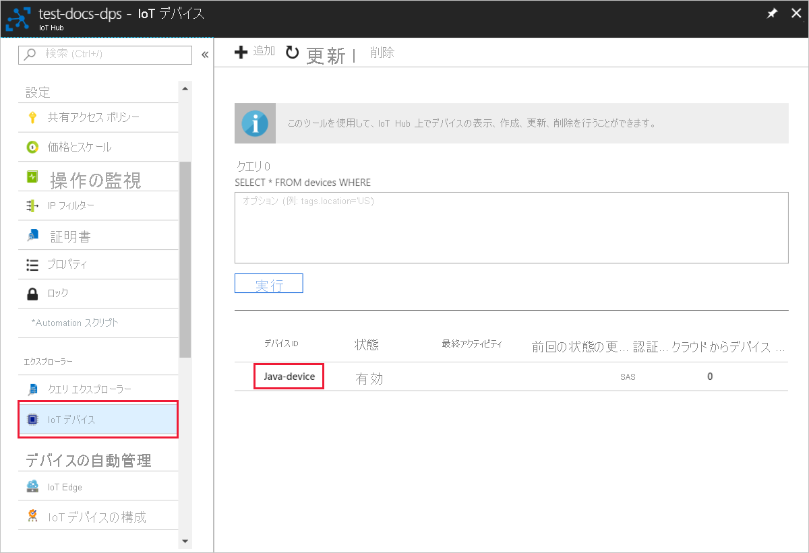

# <a name="quickstart-provision-a-simulated-tpm-device"></a>クイックスタート: シミュレートされた TPM デバイスをプロビジョニングする

このクイックスタートでは、シミュレートされた TPM デバイスを Windows コンピューターに作成します。 デバイスを構成した後、Azure IoT Hub Device Provisioning Service を使用して IoT ハブにプロビジョニングします。 その後、サンプル コードを使用します。これは、デバイスを Device Provisioning Service インスタンスに登録するのに役立ちます

プロビジョニングのプロセスに慣れていない場合は、[プロビジョニング](about-iot-dps.md#provisioning-process)の概要を確認してください。  また、先に進む前に、[Azure Portal での IoT Hub Device Provisioning Service の設定](./quick-setup-auto-provision.md)に関するページの手順も済ませておいてください。

Azure IoT Device Provisioning Service では、次の 2 種類の登録がサポートされています。

* [登録グループ](concepts-service.md#enrollment-group)。複数の関連するデバイスを登録するために使用されます。

* [個別登録](concepts-service.md#individual-enrollment)。1 台のデバイスを登録するために使用されます。

この記事では、個別登録の使用方法を示します。

## <a name="prerequisites"></a>前提条件

* Azure サブスクリプションをお持ちでない場合は、開始する前に [無料アカウント](https://azure.microsoft.com/free/?ref=microsoft.com&utm_source=microsoft.com&utm_medium=docs&utm_campaign=visualstudio) を作成してください。

* [Azure portal での IoT Hub Device Provisioning Service の設定](./quick-setup-auto-provision.md)に関するページの手順を完了します。

Windows 開発環境の前提条件は次のとおりです。 Linux または macOS については、SDK ドキュメントの「[開発環境を準備する](https://github.com/Azure/azure-iot-sdk-c/blob/master/doc/devbox_setup.md)」の該当するセクションを参照してください。

::: zone pivot="programming-language-ansi-c"

* [C++ によるデスクトップ開発](/cpp/ide/using-the-visual-studio-ide-for-cpp-desktop-development)ワークロードを有効にした [Visual Studio](https://visualstudio.microsoft.com/vs/) 2019。 Visual Studio 2015 と Visual Studio 2017 もサポートされています。

::: zone-end

::: zone pivot="programming-language-csharp"

* Windows ベースのコンピューターに [.NET Core 2.1 SDK](https://dotnet.microsoft.com/download) 以降をインストールします。 次のコマンドを使用してバージョンを確認してください。

    ```bash
    dotnet --info
    ```

::: zone-end

::: zone pivot="programming-language-nodejs"

* [Node.js v4.0 以降](https://nodejs.org)をインストールします。

::: zone-end

::: zone pivot="programming-language-python"

* [Python 2.x または 3.x](https://www.python.org/downloads/) のインストール 必ず、セットアップに必要な 32 ビットまたは 64 ビットのインストールを使用してください。 インストール中に求められた場合は、プラットフォーム固有の環境変数に Python を追加します。

* Windows OS を使用する場合は、[Visual C++ 再頒布可能パッケージ](https://support.microsoft.com/help/2977003/the-latest-supported-visual-c-downloads)をインストールして、Python からネイティブ DLL を使用できます。

* [C++ によるデスクトップ開発](/cpp/ide/using-the-visual-studio-ide-for-cpp-desktop-development)ワークロードを有効にした [Visual Studio](https://visualstudio.microsoft.com/vs/) 2019。 Visual Studio 2015 と Visual Studio 2017 もサポートされています。

* [CMake ビルド システム](https://cmake.org/download/)

::: zone-end

::: zone pivot="programming-language-java"

* コンピューターに [Java SE Development Kit 8](/azure/developer/java/fundamentals/java-support-on-azure) 以降をインストールします。

* [Maven](https://maven.apache.org/install.html) をダウンロードし、インストールします。

::: zone-end

* 最新バージョンの [Git](https://git-scm.com/download/) をインストールします。 コマンド ウィンドウからアクセスできる環境変数に Git が追加されていることを確認します。 *Git Bash* (ローカル Git リポジトリとやりとりする際に使用できるコマンドライン アプリ) を含む、インストールする `git` ツールの最新バージョンについては、[Software Freedom Conservancy の Git クライアント ツール](https://git-scm.com/download/)に関するページを参照してください。

<a id="setupdevbox"></a>

## <a name="prepare-your-development-environment"></a>開発環境を準備する

::: zone pivot="programming-language-ansi-c"

このセクションでは、[Azure IoT C SDK](https://github.com/Azure/azure-iot-sdk-c) と [TPM](/windows/device-security/tpm/trusted-platform-module-overview) デバイス シミュレーターのサンプルをビルドするために使用する開発環境を準備します。

1. 最新の [CMake ビルド システム](https://cmake.org/download/)をダウンロードします。

    >[!IMPORTANT]
    >`CMake` のインストールを開始する **前に**、Visual Studio の前提条件 (Visual Studio と "C++ によるデスクトップ開発" ワークロード) がコンピューターにインストールされていることを確認します。 前提条件を満たし、ダウンロードを検証したら、CMake ビルド システムをインストールします。 また、以前のバージョンの CMake ビルド システムでは、この記事で使用されているソリューション ファイルを生成できないことに注意してください。 必ず最新バージョンの CMake を使用してください。

2. Web ブラウザーを開き、[Azure IoT C SDK のリリース ページ](https://github.com/Azure/azure-iot-sdk-c/releases/latest)に移動します。

3. そのページの上部にある **[タグ]** タブを選択します。

4. 最新リリースの Azure IoT C SDK のタグ名をコピーします。

5. コマンド プロンプトまたは Git Bash シェルを開きます。 次のコマンドを実行して、最新リリースの [Azure IoT C SDK](https://github.com/Azure/azure-iot-sdk-c) GitHub リポジトリを複製します。 (`<release-tag>` は、前のステップでコピーしたタグで置き換えます)。

    ```cmd/sh
    git clone -b <release-tag> https://github.com/Azure/azure-iot-sdk-c.git
    cd azure-iot-sdk-c
    git submodule update --init
    ```

    この操作が完了するまで数分かかる場合があります。

6. 操作が完了したら、`azure-iot-sdk-c` ディレクトリから次のコマンドを実行します。

    ```cmd/sh
    mkdir cmake
    cd cmake
    ```

::: zone-end

::: zone pivot="programming-language-csharp"

1. Git CMD または Git Bash コマンド ライン環境を開きます。

2. 次のコマンドを使用して、[C# 用 Azure IoT サンプル](https://github.com/Azure-Samples/azure-iot-samples-csharp)の GitHub リポジトリをクローンします。

    ```cmd
    git clone https://github.com/Azure-Samples/azure-iot-samples-csharp.git
    ```

::: zone-end

::: zone pivot="programming-language-nodejs"

1. Git CMD または Git Bash コマンド ライン環境を開きます。

2. 次のコマンドを使用して、[azure-utpm-c](https://github.com/Azure-Samples/azure-iot-samples-csharp) の GitHub リポジトリをクローンします。

    ```cmd/sh
    git clone https://github.com/Azure/azure-utpm-c.git --recursive
    ```

::: zone-end

::: zone pivot="programming-language-python"

1. Git CMD または Git Bash コマンド ライン環境を開きます。
  
2. 次のコマンドを使用して、[Python](https://github.com/Azure/azure-iot-sdk-python) の GitHub リポジトリをクローンします。

    ```cmd/sh
    git clone --single-branch --branch v1-deprecated https://github.com/Azure/azure-iot-sdk-python.git --recursive
    ```

3. この GitHub リポジトリのローカル コピーに、CMake ビルド プロセス用のフォルダーを作成します。 

    ```cmd/sh
    cd azure-iot-sdk-python/c
    mkdir cmake
    cd cmake
    ```

4. [これらの手順](https://github.com/Azure/azure-iot-sdk-python/blob/v1-deprecated/doc/python-devbox-setup.md)に従って、Python パッケージをビルドします。

   > [!NOTE]
   > `build_client.cmd` を実行する場合は、必ず `--use-tpm-simulator` フラグを使用してください。
   > 
   > [!NOTE]
   > `pip` を使用する場合は、`azure-iot-provisioning-device-client` パッケージもインストールされていることを確認してください。 リリースされている PIP パッケージでは、シミュレーターではなく実際の TPM が使用されています。 シミュレーターを使用するには、`--use-tpm-simulator` フラグを使用してソースからコンパイルする必要があります。

::: zone-end

::: zone pivot="programming-language-java"

1. Git CMD または Git Bash コマンド ライン環境を開きます。
  
2. 次のコマンドを使用して、[Java](https://github.com/Azure/azure-iot-sdk-java.git) の GitHub リポジトリをクローンします。

    ```cmd/sh
    git clone https://github.com/Azure/azure-iot-sdk-java.git --recursive
    ```

::: zone-end

## <a name="build-and-run-the-tpm-device-simulator"></a>TPM デバイス シミュレーターをビルドして実行する

このセクションでは、TPM シミュレーターをビルドして実行します。 このシミュレーターは、ソケットでポート 2321 とポート 2322 をリッスンします。 コマンド ウィンドウは閉じないでください。 このクイックスタートを終了するまで、このシミュレーターを実行状態にしておく必要があります。

::: zone pivot="programming-language-ansi-c"

1. 次のコマンドを実行して、TPM デバイス シミュレーターのサンプル コードを含む Azure IoT C SDK をビルドします。 シミュレートされたデバイスの Visual Studio ソリューションが `cmake` ディレクトリに生成されます。 このサンプルは、Shared Access Signature (SAS) トークン認証を使用して、TPM [構成証明メカニズム](concepts-service.md#attestation-mechanism)を提供します。

    ```cmd
    cmake -Duse_prov_client:BOOL=ON ..
    ```

    >[!TIP]
    >`cmake` で C++ コンパイラが見つからない場合は、上記のコマンドの実行中にビルド エラーが発生する可能性があります。 これが発生した場合は、[Visual Studio コマンド プロンプト](/dotnet/framework/tools/developer-command-prompt-for-vs)でコマンドを実行してください。

2. ビルドが成功すると、最後のいくつかの出力行は次の出力のようになります。

    ```cmd/sh
    $ cmake -Duse_prov_client:BOOL=ON ..
    -- Building for: Visual Studio 16 2019
    -- The C compiler identification is MSVC 19.23.28107.0
    -- The CXX compiler identification is MSVC 19.23.28107.0

    ...

    -- Configuring done
    -- Generating done
    -- Build files have been written to: C:/code/azure-iot-sdk-c/cmake
    ```

3. クローンした git リポジトリのルート フォルダーに移動します。

4. 以下に示すパスを使用して、[TPM](/windows/device-security/tpm/trusted-platform-module-overview) シミュレーターを実行します。

    ```cmd/sh
    cd ..
    .\provisioning_client\deps\utpm\tools\tpm_simulator\Simulator.exe
    ```

    シミュレーターに出力は表示されません。 TPM デバイスがシミュレートされるので、実行したままにします。

::: zone-end

::: zone pivot="programming-language-csharp"

1. Device Provisioning Service のメイン メニューで、 **[概要]** を選択します。

2. **[ID スコープ]** の値をコピーします。

     

3. コマンド プロンプトで、ディレクトリを TPM デバイス プロビジョニング サンプルのプロジェクト ディレクトリに変更します。

    ```cmd
    cd .\azure-iot-samples-csharp\provisioning\Samples\device\TpmSample
    ```

4. 次のコマンドを入力し、TPM デバイス プロビジョニング サンプルをビルドして実行します (`<IDScope>` は、プロビジョニング サービスの ID スコープに置き換えます)。

    ```cmd
    dotnet run <IDScope>
    ```

    >[!NOTE]
    >このコマンドにより、別のコマンド プロンプトで TPM チップのシミュレーターが起動します。 Windows では、`Simulator.exe` がパブリック ネットワークで通信するのを許可するかどうかを確認する Windows セキュリティ アラートが表示される場合があります。 このサンプルでは、要求を取り消してもかまいません。

5. 元のコマンド ウィンドウには、デバイスの登録に必要な **_保証キー_**、**_登録 ID_**、提案される **_デバイス ID_** が表示されます。 これらの値を書き留めておきます。 これらの値を使用して、Device Provisioning Service インスタンスで個別登録を作成します。

   > [!NOTE]
   > コマンド出力が表示されるウィンドウと、TPM シミュレーターの出力が表示されるウィンドウを混同しないでください。 必要に応じて、元のコマンド ウィンドウを選択してウィンドウを前面に表示します。

::: zone-end

::: zone pivot="programming-language-nodejs"

1. GitHub ルート フォルダーに移動します。

2. シミュレートされたデバイスの [HSM](https://azure.microsoft.com/blog/azure-iot-supports-new-security-hardware-to-strengthen-iot-security/) として [TPM](/windows/device-security/tpm/trusted-platform-module-overview) シミュレーターを実行します。

    ```cmd/sh
    .\azure-utpm-c\tools\tpm_simulator\Simulator.exe
    ```

3. **registerdevice** という名前の新しい空のフォルダーを作成します。 コマンド プロンプトで次のコマンドを使用して、**registerdevice** フォルダーに _package.json_ ファイルを作成します (必ず、`npm` による質問に回答するか、既定値が適切であれば、それを受け入れてください)。

    ```cmd/sh
    npm init
    ```

4. 次の前段階パッケージをインストールします。

    ```cmd/sh
    npm install node-gyp -g
    npm install ffi -g
    ```

    > [!NOTE]
    > 上記のパッケージのインストールには、いくつかの既知の問題があります。 これらの問題を解決するには、 **[管理者として実行]** モードのコマンド プロンプトで `npm install --global --production windows-build-tools` を実行し、インストールしたバージョンにパスを置き換えて `SET VCTargetsPath=C:\Program Files (x86)\MSBuild\Microsoft.Cpp\v4.0\V140` を実行します。その後、上のインストール コマンドを再実行します。
    >

5. コマンド プロンプトで次のコマンドを実行し、**registerdevice** フォルダーに必要なすべてのパッケージをインストールします。

    ```cmd/sh
    npm install --save azure-iot-device azure-iot-device-mqtt azure-iot-security-tpm azure-iot-provisioning-device-http azure-iot-provisioning-device
    ```

    このコマンドでは次のパッケージがインストールされます。

   * TPM と連係するセキュリティ クライアント: `azure-iot-security-tpm`
   * デバイスが Device Provisioning Service に接続するためのトランスポート: `azure-iot-provisioning-device-http` または `azure-iot-provisioning-device-amqp`
   * トランスポートおよびセキュリティ クライアントを使用するクライアント: `azure-iot-provisioning-device`
   * デバイス クライアント: `azure-iot-device`
   * トランスポート: `azure-iot-device-amqp`、`azure-iot-device-mqtt`、`azure-iot-device-http` のいずれか
   * 既にインストール済みのセキュリティ クライアント: `azure-iot-security-tpm`

     > [!NOTE]
     > このクイックスタートのサンプルでは、`azure-iot-provisioning-device-http` および `azure-iot-device-mqtt` トランスポートを使用します。
     >

6. 任意のテキスト エディターを開きます。

7. **registerdevice** フォルダーに、新しい _ExtractDevice.js_ ファイルを作成します。

8. **ExtractDevice.js** ファイルの先頭に、次の `require` ステートメントを追加します。

    ```Javascript

    'use strict';
    
    var tpmSecurity = require('azure-iot-security-tpm');
    var tssJs = require("tss.js");
    
    var myTpm = new tpmSecurity.TpmSecurityClient(undefined, new tssJs.Tpm(true));
    ```

9. メソッドを実装するために、次の関数を追加します。

    ```Javascript

    myTpm.getEndorsementKey(function(err, endorsementKey) {
      if (err) {
        console.log('The error returned from get key is: ' + err);
      } else {
        console.log('the endorsement key is: ' + endorsementKey.toString('base64'));
        myTpm.getRegistrationId((getRegistrationIdError, registrationId) => {
          if (getRegistrationIdError) {
            console.log('The error returned from get registration id is: ' + getRegistrationIdError);
          } else {
            console.log('The Registration Id is: ' + registrationId);
            process.exit();
          }
        });
      }
    });
    ```

10. _ExtractDevice.js_ ファイルを保存して閉じます。

    ```cmd/sh
    node ExtractDevice.js
    ```

11. サンプルを実行します。

12. デバイス登録に必要な **_保証キー_** と **_登録 ID_** が出力ウィンドウに表示されます。 これらの値をコピーします。

::: zone-end

::: zone pivot="programming-language-python"

1. 次のコマンドを実行して SAS トークン認証を有効にします (このコマンドでは、シミュレートされたデバイスの Visual Studio ソリューションも生成されます)。

    ```cmd/sh
    cmake -Duse_prov_client:BOOL=ON -Duse_tpm_simulator:BOOL=ON ..
    ```

2. 2 つ目のコマンド プロンプトを開きます。

3. 2 つ目のコマンド プロンプトで、TPM シミュレーター フォルダーに移動します。

4. シミュレートされたデバイスの [HSM](https://azure.microsoft.com/blog/azure-iot-supports-new-security-hardware-to-strengthen-iot-security/) として [TPM](/windows/device-security/tpm/trusted-platform-module-overview) シミュレーターを実行します。

5. **[アクセスを許可]** を選択します。 シミュレーターでは、ソケットでポート 2321 および 2322 をリッスンします。 このコマンド ウィンドウを閉じないでください。このクイックスタート ガイドの終了まで、このシミュレーターを実行状態にしておく必要があります。

  ```cmd/sh
  .\azure-iot-sdk-python\c\provisioning_client\deps\utpm\tools\tpm_simulator\Simulator.exe
  ```

  

::: zone-end

::: zone pivot="programming-language-java"

1. シミュレートされたデバイスの [HSM](https://azure.microsoft.com/blog/azure-iot-supports-new-security-hardware-to-strengthen-iot-security/) として [TPM](/windows/device-security/tpm/trusted-platform-module-overview) シミュレーターを実行します。

2. **[アクセスを許可]** を選択します。 シミュレーターでは、ソケットでポート 2321 および 2322 をリッスンします。 このコマンド ウィンドウを閉じないでください。このクイックスタート ガイドの終了まで、このシミュレーターを実行状態にしておく必要があります。

    ```cmd/sh
    .\azure-iot-sdk-java\provisioning\provisioning-tools\tpm-simulator\Simulator.exe
    ```

    

3. 2 つ目のコマンド プロンプトを開きます。

4. 2 つ目のコマンド プロンプトで、ルート フォルダーに移動し、サンプルの依存関係をビルドします。

    ```cmd/sh
    cd azure-iot-sdk-java
    mvn install -DskipTests=true
    ```

5. サンプル フォルダーに移動します。

    ```cmd/sh
    cd provisioning/provisioning-samples/provisioning-tpm-sample
    ```

::: zone-end

::: zone pivot="programming-language-ansi-c, programming-language-python,programming-language-java"

<a id="simulatetpm"></a>

## <a name="read-cryptographic-keys-from-the-tpm-device"></a>TPM デバイスから暗号化キーを読み取る

このセクションでは、実行したままにし、引き続きポート 2321 と 2322 でリッスンしている TPM シミュレーターから保証キーと登録 ID を読み取るサンプルをビルドして実行します。 これらの値は、Device Provisioning Service インスタンスにデバイスを登録する際に使用します。

::: zone-end

::: zone pivot="programming-language-ansi-c"

1. Visual Studio を起動します。

2. *cmake* フォルダーに生成されたソリューション (`azure_iot_sdks.sln` という名前) を開きます。

3. Visual Studio のメニューで **[ビルド]**  >  **[ソリューションのビルド]** の順に選択して、ソリューション内のすべてのプロジェクトをビルドします。

4. Visual Studio の "*ソリューション エクスプローラー*" ウィンドウで、**Provision\_Tools** フォルダーに移動します。 **tpm_device_provision** プロジェクトを右クリックし、**[スタートアップ プロジェクトに設定]** を選択します。 

5. Visual Studio のメニューで **[デバッグ]**  >  **[デバッグなしで開始]** の順に選択して、ソリューションを実行します。 アプリが **_登録 ID_** と **_保証キー_** を読み取って表示します。 この値をメモに書くかコピーします。 これらは次のセクションでデバイスを登録する際に使用します。

::: zone-end

::: zone pivot="programming-language-python"

1. Visual Studio を起動します。

2. *cmake* フォルダーに生成されたソリューション (`azure_iot_sdks.sln` という名前) を開きます。

3. Visual Studio のメニューで **[ビルド]**  >  **[ソリューションのビルド]** の順に選択して、ソリューション内のすべてのプロジェクトをビルドします。

4. **tpm_device_provision** プロジェクトを右クリックし、**[スタートアップ プロジェクトに設定]** を選択します。

5. ソリューションを実行する デバイス登録に必要な **_保証キー_** と **_登録 ID_** が出力ウィンドウに表示されます。 これらの値をコピーします。

::: zone-end

::: zone pivot="programming-language-java"

1. Azure portal にサインインし、左側のメニューの **[すべてのリソース]** ボタンを選択して、Device Provisioning Service を開きます。 "_ID スコープ_" と "_プロビジョニング サービス グローバル エンドポイント_" をメモします。

    

2. `src/main/java/samples/com/microsoft/azure/sdk/iot/ProvisioningTpmSample.java` を編集して、メモした "_ID スコープ_" と "_プロビジョニング サービス グローバル エンドポイント_" を含めます。  

    ```java
    private static final String idScope = "[Your ID scope here]";
    private static final String globalEndpoint = "[Your Provisioning Service Global Endpoint here]";
    private static final ProvisioningDeviceClientTransportProtocol PROVISIONING_DEVICE_CLIENT_TRANSPORT_PROTOCOL = ProvisioningDeviceClientTransportProtocol.HTTPS;
    ```

3. ファイルを保存します。

4. 次のコマンドを使用してプロジェクトをビルドし、ターゲット フォルダーに移動して、作成した jar ファイルを実行します (`{version}` は、ご利用の Java のバージョンに置き換えてください)。

    ```cmd/sh
    mvn clean install
    cd target
    java -jar ./provisioning-tpm-sample-{version}-with-deps.jar
    ```

5. プログラムの実行が開始されると、*_[保証キー]_* と *_[登録キー]_* が表示されます。  次のセクションのためにこれらの値をコピーします。 プログラムは必ず実行したままにしておいてください。
  
::: zone-end


<a id="portalenrollment"></a>

## <a name="create-a-device-enrollment-entry"></a>デバイス登録エントリを作成する

1. [Azure portal](https://portal.azure.com) にサインインします。

2. 左側のメニューまたはポータル ページで、 **[すべてのリソース]** を選択します。

3. ご利用の Device Provisioning Service を選択します。

4. **[設定]** メニューで、 **[登録の管理]** を選択します。

5. ページの上部にある **[+ 個別登録の追加]** を選択します。

6. **[登録の追加]** パネルで、次の情報を入力します。

   * ID 構成証明の "*メカニズム*" として **[TPM]** を選択します。
   * 前にメモしておいた値を基に、TPM デバイスの "*登録 ID*" と "*保証キー*" を入力します。
   * プロビジョニング サービスにリンクされた IoT ハブを選択します。
   * 必要に応じて、次の情報を入力することができます。
       * 一意の *デバイス ID* を入力します (推奨される **test-docs-device** を使用するか、独自のものを指定できます)。 デバイスに名前を付ける際に機密データを含めないようにしてください。 指定しない場合には、デバイスを識別するために登録 ID が代わりに使用されます。
       * **[Initial device twin state]\(初期のデバイス ツインの状態\)** をデバイスの目的の初期構成で更新します。
   * 作業が完了したら、 **[保存]** を押します。

        

7. **[保存]** を選択します。

## <a name="register-the-device"></a>デバイスの登録

このセクションでは、[Advanced Message Queuing Protocol (AMQP)](https://wikipedia.org/wiki/Advanced_Message_Queuing_Protocol) を使用して、デバイスのブート シーケンスを Device Provisioning Service インスタンスに送信するようにサンプル コードを構成します。 このブート シーケンスにより、Device Provisioning Service インスタンスにリンクされた IoT ハブにデバイスが登録されます。

::: zone pivot="programming-language-ansi-c"

<a id="firstbootsequence"></a>

1. Azure portal で、Device Provisioning Service の **[概要]** タブを選択します。

2. **_[ID スコープ]_** の値をコピーします。

    
3. Visual Studio の "*ソリューション エクスプローラー*" ウィンドウで、**Provision\_Samples** フォルダーに移動します。 **prov\_dev\_client\_sample** という名前のサンプル プロジェクトを展開します。 **Source Files** を展開し、**prov\_dev\_client\_sample.c** を開きます。

4. ファイルの先頭近くで、以下のような各デバイス プロトコルの `#define` ステートメントを探します。 `SAMPLE_AMQP` のみがコメント解除されていることを確認します。

    現在、[TPM の個別登録で MQTT プロトコルはサポートされていません](https://github.com/Azure/azure-iot-sdk-c#provisioning-client-sdk)。

    ```c
    //
    // The protocol you wish to use should be uncommented
    //
    //#define SAMPLE_MQTT
    //#define SAMPLE_MQTT_OVER_WEBSOCKETS
    #define SAMPLE_AMQP
    //#define SAMPLE_AMQP_OVER_WEBSOCKETS
    //#define SAMPLE_HTTP
    ```

5. 定数 `id_scope` を探し、以前にコピーした **ID スコープ** の値で置き換えます。 

    ```c
    static const char* id_scope = "0ne00002193";
    ```

6. 同じファイル内で `main()` 関数の定義を探します。 以下に示すように `hsm_type` 変数が `SECURE_DEVICE_TYPE_TPM` ではなく `SECURE_DEVICE_TYPE_X509` に設定されていることを確認します。

    ```c
    SECURE_DEVICE_TYPE hsm_type;
    //hsm_type = SECURE_DEVICE_TYPE_TPM;
    hsm_type = SECURE_DEVICE_TYPE_X509;
    ```

7. **prov\_dev\_client\_sample** プロジェクトを右クリックし、 **[スタートアップ プロジェクトに設定]** を選択します。

8. Visual Studio のメニューで **[デバッグ]**  >  **[デバッグなしで開始]** の順に選択して、ソリューションを実行します。 プロジェクトをリビルドするよう求められたら、 **[はい]** を選択して、プロジェクトをリビルドしてから実行します。

    次の出力は、プロビジョニング デバイス クライアントのサンプルが正常に起動し、Device Provisioning Service インスタンスに接続して、IoT ハブの情報を取得し、登録した場合の例です。

     ```cmd
    Provisioning API Version: 1.2.7

    Registering... Press enter key to interrupt.

    Provisioning Status: PROV_DEVICE_REG_STATUS_CONNECTED
    Provisioning Status: PROV_DEVICE_REG_STATUS_ASSIGNING
    Provisioning Status: PROV_DEVICE_REG_STATUS_ASSIGNING

    Registration Information received from service:
    test-docs-hub.azure-devices.net, deviceId: test-docs-cert-device
    ```

::: zone-end

::: zone pivot="programming-language-nodejs"

1. Azure portal で、Device Provisioning Service の **[概要]** タブを選択します。

2. **_[ID スコープ]_** の値をコピーします。

      

3. 任意のテキスト エディターを開きます。

4. **registerdevice** フォルダーに、新しい _RegisterDevice.js_ ファイルを作成します。

5. _RegisterDevice.js_ ファイルの先頭に、次の `require` ステートメントを追加します。

    ```Javascript

    'use strict';

    var ProvisioningTransport = require('azure-iot-provisioning-device-http').Http;
    var iotHubTransport = require('azure-iot-device-mqtt').Mqtt;
    var Client = require('azure-iot-device').Client;
    var Message = require('azure-iot-device').Message;
    var tpmSecurity = require('azure-iot-security-tpm');
    var ProvisioningDeviceClient = require('azure-iot-provisioning-device').ProvisioningDeviceClient;
    ```

    > [!NOTE]
    > **Node.js 用 Azure IoT SDK** では、_AMQP_、_AMQP WS_、_MQTT WS_ などの追加プロトコルがサポートされています。  詳細については、「[Device Provisioning Service SDK for Node.js samples (Node.js 用 Device Provisioning Service SDK のサンプル)](https://github.com/Azure/azure-iot-sdk-node/tree/master/provisioning/device/samples)」を参照してください。
    > 

6. **globalDeviceEndpoint** と **idScope** 変数を追加し、それらを使用して **ProvisioningDeviceClient** インスタンスを作成します。 **{globalDeviceEndpoint}** と **{idScope}** を、**手順 1.** の " **_グローバル デバイス エンドポイント_** " と " **_ID スコープ_** " の値に置き換えます。

    ```Javascript

    var provisioningHost = '{globalDeviceEndpoint}';
    var idScope = '{idScope}';

    var tssJs = require("tss.js");
    var securityClient = new tpmSecurity.TpmSecurityClient('', new tssJs.Tpm(true));
    // if using non-simulated device, replace the above line with following:
    //var securityClient = new tpmSecurity.TpmSecurityClient();

    var provisioningClient = ProvisioningDeviceClient.create(provisioningHost, idScope, new ProvisioningTransport(), securityClient);
    ```

7. デバイスにメソッドを実装する次の関数を追加します。

    ```JavaScript

    provisioningClient.register(function(err, result) {
      if (err) {
        console.log("error registering device: " + err);
      } else {
        console.log('registration succeeded');
        console.log('assigned hub=' + result.registrationState.assignedHub);
        console.log('deviceId=' + result.registrationState.deviceId);
        var tpmAuthenticationProvider = tpmSecurity.TpmAuthenticationProvider.fromTpmSecurityClient(result.registrationState.deviceId, result.registrationState.assignedHub, securityClient);
        var hubClient = Client.fromAuthenticationProvider(tpmAuthenticationProvider, iotHubTransport);

        var connectCallback = function (err) {
          if (err) {
            console.error('Could not connect: ' + err.message);
          } else {
            console.log('Client connected');
            var message = new Message('Hello world');
            hubClient.sendEvent(message, printResultFor('send'));
          }
        };

        hubClient.open(connectCallback);

        function printResultFor(op) {
          return function printResult(err, res) {
            if (err) console.log(op + ' error: ' + err.toString());
            if (res) console.log(op + ' status: ' + res.constructor.name);
            process.exit(1);
          };
        }
      }
    });
    ```

8. _RegisterDevice.js_ ファイルを保存して閉じます。 

9. 次のコマンドを実行します。

    ```cmd/sh
    node RegisterDevice.js
    ```

10. デバイスが起動して Device Provisioning Service に接続し、IoT ハブの情報を取得する動作がシミュレートされるので、そのメッセージに注目してください。

::: zone-end

::: zone pivot="programming-language-python"

1. Git リポジトリの samples フォルダーに移動します。

    ```cmd/sh
    cd azure-iot-sdk-python/provisioning_device_client/samples
    ```

2. Python IDE を使用して、**provisioning\_device\_client\_sample.py** という名前の Python スクリプトを編集します (`{globalServiceEndpoint}` と `{idScope}` は、先ほどコピーした値に置き換えます)。 また、*SECURITY\_DEVICE\_TYPE* が `ProvisioningSecurityDeviceType.TPM` に設定されていることを確認します。

    ```python
    GLOBAL_PROV_URI = "{globalServiceEndpoint}"
    ID_SCOPE = "{idScope}"
    SECURITY_DEVICE_TYPE = ProvisioningSecurityDeviceType.TPM
    PROTOCOL = ProvisioningTransportProvider.HTTP
    ```

    

3. サンプルを実行します。

    ```cmd/sh
    python provisioning_device_client_sample.py
    ```

4. デバイスが起動して Device Provisioning Service に接続し、IoT ハブの情報を取得する動作がシミュレートされるので、そのメッセージに注目してください。

::: zone-end

::: zone pivot="programming-language-java"

1. コンピューター上で Java サンプル コードを実行しているコマンド ウィンドウで、*Enter* キーを押してアプリケーションの実行を続けます。 デバイスが起動して Device Provisioning Service に接続し、IoT ハブの情報を取得する動作がシミュレートされるので、そのメッセージに注目してください。  

    

::: zone-end

## <a name="confirm-your-device-provisioning-registration"></a>デバイス プロビジョニングの登録を確認する

1. [Azure ポータル](https://portal.azure.com)にアクセスします。

2. 左側のメニューまたはポータル ページで、 **[すべてのリソース]** を選択します。

3. デバイスが割り当てられた IoT ハブを選択します。

4. **[エクスプローラー]** メニューで、 **[IoT デバイス]** を選択します。

5. デバイスが正常にプロビジョニングされた場合は、デバイス ID が一覧に表示され、 **[状態]** が *[有効]* として設定されているはずです。 デバイスが表示されていない場合は、ページの上部にある **[最新の情報に更新]** を選択します。

    :::zone pivot="programming-language-ansi-c"

     

    :::zone-end

    :::zone pivot="programming-language-csharp"

      

    ::: zone-end

    ::: zone pivot="programming-language-nodejs"

    

    ::: zone-end

    ::: zone pivot="programming-language-python"

     

    ::: zone-end

    ::: zone pivot="programming-language-java"

     

    ::: zone-end


> [!NOTE]
> *[Initial device twin state]\(初期のデバイス ツインの状態\)* をデバイスの登録エントリの既定値から変更した場合、デバイスはハブから目的のツインの状態をプルし、それに従って動作することができます。 詳細については、「[IoT Hub のデバイス ツインの理解と使用](../iot-hub/iot-hub-devguide-device-twins.md)」を参照してください。
>

## <a name="clean-up-resources"></a>リソースをクリーンアップする

デバイス クライアント サンプルでの作業と確認を続行する予定の場合は、このクイックスタートで作成したリソースをクリーンアップしないでください。 続行する予定がない場合は、次の手順を使用して、このクイックスタートで作成したすべてのリソースを削除してください。

### <a name="delete-your-device-enrollment"></a>デバイスの登録を削除する

1. マシンに表示されているデバイス クライアント サンプルの出力ウィンドウを閉じます。

2. Azure portal の左側のメニューから、 **[すべてのリソース]** を選択します。

3. ご利用の Device Provisioning Service を選択します。

4. **[設定]** メニューで、 **[登録の管理]** を選択します。

5. **[個別登録]** タブを選択します。

6. このクイックスタートで登録したデバイスの ''*登録 ID*'' の横にあるチェック ボックスをオンにします。

7. ページの上部にある **[削除]** を選択します。

### <a name="delete-your-device-registration-from-iot-hub"></a>IoT Hub からデバイスの登録を削除する

1. Azure portal の左側のメニューから、 **[すべてのリソース]** を選択します。

2. IoT ハブを選択します。

3. **[エクスプローラー]** メニューで、 **[IoT デバイス]** を選択します。

4. このクイックスタートで登録したデバイスの "*デバイス ID*" の横にあるチェック ボックスをオンにします。

5. ページの上部にある **[削除]** を選択します。

## <a name="next-steps"></a>次のステップ

このクイックスタートでは、TPM のシミュレートされたデバイスをマシン上に作成し、IoT Hub Device Provisioning Service を使用して IoT ハブにプロビジョニングしました。 TPM デバイスをプログラムで登録する方法については、プログラムによる TPM デバイスの登録のクイックスタートに進みます。

> [!div class="nextstepaction"]
> [クイック スタート - TPM デバイスを Azure IoT Hub Device Provisioning Service に登録する](quick-enroll-device-tpm.md)