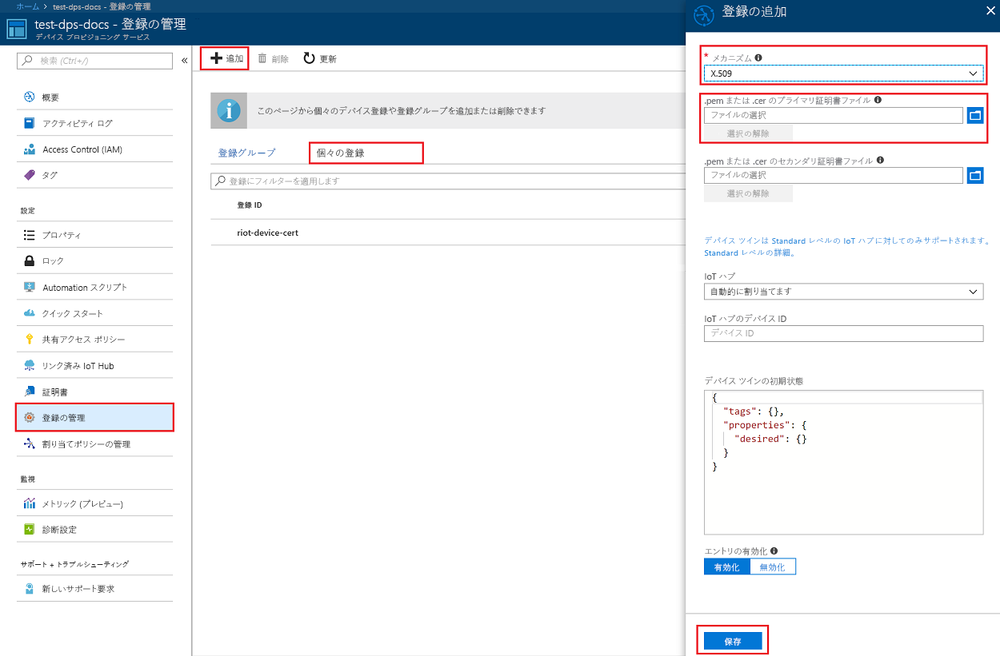
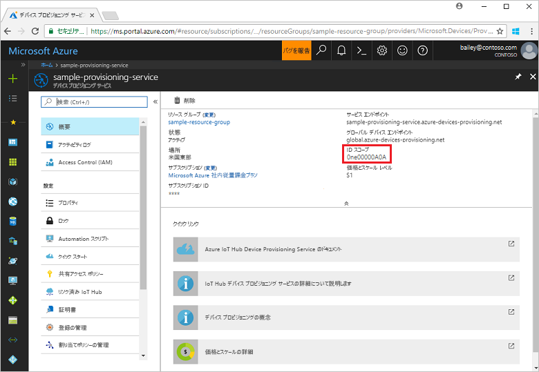

# <a name="create-and-provision-a-simulated-x509-device-using-c-device-sdk-for-iot-hub-device-provisioning-service"></a>IoT Hub Device Provisioning Service 対応の C# デバイス SDK を使用して、シミュレートされた X.509 デバイスを作成してプロビジョニングする
[!INCLUDE [iot-dps-selector-quick-create-simulated-device-x509](../../includes/iot-dps-selector-quick-create-simulated-device-x509.md)]

以下の手順では、Windows OS を実行する開発マシンで [Azure IoT Hub C# SDK](https://github.com/Azure/azure-iot-sdk-csharp) でシミュレートされた X.509 デバイス サンプルをビルドし、シミュレートされたデバイスを Device Provisioning Service と IoT ハブに接続する方法について説明します。

自動プロビジョニングの処理に慣れていない場合は、「[自動プロビジョニングの概念](concepts-auto-provisioning.md)」も確認してください。 また、先に進む前に、[Azure Portal での IoT Hub Device Provisioning Service の設定](./quick-setup-auto-provision.md)に関するページの手順も済ませておいてください。 

[!INCLUDE [IoT DPS basic](../../includes/iot-dps-basic.md)]

<a id="setupdevbox"></a>
## <a name="prepare-the-development-environment"></a>開発環境の準備 

1. マシンに [.NET Core SDK](https://www.microsoft.com/net/download/windows) がインストールされていることを確認します。 

1. マシンに `git` がインストールされ、コマンド ウィンドウからアクセスできる環境変数に追加されていることを確認します。 **Git Bash** (ローカル Git リポジトリと対話する際に使用するコマンドライン アプリ) など、インストールする各種 `git` ツールの最新バージョンについては、[Software Freedom Conservancy の Git クライアント ツール](https://git-scm.com/download/)に関するページを参照してください。 

4. コマンド プロンプトまたは Git Bash を開きます。 [Azure IoT SDK for C#](https://github.com/Azure/azure-iot-sdk-csharp) GitHub リポジトリを複製します。
    
    ```cmd
    git clone --recursive https://github.com/Azure/azure-iot-sdk-csharp.git
    ```

## <a name="create-a-self-signed-x509-device-certificate-and-individual-enrollment-entry"></a>自己署名 X.509 デバイス証明書と個々の登録エントリを作成する

このセクションでは、自己署名 X.509 証明書を使用します。次の点に留意することが重要です。

* 自己署名証明書はテスト目的専用であるため、運用環境では使用しないでください。
* 自己署名証明書の既定の有効期限は 1 年間です。

[Azure IoT SDK for .NET](https://github.com/Azure/azure-iot-sdk-csharp.git) のサンプル コードを使用して、シミュレートされたデバイスの個々の登録エントリで使用する証明書を作成します。


1. コマンド プロンプトで、ディレクトリを X.509 デバイス プロビジョニング サンプルのプロジェクト ディレクトリに変更します。

    ```cmd
    cd .\azure-iot-sdk-csharp\provisioning\device\samples\ProvisioningDeviceClientX509
    ```

2. このサンプル コードは、パスワードで保護された PKCS12 形式のファイル (certificate.pfx) 内に格納された X.509 証明書を使用するように設定されています。 また、このクイックスタートの後半で個々の登録を作成するために、公開キーの証明書ファイル (certificate.cer) が必要です。 自己署名証明書とそれに関連する .cer ファイルと .pfx ファイルを生成するには、次のコマンドを実行します。

    ```cmd
    powershell .\GenerateTestCertificate.ps1
    ```

3. PFX パスワードの入力を求められます。 このパスワードを覚えておいてください。サンプルの実行時に使用する必要があります。

      


4. Azure Portal にログインし、左側のメニューの **[すべてのリソース]** をクリックして、Provisioning Service を開きます。

5. Device Provisioning Service の概要ブレードで、**[Manage enrollments]\(登録の管理\)** を選択します。 **[Individual Enrollments]\(個々の登録\)** タブの上部にある **[追加]** ボタンをクリックします。 

6. **[Add enrollment]\(登録の追加\)** で、次の情報を入力します。
    - ID 構成証明の "*メカニズム*" として **[X.509]** を選択します。
    - *[Primary certificate .pem or .cer file]\(プライマリ証明書 .pem または .cer ファイル\)* の *[ファイルの選択]* をクリックし、前の手順で作成した証明書ファイル **certificate.cer** を選択します。
    - **[デバイス ID]** は空白のままにします。 デバイス ID が X.509 証明書の共通名 (CN) **iothubx509device1** に設定されたデバイスがプロビジョニングされます。 これは、個々の登録エントリの登録 ID に使用される名前にもなります。 
    - 必要に応じて、次の情報を入力することができます。
        - プロビジョニング サービスにリンクされた IoT ハブを選択します。
        - **[Initial device twin state]\(初期のデバイス ツインの状態\)** をデバイスの目的の初期構成で更新します。
    - 作業が完了したら、**[保存]** をクリックします。 

    [](./media/quick-create-simulated-device-x509-csharp/individual-enrollment.png#lightbox)
    
   登録に成功すると、*[個々の登録]* タブの *[登録 ID]* 列に X.509 登録エントリが **iothubx509device1** として表示されます。 

## <a name="provision-the-simulated-device"></a>シミュレーションされたデバイスをプロビジョニングする

1. プロビジョニング サービスの **[概要]** ブレードから、**_[ID スコープ]_** の値をメモします。

     


2. 次のコマンドを入力して、X.509 デバイス プロビジョニング サンプルをビルドして実行します。 `<IDScope>` 値をプロビジョニング サービスの ID スコープに置き換えます。 

    ```cmd
    dotnet run <IDScope>
    ```

3. メッセージに従って、以前に作成した PFX ファイルのパスワードを入力します。 デバイスが起動して Device Provisioning Service に接続し、IoT ハブの情報を取得する動作がシミュレートされるので、そのメッセージに注目してください。 

     

4. デバイスがプロビジョニングされたことを確認します。 プロビジョニング サービスにリンクされた IoT ハブに対してシミュレートされたデバイスが正常にプロビジョニングされると、ハブの **[IoT デバイス]** ブレードにデバイス ID が表示されます。 

     

    *[Initial device twin state]\(初期のデバイス ツインの状態\)* をデバイスの登録エントリの既定値から変更した場合、デバイスはハブから目的のツインの状態をプルし、それに従って動作することができます。 詳細については、「[IoT Hub のデバイス ツインの理解と使用](../iot-hub/iot-hub-devguide-device-twins.md)」を参照してください。


## <a name="clean-up-resources"></a>リソースのクリーンアップ

引き続きデバイス クライアント サンプルを使用する場合は、このクイックスタートで作成したリソースをクリーンアップしないでください。 使用する予定がない場合は、次の手順を使用して、このクイックスタートで作成したすべてのリソースを削除してください。

1. マシンに表示されているデバイス クライアント サンプルの出力ウィンドウを閉じます。
1. マシンに表示されている TPM シミュレーター ウィンドウを閉じます。
1. Azure Portal の左側のメニューにある **[すべてのリソース]** をクリックし、Device Provisioning サービスを選択します。 **[すべてのリソース]** ブレードの上部にある **[削除]** をクリックします。  
1. Azure Portal の左側のメニューにある **[すべてのリソース]** をクリックし、IoT ハブを選択します。 **[すべてのリソース]** ブレードの上部にある **[削除]** をクリックします。  

## <a name="next-steps"></a>次の手順

このクイックスタートでは、ポータルでシミュレートされた X.509 デバイスを Windows コンピューター上に作成し、Azure IoT Hub Device Provisioning Service を使用して IoT ハブにプロビジョニングしました。 プログラミングによって X.509 デバイスを登録する方法については、X.509 デバイスのプログラミングによる登録のクイックスタートに進みます。 

> [!div class="nextstepaction"]
> [Azure クイックスタート - Azure IoT Hub Device Provisioning Service への X.509 デバイスの登録](quick-enroll-device-x509-csharp.md)
