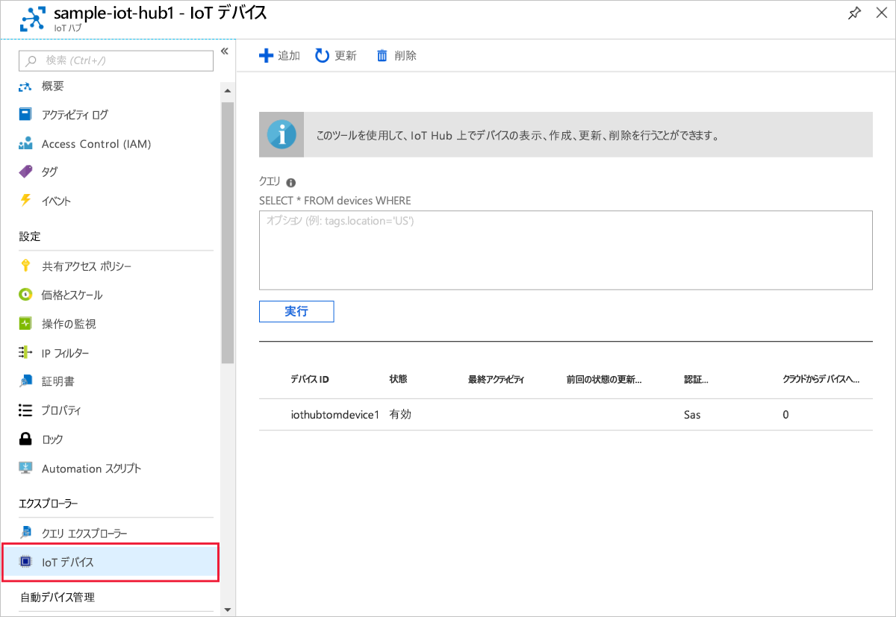

# <a name="quickstart-create-and-provision-an-x509-device-using-c-device-sdk-for-iot-hub-device-provisioning-service"></a>クイックスタート: IoT Hub Device Provisioning Service 対応の C# デバイス SDK を使用して、X.509 のデバイスを作成してプロビジョニングする

[!INCLUDE [iot-dps-selector-quick-create-simulated-device-x509](../../includes/iot-dps-selector-quick-create-simulated-device-x509.md)]

これらの手順では、[C# 用の Azure IoT サンプル](https://github.com/Azure-Samples/azure-iot-samples-csharp)のデバイス コードを使用して X.509 デバイスをプロビジョニングします。 この記事では、お使いの開発マシン上でデバイスのサンプル コードを実行し、Device Provisioning Service を使用して IoT ハブに接続します。

## <a name="prerequisites"></a>前提条件

自動プロビジョニングの処理に慣れていない場合は、[プロビジョニング](about-iot-dps.md#provisioning-process)の概要を確認してください。 また、先に進む前に、[Azure Portal での IoT Hub Device Provisioning Service の設定](./quick-setup-auto-provision.md)に関するページの手順も済ませておいてください。

Azure IoT Device Provisioning Service では、次の 2 種類の登録がサポートされています。
- [登録グループ](concepts-service.md#enrollment-group)：複数の関連するデバイスを登録するために使用します。
- [個々の登録](concepts-service.md#individual-enrollment):単一デバイスを登録するために使用します。

この記事では、個別登録の使用方法を示します。

[!INCLUDE [IoT Device Provisioning Service basic](../../includes/iot-dps-basic.md)]

<a id="setupdevbox"></a>
## <a name="prepare-the-development-environment"></a>開発環境の準備 

1. マシンに `git` がインストールされ、コマンド ウィンドウからアクセスできる環境変数に追加されていることを確認します。 **Git Bash** (ローカル Git リポジトリと対話する際に使用するコマンドライン アプリ) など、インストールする各種 `git` ツールの最新バージョンについては、[Software Freedom Conservancy の Git クライアント ツール](https://git-scm.com/download/)に関するページを参照してください。 

1. コマンド プロンプトまたは Git Bash を開きます。 C# の GitHub リポジトリ用の Azure IoT サンプルを複製します。
    
    ```bash
    git clone https://github.com/Azure-Samples/azure-iot-samples-csharp.git
    ```

1. お使いのマシンに [.NET Core 3.0.0 SDK 以降](https://www.microsoft.com/net/download/windows)がインストールされていることを確認します。 次のコマンドを使用してバージョンを確認してください。

    ```bash
    dotnet --info
    ```

## <a name="create-a-self-signed-x509-device-certificate"></a>自己署名 X.509 デバイス証明書を作成する

このセクションでは、サブジェクトの共通名として `iothubx509device1` を使用して自己署名 X.509 テスト証明書を作成します。 次の点に注意することが重要です。

* 自己署名証明書はテスト目的専用であるため、運用環境では使用しないでください。
* 自己署名証明書の既定の有効期限は 1 年間です。
* IoT デバイスのデバイス ID が、証明書におけるサブジェクトの共通名になります。 必ず、[デバイス ID の文字列要件](../iot-hub/iot-hub-devguide-identity-registry.md#device-identity-properties)に準拠したサブジェクト名を使用してください。

[X509Sample](https://github.com/Azure-Samples/azure-iot-samples-csharp/tree/master/provisioning/Samples/device/X509Sample) のサンプル コードを使用して、デバイスの個別登録エントリで使用する証明書を作成します。


1. PowerShell プロンプトで、ディレクトリを X.509 デバイス プロビジョニング サンプルのプロジェクト ディレクトリに変更します。

    ```powershell
    cd .\azure-iot-samples-csharp\provisioning\Samples\device\X509Sample
    ```

2. このサンプル コードは、パスワードで保護された PKCS12 形式のファイル (certificate.pfx) 内に格納された X.509 証明書を使用するように設定されています。 また、このクイックスタートの後半で個々の登録を作成するために、公開キーの証明書ファイル (certificate.cer) が必要です。 自己署名証明書とそれに関連する .cer ファイルと .pfx ファイルを生成するには、次のコマンドを実行します。

    ```powershell
    PS D:\azure-iot-samples-csharp\provisioning\Samples\device\X509Sample> .\GenerateTestCertificate.ps1 iothubx509device1
    ```

3. PFX パスワードの入力を求められます。 このパスワードを覚えておいてください。後でサンプルの実行時に再び使用する必要があります。 `certutil` を実行して証明書をダンプし、サブジェクト名を検証することができます。

    ```powershell
    PS D:\azure-iot-samples-csharp\provisioning\Samples\device\X509Sample> certutil .\certificate.pfx
    Enter PFX password:
    ================ Certificate 0 ================
    ================ Begin Nesting Level 1 ================
    Element 0:
    Serial Number: 7b4a0e2af6f40eae4d91b3b7ff05a4ce
    Issuer: CN=iothubx509device1, O=TEST, C=US
     NotBefore: 2/1/2021 6:18 PM
     NotAfter: 2/1/2022 6:28 PM
    Subject: CN=iothubx509device1, O=TEST, C=US
    Signature matches Public Key
    Root Certificate: Subject matches Issuer
    Cert Hash(sha1): e3eb7b7cc1e2b601486bf8a733887a54cdab8ed6
    ----------------  End Nesting Level 1  ----------------
      Provider = Microsoft Strong Cryptographic Provider
    Signature test passed
    CertUtil: -dump command completed successfully.    
    ```

 ## <a name="create-an-individual-enrollment-entry-for-the-device"></a>デバイスの個別登録エントリを作成する


1. Azure portal にサインインし、左側のメニューにある **[すべてのリソース]** を選択してプロビジョニング サービスを開きます。

2. Device Provisioning Service のメニューで、 **[登録を管理します]** を選択します。 **[個々の登録]** タブを選択したうえで、上部にある **[個別登録の追加]** を選択します。 

3. **[登録の追加]** パネルで、次の情報を入力します。
   - ID 構成証明の "*メカニズム*" として **[X.509]** を選択します。
   - *[Primary certificate .pem or .cer file]\(プライマリ証明書 .pem または .cer ファイル\)* の *[ファイルの選択]* を選択し、前の手順で作成した証明書ファイル **certificate.cer** を選択します。
   - **[デバイス ID]** は空白のままにします。 デバイス ID が X.509 証明書の共通名 (CN) **iothubx509device1** に設定されたデバイスがプロビジョニングされます。 この共通名は、個別登録エントリの登録 ID に使用される名前にもなります。 
   - 必要に応じて、次の情報を入力することができます。
       - プロビジョニング サービスにリンクされた IoT ハブを選択します。
       - **[Initial device twin state]\(初期のデバイス ツインの状態\)** をデバイスの目的の初期構成で更新します。
   - 作業が完了したら、 **[保存]** を押します。 

     [](./media/quick-create-simulated-device-x509-csharp/device-enrollment.png#lightbox)
    
   登録に成功すると、 *[個々の登録]* タブの *[登録 ID]* 列に X.509 登録エントリが **iothubx509device1** として表示されます。 


## <a name="provision-the-device"></a>デバイスをプロビジョニングする

1. プロビジョニング サービスの **[概要]** ブレードから、 **_[ID スコープ]_** の値をメモします。

     


2. 次のコマンドを入力して、X.509 デバイス プロビジョニング サンプルをビルドして実行します。 `<IDScope>` 値をプロビジョニング サービスの ID スコープに置き換えます。 

    証明書ファイルは既定の *./certificate.pfx* になり、.pfx のパスワードを入力するように求められます。  

    ```powershell
    dotnet run -- -s <IDScope>
    ```

    すべての指定項目をパラメーターで渡す場合は、次の例に示す形式を使用してください。

    ```powershell
    dotnet run -- -s 0ne00000A0A -c certificate.pfx -p 1234
    ```


3. デバイスが DPS に接続されて、IoT ハブに割り当てられます。 デバイスは、さらにテレメトリ メッセージをハブに送信します。

    ```output
    Loading the certificate...
    Found certificate: 10952E59D13A3E388F88E534444484F52CD3D9E4 CN=iothubx509device1, O=TEST, C=US; PrivateKey: True
    Using certificate 10952E59D13A3E388F88E534444484F52CD3D9E4 CN=iothubx509device1, O=TEST, C=US
    Initializing the device provisioning client...
    Initialized for registration Id iothubx509device1.
    Registering with the device provisioning service...
    Registration status: Assigned.
    Device iothubx509device2 registered to sample-iot-hub1.azure-devices.net.
    Creating X509 authentication for IoT Hub...
    Testing the provisioned device with IoT Hub...
    Sending a telemetry message...
    Finished.
    ```

4. デバイスがプロビジョニングされたことを確認します。 プロビジョニング サービスにリンクされた IoT ハブに対してデバイスが正常にプロビジョニングされると、ハブの **[IoT デバイス]** ブレードにデバイス ID が表示されます。 

     

    *[Initial device twin state]\(初期のデバイス ツインの状態\)* をデバイスの登録エントリの既定値から変更した場合、デバイスはハブから目的のツインの状態をプルし、それに従って動作することができます。 詳細については、「[IoT Hub のデバイス ツインの理解と使用](../iot-hub/iot-hub-devguide-device-twins.md)」を参照してください。


## <a name="clean-up-resources"></a>リソースをクリーンアップする

引き続きデバイス クライアント サンプルを使用する場合は、このクイックスタートで作成したリソースをクリーンアップしないでください。 使用する予定がない場合は、次の手順を使用して、このクイックスタートで作成したすべてのリソースを削除してください。

1. マシンに表示されているデバイス クライアント サンプルの出力ウィンドウを閉じます。
1. マシンに表示されている TPM シミュレーター ウィンドウを閉じます。
1. Azure portal の左側のメニューで **[すべてのリソース]** を選択し、Device Provisioning Service を選択します。 **[概要]** ブレードの上部で、ペインの上部にある **[削除]** をクリックします。  
1. Azure portal の左側のメニューにある **[すべてのリソース]** を選択し、IoT ハブを選択します。 **[概要]** ブレードの上部で、ペインの上部にある **[削除]** をクリックします。  

## <a name="next-steps"></a>次のステップ

このクイックスタートでは、Azure IoT Hub Device Provisioning Service を使用して、X.509 デバイスを IoT ハブにプロビジョニングしました。 プログラムで X.509 デバイスを登録する方法については、プログラムによる X.509 デバイスの登録のクイックスタートに進みます。 

> [!div class="nextstepaction"]
> [Azure クイックスタート - X.509 デバイスを Azure IoT Hub Device Provisioning Service に登録する](quick-enroll-device-x509-csharp.md)
