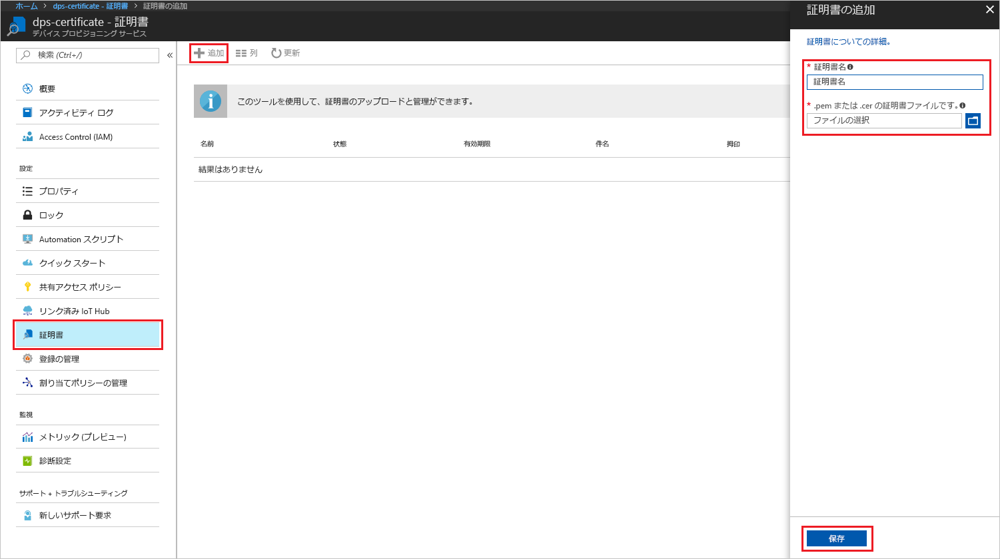
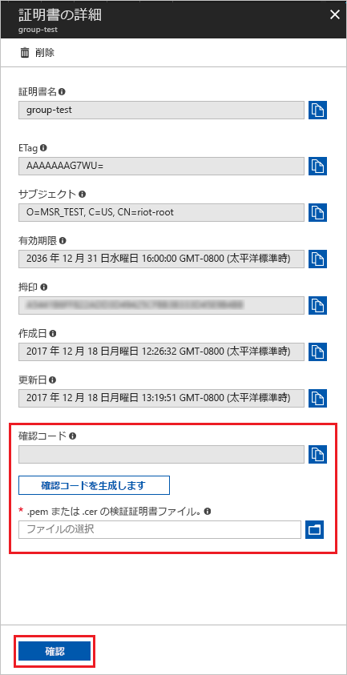
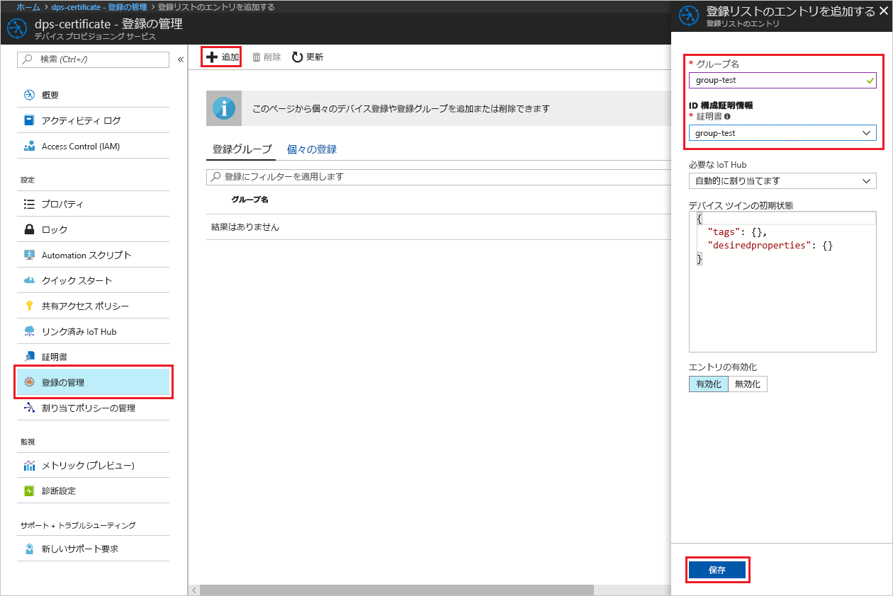

# <a name="create-and-provision-an-x509-simulated-device-using-nodejs-device-sdk-for-iot-hub-device-provisioning-service"></a>IoT Hub Device Provisioning Service 対応の Node.js device SDK を使用して、シミュレートされた X.509 デバイスを作成してプロビジョニングする
[!INCLUDE [iot-dps-selector-quick-create-simulated-device-x509](../../includes/iot-dps-selector-quick-create-simulated-device-x509.md)]

IoT Hub Device Provisioning Service は、IoT ハブへのゼロタッチでのデバイス プロビジョニングを可能にする、IoT Hub のヘルパー サービスです。 デバイス プロビジョニング サービスを利用すると、セキュリティで保護されたスケーラブルな方法でいくつものデバイスをプロビジョニングできます。

デバイス プロビジョニングは、2 つの手順で構成されます。 最初の手順では、ソリューションの特定の要件に基づいて、Device Provisioning Service に適切な登録エントリを作成します。  2 番目の手順では、デバイスと Device Provisioning Service 間の接続を確立し、IoT ハブにデバイスを登録します。 両方の手順を完了すると、デバイスは完全にプロビジョニングされたと見なされます。 デバイス プロビジョニング サービスでは、デバイスにシームレスなプロビジョニング エクスペリエンスを提供するために、両方のステップを自動化しています。 詳細については、[Device Provisioning Service の概念](https://docs.microsoft.com/en-us/azure/iot-dps/concepts-service)に関するページを参照してください。

以下の手順では、Device Provisioning Service で登録エントリを作成する方法、開発マシン上で X.509 デバイスをシミュレートする方法、そのシミュレートされたデバイスを Device Provisioning Service と接続する方法、[Azure IoT Hub Node.js device SDK](https://github.com/Azure/azure-iot-sdk-node) を使用してデバイスを IoT ハブに登録する方法について説明します。

[!INCLUDE [IoT DPS basic](../../includes/iot-dps-basic.md)]

## <a name="prepare-the-environment"></a>環境の準備 

1. 先に進む前に、[Azure Portal での IoT Hub Device Provisioning Service の設定](./quick-setup-auto-provision.md)に関するページの手順を完了します。

1. マシンに [Node.js v4.0 以降](https://nodejs.org)がインストールされていることを確認します。

1. マシンに [Git](https://git-scm.com/download/) がインストールされ、コマンド ウィンドウからアクセスできる環境変数に追加されていることを確認します。 

1. マシンに [OpenSSL](https://www.openssl.org/) がインストールされ、コマンド ウィンドウからアクセスできる環境変数に追加されていることを確認します。 このライブラリは、ソースからビルドしてインストールするか、または[サード パーティ](https://wiki.openssl.org/index.php/Binaries) ([例](https://sourceforge.net/projects/openssl/)) からダウンロードしてインストールすることができます。 

    > [!NOTE]
    > "_ルート_"、"_中間_"、"_リーフ_" の X.509 証明書すべてまたはいずれかを既に作成している場合は、この手順および証明書の生成に関する以下のすべての手順を省略してかまいません。
    >


## <a name="create-an-enrollment-entry"></a>登録エントリの作成

登録とは、任意の時点で登録でき、Device Provisioning Service に格納される、デバイスまたはデバイス グループのレコードのことです。 登録レコードには、X.509 証明書の詳細や追加の登録情報など、デバイスまたはデバイス グループに関する情報が含まれています。 Device Provisioning Service によってサポートされている登録の種類には、"_個々の登録_" と "_登録グループ_" の 2 つがあります。 詳細については、[登録の概念](https://docs.microsoft.com/en-us/azure/iot-dps/concepts-service#enrollment)に関するページを参照してください。

独自の X.509 テスト証明書を作成する場合、該当するソリューションに必要な証明書については[セキュリティの概念](https://docs.microsoft.com/en-us/azure/iot-dps/concepts-security#x509-certificates)に関するページを参照してください。また、実装の詳細については、「[Tools for the Azure IoT Device Provisioning Device SDK for Node.js (Azure IoT Device Provisioning の Node.js device SDK 用ツール)](https://github.com/azure/azure-iot-sdk-node/tree/master/provisioning/tools)」を参照してください。

1. コマンド プロンプトを開きます。 コード サンプルの GitHub リポジトリを複製します。
    
    ```cmd/sh
    git clone https://github.com/Azure/azure-iot-sdk-node.git --recursive
    ```

1. 証明書ジェネレーター スクリプトに移動し、プロジェクトをビルドします。 

    ```cmd/sh
    cd azure-iot-sdk-node/provisioning/tools
    npm install
    ```

1. 設定に従って、次のいずれかの方法で登録情報を作成します。

    - **個々の登録**：

        1. 独自の _certificate-name_ を使用してスクリプトを実行し、"_リーフ_" 証明書を作成します。 リーフ証明書の共通名は[登録 ID](https://docs.microsoft.com/en-us/azure/iot-dps/concepts-device#registration-id) になるため、必ず小文字の英数字とハイフンのみを使用してください。

        ```cmd/sh
        node create_test_cert.js device {certificate-name}
        ```
         
        1. **Azure Portal** で、**Device Provisioning Service** の概要ブレードを開きます。 **[登録を管理します]**、**[個々の登録]** タブの順に選択し、上部にある **[追加]** ボタンをクリックします。 

        1. **[Add enrollment list entry]\(登録リスト エントリの追加\)** で、次の情報を入力します。
            - ID 構成証明の "*メカニズム*" として **[X.509]** を選択します。
            - *[.pem または .cer の証明書ファイルです。]* で、前の手順で "*エクスプローラー*" ウィジェットを使用して作成した証明書ファイル **_{certificate-name}\_cert.pem_** を選択します。
            - 必要に応じて、次の情報を入力することができます。
                - プロビジョニング サービスにリンクされた IoT ハブを選択します。
                - 一意のデバイス ID を入力します。 デバイスに名前を付ける際に機密データを含めないようにしてください。 
                - **[Initial device twin state]\(初期のデバイス ツインの状態\)** をデバイスの目的の初期構成で更新します。
            - 作業が完了したら、**[保存]** をクリックします。 

          

    登録に成功すると、*[個々の登録]* タブの *[登録 ID]* 列に X.509 デバイスが **{certificate-name}** として表示されます。この値は、後で使用するためにメモしておきます。

    - **登録グループ**： 

        1. 独自の _root-name_ を使用してスクリプトを実行し、"_ルート_" 証明書を作成します。

        ```cmd/sh
        node create_test_cert.js root {root-name}
        ```

        1. **Azure Portal** で、**Device Provisioning Service** の概要ブレードを開きます。 **[証明書]** を選択して、上部の **[追加]** ボタンをクリックします。

        1. **[証明書の追加]** に次の情報を入力します。
            - 一意の証明書名を入力します。
            - 前に作成した **_{root-name}\_cert.pem_** ファイルを選択します。
            - 作業が完了したら、**[保存]** をクリックします。

        

        1. 新しく作成された証明書を選択します。
            - **[確認コードを生成します]** をクリックします。 生成されたコードをコピーします。
            - "_検証_" 証明書を作成します。 "_確認コード_" を入力するか、または右クリックして実行中の Node スクリプト ウィンドウに次のコマンドを貼り付けます。

                ```cmd/sh
                node create_test_cert.js verification {rootname_cert} {verification code}
                ```

            - *[.pem または .cer の検証証明書ファイル]* で、前の手順で "*エクスプローラー*" ウィジェットを使用して作成した証明書ファイル **_verification_cert.pem_** を選択します。 **[確認]** をクリックします。

            

        1. **[登録を管理します]** を選択します。 **[登録グループ]** タブを選択して、上部の **[追加]** ボタンをクリックします。
            - 一意のグループ名を入力します。
            - 前に作成した一意の証明書名を選択します
            - 必要に応じて、次の情報を入力することができます。
                - プロビジョニング サービスにリンクされた IoT ハブを選択します。
                - **[Initial device twin state]\(初期のデバイス ツインの状態\)** をデバイスの目的の初期構成で更新します。

        

        登録が正常に完了すると、X.509 デバイス グループが *[登録グループ]* タブの *[グループ名]* 列に表示されます。この値は、後で使用するためにメモしておきます。

        1. 独自の _certficate-name_ の後に続けて、前に使用した独自の _root-name_ を使用したスクリプトを実行し、"_リーフ_" 証明書を作成します。 リーフ証明書の共通名は[登録 ID](https://docs.microsoft.com/en-us/azure/iot-dps/concepts-device#registration-id) になるため、必ず小文字の英数字とハイフンのみを使用してください。

            ```cmd/sh
            node create_test_cert.js device {certificate-name} {root-name}
            ```

        > [!NOTE]
        > `node create_test_cert.js intermediate {certificate-name} {parent-name}` を使用して "_中間_" 証明書を作成することもできます。 "_リーフ_" 証明書は、最後の "_中間_" 証明書をルートまたは親として、必ず最後に作成してください。 詳細については、[デバイスのアクセスの制御](https://docs.microsoft.com/en-us/azure/iot-dps/concepts-security#controlling-device-access-to-the-provisioning-service-with-x509-certificates)に関する記事を参照してください。
        >


## <a name="simulate-the-device"></a>デバイスをシミュレートする

[Azure IoT Hub Node.js device SDK](https://github.com/Azure/azure-iot-sdk-node) を使用すれば、デバイスを簡単にシミュレートできます。 詳細については、[デバイスの概念](https://docs.microsoft.com/en-us/azure/iot-dps/concepts-device)に関するページを参照してください。

1. Azure Portal で、Device Provisioning サービスの **[概要]** ブレードを選択し、**_[グローバル デバイス エンドポイント]_** と **_[ID スコープ]_** の値を書き留めます。

     

1. "_証明書_" と "_キー_" を同じフォルダーにコピーします。

    ```cmd/sh
    copy .\{certificate-name}_cert.pem ..\device\samples\{certificate-name}_cert.pem
    copy .\{certificate-name}_key.pem ..\device\samples\{certificate-name}_key.pem
    ```

1. デバイスのテスト スクリプトに移動し、プロジェクトをビルドします。 

    ```cmd/sh
    cd ..\device\samples
    npm install
    ```

1. **register\_x509.js** ファイルを編集します。 次の変更を行った後に、ファイルを保存します。
    - `provisioning host` を、上記の**手順 1** で書き留めた "**_グローバル デバイス エンドポイント_**" に置き換えます。
    - `id scope` を、上記の**手順 1** で書き留めた "**_ID スコープ_**" に置き換えます。 
    - `reigstration id` を、前のセクションで書き留めた "**_登録 ID_**" または "**_グループ名_**" に置き換えます。
    - `cert filename` と `key filename` を、上記の**手順 2** でコピーしたファイルに置き換えます。 

1. スクリプトを実行し、デバイスが正常にプロビジョニングされたことを確認します。

    ```cmd/sh
    node register_x509.js
    ```   

1. ポータルで、ご利用のプロビジョニング サービスにリンクされている IoT Hub に移動し、**[IoT デバイス]** ブレードを開きます。 シミュレートされた X.509 デバイスをハブにプロビジョニングすると、そのデバイス ID が**有効**な "*状態*" で **[IoT デバイス]** ブレードに表示されます。 サンプル デバイス アプリケーションを実行する前に既にブレードが開いていた場合は、必要に応じて一番上にある **[最新の情報に更新]** ボタンをクリックしてください。 

     

    *[Initial device twin state]\(初期のデバイス ツインの状態\)* をデバイスの登録エントリの既定値から変更した場合、デバイスはハブから目的のツインの状態をプルし、それに従って動作することができます。 詳細については、「[IoT Hub のデバイス ツインの理解と使用](../iot-hub/iot-hub-devguide-device-twins.md)」を参照してください。


## <a name="clean-up-resources"></a>リソースのクリーンアップ

引き続きデバイス クライアント サンプルを使用する場合は、このクイックスタートで作成したリソースをクリーンアップしないでください。 使用する予定がない場合は、次の手順を使用して、このクイックスタートで作成したすべてのリソースを削除してください。

1. マシンに表示されているデバイス クライアント サンプルの出力ウィンドウを閉じます。
1. Azure Portal の左側のメニューにある **[すべてのリソース]** をクリックし、Device Provisioning サービスを選択します。 サービスの **[登録を管理します]** ブレードを開き、**[個々の登録]** タブまたは **[登録グループ]** タブをクリックします。このクイック スタートで登録したデバイスの "*登録 ID*" または "*グループ名*" を選択し、上部の **[削除]** ボタンをクリックします。 
1. Azure Portal の左側のメニューにある **[すべてのリソース]** をクリックし、IoT ハブを選択します。 ハブの **[IoT Devices]\(IoT デバイス\)** ブレードを開き、このクイックスタートで登録したデバイスの "*デバイス ID*" を選択し、一番上の **[削除]** ボタンをクリックします。


## <a name="next-steps"></a>次の手順

このクイック スタートでは、シミュレートされた X.509 デバイスを作成し、ポータルで Azure IoT Hub Device Provisioning Service を使って IoT ハブにプロビジョニングしました。 プログラミングによって X.509 デバイスを登録する方法については、X.509 デバイスのプログラミングによる登録のクイックスタートに進みます。 

> [!div class="nextstepaction"]
> [Azure クイックスタート - Azure IoT Hub Device Provisioning Service への X.509 デバイスの登録](quick-enroll-device-x509-node.md)
