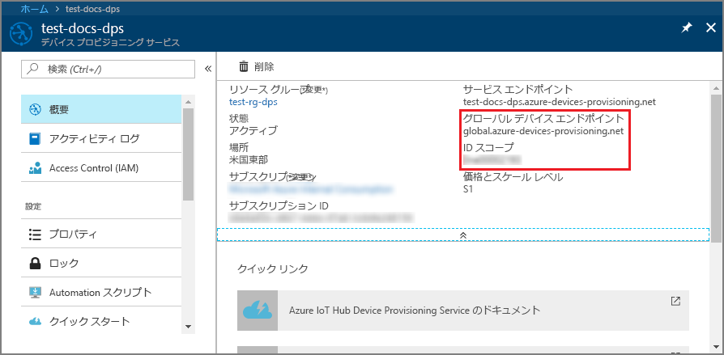

# <a name="quickstart-create-and-provision-a-simulated-x509-device-using-python-device-sdk-for-iot-hub-device-provisioning-service"></a>クイック スタート:IoT Hub Device Provisioning Service 対応の Python デバイス SDK を使用して、シミュレートされた X.509 デバイスを作成してプロビジョニングする

[!INCLUDE [iot-dps-selector-quick-create-simulated-device-x509](../../includes/iot-dps-selector-quick-create-simulated-device-x509.md)]

このクイックスタートでは、Python X.509 デバイスとして開発マシンをプロビジョニングします。 [Azure IoT Python SDK](https://github.com/Azure/azure-iot-sdk-python) からサンプル デバイス コードを使用して、IoT ハブにデバイスを接続します。 この例では、Device Provisioning Service (DPS) で個別登録を使用します。

## <a name="prerequisites"></a>前提条件

- [プロビジョニング](about-iot-dps.md#provisioning-process)の概念を理解していること。
- [Azure portal での IoT Hub Device Provisioning Service の設定](./quick-setup-auto-provision.md)が完了していること。
- アクティブなサブスクリプションが含まれる Azure アカウント。 [無料で作成できます](https://azure.microsoft.com/free/?ref=microsoft.com&utm_source=microsoft.com&utm_medium=docs&utm_campaign=visualstudio)。
- [Python 3.5.3 以降](https://www.python.org/downloads/)
- [Git](https://git-scm.com/download/).


[!INCLUDE [IoT Device Provisioning Service basic](../../includes/iot-dps-basic.md)]

## <a name="prepare-the-environment"></a>環境の準備 

1. マシンに `git` がインストールされ、コマンド ウィンドウからアクセスできる環境変数に追加されていることを確認します。 **Git Bash** (ローカル Git リポジトリと対話する際に使用するコマンドライン アプリ) など、インストールする各種 `git` ツールの最新バージョンについては、[Software Freedom Conservancy の Git クライアント ツール](https://git-scm.com/download/)に関するページを参照してください。 

2. Git Bash プロンプトを開きます。 [Azure IoT Python SDK](https://github.com/Azure/azure-iot-sdk-python) の GitHub リポジトリをクローンします。
    
    ```cmd/sh
    git clone https://github.com/Azure/azure-iot-sdk-python.git --recursive
    ```


## <a name="create-a-self-signed-x509-device-certificate"></a>自己署名 X.509 デバイス証明書を作成する 

このセクションでは、自己署名 X.509 証明書を作成します。 次の点に注意することが重要です。

* 自己署名証明書はテスト目的専用であるため、運用環境では使用しないでください。
* 自己署名証明書の既定の有効期限は 1 年間です。

デバイスを認証するためのデバイス証明書がない場合は、この記事でテスト目的に使用する自己署名証明書を OpenSSL で作成してください。  OpenSSL は Git のインストールに含まれています。 

1. Git Bash プロンプトで次のコマンドを実行します。

    # <a name="windows"></a>[Windows](#tab/windows)
    
    ```bash
    winpty openssl req -outform PEM -x509 -sha256 -newkey rsa:4096 -keyout ./python-device.key.pem -out ./python-device.pem -days 365 -extensions usr_cert -subj "//CN=Python-device-01"
    ```

    > [!IMPORTANT]
    > サブジェクト名 (`//CN=Python-device-01`) に追加されているスラッシュは、Windows プラットフォーム上の Git で文字列をエスケープする場合にのみ必要となります。 

    # <a name="linux"></a>[Linux](#tab/linux)
    
    ```bash
    openssl req -outform PEM -x509 -sha256 -newkey rsa:4096 -keyout ./python-device.key.pem -out ./python-device.pem -days 365 -extensions usr_cert -subj "/CN=Python-device-01"
    ```
    
    ---
    
2. **PEM のパス フレーズを入力** するよう求められたら、この記事でテストに使用するパス フレーズ `1234` を入力します。    

3. **PEM パス フレーズの確認入力** を求められたら、同じパス フレーズ `1234` をもう一度入力します。    

`openssl` コマンドを実行したディレクトリに、テスト証明書ファイル (*python-device.pem*) と秘密キー ファイル (*python-device.key.pem*) が生成されます。


## <a name="create-an-individual-enrollment-entry-in-dps"></a>DPS で個別登録エントリを作成する


Azure IoT Device Provisioning Service では、次の 2 種類の登録がサポートされています。

- [登録グループ](concepts-service.md#enrollment-group)：複数の関連するデバイスを登録するために使用します。
- [個別登録](concepts-service.md#individual-enrollment): 単一デバイスを登録するために使用します。

この記事では、IoT ハブに単一のデバイスをプロビジョニングする個別登録のデモを行います。

1. Azure portal にサインインし、左側のメニューにある **[すべてのリソース]** を選択してプロビジョニング サービスを開きます。

2. Device Provisioning Service のメニューで、 **[登録を管理します]** を選択します。 **[個々の登録]** タブを選択したうえで、上部にある **[個別登録の追加]** を選択します。 

3. **[登録の追加]** パネルで、次の情報を入力します。
   - ID 構成証明の "*メカニズム*" として **[X.509]** を選択します。
   - 先ほど作成したテスト証明書を使用している場合、 *[Primary certificate .pem or .cer file]\(プライマリ証明書 .pem または .cer ファイル\)* の *[ファイルの選択]* を選択し、証明書ファイル **python-device.pem** を選択します。
   - 必要に応じて、次の情報を入力することができます。
     - プロビジョニング サービスにリンクされた IoT ハブを選択します。
     - **[Initial device twin state]\(初期のデバイス ツインの状態\)** をデバイスの目的の初期構成で更新します。
   - 作業が完了したら、 **[保存]** を押します。 

     [](./media/python-quick-create-simulated-device-x509/device-enrollment.png#lightbox)

   登録に成功すると、 *[個々の登録]* タブの *[登録 ID]* 列に X.509 デバイスが **Python-device-01** として表示されます。この登録値は、デバイス証明書上のサブジェクト名に由来します。 

## <a name="simulate-the-device"></a>デバイスをシミュレートする

Python プロビジョニング サンプル [provision_x509.py](https://github.com/Azure/azure-iot-sdk-python/blob/master/azure-iot-device/samples/async-hub-scenarios/provision_x509.py) は、`azure-iot-sdk-python/azure-iot-device/samples/async-hub-scenarios` ディレクトリに格納されています。 DPS を使用して IoT デバイスの認証とプロビジョニングを行うために、このサンプルでは 6 つの環境変数を使用しています。 それらの環境変数を次に示します。

| 変数名              | 説明                                     |
| :------------------------- | :---------------------------------------------- |
| `PROVISIONING_HOST`        |  この値は、DPS リソースへの接続に使用されるグローバル エンドポイントです |    
| `PROVISIONING_IDSCOPE`     |  この値は、DPS リソースの ID スコープです |    
| `DPS_X509_REGISTRATION_ID` |  この値は、デバイスの ID です。 デバイス証明書上のサブジェクト名とも一致している必要があります |    
| `X509_CERT_FILE`           |  デバイス証明書のファイル名 |    
| `X509_KEY_FILE`            |  デバイス証明書の秘密キーのファイル名 |
| `PASS_PHRASE`              |  証明書と秘密キー ファイルを暗号化する際に使用したパス フレーズ (`1234`)。 |    

1. Device Provisioning Service のメニューで、 **[概要]** を選択します。 _[ID スコープ]_ と _[グローバル デバイス エンドポイント]_ をメモします。

    

2. Git Bash プロンプトで次のコマンドを使用して、グローバル デバイス エンドポイントと ID スコープの環境変数を追加します。

    ```bash
    $export PROVISIONING_HOST=global.azure-devices-provisioning.net
    $export PROVISIONING_IDSCOPE=<ID scope for your DPS resource>
    ```

3. IoT デバイスの登録 ID は、そのデバイス証明書上のサブジェクト名と一致している必要があります。 自己署名テスト証明書を生成した場合は、`Python-device-01` がサブジェクト名であり、デバイスの登録 ID となります。 

    既にデバイスの証明書がある場合は、`certutil` を使用して、デバイスに使用されているサブジェクトの共通名を確認できます。以下に示したのは、自己署名テスト証明書での例です。

    ```bash
    $ certutil python-device.pem
    X509 Certificate:
    Version: 3
    Serial Number: fa33152fe1140dc8
    Signature Algorithm:
        Algorithm ObjectId: 1.2.840.113549.1.1.11 sha256RSA
        Algorithm Parameters:
        05 00
    Issuer:
        CN=Python-device-01
      Name Hash(sha1): 1dd88de40e9501fb64892b698afe12d027011000
      Name Hash(md5): a62c784820daa931b9d3977739b30d12
    
     NotBefore: 1/29/2021 7:05 PM
     NotAfter: 1/29/2022 7:05 PM
    
    Subject:
        ===> CN=Python-device-01 <===
      Name Hash(sha1): 1dd88de40e9501fb64892b698afe12d027011000
      Name Hash(md5): a62c784820daa931b9d3977739b30d12
    ```

    Git Bash プロンプトで、次のように登録 ID の環境変数を設定します。

    ```bash
    $export DPS_X509_REGISTRATION_ID=Python-device-01
    ```

4. Git Bash プロンプトで、証明書ファイル、秘密キー ファイル、パス フレーズに使用する環境変数を設定します。

    ```bash
    $export X509_CERT_FILE=./python-device.pem
    $export X509_KEY_FILE=./python-device.key.pem
    $export PASS_PHRASE=1234
    ```

5. [provision_x509.py](https://github.com/Azure/azure-iot-sdk-python/blob/master/azure-iot-device/samples/async-hub-scenarios/provision_x509.py) のコードを確認します。**Python バージョン 3.7** 以降をご使用でない場合は、[こちらに記載されているコード変更](https://github.com/Azure/azure-iot-sdk-python/tree/master/azure-iot-device/samples/async-hub-scenarios#advanced-iot-hub-scenario-samples-for-the-azure-iot-hub-device-sdk)を行って `asyncio.run(main())` を置き換え、変更内容を保存してください。 

6. サンプルを実行します。 このサンプルは、デバイスをハブに接続してプロビジョニングし、そのハブにいくつかのテスト メッセージを送信します。

    ```bash
    $ winpty python azure-iot-sdk-python/azure-iot-device/samples/async-hub-scenarios/provision_x509.py
    RegistrationStage(RequestAndResponseOperation): Op will transition into polling after interval 2.  Setting timer.
    The complete registration result is
    Python-device-01
    TestHub12345.azure-devices.net
    initialAssignment
    null
    Will send telemetry from the provisioned device
    sending message #4
    sending message #7
    sending message #2
    sending message #8
    sending message #5
    sending message #9
    sending message #1
    sending message #6
    sending message #10
    sending message #3
    done sending message #4
    done sending message #7
    done sending message #2
    done sending message #8
    done sending message #5
    done sending message #9
    done sending message #1
    done sending message #6
    done sending message #10
    done sending message #3
    ```

7. ポータルで、ご利用のプロビジョニング サービスにリンクされている IoT ハブに移動し、左側のメニューの **[エクスプローラー]** セクションにある **[IoT デバイス]** ブレードを開きます。 シミュレートされた X.509 デバイスをハブにプロビジョニングすると、そのデバイス ID が **有効** な "*状態*" として **[Device Explorer]** ブレードに表示されます。 サンプル デバイス アプリケーションを稼働させる前にこのブレードを開いていた場合は、一番上にある **[最新の情報に更新]** を押すことが必要になる場合があります。 

     

> [!NOTE]
> *[Initial device twin state]\(初期のデバイス ツインの状態\)* をデバイスの登録エントリの既定値から変更した場合、デバイスはハブから目的のツインの状態をプルし、それに従って動作することができます。 詳細については、「[IoT Hub のデバイス ツインの理解と使用](../iot-hub/iot-hub-devguide-device-twins.md)」を参照してください。
>

## <a name="clean-up-resources"></a>リソースをクリーンアップする

引き続きデバイス クライアント サンプルを使用する場合は、このクイックスタートで作成したリソースをクリーンアップしないでください。 使用する予定がない場合は、次の手順を使用して、このクイックスタートで作成したすべてのリソースを削除してください。

1. マシンに表示されているデバイス クライアント サンプルの出力ウィンドウを閉じます。
2. Azure portal の左側のメニューで **[すべてのリソース]** を選択し、Device Provisioning Service を選択します。 サービスの **[登録を管理します]** ブレードを開き、 **[個々の登録]** タブを選択します。このクイックスタートで登録したデバイスの "*登録 ID*" の隣にあるチェック ボックスをオンにして、ペイン上部の **[削除]** を押します。 
3. Azure portal の左側のメニューにある **[すべてのリソース]** を選択し、IoT ハブを選択します。 ハブの **[IoT デバイス]** ブレードを開き、このクイックスタートで登録したデバイスの "*デバイス ID*" の隣にあるチェック ボックスをオンにして、ペイン上部の **[削除]** を押します。

## <a name="next-steps"></a>次のステップ

このクイックスタートでは、ポータルで、シミュレートされた X.509 デバイスをデプロイ マシン上に作成し、Azure IoT Hub Device Provisioning Service を使用してそれを IoT ハブにプロビジョニングしました。 プログラムで X.509 デバイスを登録する方法については、プログラムによる X.509 デバイスの登録のクイックスタートに進みます。 

> [!div class="nextstepaction"]
> [Azure クイックスタート - X.509 デバイスを Azure IoT Hub Device Provisioning Service に登録する](quick-enroll-device-x509-python.md)
