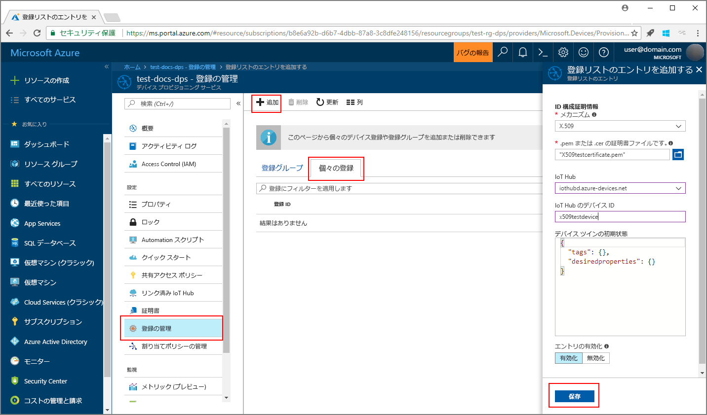
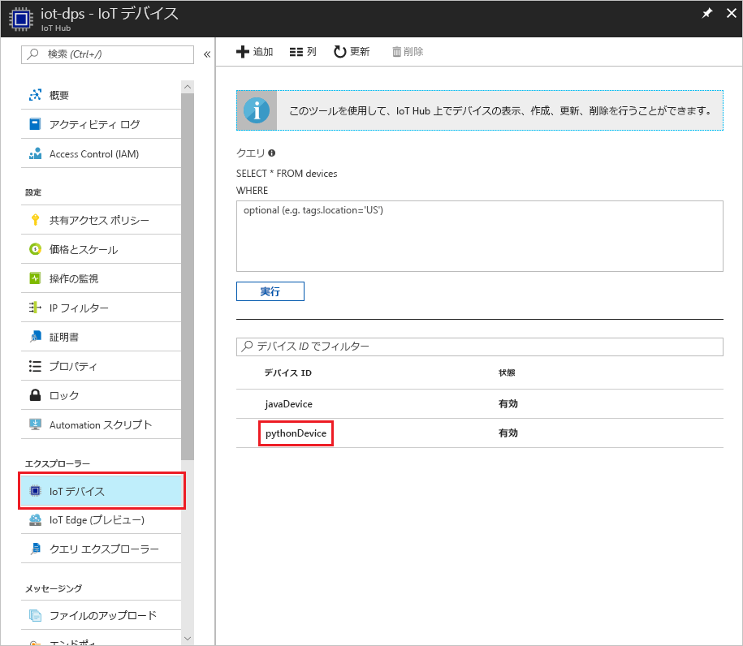

# <a name="create-and-provision-a-simulated-x509-device-using-python-device-sdk-for-iot-hub-device-provisioning-service"></a>IoT Hub Device Provisioning Service 対応の Python デバイス SDK を使用して、シミュレートされた X.509 デバイスを作成してプロビジョニングする
> [!div class="op_single_selector"]
> * [C](quick-create-simulated-device-x509.md)
> * [Java](quick-create-simulated-device-x509-java.md)
> * [C#](quick-create-simulated-device-x509-csharp.md)
> * [Python](quick-create-simulated-device-x509-python.md)

以下の手順では、Windows OS を実行する開発マシン上で X.509 デバイスをシミュレートすると共に、Python コード サンプルを使用して、そのシミュレートされたデバイスを Device Provisioning Service と IoT ハブに接続する方法について説明します。 

事前に、[Azure Portal での IoT Hub Device Provisioning Service の設定](./quick-setup-auto-provision.md)に関するページの手順を済ませておいてください。


## <a name="prepare-the-environment"></a>環境の準備 

1. コンピューターに [Visual Studio 2015](https://www.visualstudio.com/vs/older-downloads/) または [Visual Studio 2017](https://www.visualstudio.com/vs/) がインストールされていることを確認します。 Visual Studio のインストールで "C++ によるデスクトップ開発" のワークロードを有効にしておく必要があります。

1. [CMake ビルド システム](https://cmake.org/download/)をダウンロードしてインストールします。

1. マシンに `git` がインストールされ、コマンド ウィンドウからアクセスできる環境変数に追加されていることを確認します。 **Git Bash** (ローカル Git リポジトリと対話する際に使用するコマンドライン アプリ) など、インストールする各種 `git` ツールの最新バージョンについては、[Software Freedom Conservancy の Git クライアント ツール](https://git-scm.com/download/)に関するページを参照してください。 

1. コマンド プロンプトまたは Git Bash を開きます。 デバイス シミュレーション コード サンプルの GitHub リポジトリを複製します。
    
    ```cmd/sh
    git clone https://github.com/Azure/azure-iot-sdk-python.git --recursive
    ```

1. この GitHub リポジトリのローカル コピーに、CMake ビルド プロセス用のフォルダーを作成します。 

    ```cmd/sh
    cd azure-iot-sdk-python/c
    mkdir cmake
    cd cmake
    ```

1. 次のコマンドを実行して、プロビジョニング クライアントの Visual Studio ソリューションを作成します。

    ```cmd/sh
    cmake -Duse_prov_client:BOOL=ON ..
    ```


## <a name="create-a-device-enrollment-entry"></a>デバイス登録エントリの作成

1. *cmake* フォルダーに生成されたソリューション (`azure_iot_sdks.sln`) を開き、Visual Studio でビルドします。

1. **Provision\_Tools** フォルダーの **dice\_device\_enrollment** プロジェクトを右クリックし、**[スタートアップ プロジェクトに設定]** を選択します。 ソリューションを実行する 出力ウィンドウで、確認を求められたら個々の登録について「`i`」と入力します。 シミュレートされたデバイスについて、ローカルで生成された X.509 証明書が出力ウィンドウに表示されます。 出力内容の *-----BEGIN CERTIFICATE-----* から *-----END CERTIFICATE-----* までをクリップボードにコピーします。この両方の行を確実に含めるようにしてください。 

    
 
1. ご使用の Windows マシンに **_X509testcertificate.pem_** という名前のファイルを作成して任意のエディターで開き、クリップボードの内容をこのファイルにコピーします。 ファイルを保存します。 

1. Azure Portal にログインし、左側のメニューの **[すべてのリソース]** をクリックして、Provisioning Service を開きます。

1. Device Provisioning Service の概要ブレードで、**[Manage enrollments]\(登録の管理\)** を選択します。 **[Individual Enrollments]\(個々の登録\)** タブの上部にある **[追加]** ボタンをクリックします。 

1. **[Add enrollment list entry]\(登録リスト エントリの追加\)** で、次の情報を入力します。
    - ID 構成証明の "*メカニズム*" として **[X.509]** を選択します。
    - *.pem または .cer の証明書ファイル*として、前の手順で "*エクスプローラー*" ウィジェットを使って作成した証明書ファイル (**_X509testcertificate.pem_**) を選択します。
    - 必要に応じて、次の情報を入力することができます。
        - プロビジョニング サービスにリンクされた IoT ハブを選択します。
        - 一意のデバイス ID を入力します。 デバイスに名前を付ける際に機密データを含めないようにしてください。 
        - **[Initial device twin state]\(初期のデバイス ツインの状態\)** をデバイスの目的の初期構成で更新します。
    - 作業が完了したら、**[保存]** をクリックします。 

      

   登録に成功すると、*[個々の登録]* タブの *[登録 ID]* 列に X.509 デバイスが **riot-device-cert** として表示されます。 


## <a name="simulate-the-device"></a>デバイスのシミュレート

1. Device Provisioning Service の概要ブレードで **[概要]** を選択します。 "_[ID スコープ]_" と "_[グローバル サービス エンドポイント]_" を書き留めます。

    

1. [Python 2.x または 3.x](https://www.python.org/downloads/) をダウンロードしてインストールします。 必ず、セットアップに必要な 32 ビットまたは 64 ビットのインストールを使用してください。 インストール中に求められた場合は、プラットフォーム固有の環境変数に Python を追加します。 Python 2.x を使用している場合は、[*pip* (Python パッケージ管理システム) のインストールまたはアップグレード](https://pip.pypa.io/en/stable/installing/)が必要な場合があります。
    - Windows OS を使用している場合は、[Visual C++ 再頒布可能パッケージ](http://www.microsoft.com/download/confirmation.aspx?id=48145)によって、Python からネイティブ DLL を使用できます。

1. [これらの手順](https://github.com/Azure/azure-iot-sdk-python/blob/master/doc/python-devbox-setup.md)に従って、Python パッケージをビルドします。

    > [!NOTE]
        > `pip` を使用する場合は、`azure-iot-provisioning-device-client` パッケージもインストールされていることを確認してください。

1. samples フォルダーに移動します。

    ```cmd/sh
    cd azure-iot-sdk-python/provisioning_device_client/samples
    ```

1. Python IDE を使用して、**provisioning\_device\_client\_sample.py** という名前の Python スクリプトを編集します。 _GLOBAL\_PROV\_URI_ 変数と _ID\_SCOPE_ 変数を前述の値に変更します。

    ```python
    GLOBAL_PROV_URI = "{globalServiceEndpoint}"
    ID_SCOPE = "{idScope}"
    SECURITY_DEVICE_TYPE = ProvisioningSecurityDeviceType.X509
    PROTOCOL = ProvisioningTransportProvider.HTTP
    ```

1. サンプルを実行します。 

    ```cmd/sh
    python provisioning_device_client_sample.py
    ```

1. アプリケーションが接続され、デバイスが登録され、登録成功メッセージが表示されます。

    

1. ポータルで、ご利用のプロビジョニング サービスにリンクされている IoT Hub に移動し、**[Device Explorer]** ブレードを開きます。 シミュレートされた X.509 デバイスをハブにプロビジョニングすると、そのデバイス ID が**有効**な "*状態*" として **[Device Explorer]** ブレードに表示されます。 サンプル デバイス アプリケーションを実行する前に既にブレードが開いていた場合は、必要に応じて一番上にある **[最新の情報に更新]** ボタンをクリックしてください。 

     

> [!NOTE]
> *[Initial device twin state]\(初期のデバイス ツインの状態\)* をデバイスの登録エントリの既定値から変更した場合、デバイスはハブから目的のツインの状態をプルし、それに従って動作することができます。 詳細については、「[IoT Hub のデバイス ツインの理解と使用](../iot-hub/iot-hub-devguide-device-twins.md)」を参照してください。
>


## <a name="clean-up-resources"></a>リソースのクリーンアップ

引き続きデバイス クライアント サンプルを使用する場合は、このクイックスタートで作成したリソースをクリーンアップしないでください。 使用する予定がない場合は、次の手順を使用して、このクイックスタートで作成したすべてのリソースを削除してください。

1. マシンに表示されているデバイス クライアント サンプルの出力ウィンドウを閉じます。
1. Azure Portal の左側のメニューにある **[すべてのリソース]** をクリックし、Device Provisioning サービスを選択します。 サービスの **[登録を管理します]** ブレードを開き、**[個々の登録]** タブをクリックします。このクイックスタートで登録したデバイスの "*登録 ID*" を選択し、一番上の **[削除]** ボタンをクリックします。 
1. Azure Portal の左側のメニューにある **[すべてのリソース]** をクリックし、IoT ハブを選択します。 ハブの **[IoT デバイス]** ブレードを開き、このクイックスタートで登録したデバイスの "*デバイス ID*" を選択し、一番上の **[削除]** ボタンをクリックします。

## <a name="next-steps"></a>次の手順

このクイックスタートでは、ポータルでシミュレートされた X.509 デバイスを Windows コンピューター上に作成し、Azure IoT Hub Device Provisioning Service を使用して IoT ハブにプロビジョニングしました。 プログラミングによって X.509 デバイスを登録する方法については、X.509 デバイスのプログラミングによる登録のクイックスタートに進みます。 

> [!div class="nextstepaction"]
> [Azure クイックスタート - Azure IoT Hub Device Provisioning Service への X.509 デバイスの登録](quick-enroll-device-x509-java.md)
