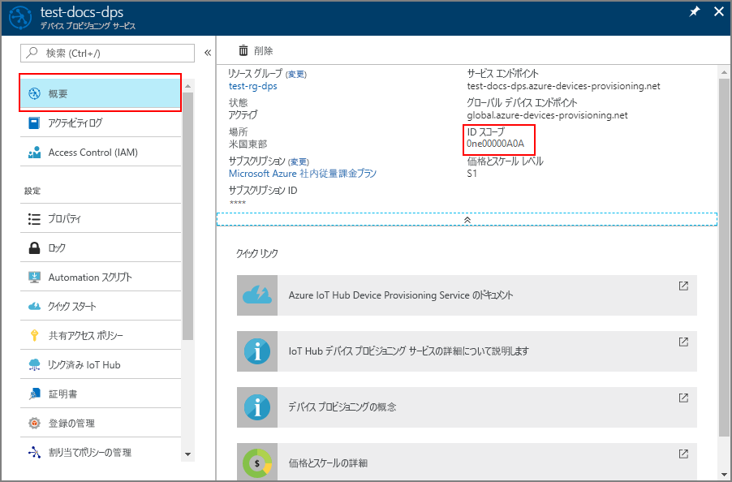

# <a name="quickstart-provision-an-x509-simulated-device-using-the-azure-iot-c-sdk"></a>クイック スタート: シミュレートされた X.509 デバイスを Azure IoT C SDK を使用してプロビジョニングする

[!INCLUDE [iot-dps-selector-quick-create-simulated-device-x509](../../includes/iot-dps-selector-quick-create-simulated-device-x509.md)]

このクイック スタートでは、Windows 開発マシン上で X.509 デバイス シミュレーターを作成して実行する方法について説明します。 このシミュレートされたデバイスを、Device Provisioning Service インスタンスへの登録を使用して IoT ハブに割り当てるように構成します。 [Azure IoT C SDK](https://github.com/Azure/azure-iot-sdk-c) のサンプル コードを使用して、デバイスのブート シーケンスをシミュレートします。 デバイスは、プロビジョニング サービスへの登録に基づいて認識され、IoT ハブに割り当てられます。

自動プロビジョニングの処理に慣れていない場合は、「[自動プロビジョニングの概念](concepts-auto-provisioning.md)」を確認してください。 また、このクイック スタートを続行する前に、[Azure portal での IoT Hub Device Provisioning Service の設定](./quick-setup-auto-provision.md)に関するページの手順も済ませておいてください。 

[!INCLUDE [quickstarts-free-trial-note](../../includes/quickstarts-free-trial-note.md)]


## <a name="prerequisites"></a>前提条件

* ["C++ によるデスクトップ開発"](https://www.visualstudio.com/vs/support/selecting-workloads-visual-studio-2017/) ワークロードを有効にした Visual Studio 2015 または [Visual Studio 2017](https://www.visualstudio.com/vs/)。
* [Git](https://git-scm.com/download/) の最新バージョンがインストールされている。


<a id="setupdevbox"></a>

## <a name="prepare-a-development-environment-for-the-azure-iot-c-sdk"></a>Azure IoT C SDK の開発環境を準備する

このセクションでは、X.509 ブート シーケンスのサンプル コードを含む [Azure IoT C SDK](https://github.com/Azure/azure-iot-sdk-c) をビルドするために使用する開発環境を準備します。

1. [CMake ビルド システム](https://cmake.org/download/)の最新のリリース バージョンをダウンロードします。 その同じサイトで、選択したバイナリ配布のバージョンの暗号化ハッシュを調べます。 ダウンロードしたバイナリを、対応する暗号化ハッシュ値を使用して検証します。 次の例では、Windows PowerShell を使用して、x64 MSI 配布のバージョン 3.11.4 の暗号化ハッシュを検証しています。

    ```PowerShell
    PS C:\Users\wesmc\Downloads> $hash = get-filehash .\cmake-3.11.4-win64-x64.msi
    PS C:\Users\wesmc\Downloads> $hash.Hash -eq "56e3605b8e49cd446f3487da88fcc38cb9c3e9e99a20f5d4bd63e54b7a35f869"
    True
    ```

    `CMake` のインストールを開始する**前に**、Visual Studio の前提条件 (Visual Studio と "C++ によるデスクトップ開発" ワークロード) が マシンにインストールされていることが重要です。 前提条件を満たし、ダウンロードを検証したら、CMake ビルド システムをインストールします。

2. コマンド プロンプトまたは Git Bash シェルを開きます。 次のコマンドを実行して、[Azure IoT C SDK](https://github.com/Azure/azure-iot-sdk-c) の GitHub リポジトリを複製します。
    
    ```cmd/sh
    git clone https://github.com/Azure/azure-iot-sdk-c.git --recursive
    ```
    このリポジトリのサイズは現在約 220 MB です。 この操作は、完了するまでに数分かかります。


3. git リポジトリのルート ディレクトリに `cmake` サブディレクトリを作成し、そのフォルダーに移動します。 

    ```cmd/sh
    cd azure-iot-sdk-c
    mkdir cmake
    cd cmake
    ```

4. このコード サンプルでは、X.509 証明書を使用し、X.509 認証によって構成証明を提示します。 次のコマンドを実行して、開発クライアント プラットフォームに固有の SDK のバージョンをビルドします。 シミュレートされたデバイスの Visual Studio ソリューションが `cmake` ディレクトリに生成されます。 

    ```cmd
    cmake -Duse_prov_client:BOOL=ON ..
    ```
    
    `cmake` で C++ コンパイラが見つからない場合は、上記のコマンドの実行中にビルド エラーが発生している可能性があります。 これが発生した場合は、[Visual Studio コマンド プロンプト](https://docs.microsoft.com/dotnet/framework/tools/developer-command-prompt-for-vs)でこのコマンドを実行してください。 

    ビルドが成功すると、最後のいくつかの出力行は次のようになります。

    ```cmd/sh
    $ cmake -Duse_prov_client:BOOL=ON ..
    -- Building for: Visual Studio 15 2017
    -- Selecting Windows SDK version 10.0.16299.0 to target Windows 10.0.17134.
    -- The C compiler identification is MSVC 19.12.25835.0
    -- The CXX compiler identification is MSVC 19.12.25835.0

    ...

    -- Configuring done
    -- Generating done
    -- Build files have been written to: E:/IoT Testing/azure-iot-sdk-c/cmake
    ```


<a id="portalenroll"></a>

## <a name="create-a-self-signed-x509-device-certificate"></a>自己署名 X.509 デバイス証明書を作成する

このセクションでは、自己署名 X.509 証明書を使用します。次の点に留意することが重要です。

* 自己署名証明書はテスト目的専用であるため、運用環境では使用しないでください。
* 自己署名証明書の既定の有効期限は 1 年間です。

Azure IoT C SDK のサンプル コードを使用して、シミュレートされたデバイスの個々の登録エントリで使用する証明書を作成します。

1. Visual Studio を起動し、`azure_iot_sdks.sln` という名前の新しいソリューション ファイルを開きます。 このソリューション ファイルは、以前に azure-iot-sdk-c git リポジトリのルートに作成した `cmake` フォルダーにあります。

2. Visual Studio のメニューで **[ビルド]** > **[ソリューションのビルド]** の順に選択して、ソリューション内のすべてのプロジェクトをビルドします。

3. Visual Studio の "*ソリューション エクスプローラー*" ウィンドウで、**Provision\_Tools** フォルダーに移動します。 **[dice\_device\_enrollment]** プロジェクトを右クリックし、**[スタートアップ プロジェクトに設定]** を選択します。 

4. Visual Studio のメニューで **[デバッグ]** > **[デバッグなしで開始]** の順に選択して、ソリューションを実行します。 出力ウィンドウで、確認を求められたら個々の登録を行うための「**i**」を入力します。 

    シミュレートされたデバイスについて、ローカルで生成された自己署名 X.509 証明書が出力ウィンドウに表示されます。 出力内容の **-----BEGIN CERTIFICATE-----** から最初の **-----END CERTIFICATE-----** までをクリップボードにコピーします。この両方の行を確実に含めるようにしてください。 必要なのは出力ウィンドウの最初の証明書のみであることに注意してください。
 
5. テキスト エディターを使用し、証明書を **_X509testcert.pem_** という名前の新しいファイルに保存します。 


## <a name="create-a-device-enrollment-entry-in-the-portal"></a>ポータルでデバイス登録エントリを作成する

1. Azure Portal にサインインし、左側のメニューの **[すべてのリソース]** をクリックして、Device Provisioning Service を開きます。

2. **[登録を管理します]** タブをクリックし、上部にある **[Add individual enrollment]\(個別登録の追加\)** ボタンをクリックします。 

3. **[Add enrollment]\(登録の追加\)** で、次の情報を入力し、**[保存]** をクリックします。

    - **メカニズム:** ID 構成証明の "*メカニズム*" として **[X.509]** を選択します。
    - **[Primary certificate .pem or .cer file]\(プライマリ証明書 .pem または .cer ファイル\):** **[ファイルの選択]** をクリックし、先ほど作成した証明書ファイル X509testcert.pem を選択します。
    - **IoT Hub のデバイス ID:** デバイスに ID を割り当てるために、「**test-docs-cert-device**」と入力します。

    [](./media/quick-create-simulated-device-x509/individual-enrollment.png#lightbox)

    登録に成功すると、*[個々の登録]* タブの *[登録 ID]* 列に X.509 デバイスが **riot-device-cert** として表示されます。 


<a id="firstbootsequence"></a>

## <a name="simulate-first-boot-sequence-for-the-device"></a>デバイスの初回ブート シーケンスのシミュレーション

このセクションでは、デバイスのブート シーケンスを Device Provisioning Service インスタンスに送信するようにサンプル コードを更新します。 このブート シーケンスにより、デバイスが認識され、Device Provisioning Service インスタンスにリンクされた IoT ハブに割り当てられます。


1. Azure portal で、Device Provisioning Service の **[概要]** タブをクリックし、**[_ID スコープ_]** の値を書き留めます。

     

2. Visual Studio の "*ソリューション エクスプローラー*" ウィンドウで、**Provision\_Samples** フォルダーに移動します。 **prov\_dev\_client\_sample** という名前のサンプル プロジェクトを展開します。 **Source Files** を展開し、**prov\_dev\_client\_sample.c** を開きます。

3. 定数 `id_scope` を探し、以前にコピーした **ID スコープ**の値で置き換えます。 

    ```c
    static const char* id_scope = "0ne00002193";
    ```

4. 同じファイル内で `main()` 関数の定義を探します。 以下に示すように `hsm_type` 変数が `SECURE_DEVICE_TYPE_TPM` ではなく `SECURE_DEVICE_TYPE_X509` に設定されていることを確認します。

    ```c
    SECURE_DEVICE_TYPE hsm_type;
    //hsm_type = SECURE_DEVICE_TYPE_TPM;
    hsm_type = SECURE_DEVICE_TYPE_X509;
    ```

5. **prov\_dev\_client\_sample** プロジェクトを右クリックし、**[スタートアップ プロジェクトに設定]** を選択します。 

6. Visual Studio のメニューで **[デバッグ]** > **[デバッグなしで開始]** の順に選択して、ソリューションを実行します。 プロジェクトをリビルドするよう求められたら、**[はい]** をクリックして、プロジェクトをリビルドしてから実行します。

    次の出力は、プロビジョニング デバイス クライアントのサンプルが正常に起動し、Provisioning Service インスタンスに接続して、IoT ハブの情報を取得し、登録した場合の例です。

    ```cmd
    Provisioning API Version: 1.2.7

    Registering... Press enter key to interrupt.

    Provisioning Status: PROV_DEVICE_REG_STATUS_CONNECTED
    Provisioning Status: PROV_DEVICE_REG_STATUS_ASSIGNING
    Provisioning Status: PROV_DEVICE_REG_STATUS_ASSIGNING

    Registration Information received from service: 
    test-docs-hub.azure-devices.net, deviceId: test-docs-cert-device    
    ```

7. ポータルで、Provisioning Service にリンクされた IoT ハブに移動し、**[IoT デバイス]** タブをクリックします。シミュレートされた X.509 デバイスをハブにプロビジョニングすると、そのデバイス ID が**有効**な "*状態*" で **[IoT デバイス]** ブレードに表示されます。 一番上の **[更新]** ボタンをクリックすることが必要な場合があることに注意してください。 

     


## <a name="clean-up-resources"></a>リソースのクリーンアップ

引き続きデバイス クライアント サンプルを使用する場合は、このクイックスタートで作成したリソースをクリーンアップしないでください。 使用する予定がない場合は、次の手順を使用して、このクイックスタートで作成したすべてのリソースを削除してください。

1. マシンに表示されているデバイス クライアント サンプルの出力ウィンドウを閉じます。
1. Azure Portal の左側のメニューにある **[すべてのリソース]** をクリックし、Device Provisioning サービスを選択します。 サービスの **[登録を管理します]** を開き、**[個々の登録]** タブをクリックします。このクイックスタートで登録したデバイスの*登録 ID* を選択し、上部の **[削除]** ボタンをクリックします。 
1. Azure Portal の左側のメニューにある **[すべてのリソース]** をクリックし、IoT ハブを選択します。 ハブの **[IoT デバイス]** を開き、このクイック スタートで登録したデバイスの "*デバイス ID*" を選択し、一番上の **[削除]** ボタンをクリックします。

## <a name="next-steps"></a>次の手順

このクイックスタートでは、ポータルでシミュレートされた X.509 デバイスを Windows コンピューター上に作成し、Azure IoT Hub Device Provisioning Service を使用して IoT ハブにプロビジョニングしました。 プログラミングによって X.509 デバイスを登録する方法については、X.509 デバイスのプログラミングによる登録のクイックスタートに進みます。 

> [!div class="nextstepaction"]
> [Azure クイックスタート - Azure IoT Hub Device Provisioning Service への X.509 デバイスの登録](quick-enroll-device-x509-java.md)
