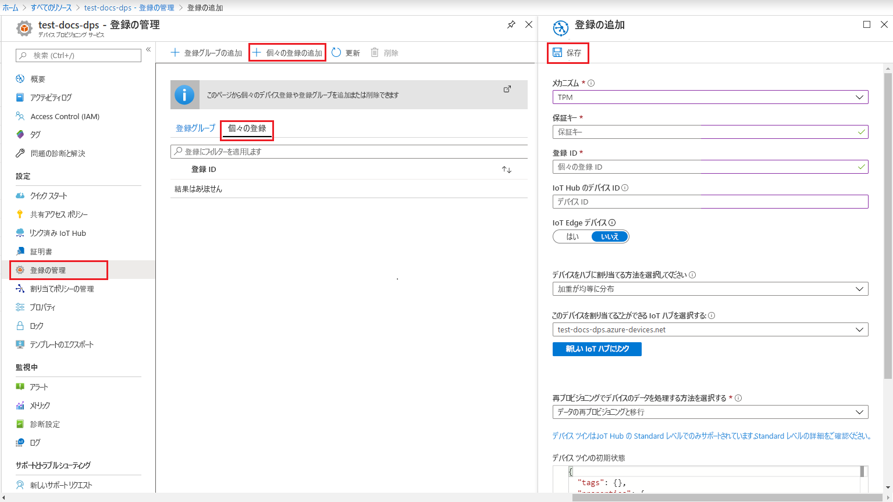
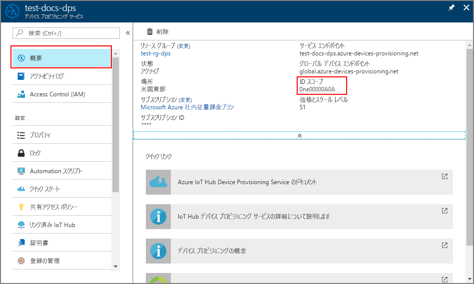
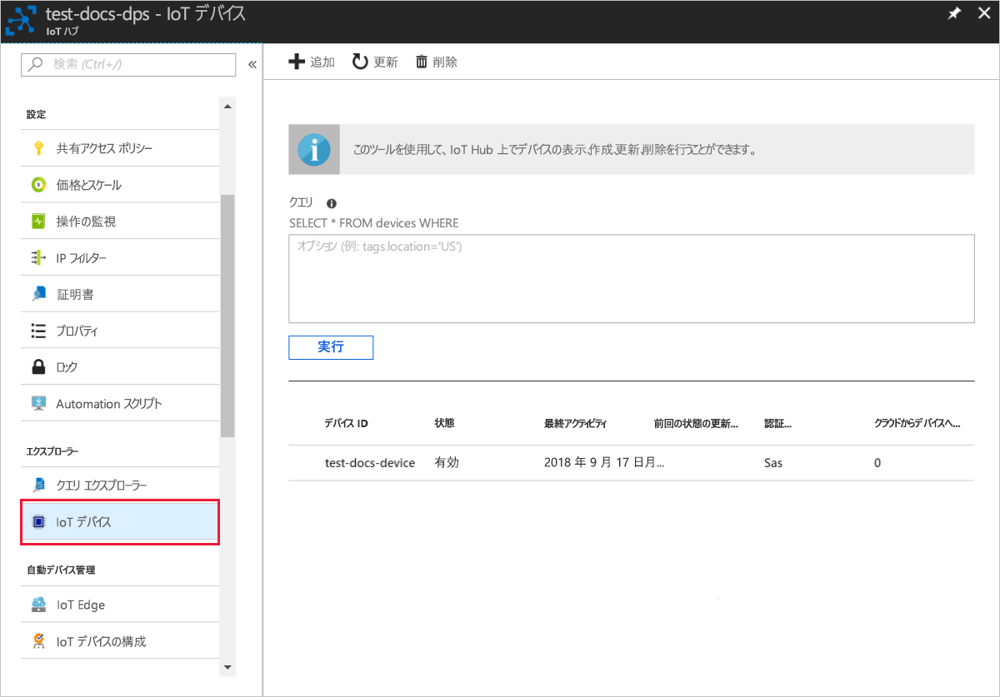

# <a name="quickstart-provision-a-simulated-tpm-device-using-the-azure-iot-c-sdk"></a>クイック スタート: Azure IoT C SDK を使用してシミュレートされた TPM デバイスをプロビジョニングする

[!INCLUDE [iot-dps-selector-quick-create-simulated-device-tpm](../../includes/iot-dps-selector-quick-create-simulated-device-tpm.md)]

このクイック スタートでは、Windows 開発マシン上でトラステッド プラットフォーム モジュール (TPM) デバイス シミュレーターを作成して実行する方法について説明します。 このシミュレートされたデバイスを、Device Provisioning Service を使用して IoT ハブに接続します。 [Azure IoT C SDK](https://github.com/Azure/azure-iot-sdk-c) のサンプル コードは、デバイスを Device Provisioning Service インスタンスに登録し、そのデバイスのブート シーケンスをシミュレートするのに役立ちます。

自動プロビジョニングの処理に慣れていない場合は、「[自動プロビジョニングの概念](concepts-auto-provisioning.md)」を確認してください。 また、このクイック スタートを続行する前に、[Azure portal での IoT Hub Device Provisioning Service の設定](./quick-setup-auto-provision.md)に関するページの手順も済ませておいてください。 

[!INCLUDE [quickstarts-free-trial-note](../../includes/quickstarts-free-trial-note.md)]

## <a name="prerequisites"></a>前提条件

* ["C++ によるデスクトップ開発"](https://www.visualstudio.com/vs/support/selecting-workloads-visual-studio-2017/) ワークロードを有効にした Visual Studio 2015 または [Visual Studio 2017](https://www.visualstudio.com/vs/)。
* [Git](https://git-scm.com/download/) の最新バージョンがインストールされている。


<a id="setupdevbox"></a>

## <a name="prepare-a-development-environment-for-the-azure-iot-c-sdk"></a>Azure IoT C SDK の開発環境を準備する

このセクションでは、[Azure IoT C SDK](https://github.com/Azure/azure-iot-sdk-c) と [TPM](https://docs.microsoft.com/windows/device-security/tpm/trusted-platform-module-overview) デバイス シミュレーターのサンプルをビルドするために使用する開発環境を準備します。

1. [CMake ビルド システム](https://cmake.org/download/)の最新のリリース バージョンをダウンロードします。 その同じサイトで、選択したバイナリ配布のバージョンの暗号化ハッシュを調べます。 ダウンロードしたバイナリを、対応する暗号化ハッシュ値を使用して検証します。 次の例では、Windows PowerShell を使用して、x64 MSI 配布のバージョン 3.11.4 の暗号化ハッシュを検証しています。

    ```PowerShell
    PS C:\Users\wesmc\Downloads> $hash = get-filehash .\cmake-3.11.4-win64-x64.msi
    PS C:\Users\wesmc\Downloads> $hash.Hash -eq "56e3605b8e49cd446f3487da88fcc38cb9c3e9e99a20f5d4bd63e54b7a35f869"
    True
    ```

    `CMake` のインストールを開始する**前に**、Visual Studio の前提条件 (Visual Studio と "C++ によるデスクトップ開発" ワークロード) が マシンにインストールされていることが重要です。 前提条件を満たし、ダウンロードを検証したら、CMake ビルド システムをインストールします。

2. コマンド プロンプトまたは Git Bash シェルを開きます。 次のコマンドを実行して、[Azure IoT C SDK](https://github.com/Azure/azure-iot-sdk-c) の GitHub リポジトリを複製します。
    
    ```cmd/sh
    git clone https://github.com/Azure/azure-iot-sdk-c.git --recursive
    ```
    このリポジトリのサイズは現在約 220 MB です。 この操作は、完了するまでに数分かかります。


3. git リポジトリのルート ディレクトリに `cmake` サブディレクトリを作成し、そのフォルダーに移動します。 

    ```cmd/sh
    cd azure-iot-sdk-c
    mkdir cmake
    cd cmake
    ```

## <a name="build-the-sdk-and-run-the-tpm-device-simulator"></a>SDK をビルドし、TPM デバイス シミュレーターを実行する

このセクションでは、TPM デバイス シミュレーターのサンプル コードを含む Azure IoT C SDK をビルドします。 このサンプルは、Shared Access Signature (SAS) トークン認証を使用して、TPM [構成証明メカニズム](concepts-security.md#attestation-mechanism)を提供します。

1. azure-iot-sdk-c git リポジトリに作成した `cmake` サブディレクトリから、次のコマンドを実行してサンプルをビルドします。 このビルド コマンドにより、シミュレートされたデバイスの Visual Studio ソリューションも生成されます。

    ```cmd/sh
    cmake -Duse_prov_client:BOOL=ON -Duse_tpm_simulator:BOOL=ON ..
    ```

    `cmake` で C++ コンパイラが見つからない場合は、上記のコマンドの実行中にビルド エラーが発生している可能性があります。 これが発生した場合は、[Visual Studio コマンド プロンプト](https://docs.microsoft.com/dotnet/framework/tools/developer-command-prompt-for-vs)でこのコマンドを実行してください。 

    ビルドが成功すると、最後のいくつかの出力行は次のようになります。

    ```cmd/sh
    $ cmake -Duse_prov_client:BOOL=ON -Duse_tpm_simulator:BOOL=ON ..
    -- Building for: Visual Studio 15 2017
    -- Selecting Windows SDK version 10.0.16299.0 to target Windows 10.0.17134.
    -- The C compiler identification is MSVC 19.12.25835.0
    -- The CXX compiler identification is MSVC 19.12.25835.0

    ...

    -- Configuring done
    -- Generating done
    -- Build files have been written to: E:/IoT Testing/azure-iot-sdk-c/cmake
    ```

2. 複製した git リポジトリのルート フォルダーに移動し、以下のパスを使用して [TPM](https://docs.microsoft.com/windows/device-security/tpm/trusted-platform-module-overview) シミュレーターを実行します。 このシミュレーターは、ソケットでポート 2321 とポート 2322 をリッスンします。 このコマンド ウィンドウは閉じないでください。このクイック スタート ガイドの最後まで、このシミュレーターを実行状態にしておく必要があります。 

   *cmake* フォルダーにいる場合は、次のコマンドを実行します。

    ```cmd/sh
    cd ..
    .\provisioning_client\deps\utpm\tools\tpm_simulator\Simulator.exe
    ```

    シミュレーターの出力は表示されません。 TPM デバイスのシミュレートを実行したままにします。

<a id="simulatetpm"></a>

## <a name="read-cryptographic-keys-from-the-tpm-device"></a>TPM デバイスから暗号化キーを読み取る

このセクションでは、実行したままにし、ポート 2321 と 2322 でリッスンしている TPM シミュレーターから保証キーと登録 ID を読み取るサンプルをビルドして実行します。 これらの値は、Device Provisioning Service インスタンスにデバイスを登録する際に使用します。

1. Visual Studio を起動し、`azure_iot_sdks.sln` という名前の新しいソリューション ファイルを開きます。 このソリューション ファイルは、以前に azure-iot-sdk-c git リポジトリのルートに作成した `cmake` フォルダーにあります。

2. Visual Studio のメニューで **[ビルド]** > **[ソリューションのビルド]** の順に選択して、ソリューション内のすべてのプロジェクトをビルドします。

3. Visual Studio の "*ソリューション エクスプローラー*" ウィンドウで、**Provision\_Tools** フォルダーに移動します。 **tpm_device_provision** プロジェクトを右クリックし、**[スタートアップ プロジェクトに設定]** を選択します。 

4. Visual Studio のメニューで **[デバッグ]** > **[デバッグなしで開始]** の順に選択して、ソリューションを実行します。 アプリが**_登録 ID_** と**_保証キー_** を読み取って表示します。 これらの値をコピーします。 これらは次のセクションでデバイスを登録する際に使用します。 


<a id="portalenrollment"></a>

## <a name="create-a-device-enrollment-entry-in-the-portal"></a>ポータルでデバイス登録エントリを作成する

1. Azure Portal にサインインし、左側のメニューの **[すべてのリソース]** をクリックして、Device Provisioning Service を開きます。

2. **[登録を管理します]** タブをクリックし、上部にある **[Add individual enrollment]\(個別登録の追加\)** ボタンをクリックします。 

3. **[Add enrollment]\(登録の追加\)** で、次の情報を入力し、**[保存]** をクリックします。

    - **メカニズム:** ID 構成証明の "*メカニズム*" として **[TPM]** を選択します。
    - **保証キー:** *tpm_device_provision* プロジェクトを実行することで TPM デバイスに対して生成された*保証キー*を入力します。
    - **登録 ID:** *tpm_device_provision* プロジェクトを実行することで TPM デバイスに対して生成された*登録 ID* を入力します。
    - **IoT Edge device \(IoT Edge デバイス\):** **[無効]** を選択します。
    - **IoT Hub のデバイス ID:** デバイスに ID を割り当てるために、「**test-docs-device**」と入力します。

      

    登録に成功すると、*[Individual Enrollments]\(個々の登録\)* タブの一覧に、対象デバイスの "*登録 ID*" が表示されます。 


<a id="firstbootsequence"></a>

## <a name="simulate-first-boot-sequence-for-the-device"></a>デバイスの初回ブート シーケンスのシミュレーション

このセクションでは、[Advanced Message Queuing Protocol (AMQP)](https://wikipedia.org/wiki/Advanced_Message_Queuing_Protocol) を使用して、デバイスのブート シーケンスを Device Provisioning Service インスタンスに送信するようにサンプル コードを構成します。 このブート シーケンスにより、デバイスが認識され、Device Provisioning Service インスタンスにリンクされた IoT ハブに割り当てられます。

1. Azure portal で、Device Provisioning Service の **[概要]** タブをクリックし、**[_ID スコープ_]** の値をコピーします。

     

2. Visual Studio の "*ソリューション エクスプローラー*" ウィンドウで、**Provision\_Samples** フォルダーに移動します。 **prov\_dev\_client\_sample** という名前のサンプル プロジェクトを展開します。 **Source Files** を展開し、**prov\_dev\_client\_sample.c** を開きます。

3. ファイルの先頭近くで、以下のような各デバイス プロトコルの `#define` ステートメントを探します。 `SAMPLE_AMQP` のみがコメント解除されていることを確認します。

    現在、[TPM の個別登録で MQTT プロトコルはサポートされていません](https://github.com/Azure/azure-iot-sdk-c#provisioning-client-sdk)。

    ```c
    //
    // The protocol you wish to use should be uncommented
    //
    //#define SAMPLE_MQTT
    //#define SAMPLE_MQTT_OVER_WEBSOCKETS
    #define SAMPLE_AMQP
    //#define SAMPLE_AMQP_OVER_WEBSOCKETS
    //#define SAMPLE_HTTP
    ```

4. 定数 `id_scope` を探し、以前にコピーした **ID スコープ**の値で置き換えます。 

    ```c
    static const char* id_scope = "0ne00002193";
    ```

5. 同じファイル内で `main()` 関数の定義を探します。 以下に示すように `hsm_type` 変数が `SECURE_DEVICE_TYPE_X509` ではなく `SECURE_DEVICE_TYPE_TPM` に設定されていることを確認します。

    ```c
    SECURE_DEVICE_TYPE hsm_type;
    hsm_type = SECURE_DEVICE_TYPE_TPM;
    //hsm_type = SECURE_DEVICE_TYPE_X509;
    ```

6. **prov\_dev\_client\_sample** プロジェクトを右クリックし、**[スタートアップ プロジェクトに設定]** を選択します。 

7. Visual Studio のメニューで **[デバッグ]** > **[デバッグなしで開始]** の順に選択して、ソリューションを実行します。 プロジェクトをリビルドするよう求められたら、**[はい]** をクリックして、プロジェクトをリビルドしてから実行します。

    次の出力は、プロビジョニング デバイス クライアントのサンプルが正常に起動し、Device Provisioning Service インスタンスに接続して、IoT ハブの情報を取得し、登録した場合の例です。

    ```cmd
    Provisioning API Version: 1.2.7
    Provisioning Status: PROV_DEVICE_REG_STATUS_CONNECTED

    Registering... Press enter key to interrupt.

    Provisioning Status: PROV_DEVICE_REG_STATUS_CONNECTED
    Provisioning Status: PROV_DEVICE_REG_STATUS_ASSIGNING
    Provisioning Status: PROV_DEVICE_REG_STATUS_ASSIGNING

    Registration Information received from service:
    test-docs-hub.azure-devices.net, deviceId: test-docs-device
    ```

8. シミュレートされたデバイスがプロビジョニング サービスによって IoT ハブにプロビジョニングされると、ハブの **[IoT デバイス]** にデバイス ID が表示されます。 

     


## <a name="clean-up-resources"></a>リソースのクリーンアップ

引き続きデバイス クライアント サンプルを使用する場合は、このクイックスタートで作成したリソースをクリーンアップしないでください。 使用する予定がない場合は、次の手順を使用して、このクイックスタートで作成したすべてのリソースを削除してください。

1. マシンに表示されているデバイス クライアント サンプルの出力ウィンドウを閉じます。
2. マシンに表示されている TPM シミュレーター ウィンドウを閉じます。
3. Azure Portal の左側のメニューにある **[すべてのリソース]** をクリックし、Device Provisioning サービスを選択します。 サービスの **[登録を管理します]** を開き、**[個々の登録]** タブをクリックします。このクイックスタートで登録したデバイスの*登録 ID* を選択し、上部の **[削除]** ボタンをクリックします。 
4. Azure Portal の左側のメニューにある **[すべてのリソース]** をクリックし、IoT ハブを選択します。 ハブの **[IoT デバイス]** を開き、このクイック スタートで登録したデバイスの "*デバイス ID*" を選択し、一番上の **[削除]** ボタンをクリックします。

## <a name="next-steps"></a>次の手順

このクイックスタートでは、TPM のシミュレートされたデバイスをコンピューター上に作成し、IoT Hub Device Provisioning Service を使用して IoT ハブにプロビジョニングしました。 プログラミングによって TPM デバイスを登録する方法については、TPM デバイスのプログラミングによる登録のクイックスタートに進みます。 

> [!div class="nextstepaction"]
> [Azure クイックスタート - Azure IoT Hub Device Provisioning Service への TPM デバイスの登録](quick-enroll-device-tpm-java.md)

