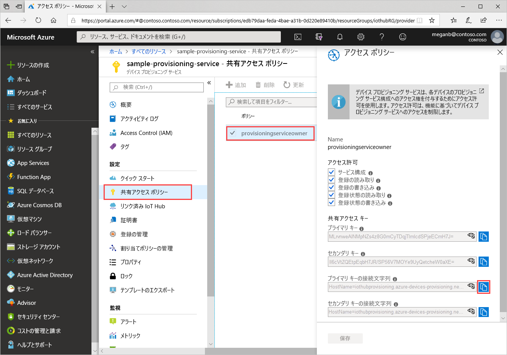
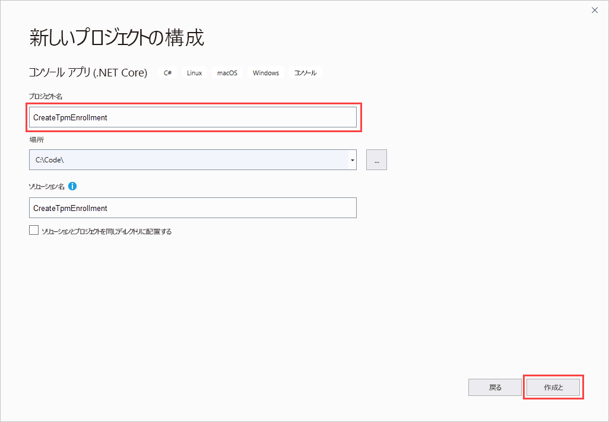
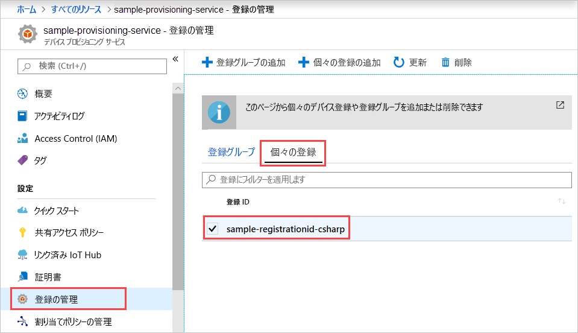

# <a name="quickstart-enroll-tpm-device-to-iot-hub-device-provisioning-service-using-c-service-sdk"></a>クイック スタート:C# サービス SDK を使用して TPM デバイスを IoT Hub Device Provisioning Service に登録する

[!INCLUDE [iot-dps-selector-quick-enroll-device-tpm](../../includes/iot-dps-selector-quick-enroll-device-tpm.md)]

この記事では、[C# サービス SDK](https://github.com/Azure/azure-iot-sdk-csharp) とサンプル C# .NET Core アプリケーションを使用して、Azure IoT Hub Device Provisioning Service で TPM デバイスの個々の登録をプログラムで作成する方法について説明します。 必要に応じて、この個々の登録エントリを使用して、シミュレートされた TPM デバイスをプロビジョニング サービスに登録することができます。 これらの手順は Windows コンピューターと Linux コンピューターの両方に利用できますが、この記事では Windows 開発コンピューターを使用します。

## <a name="prepare-the-development-environment"></a>開発環境の準備

1. [Visual Studio 2019](https://www.visualstudio.com/vs/) がご利用のコンピューターにインストールされていることを確認します。

1. [.NET Core SDK](https://www.microsoft.com/net/download/windows) がご利用のコンピューターにインストールされていることを確認します。

1. 続行する前に、「[Azure portal で IoT Hub Device Provisioning Service を設定する](./quick-setup-auto-provision.md)」に記載の手順を済ませてください。

1. (省略可能) このクイックスタートの最後でシミュレートされたデバイスを登録する場合は、デバイスの保証キーを取得するところまで、[C# デバイス SDK を使用したシミュレートされた TPM デバイスの作成とプロビジョニング](quick-create-simulated-device-tpm-csharp.md)に関するページの手順に従います。 保証キー、登録 ID、(必要に応じて) デバイス ID は、このクイックスタートの後半で使用する必要があるので、保存しておいてください。

   > [!NOTE]
   > Azure portal を使用して個々の登録を作成する手順は行わないでください。

## <a name="get-the-connection-string-for-your-provisioning-service"></a>プロビジョニング サービスの接続文字列を取得する

このクイック スタートのサンプルには、プロビジョニング サービスの接続文字列が必要です。

1. Azure portal にサインインし、 **[すべてのリソース]** を選択してから、ご利用の Device Provisioning Service を選択します。

1. **[共有アクセス ポリシー]** を選択して、プロパティを開くために使用するアクセス ポリシーを選択します。 **[アクセス ポリシー]** で、主キーの接続文字列をコピーして保存します。

    

## <a name="create-the-individual-enrollment-sample"></a>個々の登録サンプルを作成する

このセクションでは、TPM デバイスの個々の登録をご利用のプロビジョニング サービスに追加する .NET Core コンソール アプリを作成する方法について説明します。 これらの手順を一部変更して実行し、個々の登録を追加する [Windows IoT Core](https://developer.microsoft.com/en-us/windows/iot) コンソール アプリを作成することもできます。 IoT Core での開発の詳細については、[Windows IoT Core の開発者ドキュメント](https://docs.microsoft.com/windows/iot-core/)に関するページを参照してください。

1. Visual Studio を開き、 **[新しいプロジェクトの作成]** を選択します。 **[新しいプロジェクトの作成]** で、C# 用の **[コンソールアプリ (.NET Cor)]** プロジェクト テンプレートを選択し、 **[次へ]** を選択します。

1. プロジェクトに "*CreateTpmEnrollment*" という名前を付けて、 **[作成]** を押します。

    

1. Visual Studio でソリューションを開き、 **[ソリューション エクスプローラー]** ペインで **CreateTpmEnrollment** プロジェクトを右クリックします。 **[NuGet パッケージの管理]** を選択します。

1. **[NuGet パッケージ マネージャー]** で **[参照]** を選択し、**Microsoft.Azure.Devices.Provisioning.Service** を検索して選択してから、 **[インストール]** を押します。

   

   この手順では、ダウンロードとインストールが行われ、[Azure IoT Provisioning Service クライアント SDK](https://www.nuget.org/packages/Microsoft.Azure.Devices.Provisioning.Service/) NuGet パッケージへの参照とその依存関係が追加されます。

1. 次の `using` ステートメントを、`Program.cs` の先頭にある他の `using` ステートメントの後ろに追加します。
  
   ```csharp
   using System.Threading.Tasks;
   using Microsoft.Azure.Devices.Provisioning.Service;
   ```

1. `Program` クラスに次のフィールドを追加し、以下の一覧に示す変更を行います。

   ```csharp
   private static string ProvisioningConnectionString = "{ProvisioningServiceConnectionString}";
   private const string RegistrationId = "sample-registrationid-csharp";
   private const string TpmEndorsementKey =
       "AToAAQALAAMAsgAgg3GXZ0SEs/gakMyNRqXXJP1S124GUgtk8qHaGzMUaaoABgCAAEMAEAgAAAAAAAEAxsj2gUS" +
       "cTk1UjuioeTlfGYZrrimExB+bScH75adUMRIi2UOMxG1kw4y+9RW/IVoMl4e620VxZad0ARX2gUqVjYO7KPVt3d" +
       "yKhZS3dkcvfBisBhP1XH9B33VqHG9SHnbnQXdBUaCgKAfxome8UmBKfe+naTsE5fkvjb/do3/dD6l4sGBwFCnKR" +
       "dln4XpM03zLpoHFao8zOwt8l/uP3qUIxmCYv9A7m69Ms+5/pCkTu/rK4mRDsfhZ0QLfbzVI6zQFOKF/rwsfBtFe" +
       "WlWtcuJMKlXdD8TXWElTzgh7JS4qhFzreL0c1mI0GCj+Aws0usZh7dLIVPnlgZcBhgy1SSDQMQ==";
       
   // Optional parameters
   private const string OptionalDeviceId = "myCSharpDevice";
   private const ProvisioningStatus OptionalProvisioningStatus = ProvisioningStatus.Enabled;
   ```

   * `ProvisioningServiceConnectionString` プレースホルダーの値を、登録を作成したいプロビジョニング サービスの接続文字列に置き換えます。

   * 必要に応じて、登録 ID、保証キー、デバイス ID、プロビジョニング状態を変更できます。

   * このクイックスタートと共に、[C# デバイス SDK を使用したシミュレートされた TPM デバイスの作成とプロビジョニング](quick-create-simulated-device-tpm-csharp.md)に関するクイックスタートを使用している場合、そのクイックスタートでメモした値を使用して保証キーと登録 ID を置き換えてください。 デバイス ID は、このクイックスタートで推奨される値に置き換えることができます。または、独自の値を使用したり、このサンプルの既定値を使用したりできます。

1. `Program` クラスに次のメソッドを追加します。  このコードでは、個々の登録エントリを作成してから、`ProvisioningServiceClient` 上で `CreateOrUpdateIndividualEnrollmentAsync` メソッドを呼び出して、個々の登録をプロビジョニング サービスに追加します。

   ```csharp
   public static async Task RunSample()
   {
       Console.WriteLine("Starting sample...");

       using (ProvisioningServiceClient provisioningServiceClient =
               ProvisioningServiceClient.CreateFromConnectionString(ProvisioningConnectionString))
       {
           #region Create a new individualEnrollment config
           Console.WriteLine("\nCreating a new individualEnrollment...");
           Attestation attestation = new TpmAttestation(TpmEndorsementKey);
           IndividualEnrollment individualEnrollment =
                   new IndividualEnrollment(
                           RegistrationId,
                           attestation);

           // The following parameters are optional. Remove them if you don't need them.
           individualEnrollment.DeviceId = OptionalDeviceId;
           individualEnrollment.ProvisioningStatus = OptionalProvisioningStatus;
           #endregion

           #region Create the individualEnrollment
           Console.WriteLine("\nAdding new individualEnrollment...");
           IndividualEnrollment individualEnrollmentResult =
               await provisioningServiceClient.CreateOrUpdateIndividualEnrollmentAsync(individualEnrollment).ConfigureAwait(false);
           Console.WriteLine("\nIndividualEnrollment created with success.");
           Console.WriteLine(individualEnrollmentResult);
           #endregion
        
       }
   }
   ```

1. 最後に、`Main` メソッドの本体を次の行に置き換えます。

   ```csharp
   RunSample().GetAwaiter().GetResult();
   Console.WriteLine("\nHit <Enter> to exit ...");
   Console.ReadLine();
   ```

1. ソリューションをビルドします。

## <a name="run-the-individual-enrollment-sample"></a>個々の登録サンプルを実行する
  
Visual Studio でサンプルを実行して、TPM デバイスの個々の登録を作成します。

コマンド プロンプト ウィンドウが表示され、確認メッセージの表示が開始されます。 作成が正常に完了すると、コマンド プロンプト ウィンドウに新しい個々の登録のプロパティが表示されます。

個々の登録が作成されたことを確認できます。 Device Provisioning Service の概要に進み、 **[登録の管理]** を選択してから、 **[個々の登録]** を選択します。 サンプルで使用した登録 ID に対応する新しい登録エントリが表示されます。



エントリを選択して、保証キーとエントリの他のプロパティを確認します。

[C# デバイス SDK を使用したシミュレートされた TPM デバイスの作成とプロビジョニング](quick-create-simulated-device-tpm-csharp.md)に関するクイックスタートの手順に従っている場合、引き続きこのクイックスタートの手順に留まって、シミュレートされたデバイスを登録できます。 Azure Portal を使用して個々の登録を作成する手順はスキップしてください。

## <a name="clean-up-resources"></a>リソースをクリーンアップする

C# サービスのサンプルを調べる予定の場合は、このクイックスタートで作成したリソースをクリーンアップしないでください。 それ以外の場合は、次の手順を使用して、このクイックスタートで作成したすべてのリソースを削除してください。

1. ご利用のコンピューターに表示されている C# サンプルの出力ウィンドウを閉じます。

1. Azure portal で Device Provisioning サービスに移動し、 **[登録を管理します]** を選択し、 **[個々の登録]** タブを選択します。このクイックスタートを使用して作成した登録エントリの "*登録 ID*" の横にあるチェック ボックスをオンにして、ペイン上部の **[削除]** を押します。

1. [C# デバイス SDK を使用したシミュレートされた TPM デバイスの作成とプロビジョニング](quick-create-simulated-device-tpm-csharp.md)に関するページに記載の手順に従って、シミュレートされた TPM デバイスを作成した場合は、次の手順に従います。

    1. TPM シミュレーター ウィンドウと、シミュレートされたデバイスのサンプル出力ウィンドウを閉じます。

    1. Azure Portal で、デバイスがプロビジョニングされた IoT ハブに移動します。 **[エクスプローラー]** の下のメニューで、 **[IoT デバイス]** を選択し、このクイックスタートで登録したデバイスの "*デバイス ID*" の隣にあるチェック ボックスを選択し、ペイン上部の **[削除]** を押します。

## <a name="next-steps"></a>次のステップ

このクイックスタートでは、TPM デバイスの個々の登録エントリをプログラムで作成しました。 必要に応じて、TPM のシミュレートされたデバイスをご利用のコンピューター上に作成し、それを Azure IoT Hub Device Provisioning Service を使用して IoT ハブにプロビジョニングしました。 Device Provisioning に関する理解をさらに深めるには、Azure Portal における Device Provisioning Service の設定に関するチュートリアルに進んでください。

> [!div class="nextstepaction"]
> [Azure IoT Hub Device Provisioning Service のチュートリアル](./tutorial-set-up-cloud.md)
