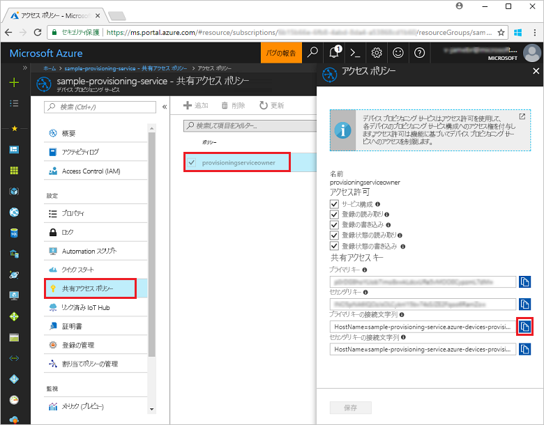
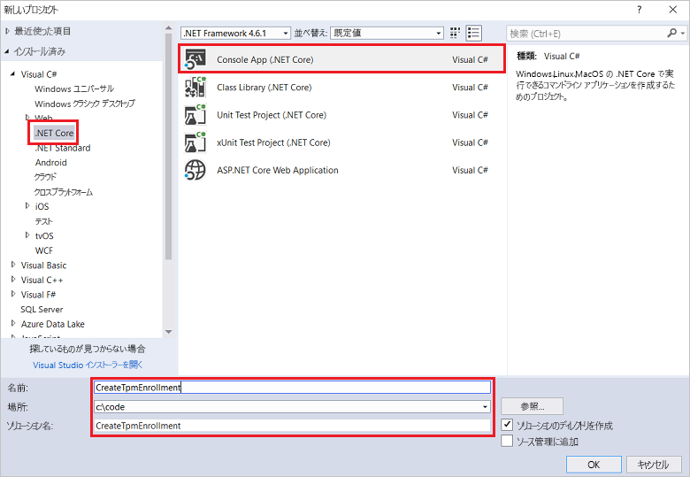
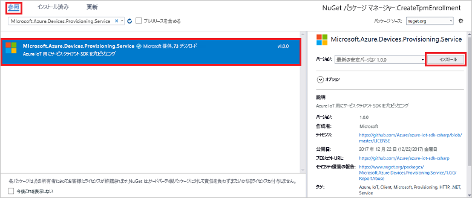
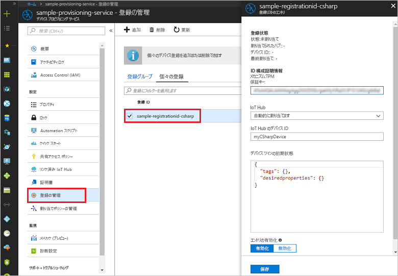

# <a name="enroll-tpm-device-to-iot-hub-device-provisioning-service-using-c-service-sdk"></a>C# サービス SDK を使用して TPM デバイスを IoT Hub Device Provisioning Service に登録する

[!INCLUDE [iot-dps-selector-quick-enroll-device-tpm](../../includes/iot-dps-selector-quick-enroll-device-tpm.md)]


[C# サービス SDK](https://github.com/Azure/azure-iot-sdk-csharp) とサンプル C# .NET Core アプリケーションを使用して、Azure IoT Hub Device Provisioning Service で TPM デバイスの個々の登録をプログラムで作成する方法について説明します。 必要に応じて、この個々の登録エントリを使用して、シミュレートされた TPM デバイスをプロビジョニング サービスに登録することができます。 これらの手順は Windows マシンと Linux マシンの両方に利用できますが、この記事では Windows 開発マシンを使用します。

## <a name="prepare-the-development-environment"></a>開発環境の準備

1. マシンに [Visual Studio 2017](https://www.visualstudio.com/vs/) がインストールされていることを確認します。 
2. マシンに [.NET Core SDK](https://www.microsoft.com/net/download/windows) がインストールされていることを確認します。 
3. 事前に、[Azure Portal での IoT Hub Device Provisioning Service の設定](./quick-setup-auto-provision.md)に関するページの手順を済ませておいてください。
4. (オプション) このクイックスタートの最後にシミュレートされたデバイスを登録する場合は、デバイスの保証キーを取得する手順まで、[C# デバイス SDK を使用したシミュレートされた TPM デバイスの作成とプロビジョニング](quick-create-simulated-device-tpm-csharp.md)に関するページの手順に従います。 保証キー、登録 ID、(必要に応じて) デバイス ID をメモしておいてください。これらの値は、このクイックスタートの後半で使用する必要があります。 **Azure Portal を使用して個々の登録を作成する手順は実行しないでください。**

## <a name="get-the-connection-string-for-your-provisioning-service"></a>プロビジョニング サービスの接続文字列を取得する

このクイックスタートのサンプルには、プロビジョニング サービスの接続文字列が必要です。
1. Azure Portal にログインし、左側のメニューの **[すべてのリソース]** をクリックして、Device Provisioning サービスを開きます。 
2. **共有アクセス ポリシー**をクリックし、プロパティを開くために使用するアクセス ポリシーをクリックします。 **[アクセス ポリシー]** ウィンドウで、主キーの接続文字列をコピーしてメモします。 

    

## <a name="create-the-individual-enrollment-sample"></a>個々の登録サンプルを作成する 

このセクションの手順では、TPM デバイスの個々の登録をプロビジョニング サービスに追加する .NET Core コンソール アプリを作成する方法について説明します。 これらの手順を一部変更して実行し、個々の登録を追加する [Windows IoT Core](https://developer.microsoft.com/en-us/windows/iot) コンソール アプリを作成することもできます。 IoT Core での開発について詳しくは、[Windows IoT Core の開発者ドキュメント](https://docs.microsoft.com/windows/iot-core/)に関するページを参照してください。
1. Visual Studio で、**コンソール アプリ (.NET Core)** プロジェクト テンプレートを使用して、Visual C# .NET Core コンソール アプリ プロジェクトを新しいソリューションに追加します。 .NET Framework のバージョンが 4.5.1 以降であることを確認します。 プロジェクトに **CreateTpmEnrollment** という名前を付けます。

    

2. ソリューション エクスプローラーで **CreateTpmEnrollment** プロジェクトを右クリックし、**[NuGet パッケージの管理]** をクリックします。
3. **[NuGet パッケージ マネージャー]** ウィンドウで **[参照]** を選択し、**Microsoft.Azure.Devices.Provisioning.Service** を検索します。**[インストール]** を選択して **Microsoft.Azure.Devices.Provisioning.Service** パッケージをインストールし、使用条件に同意します。 この手順により、ダウンロードとインストールが行われ、[Azure IoT Provisioning Service クライアント SDK](https://www.nuget.org/packages/Microsoft.Azure.Devices.Provisioning.Service/) NuGet パッケージへの参照とその依存関係が追加されます。

    

4. 次の `using` ステートメントを、**Program.cs** ファイルの先頭にある他の `using` ステートメントの後ろに追加します。
   
   ```csharp
   using System.Threading.Tasks;
   using Microsoft.Azure.Devices.Provisioning.Service;
   ```
    
5. **Program** クラスに次のフィールドを追加します。  
   - **ProvisioningConnectionString** プレースホルダ―の値を、登録を作成したいプロビジョニング サービスの接続文字列に置き換えます。
   - 必要に応じて、登録 ID、保証キー、デバイス ID、プロビジョニング状態を変更できます。 
   - このクイックスタートと共に、[C# デバイス SDK を使用したシミュレートされた TPM デバイスの作成とプロビジョニング](quick-create-simulated-device-tpm-csharp.md)に関するクイックスタートを使用している場合、そのクイックスタートでメモした値を使用して保証キーと登録 ID を置き換えてください。 デバイス ID は、このクイックスタートで推奨される値に置き換えることができます。または、独自の値を使用したり、このサンプルの既定値を使用したりできます。
        
   ```csharp
   private static string ProvisioningConnectionString = "{Your provisioning service connection string}";
   private const string RegistrationId = "sample-registrationid-csharp";
   private const string TpmEndorsementKey =
       "AToAAQALAAMAsgAgg3GXZ0SEs/gakMyNRqXXJP1S124GUgtk8qHaGzMUaaoABgCAAEMAEAgAAAAAAAEAxsj2gUS" +
       "cTk1UjuioeTlfGYZrrimExB+bScH75adUMRIi2UOMxG1kw4y+9RW/IVoMl4e620VxZad0ARX2gUqVjYO7KPVt3d" +
       "yKhZS3dkcvfBisBhP1XH9B33VqHG9SHnbnQXdBUaCgKAfxome8UmBKfe+naTsE5fkvjb/do3/dD6l4sGBwFCnKR" +
       "dln4XpM03zLpoHFao8zOwt8l/uP3qUIxmCYv9A7m69Ms+5/pCkTu/rK4mRDsfhZ0QLfbzVI6zQFOKF/rwsfBtFe" +
       "WlWtcuJMKlXdD8TXWElTzgh7JS4qhFzreL0c1mI0GCj+Aws0usZh7dLIVPnlgZcBhgy1SSDQMQ==";
       
   // Optional parameters
   private const string OptionalDeviceId = "myCSharpDevice";
   private const ProvisioningStatus OptionalProvisioningStatus = ProvisioningStatus.Enabled;
   ```
    
6. **Program** クラスに次のメソッドを追加します。  このコードでは、個々の登録エントリを作成して **ProvisioningServiceClient** の **CreateOrUpdateIndividualEnrollmentAsync** メソッドを呼び出し、個々の登録をプロビジョニング サービスに追加します。
   
   ```csharp
   public static async Task RunSample()
   {
       Console.WriteLine("Starting sample...");

       using (ProvisioningServiceClient provisioningServiceClient =
               ProvisioningServiceClient.CreateFromConnectionString(ProvisioningConnectionString))
       {
           #region Create a new individualEnrollment config
           Console.WriteLine("\nCreating a new individualEnrollment...");
           Attestation attestation = new TpmAttestation(TpmEndorsementKey);
           IndividualEnrollment individualEnrollment =
                   new IndividualEnrollment(
                           RegistrationId,
                           attestation);

           // The following parameters are optional. Remove them if you don't need them.
           individualEnrollment.DeviceId = OptionalDeviceId;
           individualEnrollment.ProvisioningStatus = OptionalProvisioningStatus;
           #endregion

           #region Create the individualEnrollment
           Console.WriteLine("\nAdding new individualEnrollment...");
           IndividualEnrollment individualEnrollmentResult =
               await provisioningServiceClient.CreateOrUpdateIndividualEnrollmentAsync(individualEnrollment).ConfigureAwait(false);
           Console.WriteLine("\nIndividualEnrollment created with success.");
           Console.WriteLine(individualEnrollmentResult);
           #endregion
        
       }
   }
   ```
       
7. 最後に、**Main** メソッドの本体を次の行に置き換えます。
   
   ```csharp
   RunSample().GetAwaiter().GetResult();
   Console.WriteLine("\nHit <Enter> to exit ...");
   Console.ReadLine();
   ```
        
8. ソリューションをビルドします。

## <a name="run-the-individual-enrollment-sample"></a>個々の登録サンプルを実行する
  
1. Visual Studio でサンプルを実行して、TPM デバイスの個々の登録を作成します。
 
2. 作成が正常に完了すると、コマンド ウィンドウに新しい個々の登録のプロパティが表示されます。

    

3. 個々の登録が作成されたことを確認するには、Azure Portal の Device Provisioning Service 概要ブレードで **[登録を管理します]** を選択し、**[個々の登録]** タブを選択します。サンプルで使用した登録 ID に対応する新しい登録エントリが表示されます。 エントリをクリックして、保証キーとエントリの他のプロパティを確認します。

    
 
4. (オプション) [C# デバイス SDK を使用したシミュレートされた TPM デバイスの作成とプロビジョニング](quick-create-simulated-device-tpm-csharp.md)に関するクイックスタートの手順に従っている場合、引き続きこのクイックスタートの手順に留まって、シミュレートされたデバイスを登録できます。 Azure Portal を使用して個々の登録を作成する手順はスキップしてください。

## <a name="clean-up-resources"></a>リソースのクリーンアップ
C# サービスのサンプルを調べる予定の場合は、このクイックスタートで作成したリソースをクリーンアップしないでください。 使用する予定がない場合は、次の手順を使用して、このクイックスタートで作成したすべてのリソースを削除してください。

1. マシンに表示されている C# サンプルの出力ウィンドウを閉じます。
2. Azure Portal で Device Provisioning サービスに移動し、**[登録を管理します]** をクリックし、**[個々の登録]** タブを選択します。このクイックスタートを使用して作成した登録エントリの*登録 ID* を選択し、ブレードの上部の **[削除]** ボタンをクリックします。 
3. [C# デバイス SDK を使用したシミュレートされた TPM デバイスの作成とプロビジョニング](quick-create-simulated-device-tpm-csharp.md)に関するクイックスタートの手順に従って、シミュレートされた TPM デバイスを作成した場合: 

    1. TPM シミュレーター ウィンドウと、シミュレートされたデバイスのサンプル出力ウィンドウを閉じます。
    2. Azure Portal で、デバイスがプロビジョニングされた IoT ハブに移動します。 **[Explorers]\(エクスプローラー\)** にある左側のメニューで **[IoT Devices]\(IoT デバイス\)** をクリックし、デバイスの横にあるチェック ボックスを選択し、ウィンドウの上部にある **[削除]** をクリックします。
 
## <a name="next-steps"></a>次の手順
このクイックスタートでは、TPM デバイスの個々の登録エントリをプログラムで作成し、TPM のシミュレートされたデバイスをマシンに作成し、Azure IoT Hub Device Provisioning Service を使って IoT ハブにプロビジョニングしました。 Device Provisioning に関する理解をさらに深めるには、Azure Portal における Device Provisioning Service の設定に関するチュートリアルに進んでください。 
 
> [!div class="nextstepaction"]
> [Azure IoT Hub Device Provisioning Service のチュートリアル](./tutorial-set-up-cloud.md)

