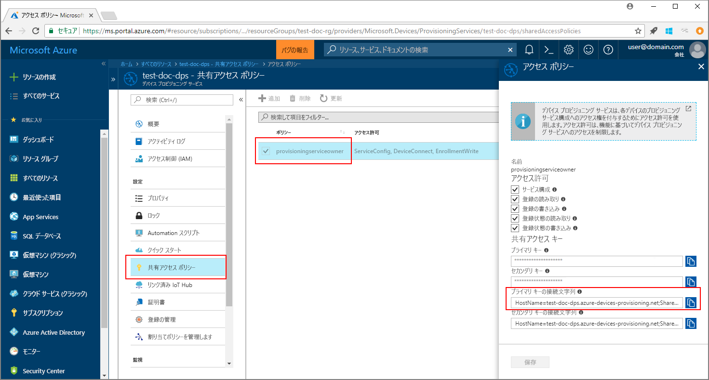
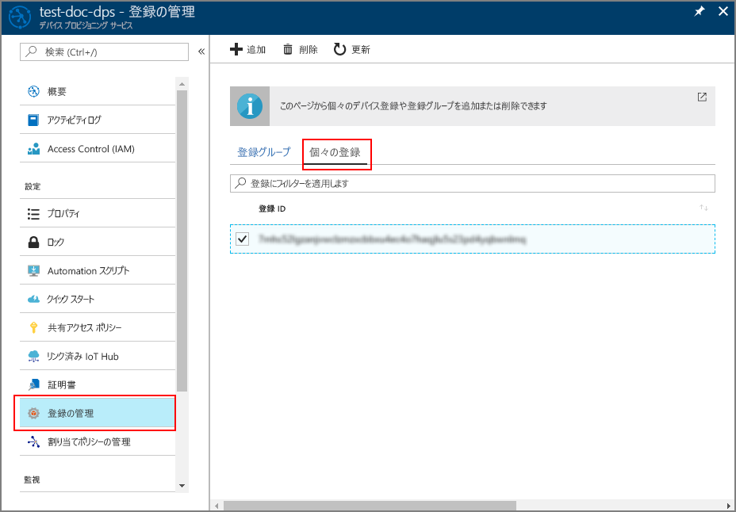

# <a name="enroll-tpm-device-to-iot-hub-device-provisioning-service-using-java-service-sdk"></a>Java Service SDK を使用して TPM デバイスを IoT Hub Device Provisioning Service に登録する

[!INCLUDE [iot-dps-selector-quick-enroll-device-tpm](../../includes/iot-dps-selector-quick-enroll-device-tpm.md)]


[Java Service SDK](https://azure.github.io/azure-iot-sdk-java/service/) とサンプル Java アプリケーションを利用して、シミュレートされた TPM デバイスを Azure IoT Hub Device Provisioning Service にプログラムで登録する方法について説明します。 Java Service SDK は Windows および Linux マシンの両方で動作しますが、この記事では、Windows 開発マシンを使用して登録プロセスの手順を説明します。

事前に、[Azure Portal での IoT Hub Device Provisioning Service の設定](./quick-setup-auto-provision.md)と [TPM デバイスのシミュレート](quick-create-simulated-device.md#simulatetpm)を済ませておいてください。

<a id="setupdevbox"></a>

## <a name="prepare-the-development-environment"></a>開発環境の準備 

1. [Java SE Development Kit 8](http://www.oracle.com/technetwork/java/javase/downloads/jdk8-downloads-2133151.html) がマシンにインストールされていることを確認します。 

2. Java インストールの環境変数を設定します。 `PATH` 変数には、*jdk1.8.x\bin* ディレクトリの完全なパスを含めます。 初めて Java をインストールするマシンの場合は、`JAVA_HOME` という新しい環境変数を作成し、*jdk1.8.x* ディレクトリの完全なパスに指定します。 通常、Windows マシンのこのディレクトリは、*C:\\Program Files\\Java\\* フォルダーにあるので、Windows マシンの **[コントロール パネル]** で **[システム環境変数の編集]** を探し、環境変数を作成または編集することができます。 

  コマンド ウィンドウで次のコマンドを実行して、マシンに Java が正常に設定されたことを確認できます。

    ```cmd\sh
    java -version
    ```

3. マシンに [Maven 3](https://maven.apache.org/download.cgi) をダウンロードして抽出します。 

4. Maven が抽出されたフォルダー内にある *apache-maven-3.x.x\\bin* フォルダーを指すように環境変数 `PATH` を編集します。 コマンド ウィンドウで次のコマンドを実行して、Maven が正常にインストールされたことを確認できます。

    ```cmd\sh
    mvn --version
    ```

5. [git](https://git-scm.com/download/) がマシンにインストールされ、環境変数 `PATH` に追加されていることを確認します。 


<a id="javasample"></a>

## <a name="download-and-modify-the-java-sample-code"></a>Java サンプル コードをダウンロードして変更する

ここでは、TPM デバイスのプロビジョニングの詳細をサンプル コードに追加する方法について説明します。 

1. コマンド プロンプトを開きます。 Java Service SDK を使用して、デバイス登録コード サンプルの GitHub リポジトリを複製します。
    
    ```cmd\sh
    git clone https://github.com/Azure/azure-iot-sdk-java.git --recursive
    ```

2. ダウンロードしたソース コードで、サンプル フォルダー **_azure-iot-sdk-java/provisioning/provisioning-samples/service-enrollment-sample_** に移動します。 任意のエディターでファイル **_/src/main/java/samples/com/microsoft/azure/sdk/iot/ServiceEnrollmentSample.java_** を開き、次の詳細を追加します。

    1. 次のように、ポータルからプロビジョニング サービスの `[Provisioning Connection String]` を追加します。
        1. [Azure Portal](https://portal.azure.com) でプロビジョニング サービスに移動します。 
        2. **[共有アクセス ポリシー]** を開き、*EnrollmentWrite* アクセス許可を持つポリシーを選択します。
        3. **主キーの接続文字列**をコピーします。 

              

        4. サンプル コード ファイル **_ServiceEnrollmentSample.java_** の `[Provisioning Connection String]` を**主キーの接続文字列**に置き換えます。
    
            ```Java
            private static final String PROVISIONING_CONNECTION_STRING = "[Provisioning Connection String]";
            ```

    2. TPM デバイスの詳細を追加します。
        1. 「[Simulate TPM device](quick-create-simulated-device.md#simulatetpm)」(TPM デバイスのシミュレート) に続く手順に従って、TPM デバイス シミュレーションの*登録 ID* と *TPM 保証キー*を取得します。
        2. 前の手順の出力の**_登録 ID_** と**_保証キー_** を使用し、サンプル コード ファイル **_ServiceEnrollmentSample.java_** の `[RegistrationId]` と `[TPM Endorsement Key]` を置き換えます。
        
            ```Java
            private static final String REGISTRATION_ID = "[RegistrationId]";
            private static final String TPM_ENDORSEMENT_KEY = "[TPM Endorsement Key]";
            ```

    3. 必要に応じて、サンプル コードでプロビジョニング サービスを構成することができます。
        - この構成をサンプルに追加するには、次の手順を実行します。
            1. [Azure Portal](https://portal.azure.com) でプロビジョニング サービスにリンクされている IoT Hub に移動します。 ハブの **[概要]** タブを開き、**[ホスト名]** をコピーします。 この **[ホスト名]** を *IOTHUB_HOST_NAME* パラメーターに割り当てます。
                ```Java
                private static final String IOTHUB_HOST_NAME = "[Host name].azure-devices.net";
                ```
            2. *DEVICE_ID* パラメーターにフレンドリ名を割り当て、*PROVISIONING_STATUS* を既定の *ENABLED* 値のままにします。 
    
        - または、プロビジョニング サービスを構成しない場合は、_ServiceEnrollmentSample.java_ ファイル内の次のステートメントをコメント アウトするか削除します。
            ```Java
            // The following parameters are optional. Remove it if you don't need.
            individualEnrollment.setDeviceId(DEVICE_ID);
            individualEnrollment.setIotHubHostName(IOTHUB_HOST_NAME);
            individualEnrollment.setProvisioningStatus(PROVISIONING_STATUS);
            ```

    4. サンプル コードの内容を確認します。 このコードでは、個々の TPM デバイス登録を作成、更新、照会、および削除しています。 ポータルで登録が成功したことを確認するには、_ServiceEnrollmentSample.java_ ファイルの末尾にある次のコード行を一時的にコメント アウトします。
    
        ```Java
        // *********************************** Delete info of individualEnrollment ************************************
        System.out.println("\nDelete the individualEnrollment...");
        provisioningServiceClient.deleteIndividualEnrollment(REGISTRATION_ID);
        ```

    5. ファイル _ServiceEnrollmentSample.java_ を保存します。

<a id="runjavasample"></a>

## <a name="build-and-run-the-java-sample-code"></a>Java サンプル コードをビルドして実行する

1. コマンド ウィンドウを開き、フォルダー **_azure-iot-sdk-java/provisioning/provisioning-samples/service-enrollment-sample_** に移動します。

2. 次のコマンドを使用して、サンプル コードをビルドします。

    ```cmd\sh
    mvn install -DskipTests
    ```

   このコマンドで、Maven パッケージ [`com.microsoft.azure.sdk.iot.provisioning.service`](https://www.mvnrepository.com/artifact/com.microsoft.azure.sdk.iot.provisioning/provisioning-service-client) がマシンにダウンロードされます。 このパッケージには、サンプル コードのビルドに必要な Java Service SDK のバイナリが含まれています。 

3. コマンド ウィンドウで次のコマンドを使用してサンプルを実行します。

    ```cmd\sh
    cd target
    java -jar ./service-enrollment-sample-{version}-with-deps.jar
    ```

4. 出力ウィンドウで、登録が正常に完了したことを確認します。 

5. Azure Portal でプロビジョニング サービスに移動します。 **[登録を管理します]** をクリックし、**[個々の登録]** タブを選択します。シミュレートされた TPM デバイスの*登録 ID* が一覧表示されます。 

      

## <a name="clean-up-resources"></a>リソースのクリーンアップ
Java Service のサンプルを調べる予定の場合は、このクイックスタートで作成したリソースをクリーンアップしないでください。 使用する予定がない場合は、次の手順を使用して、このクイックスタートで作成したすべてのリソースを削除してください。

1. マシンに表示されている Java サンプルの出力ウィンドウを閉じます。
1. TPM デバイスをシミュレートするために作成した TPM シミュレーター ウィンドウが表示されている場合は閉じます。
1. Azure Portal で [デバイス プロビジョニング サービス] に移動し、**[登録を管理します]** をクリックし、**[個々の登録]** タブを選択します。このクイックスタートで登録したデバイスの*登録 ID* を選択し、ブレードの上部の **[削除]** ボタンをクリックします。 

## <a name="next-steps"></a>次の手順
このクイックスタートでは、シミュレートされた TPM デバイスを Device Provisioning Service に登録しました。 Device Provisioning に関する理解をさらに深めるには、Azure Portal における Device Provisioning Service の設定に関するチュートリアルに進んでください。 

> [!div class="nextstepaction"]
> [Azure IoT Hub Device Provisioning Service のチュートリアル](./tutorial-set-up-cloud.md)
