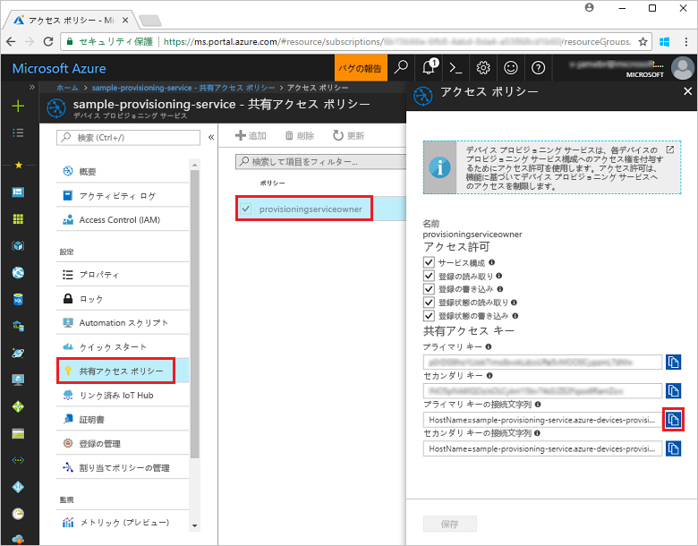
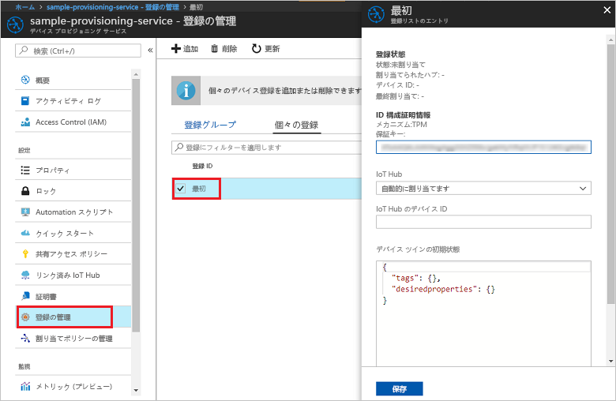

# <a name="enroll-tpm-device-to-iot-hub-device-provisioning-service-using-nodejs-service-sdk"></a>Node.js Service SDK を使用して TPM デバイスを IoT Hub Device Provisioning Service に登録する

[!INCLUDE [iot-dps-selector-quick-enroll-device-tpm](../../includes/iot-dps-selector-quick-enroll-device-tpm.md)]


[Node.js Service SDK](https://github.com/Azure/azure-iot-sdk-node) とサンプル Node.js アプリケーションを使用して、Azure IoT Hub Device Provisioning Service で TPM デバイスの個々の登録をプログラムで作成する方法について説明します。 必要に応じて、この個々の登録エントリを使用して、シミュレートされた TPM デバイスをプロビジョニング サービスに登録することができます。 これらの手順は Windows マシンと Linux マシンの両方に利用できますが、この記事では説明に Windows 開発マシンを使用します。

## <a name="prerequisites"></a>前提条件

- 事前に、[Azure Portal での IoT Hub Device Provisioning Service の設定](./quick-setup-auto-provision.md)に関するページの手順を済ませておいてください。 
-  マシンに [Node.js v4.0 以降](https://nodejs.org)がインストールされていることを確認します。
- このクイックスタートの最後にシミュレートされたデバイスを登録する場合は、デバイスの保証キーを取得する手順まで、[シミュレートされたデバイスの作成とプロビジョニング](quick-create-simulated-device.md)の手順に従います。 このクイックスタートの後の手順で使用するので、保証キーをメモします。 **Azure Portal を使用して個々の登録を作成する手順は実行しないでください。**
 
## <a name="create-the-individual-enrollment-sample"></a>個々の登録サンプルを作成する 

 
1. 作業フォルダーのコマンド ウィンドウから次のコマンドを実行します。
  
    ```cmd\sh
    npm install azure-iot-provisioning-service
    ```  

2. テキスト エディターを使用して、作業フォルダーに **create_individual_enrollment.js** ファイルを作成します。 次のコードをファイルに追加して保存します。

    ```
    'use strict';

    var provisioningServiceClient = require('azure-iot-provisioning-service').ProvisioningServiceClient;

    var serviceClient = provisioningServiceClient.fromConnectionString(process.argv[2]);
    var endorsementKey = process.argv[3];

    var enrollment = {
      registrationId: 'first',
      attestation: {
        type: 'tpm',
        tpm: {
          endorsementKey: endorsementKey
        }
      }
    };

    serviceClient.createOrUpdateIndividualEnrollment(enrollment, function(err, enrollmentResponse) {
      if (err) {
        console.log('error creating the individual enrollment: ' + err);
      } else {
        console.log("enrollment record returned: " + JSON.stringify(enrollmentResponse, null, 2));
      }
    });
    ````

## <a name="run-the-individual-enrollment-sample"></a>個々の登録サンプルを実行する
  
1. サンプルを実行するには、プロビジョニング サービスの接続文字列が必要です。 
    1. Azure Portal にログインし、左側のメニューの **[すべてのリソース]** をクリックして、Device Provisioning Service を開きます。 
    2. **共有アクセス ポリシー**をクリックし、プロパティを開くために使用するアクセス ポリシーをクリックします。 **[アクセス ポリシー]** ウィンドウで、主キーの接続文字列をコピーしてメモします。 

     


2. デバイスの保証キーも必要です。 [シミュレートされたデバイスの作成とプロビジョニング](quick-create-simulated-device.md)のクイックスタートに従ってシミュレートされた TPM デバイスを作成した場合は、そのデバイス用に作成されたキーを使用します。 それ以外の場合でサンプルの個々の登録を作成するには、SDK に付属している次の保証キーを使用できます。

    ```
    AToAAQALAAMAsgAgg3GXZ0SEs/gakMyNRqXXJP1S124GUgtk8qHaGzMUaaoABgCAAEMAEAgAAAAAAAEAxsj2gUScTk1UjuioeTlfGYZrrimExB+bScH75adUMRIi2UOMxG1kw4y+9RW/IVoMl4e620VxZad0ARX2gUqVjYO7KPVt3dyKhZS3dkcvfBisBhP1XH9B33VqHG9SHnbnQXdBUaCgKAfxome8UmBKfe+naTsE5fkvjb/do3/dD6l4sGBwFCnKRdln4XpM03zLpoHFao8zOwt8l/uP3qUIxmCYv9A7m69Ms+5/pCkTu/rK4mRDsfhZ0QLfbzVI6zQFOKF/rwsfBtFeWlWtcuJMKlXdD8TXWElTzgh7JS4qhFzreL0c1mI0GCj+Aws0usZh7dLIVPnlgZcBhgy1SSDQMQ==
    ```

3. TPM デバイスの個々の登録を作成するには、次のコマンドを実行します (コマンド引数は引用符で囲みます)。
 
     ```cmd\sh
     node create_individual_enrollment.js "<the connection string for your provisioning service>" "<endorsement key>"
     ```
 
3. 作成が正常に完了すると、コマンド ウィンドウに新しい個々の登録のプロパティが表示されます。

     

4. 個々の登録が作成されたことを確認します。 Azure Portal の Device Provisioning Service の概要ブレードで、**[登録を管理します]** を選択します。 **[個々の登録]** タブを選択し、新しい登録エントリ (*1 つ目*) をクリックして、エントリの保証キーと他のプロパティを確認します。

     
 
TPM デバイスの個々の登録を作成したので、シミュレートされたデバイスを登録する場合は、[シミュレートされたデバイスの作成とプロビジョニング](quick-create-simulated-device.md)に関するページに記載されている残りの手順を続行できます。 そのクイックスタートでは、Azure Portal を使用して個々の登録を作成する手順を実行しないでください。

## <a name="clean-up-resources"></a>リソースのクリーンアップ
Node.js Service のサンプルを調べる予定の場合は、このクイックスタートで作成したリソースをクリーンアップしないでください。 使用する予定がない場合は、次の手順を使用して、このクイックスタートで作成したすべてのリソースを削除してください。

1. マシンに表示されている Node.js サンプルの出力ウィンドウを閉じます。
1. シミュレートされた TPM デバイスを作成した場合は、TPM シミュレーター ウィンドウを閉じます。
2. Azure Portal で [デバイス プロビジョニング サービス] に移動し、**[登録を管理します]** をクリックし、**[個々の登録]** タブを選択します。このクイックスタートを使用して作成した登録エントリの*登録 ID* を選択し、ブレードの上部の **[削除]** ボタンをクリックします。 
 
## <a name="next-steps"></a>次の手順
このクイックスタートでは、TPM デバイスの個々の登録エントリをプログラムで作成し、TPM のシミュレートされたデバイスをマシンに作成し、Azure IoT Hub Device Provisioning Service を使って IoT ハブにプロビジョニングしました。 Device Provisioning に関する理解をさらに深めるには、Azure Portal における Device Provisioning Service の設定に関するチュートリアルに進んでください。 
 
> [!div class="nextstepaction"]
> [Azure IoT Hub Device Provisioning Service のチュートリアル](./tutorial-set-up-cloud.md)