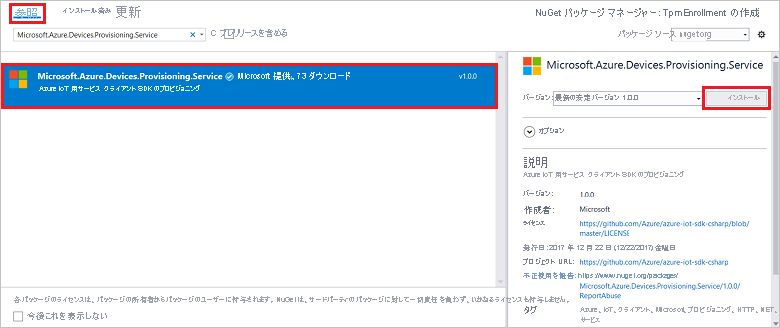

# <a name="quickstart-enroll-individual-device-to-iot-hub-device-provisioning-service-using-tpm-attestation"></a>クイック スタート: TPM 構成証明を使用して個々のデバイスを IoT Hub Device Provisioning Service に登録する

この記事では、[Microsoft Azure IoT SDK](../iot-hub/iot-hub-devguide-sdks.md) とサンプル アプリケーションを使用して、Azure IoT Hub Device Provisioning Service で TPM デバイスの個々の登録をプログラムで作成する方法について説明します。 必要に応じて、この個々の登録エントリを使用して、シミュレートされた TPM デバイスをプロビジョニング サービスに登録することができます。 

これらの手順は Windows コンピューターと Linux コンピューターの両方に利用できますが、この記事では Windows 開発コンピューターを使用します。

## <a name="prerequisites"></a>前提条件

[!INCLUDE [quickstarts-free-trial-note](../../includes/quickstarts-free-trial-note.md)]

* [Azure portal での IoT Hub Device Provisioning Service の設定](./quick-setup-auto-provision.md)に関するページの手順を完了します。

:::zone pivot="programming-language-csharp"

* [Visual Studio 2019](https://www.visualstudio.com/vs/) をインストールします。

* Windows ベースのマシンに [.NET Core 3.1 SDK 以降](https://dotnet.microsoft.com/download)をインストールします。 次のコマンドを使用してバージョンを確認してください。

    ```bash
    dotnet --info
    ```

* (省略可能) このクイック スタートの最後でシミュレートされたデバイスを登録する場合は、デバイスの保証キーを取得する手順まで、[シミュレートされた TPM デバイスの作成とプロビジョニング](quick-create-simulated-device-tpm.md)に関するページの手順に従います。 保証キー、登録 ID、(必要に応じて) デバイス ID を保存しておいてください。

:::zone-end

:::zone pivot="programming-language-nodejs"

* [Node.js v4.0+](https://nodejs.org) をインストールします。

* (省略可能) 保証キーを作成します。 このキーは、[シミュレートされたデバイスの作成とプロビジョニング](quick-create-simulated-device-tpm.md)に関するページの手順に従って取得します。

:::zone-end

:::zone pivot="programming-language-python"

* [Python 2.x または 3.x](https://www.python.org/downloads/) をダウンロードしてインストールします。 必ず、セットアップに必要な 32 ビットまたは 64 ビットのインストールを使用してください。 インストール中に求められた場合は、プラットフォーム固有の環境変数に Python を追加します。 

* [Pip](https://pip.pypa.io/en/stable/installing/) が Python のディストリビューションに含まれていない場合はインストールします。

> [!IMPORTANT]
> この記事は、非推奨となっている V1 Python SDK にのみ適用されます。 V2 では、Iot Hub Device Provisioning Service 用のデバイス クライアントとサービス クライアントはまだ利用できません。 チームは現在、V2 を機能パリティに移行する作業に取り組んでいます。

:::zone-end

:::zone pivot="programming-language-java"

* [Java SE Development Kit 8](/azure/developer/java/fundamentals/java-support-on-azure) をインストールします。 このクイックスタートの中で、後から [Java Service SDK](https://azure.github.io/azure-iot-sdk-java/master/service/) をインストールします。 Windows と Linux のどちらでも使用できます。 このクイックスタートでは Windows を使用します。

* [Maven 3](https://maven.apache.org/download.cgi) のインストール。

* [Git](https://git-scm.com/download/) をインストールし、パスが環境変数 `PATH` に追加されていることを確認します。


:::zone-end

> [!NOTE]
> Azure portal を使用して個々の登録を作成する手順は行わないでください。


:::zone pivot="programming-language-python"

<a id="prepareenvironment"></a>

## <a name="prepare-the-development-environment"></a>開発環境の準備

* [Python Provisioning Service SDK](https://github.com/Azure/azure-iot-sdk-python/tree/v1-deprecated/provisioning_service_client) をダウンロードしてインストールするには、次のいずれかの方法を選択します。
    
    - **Azure IoT Python SDK** をビルドしてコンパイルします。 [これらの手順](https://github.com/Azure/azure-iot-sdk-python/blob/v1-deprecated/doc/python-devbox-setup.md)に従って、Python パッケージをビルドします。 Windows OS を使用している場合は、Python からネイティブ DLL を使用できるように、[Visual C++ 再配布可能パッケージ](https://support.microsoft.com/help/2977003/the-latest-supported-visual-c-downloads)もインストールします。
    
    - [Python パッケージ管理システムである *pip* をインストールまたはアップグレードし](https://pip.pypa.io/en/stable/installing/)、次のコマンドを使用してパッケージをインストールします。
        
        ```cmd/sh
        pip install azure-iothub-provisioningserviceclient
        ```

### <a name="copy-symmetric-and-tpm-enrollment-keys"></a>対称キーと TPM 登録キーのコピー

このクイック スタートでは、対称キーと TPM 登録の両方について説明します。 独自のテスト キーを作成するか、指定されたテスト キーを使用する必要があります。
 
# <a name="symmetric-key"></a>[対称キー](#tab/symmetrickey)

シミュレートされた対称キーをデバイスに登録するには、デバイスの主キーとセカンダリ キーが必要です。 有効な対称キーをお持ちでない場合は、この例では次のテスト キーを使用できます。

*プライマリ対称キー*

```
UmorGiEVPNIQuaWGXXbe8v9gWayS7XtOZmNMo6DEaEXP65GvhuK3OeRf8RVZ9BymBCHxNg3oRTey0pUHUwwYKQ==
```

*セカンダリー対称キー*

```
Zx8/eE7PUBmnouB1qlNQxI7fcQ2HbJX+y96F1uCVQvDj88jFL+q6L9YWLLi4jqTmkRPOulHlSbSv2uFgj4vKtw==
```

# <a name="tpm"></a>[TPM](#tab/tpm)

TPM 登録の場合は、デバイスの保証キーが必要です。 [シミュレートされたデバイスの作成とプロビジョニング](quick-create-simulated-device-tpm.md)のクイックスタートに従ってシミュレートされた TPM デバイスを作成した場合は、そのデバイス用に作成されたキーを使用します。 それ以外の場合は、SDK に付属している次の保証キーを使用できます。

```
AToAAQALAAMAsgAgg3GXZ0SEs/gakMyNRqXXJP1S124GUgtk8qHaGzMUaaoABgCAAEMAEAgAAAAAAAEAtW6MOyCu/Nih47atIIoZtlYkhLeCTiSrtRN3q6hqgOllA979No4BOcDWF90OyzJvjQknMfXS/Dx/IJIBnORgCg1YX/j4EEtO7Ase29Xd63HjvG8M94+u2XINu79rkTxeueqW7gPeRZQPnl1xYmqawYcyzJS6GKWKdoIdS+UWu6bJr58V3xwvOQI4NibXKD7htvz07jLItWTFhsWnTdZbJ7PnmfCa2vbRH/9pZIow+CcAL9mNTNNN4FdzYwapNVO+6SY/W4XU0Q+dLMCKYarqVNH5GzAWDfKT8nKzg69yQejJM8oeUWag/8odWOfbszA+iFjw3wVNrA5n8grUieRkPQ==
```

---

:::zone-end


:::zone pivot="programming-language-java"

<a id="setupdevbox"></a>

## <a name="prepare-the-development-environment"></a>開発環境の準備 

### <a name="set-up-environment-variables"></a>環境変数を設定する

環境変数を設定するには:

1. `PATH` 変数には、*jdk1.8.x\bin* ディレクトリの完全なパスを含めます。 初めて Java をインストールするマシンの場合は、`JAVA_HOME` という新しい環境変数を作成し、*jdk1.8.x* ディレクトリの完全なパスに指定します。 Windows マシンでは、このディレクトリは *C:\\Program Files\\Java\\* フォルダーにあります。Windows マシンの **[コントロール パネル]** で **[システム環境変数の編集]** を探し、環境変数を作成または編集することができます。

    コマンド ウィンドウで次のコマンドを実行して、マシンに Java が正常に設定されたことを確認できます。

    ```cmd\sh
    java -version
    ```

2. Maven が抽出されたフォルダー内にある *apache-maven-3.x.x\\bin* フォルダーを指すように環境変数 `PATH` を編集します。 コマンド ウィンドウで次のコマンドを実行して、Maven が正常にインストールされたことを確認できます。

    ```cmd\sh
    mvn --version
    ```

3. [git](https://git-scm.com/download/) がマシンにインストールされ、環境変数 `PATH` に追加されていることを確認します。

### <a name="clone-git-repository-for-azure-iot-java-sdk"></a>Azure IoT Java SDK 用の Git リポジトリのクローン

Azure IoT Java SDK をクローンするには:

1. コマンド プロンプトを開きます。 

2. [Java Service SDK](https://azure.github.io/azure-iot-sdk-java/master/service/) を使用して、デバイス登録コード サンプルの GitHub リポジトリを複製します。

    ```cmd\sh
    git clone https://github.com/Azure/azure-iot-sdk-java.git --recursive
    ```

:::zone-end

## <a name="get-the-connection-string-for-your-provisioning-service"></a>プロビジョニング サービスの接続文字列を取得する

このクイック スタートのサンプルでは、プロビジョニング サービスの接続文字列をコピーする必要があります。

1. [Azure portal](https://portal.azure.com) にサインインします。

2. 左側のメニューまたはポータル ページで **[すべてのリソース]** を選択します。

3. Device Provisioning Service を選択します。

4. **[設定]** メニューから、 **[共有アクセス ポリシー]** を選択します。

5. 使用するアクセス ポリシーを選択します。

6. **[アクセス ポリシー]** パネルで、主キーの接続文字列をコピーして保存します。

    :::image type="content" source="./media/quick-enroll-device-tpm/get-service-connection-string.png" alt-text="ポータルからプロビジョニング サービスの接続文字列を取得します。":::

## <a name="create-the-individual-enrollment-sample"></a>個々の登録サンプルを作成する

:::zone pivot="programming-language-csharp"

このセクションでは、TPM デバイスの個々の登録をご利用のプロビジョニング サービスに追加する .NET Core コンソール アプリを作成する方法について説明します。 これらの手順を一部変更して実行し、個々の登録を追加する [Windows IoT Core](https://developer.microsoft.com/en-us/windows/iot) コンソール アプリを作成することもできます。 IoT Core での開発の詳細については、[Windows IoT Core の開発者ドキュメント](/windows/iot-core/)に関するページを参照してください。

1. Visual Studio を開き、 **[新しいプロジェクトの作成]** を選択します。

2. **[新しいプロジェクトの作成]** パネルで、* *[コンソール アプリケーション]* を選択します。

3. **[次へ]** を選択します。

4. **[プロジェクト名]** に、「*CreateEnrollmentGroup*」と入力します。

5. **[次へ]** を選択します。 既定の **[ターゲット フレームワーク]** のままにします。

6. **［作成］** を選択します

7. ソリューションが開いたら、 **[ソリューション エクスプローラー]** ウィンドウで **CreateEnrollmentGroup** プロジェクトを右クリックし、 **[NuGet パッケージの管理]** を選択します。

8. **NuGet パッケージ マネージャー** で、 **[参照]** を選択します。

9. 「*Microsoft.Azure.Devices.Provisioning.Service*」と入力し、選択します。

10. **[インストール]** を選択します。

    

    この手順では、ダウンロードとインストールが行われ、[Azure IoT Provisioning Service クライアント SDK](https://www.nuget.org/packages/Microsoft.Azure.Devices.Provisioning.Service/) NuGet パッケージへの参照とその依存関係が追加されます。

11. 次の `using` ステートメントを、`Program.cs` の先頭にある他の `using` ステートメントの後ろに追加します。
  
    ```csharp
    using System.Threading.Tasks;
    using Microsoft.Azure.Devices.Provisioning.Service;
    ```

12. `Program` クラスに次のフィールドを追加し、一覧された変更を行います。  

    ```csharp
    private static string ProvisioningConnectionString = "{ProvisioningServiceConnectionString}";
    private const string RegistrationId = "sample-registrationid-csharp";
    private const string TpmEndorsementKey =
        "AToAAQALAAMAsgAgg3GXZ0SEs/gakMyNRqXXJP1S124GUgtk8qHaGzMUaaoABgCAAEMAEAgAAAAAAAEAxsj2gUS" +
        "cTk1UjuioeTlfGYZrrimExB+bScH75adUMRIi2UOMxG1kw4y+9RW/IVoMl4e620VxZad0ARX2gUqVjYO7KPVt3d" +
        "yKhZS3dkcvfBisBhP1XH9B33VqHG9SHnbnQXdBUaCgKAfxome8UmBKfe+naTsE5fkvjb/do3/dD6l4sGBwFCnKR" +
        "dln4XpM03zLpoHFao8zOwt8l/uP3qUIxmCYv9A7m69Ms+5/pCkTu/rK4mRDsfhZ0QLfbzVI6zQFOKF/rwsfBtFe" +
        "WlWtcuJMKlXdD8TXWElTzgh7JS4qhFzreL0c1mI0GCj+Aws0usZh7dLIVPnlgZcBhgy1SSDQMQ==";
        
    // Optional parameters
    private const string OptionalDeviceId = "myCSharpDevice";
    private const ProvisioningStatus OptionalProvisioningStatus = ProvisioningStatus.Enabled;
    ```

13. `ProvisioningServiceConnectionString` プレースホルダーの値を、前のセクションでコピーしたプロビジョニング サービスの接続文字列に置き換えます。

14. このクイック スタートと共に、[シミュレートされた TPM デバイスの作成とプロビジョニング](quick-create-simulated-device-tpm.md)に関するクイック スタートを使用している場合は、そのクイック スタートでメモした値で保証キーと登録 ID を置き換えてください。 デバイス ID は、このクイックスタートで推奨される値に置き換えることができます。または、独自の値を使用したり、このサンプルの既定値を使用したりできます。

15. `Program` クラスに次のメソッドを追加します。  このコードでは、個々の登録エントリを作成してから、`ProvisioningServiceClient` 上で `CreateOrUpdateIndividualEnrollmentAsync` メソッドを呼び出して、個々の登録をプロビジョニング サービスに追加します。

    ```csharp
    public static async Task RunSample()
    {
        Console.WriteLine("Starting sample...");
    
        using (ProvisioningServiceClient provisioningServiceClient =
                ProvisioningServiceClient.CreateFromConnectionString(ProvisioningConnectionString))
        {
            #region Create a new individualEnrollment config
            Console.WriteLine("\nCreating a new individualEnrollment...");
            Attestation attestation = new TpmAttestation(TpmEndorsementKey);
            IndividualEnrollment individualEnrollment =
                    new IndividualEnrollment(
                            RegistrationId,
                            attestation);
    
            // The following parameters are optional. Remove them if you don't need them.
            individualEnrollment.DeviceId = OptionalDeviceId;
            individualEnrollment.ProvisioningStatus = OptionalProvisioningStatus;
            #endregion
    
            #region Create the individualEnrollment
            Console.WriteLine("\nAdding new individualEnrollment...");
            IndividualEnrollment individualEnrollmentResult =
                await provisioningServiceClient.CreateOrUpdateIndividualEnrollmentAsync(individualEnrollment).ConfigureAwait(false);
            Console.WriteLine("\nIndividualEnrollment created with success.");
            Console.WriteLine(individualEnrollmentResult);
            #endregion
        
        }
    }
    ```

16. 最後に、`Main` メソッドを次の行に置き換えます。

    ```csharp
    static async Task Main(string[] args)
    {
        await RunSample();
        Console.WriteLine("\nHit <Enter> to exit ...");
        Console.ReadLine();
    }
    ```

17. ソリューションをビルドします。

:::zone-end

:::zone pivot="programming-language-nodejs"

1. 作業フォルダーのコマンド ウィンドウから次のコマンドを実行します。
  
    ```cmd\sh
    npm install azure-iot-provisioning-service
    ```  

2. テキスト エディターを使用して、作業フォルダーに _create_individual_enrollment.js_ ファイルを作成します。 次のコードをファイルに追加します。

    ```Java
    'use strict';

    var provisioningServiceClient = require('azure-iot-provisioning-service').ProvisioningServiceClient;

    var serviceClient = provisioningServiceClient.fromConnectionString(process.argv[2]);
    var endorsementKey = process.argv[3];

    var enrollment = {
      registrationId: 'first',
      attestation: {
        type: 'tpm',
        tpm: {
          endorsementKey: endorsementKey
        }
      }
    };

    serviceClient.createOrUpdateIndividualEnrollment(enrollment, function(err, enrollmentResponse) {
      if (err) {
        console.log('error creating the individual enrollment: ' + err);
      } else {
        console.log("enrollment record returned: " + JSON.stringify(enrollmentResponse, null, 2));
      }
    });
    ```

3. ファイルを保存します。

:::zone-end

:::zone pivot="programming-language-python"

1. テキスト エディターを使用して、新しい *Enrollment.py* ファイルを作成します。

2. *Enrollment.py* ファイルの先頭に次の `import` ステートメントと変数を追加します (`{dpsConnectionString}` を以前にコピーした接続文字列に置き換え、証明書プレースホルダーを「[対称キーと TPM 登録キーのコピー](#copy-symmetric-and-tpm-enrollment-keys)」で作成した証明書に置き換え、`{registrationid}` を小文字とハイフンのみから構成される一意の `registrationid` に置き換えます)。


    # <a name="symmetric-key"></a>[対称キー](#tab/symmetrickey)

    ```python
    from provisioningserviceclient import ProvisioningServiceClient
    from provisioningserviceclient.models import IndividualEnrollment, AttestationMechanism
    from provisioningserviceclient.protocol.models import SymmetricKeyAttestation

    CONNECTION_STRING = "Enter your DPS connection string"
    PRIMARY_KEY = "Add a valid key"
    SECONDARY_KEY = "Add a valid key"
    REGISTRATION_ID = "Enter a registration ID"
    ```

    # <a name="tpm"></a>[TPM](#tab/tpm)
   
    ```python
    from provisioningserviceclient import ProvisioningServiceClient
    from provisioningserviceclient.models import IndividualEnrollment, AttestationMechanism

    CONNECTION_STRING = "Enter your DPS connection string"
    ENDORSEMENT_KEY = "Enter the endorsement key for your device"
    REGISTRATION_ID = "Enter a registration ID"
    ```

    ---

3. 次の Python コードを追加して、個々の登録の作成を実装します。

     # <a name="symmetric-key"></a>[対称キー](#tab/symmetrickey)

    ```python
    def main():
        print ( "Starting individual enrollment..." )
    
        psc = ProvisioningServiceClient.create_from_connection_string(CONNECTION_STRING)
    
        symAtt = SymmetricKeyAttestation(primary_key=PRIMARY_KEY, secondary_key=SECONDARY_KEY)
        att = AttestationMechanism(type="symmetricKey", symmetric_key=symAtt)
        ie = IndividualEnrollment.create(REGISTRATION_ID, att)
    
        ie = psc.create_or_update(ie)
    
        print ( "Individual enrollment successful." )
    
    if __name__ == '__main__':
        main()
    ```

    # <a name="tpm"></a>[TPM](#tab/tpm)

    ```python
    def main():
        print ( "Starting individual enrollment..." )
    
        psc = ProvisioningServiceClient.create_from_connection_string(CONNECTION_STRING)
    
        att = AttestationMechanism.create_with_tpm(ENDORSEMENT_KEY)
        ie = IndividualEnrollment.create(REGISTRATION_ID, att)
    
        ie = psc.create_or_update(ie)
    
        print ( "Individual enrollment successful." )
    
    if __name__ == '__main__':
        main()
    ```

    ---

4. *Enrollment.py* ファイルを保存して閉じます。

:::zone-end

:::zone pivot="programming-language-java"

1. ダウンロードしたソース コードで、サンプル フォルダー *_azure-iot-sdk-java/provisioning/provisioning-samples/service-enrollment-sample_* に移動します。 ファイル *_/src/main/java/samples/com/microsoft/azure/sdk/iot/ServiceEnrollmentSample.java_* を開きます。

2. `[Provisioning Connection String]` を、「[プロビジョニング サービスの接続文字列を取得する](#get-the-connection-string-for-your-provisioning-service)」でコピーしておいた接続文字列に置き換えます。

    ```Java
    private static final String PROVISIONING_CONNECTION_STRING = "[Provisioning Connection String]";
    ```

   2. TPM デバイスの詳細を追加します。
       1. 「[Simulate TPM device](quick-create-simulated-device-tpm.md#simulatetpm)」(TPM デバイスのシミュレート) に続く手順に従って、TPM デバイス シミュレーションの *登録 ID* と *TPM 保証キー* を取得します。
       2. 前の手順の出力の **_登録 ID_** と **_保証キー_** を使用し、サンプル コード ファイル **_ServiceEnrollmentSample.java_** の `[RegistrationId]` と `[TPM Endorsement Key]` を置き換えます。
    
           ```Java
           private static final String REGISTRATION_ID = "[RegistrationId]";
           private static final String TPM_ENDORSEMENT_KEY = "[TPM Endorsement Key]";
           ```

3. サンプル コード内からプロビジョニング サービスを構成するには、次の手順に進みます。 それを構成しない場合は、_ServiceEnrollmentSample.java_ ファイル内の次のステートメントをコメント アウトするか削除してください。

    ```Java
    / / The following parameters are optional. Remove it if you don't need.
    individualEnrollment.setDeviceId(DEVICE_ID);
    individualEnrollment.setIotHubHostName(IOTHUB_HOST_NAME);
    individualEnrollment.setProvisioningStatus(PROVISIONING_STATUS);
    ```

4. この手順では、サンプル コードでプロビジョニング サービスを構成する方法について説明します。

    1. [Azure ポータル](https://portal.azure.com)にアクセスします。

    2. 左側のメニューまたはポータル ページで **[すべてのリソース]** を選択します。

    3. Device Provisioning Service を選択します。

    4. **[概要]** パネルで、 *サービス エンドポイント* のホスト名をコピーします。  ソース コード サンプルで、`[Host name]` をコピーしたホスト名に置き換えます。

    ```Java
    private static final String IOTHUB_HOST_NAME = "[Host name].azure-devices.net";
    ```

5. サンプル コードの内容を確認します。 このコードでは、個々の TPM デバイス登録を作成、更新、照会、および削除しています。 ポータルで登録が成功したことを確認するには、_ServiceEnrollmentSample.java_ ファイルの末尾にある次のコード行を一時的にコメント アウトします。

    ```Java
    // *********************************** Delete info of individualEnrollment ************************************
    System.out.println("\nDelete the individualEnrollment...");
    provisioningServiceClient.deleteIndividualEnrollment(REGISTRATION_ID);
    ```

6. ファイル _ServiceEnrollmentSample.java_ を保存します。

:::zone-end

## <a name="run-the-individual-enrollment-sample"></a>個々の登録サンプルを実行する

:::zone pivot="programming-language-csharp"

1. Visual Studio でサンプルを実行して登録を作成します。 コマンド ウィンドウが表示され、確認メッセージが表示されます。

2. 作成が正常に完了すると、コマンド ウィンドウに新しい登録のプロパティが表示されます。

:::zone-end

:::zone pivot="programming-language-nodejs"

サンプルを実行するには、前のセクションでコピーしたプロビジョニング サービスの接続文字列のほか、デバイスの保証キーが必要です。 [シミュレートされたデバイスの作成とプロビジョニング](quick-create-simulated-device-tpm.md)のクイック スタートに従ってシミュレートされた TPM デバイスを作成した場合は、そのデバイス用に作成されたキーを使用します。 それ以外の場合でサンプルの個別登録を作成するには、[Node.js Service SDK](https://github.com/Azure/azure-iot-sdk-node) に付属している次の保証キーを使用できます。

```bash
AToAAQALAAMAsgAgg3GXZ0SEs/gakMyNRqXXJP1S124GUgtk8qHaGzMUaaoABgCAAEMAEAgAAAAAAAEAxsj2gUScTk1UjuioeTlfGYZrrimExB+bScH75adUMRIi2UOMxG1kw4y+9RW/IVoMl4e620VxZad0ARX2gUqVjYO7KPVt3dyKhZS3dkcvfBisBhP1XH9B33VqHG9SHnbnQXdBUaCgKAfxome8UmBKfe+naTsE5fkvjb/do3/dD6l4sGBwFCnKRdln4XpM03zLpoHFao8zOwt8l/uP3qUIxmCYv9A7m69Ms+5/pCkTu/rK4mRDsfhZ0QLfbzVI6zQFOKF/rwsfBtFeWlWtcuJMKlXdD8TXWElTzgh7JS4qhFzreL0c1mI0GCj+Aws0usZh7dLIVPnlgZcBhgy1SSDQMQ==
```

1. TPM デバイスの個々の登録を作成するには、次のコマンドを実行します (コマンド引数は引用符で囲みます)。

     ```cmd\sh
     node create_individual_enrollment.js "<the connection string for your provisioning service>" "<endorsement key>"
     ```

2. 作成が正常に完了すると、コマンド ウィンドウに新しい登録のプロパティが表示されます。

:::zone-end

:::zone pivot="programming-language-python"

1. コマンド プロンプトを開いて、次のスクリプトを実行します。

    ```cmd/sh
    python Enrollment.py
    ```

2. 作成が正常に完了すると、コマンド ウィンドウに新しい登録のプロパティが表示されます。

:::zone-end

:::zone pivot="programming-language-java"

1. 管理者モードでコマンド ウィンドウを開き、フォルダー *_azure-iot-sdk-java/provisioning/provisioning-samples/service-enrollment-group-sample_* に移動します。

2. コマンド プロンプトで、このコマンドを実行します。

    ```cmd\sh
    mvn install -DskipTests
    ```

    このコマンドで、Maven パッケージ [`com.microsoft.azure.sdk.iot.provisioning.service`](https://mvnrepository.com/artifact/com.microsoft.azure.sdk.iot.provisioning/provisioning-service-client) がマシンにダウンロードされます。 このパッケージには、サンプル コードのビルドに必要な Java Service SDK のバイナリが含まれています。 前のセクションで _X.509 証明書ジェネレーター_ を実行した場合、このパッケージは既にマシンにダウンロードされています。

3. コマンド プロンプトで、スクリプトを実行します。

    ```cmd\sh
    cd target
    java -jar ./service-enrollment-group-sample-{version}-with-deps.jar
    ```

4. 作成が正常に完了すると、コマンド ウィンドウに新しい登録のプロパティが表示されます。


:::zone-end

登録グループが作成されていることを確認するには:

1. Azure portal で Device Provisioning Service を選択します。

2. **[設定]** メニューで **[登録の管理]** を選択します。

3. **[個別の登録]** を選択します。 サンプルで使用した登録 ID に対応する新しい登録エントリが表示されます。

:::zone pivot="programming-language-csharp"

:::image type="content" source="./media/quick-enroll-device-tpm/verify-enrollment-csharp.png" alt-text="ポータルで、C# の個々のデバイスの登録を確認します。":::

:::zone-end

:::zone pivot="programming-language-nodejs"

:::image type="content" source="./media/quick-enroll-device-tpm/verify-enrollment-nodejs.png" alt-text="ポータルで、Node.js の個々のデバイスの登録を確認します。":::

:::zone-end

:::zone pivot="programming-language-python"

:::image type="content" source="./media/quick-enroll-device-tpm/verify-enrollment-python.png" alt-text="ポータルで、Python の個々のデバイスの登録を確認します。":::

:::zone-end

:::zone pivot="programming-language-java"

:::image type="content" source="./media/quick-enroll-device-tpm/verify-enrollment-java.png" alt-text="ポータルで、Java の個々のデバイスの登録を確認します。":::

:::zone-end


## <a name="clean-up-resources"></a>リソースをクリーンアップする

[Azure IoT Hub Device Provisioning Service のチュートリアル](./tutorial-set-up-cloud.md)を調べる予定がある場合は、このクイック スタートで作成したリソースをクリーンアップしないでください。 それ以外の場合は、次の手順を使用して、このクイックスタートで作成したすべてのリソースを削除してください。

1. コンピューター上のサンプル出力ウィンドウを閉じます。

2. Azure portal の左側のメニューから **[すべてのリソース]** を選択します。

3. Device Provisioning Service を選択します。

4. **[設定]** メニューで **[登録の管理]** を選択します。

5. **[個別の登録]** タブを選択します。

6. このクイック スタートで登録したデバイスの *登録 ID* の横にあるチェック ボックスをオンにします。

7. ページの上部で **[削除]** を選択します。

8. Azure portal の Device Provisioning Service から、 **[証明書]** を選択します。

9. このクイック スタートでアップロードした証明書を選択します。

10. **[証明書の詳細]** の上部で、 **[削除]** を選択します。  

11. [シミュレートされた TPM デバイスの作成とプロビジョニング](quick-create-simulated-device-tpm.md)に関するページの手順に従って、シミュレートされた TPM デバイスを作成した場合は、次の手順に従います。

    1. TPM シミュレーター ウィンドウと、シミュレートされたデバイスのサンプル出力ウィンドウを閉じます。

    2. Azure Portal で、デバイスがプロビジョニングされた IoT ハブに移動します。 

    3. メニューの **[エクスプローラー]** で、 **[IoT デバイス]** を選択します。

    4. このクイック スタートで登録したデバイスの *デバイス ID* の横にあるチェック ボックスをオンにします。

    5. ウィンドウの上部にある **[削除]** を選択します。

## <a name="next-steps"></a>次のステップ

このクイックスタートでは、TPM デバイスの個々の登録エントリをプログラムで作成しました。 必要に応じて、TPM のシミュレートされたデバイスをご利用のコンピューター上に作成し、それを Azure IoT Hub Device Provisioning Service を使用して IoT ハブにプロビジョニングしました。 Device Provisioning に関する理解をさらに深めるには、Azure Portal における Device Provisioning Service の設定に関するチュートリアルに進んでください。

> [!div class="nextstepaction"]
> [Azure IoT Hub Device Provisioning Service のチュートリアル](./tutorial-set-up-cloud.md)