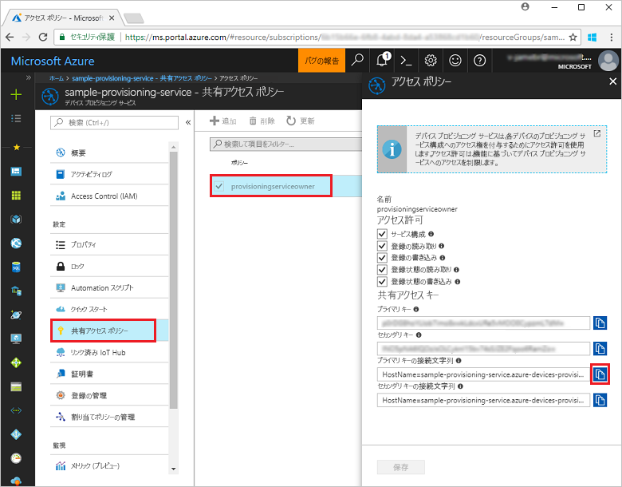
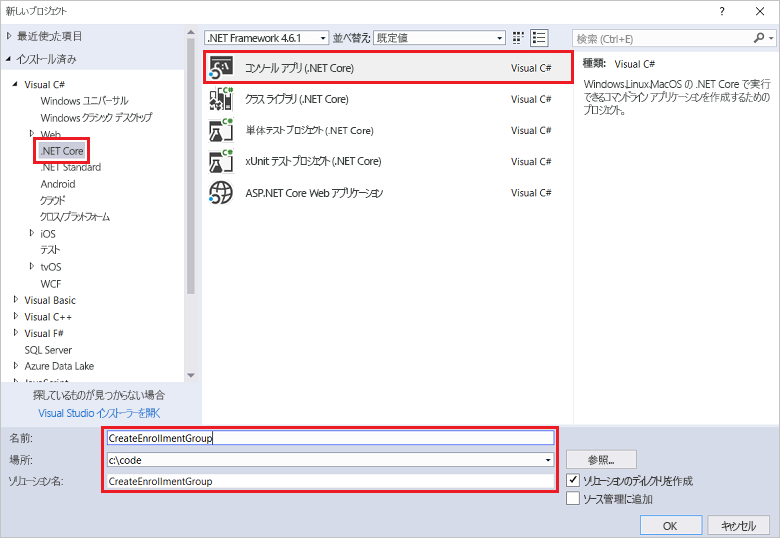
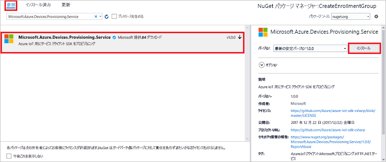
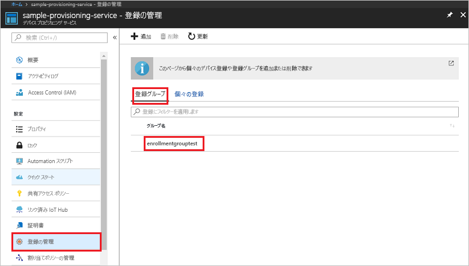

# <a name="quickstart-enroll-x509-devices-to-the-device-provisioning-service-using-c"></a>クイック スタート: C# を使用して X.509 デバイスを Device Provisioning Service に登録する

[!INCLUDE [iot-dps-selector-quick-enroll-device-x509](../../includes/iot-dps-selector-quick-enroll-device-x509.md)]


このクイック スタートは、C# を使用して中間またはルートの CA の X.509 証明書を使用する[登録グループ](concepts-service.md#enrollment-group)をプログラムで作成する方法を示します。 登録グループは、[Microsoft Azure IoT SDK for .NET](https://github.com/Azure/azure-iot-sdk-csharp) と C# .NET Core のサンプル アプリケーションを使用して作成されます。 登録グループでは、証明書チェーン内の共通の署名証明書を共有するデバイスに関してプロビジョニング サービスへのアクセスを制御します。 詳細については、「[X.509 証明書を使用してプロビジョニング サービスへのデバイスのアクセスを制御する](./concepts-security.md#controlling-device-access-to-the-provisioning-service-with-x509-certificates)」を参照してください。 Azure IoT Hub と Device Provisioning Service と共に X.509 証明書ベースの公開キー基盤 (PKI) を使用する方法について詳しくは、[X.509 CA 証明書セキュリティの概要](https://docs.microsoft.com/azure/iot-hub/iot-hub-x509ca-overview)に関するページを参照してください。 

このクイック スタートでは、IoT ハブと Device Provisioning Service インスタンスを既に作成していることを前提としています。 これらのリソースをまだ作成していない場合は、この記事を進める前に「[Azure portal で IoT Hub Device Provisioning Service を設定する](./quick-setup-auto-provision.md)」のクイック スタートを完了してください。

この記事の手順は Windows マシンと Linux マシンの両方に利用できますが、この記事は Windows 開発マシン用に作成されています。

[!INCLUDE [quickstarts-free-trial-note](../../includes/quickstarts-free-trial-note.md)]


## <a name="prerequisites"></a>前提条件

* [Visual Studio 2017](https://www.visualstudio.com/vs/) のインストール。
* [.Net Core SDK](https://www.microsoft.com/net/download/windows) のインストール。
* [Git](https://git-scm.com/download/) のインストール。


## <a name="prepare-test-certificates"></a>テスト証明書を準備する

このクイック スタートでは、中間またはルートの CA の X.509 証明書の公開部分が含まれる .pem ファイルまたは .cer が必要です。 この証明書はプロビジョニング サービスにアップロードされ、サービスによって検証される必要があります。 

[Azure IoT C SDK](https://github.com/Azure/azure-iot-sdk-c) には、X.509 証明書チェーンを作成し、そのチェーンからルートまたは中間証明書をアップロードし、サービスで所有証明を実行して証明書を検証するために役立つテスト ツールが含まれています。 SDK ツールで作成される証明書は、**開発テストにのみ**使用するよう設計されています。 これらの証明書は**運用環境では使用しないでください**。 30 日後に有効期限が切れるハード コーディングされたパスワード ("1234") が含まれます。 運用環境での使用に適した証明書の取得について詳しくは、Azure IoT Hub ドキュメントの「[X.509 CA 証明書の入手方法](https://docs.microsoft.com/azure/iot-hub/iot-hub-x509ca-overview#how-to-get-an-x509-ca-certificate)」をご覧ください。

このテスト ツールを使用して証明書を生成するには、次の手順を実行します。 
 
1. コマンド プロンプトまたは Git Bash シェルを開き、お使いのコンピューターの作業フォルダーに変更します。 次のコマンドを実行して、[Azure IoT C SDK](https://github.com/Azure/azure-iot-sdk-c) の GitHub リポジトリを複製します。
    
  ```cmd/sh
  git clone https://github.com/Azure/azure-iot-sdk-c.git --recursive
  ```

  このリポジトリのサイズは現在約 220 MB です。 この操作は、完了するまでに数分かかります。

  テスト ツールは複製したリポジトリの *azure-iot-sdk-c/tools/CACertificates* にあります。    

2. 「[Managing test CA certificates for samples and tutorials](https://github.com/Azure/azure-iot-sdk-c/blob/master/tools/CACertificates/CACertificateOverview.md)」(サンプルおよびチュートリアルのためのテスト用 CA 証明書の管理) の手順に従います。 

C SDK のツールに加えて、*Microsoft Azure IoT SDK for .NET* に含まれている[グループ証明書の検証のサンプル](https://github.com/Azure/azure-iot-sdk-csharp/tree/master/provisioning/service/samples/GroupCertificateVerificationSample)では、既存の X.509 中間またはルート CA 証明書で C# の所有証明を実行する方法について説明されています。 


## <a name="get-the-connection-string-for-your-provisioning-service"></a>プロビジョニング サービスの接続文字列を取得する

このクイック スタートのサンプルには、プロビジョニング サービスの接続文字列が必要です。
1. Azure portal にサインインし、左側のメニューの **[すべてのリソース]** をクリックして、Device Provisioning Service を開きます。 
2. **共有アクセス ポリシー**をクリックし、プロパティを開くために使用するアクセス ポリシーをクリックします。 **[アクセス ポリシー]** ウィンドウで、主キーの接続文字列をコピーしてメモします。 

    

## <a name="create-the-enrollment-group-sample"></a>登録グループのサンプルを作成する 

このセクションの手順では、登録グループをプロビジョニング サービスに追加する .NET Core コンソール アプリを作成する方法について説明します。 これらの手順を一部変更して実行し、登録グループを追加する [Windows IoT Core](https://developer.microsoft.com/en-us/windows/iot) コンソール アプリを作成することもできます。 IoT Core での開発について詳しくは、[Windows IoT Core の開発者ドキュメント](https://docs.microsoft.com/windows/iot-core/)に関するページを参照してください。
1. Visual Studio で、**コンソール アプリ (.NET Core)** プロジェクト テンプレートを使用して、Visual C# .NET Core コンソール アプリ プロジェクトを新しいソリューションに追加します。 .NET Framework のバージョンが 4.5.1 以降であることを確認します。 プロジェクトに **CreateEnrollmentGroup** という名前を付けます。

    

2. ソリューション エクスプローラーで **CreateEnrollmentGroup** プロジェクトを右クリックし、**[NuGet パッケージの管理]** をクリックします。
3. **[NuGet パッケージ マネージャー]** ウィンドウで **[参照]** を選択し、**Microsoft.Azure.Devices.Provisioning.Service** を検索します。**[インストール]** を選択して **Microsoft.Azure.Devices.Provisioning.Service** パッケージをインストールし、使用条件に同意します。 この手順により、ダウンロードとインストールが行われ、[Azure IoT Provisioning Service クライアント SDK](https://www.nuget.org/packages/Microsoft.Azure.Devices.Provisioning.Service/) NuGet パッケージへの参照とその依存関係が追加されます。

    

4. 次の `using` ステートメントを、**Program.cs** ファイルの先頭にある他の `using` ステートメントの後ろに追加します。
   
   ```csharp
   using System.Security.Cryptography.X509Certificates;
   using System.Threading.Tasks;
   using Microsoft.Azure.Devices.Provisioning.Service;
   ```
    
5. **Program** クラスに次のフィールドを追加します。  
   - **ProvisioningConnectionString** プレースホルダ―の値を、登録を作成したいプロビジョニング サービスの接続文字列に置き換えます。
   - **X509RootCertPath** プレースホルダーの値を、プロビジョニング サービスに以前アップロードされ検証された中間またはルート CA X.509 証明書の公開部分を表す .pem ファイルまたは .cer ファイルへのパスに置き換えます。
   - 必要に応じて **EnrollmentGroupId** の値を変更できます。 文字列に含めることができるのは、小文字とハイフンのみです。 

   > [!IMPORTANT]
   > 運用コードでは、セキュリティに関する次の考慮事項に注意してください。
   >
   > - プロビジョニング サービス管理者の接続文字列のハードコーディングは、セキュリティのベスト プラクティスに反しています。 代わりに、接続文字列は安全な方法で保持する必要があります (例: セキュリティ保護された構成ファイル内またはレジストリ内)。
   > - 必ず署名証明書の公開部分のみをアップロードしてください。 プロビジョニング サービスへの秘密キーが含まれた .pfx (PKCS12) ファイルまたは .pem ファイルは、決してアップロードしないでください。
        
   ```csharp
   private static string ProvisioningConnectionString = "{Your provisioning service connection string}";
   private static string EnrollmentGroupId = "enrollmentgrouptest";
   private static string X509RootCertPath = @"{Path to a .cer or .pem file for a verified root CA or intermediate CA X.509 certificate}";
   ```
    
6. **Program** クラスに次のメソッドを追加します。 このコードでは、登録グループ エントリを作成して **ProvisioningServiceClient** の **CreateOrUpdateEnrollmentGroupAsync** メソッドを呼び出して、登録グループをプロビジョニング サービスに追加します。
   
   ```csharp
   public static async Task RunSample()
   {
       Console.WriteLine("Starting sample...");
 
       using (ProvisioningServiceClient provisioningServiceClient =
               ProvisioningServiceClient.CreateFromConnectionString(ProvisioningConnectionString))
       {
           #region Create a new enrollmentGroup config
           Console.WriteLine("\nCreating a new enrollmentGroup...");
           var certificate = new X509Certificate2(X509RootCertPath);
           Attestation attestation = X509Attestation.CreateFromRootCertificates(certificate);
           EnrollmentGroup enrollmentGroup =
                   new EnrollmentGroup(
                           EnrollmentGroupId,
                           attestation)
                   {
                       ProvisioningStatus = ProvisioningStatus.Enabled
                   };
           Console.WriteLine(enrollmentGroup);
           #endregion
 
           #region Create the enrollmentGroup
           Console.WriteLine("\nAdding new enrollmentGroup...");
           EnrollmentGroup enrollmentGroupResult =
               await provisioningServiceClient.CreateOrUpdateEnrollmentGroupAsync(enrollmentGroup).ConfigureAwait(false);
           Console.WriteLine("\nEnrollmentGroup created with success.");
           Console.WriteLine(enrollmentGroupResult);
           #endregion
 
       }
   }
   ```

7. 最後に、**Main** メソッドの本体を次の行に置き換えます。
   
   ```csharp
   RunSample().GetAwaiter().GetResult();
   Console.WriteLine("\nHit <Enter> to exit ...");
   Console.ReadLine();
   ```
        
8. ソリューションをビルドします。

## <a name="run-the-enrollment-group-sample"></a>登録グループのサンプルを実行する
  
1. Visual Studio でサンプルを実行して登録グループを作成します。
 
2. 作成が正常に完了すると、コマンド ウィンドウに新しい登録グループのプロパティが表示されます。

    

3. 登録グループが作成されたことを確認するには、Azure Portal の Device Provisioning Service 概要ブレードで **[登録を管理します]** を選択し、**[登録グループ]** タブを選択します。サンプルで使用した登録 ID に対応する新しい登録エントリが表示されます。 エントリをクリックして、証明書の拇印とエントリの他のプロパティを確認します。

    
 
## <a name="clean-up-resources"></a>リソースのクリーンアップ
C# サービスのサンプルを調べる予定の場合は、このクイックスタートで作成したリソースをクリーンアップしないでください。 使用する予定がない場合は、次の手順を使用して、このクイックスタートで作成したすべてのリソースを削除してください。

1. マシンに表示されている C# サンプルの出力ウィンドウを閉じます。
2. Azure Portal で [デバイス プロビジョニング サービス] に移動し、**[登録を管理します]** をクリックし、**[登録グループ]** タブを選択します。このクイックスタートを使用して作成した登録エントリの*登録 ID* を選択し、ブレードの上部の **[削除]** ボタンをクリックします。  
3. Azure Portal の Device Provisioning サービスから、**[証明書]** をクリックし、このクイックスタート用にアップロードした証明書をクリックし、**[証明書の詳細]** ウィンドウの上部にある **[削除]** ボタンをクリックします。  
 
## <a name="next-steps"></a>次の手順
このクイックスタートでは、Azure IoT Hub Device Provisioning Service を使用して X.509 中間またはルート CA 証明書の登録グループを作成しました。 Device Provisioning に関する理解をさらに深めるには、Azure Portal における Device Provisioning Service の設定に関するチュートリアルに進んでください。 
 
> [!div class="nextstepaction"]
> [Azure IoT Hub Device Provisioning Service のチュートリアル](./tutorial-set-up-cloud.md)
