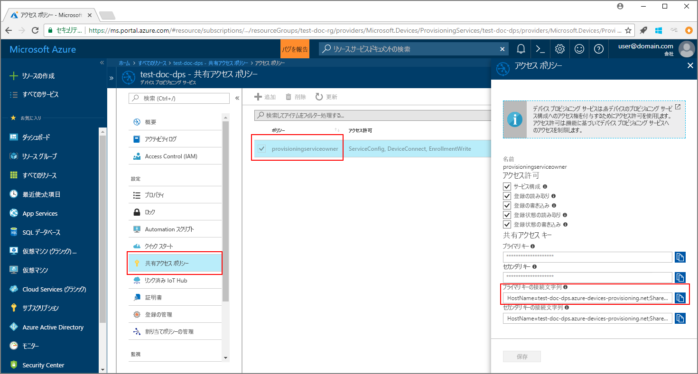
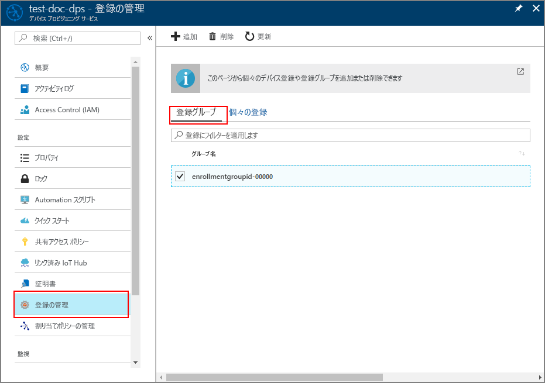

# <a name="enroll-x509-devices-to-iot-hub-device-provisioning-service-using-java-service-sdk"></a>Java Service SDK を使用して X.509 デバイスを IoT Hub Device Provisioning Service に登録する
> [!div class="op_single_selector"]
> * [Java](quick-enroll-device-x509-java.md)
> * [Node.js](quick-enroll-device-x509-node.md)

[Java Service SDK](https://azure.github.io/azure-iot-sdk-java/service/) とサンプル Java アプリケーションを利用して、シミュレートされた X.509 デバイスのグループを Azure IoT Hub Device Provisioning Service にプログラムで登録する方法について説明します。 Java Service SDK は Windows および Linux マシンの両方で動作しますが、この記事では、Windows 開発マシンを使用して登録プロセスの手順を説明します。

事前に、[Azure Portal での IoT Hub Device Provisioning Service の設定](./quick-setup-auto-provision.md)を済ませておいてください。

<a id="setupdevbox"></a>

## <a name="prepare-the-development-environment"></a>開発環境の準備 

1. [Java SE Development Kit 8](http://www.oracle.com/technetwork/java/javase/downloads/jdk8-downloads-2133151.html) がマシンにインストールされていることを確認します。 

2. Java インストールの環境変数を設定します。 `PATH` 変数には、*jdk1.8.x\bin* ディレクトリの完全なパスを含めます。 初めて Java をインストールするマシンの場合は、`JAVA_HOME` という新しい環境変数を作成し、*jdk1.8.x* ディレクトリの完全なパスに指定します。 通常、Windows マシンのこのディレクトリは、*C:\\Program Files\\Java\\* フォルダーにあるので、Windows マシンの **[コントロール パネル]** で **[システム環境変数の編集]** を探し、環境変数を作成または編集することができます。 

  コマンド ウィンドウで次のコマンドを実行して、マシンに Java が正常に設定されたことを確認できます。

    ```cmd\sh
    java -version
    ```

3. マシンに [Maven 3](https://maven.apache.org/download.cgi) をダウンロードして抽出します。 

4. Maven が抽出されたフォルダー内にある *apache-maven-3.x.x\\bin* フォルダーを指すように環境変数 `PATH` を編集します。 コマンド ウィンドウで次のコマンドを実行して、Maven が正常にインストールされたことを確認できます。

    ```cmd\sh
    mvn --version
    ```

5. [git](https://git-scm.com/download/) がマシンにインストールされ、環境変数 `PATH` に追加されていることを確認します。 


<a id="javasample"></a>

## <a name="download-and-modify-the-java-sample-code"></a>Java サンプル コードをダウンロードして変更する

ここでは、X.509 デバイスのプロビジョニングの詳細をサンプル コードに追加する方法について説明します。 

1. コマンド プロンプトを開きます。 Java Service SDK を使用して、デバイス登録コード サンプルの GitHub リポジトリを複製します。
    
    ```cmd\sh
    git clone https://github.com/Azure/azure-iot-sdk-java.git --recursive
    ```

2. ダウンロードしたソース コードで、サンプル フォルダー **_azure-iot-sdk-java/provisioning/provisioning-samples/service-enrollment-group-sample_** に移動します。 任意のエディターでファイル **_/src/main/java/samples/com/microsoft/azure/sdk/iot/ServiceEnrollmentGroupSample.java_** を開き、次の詳細を追加します。

    1. 次のように、ポータルからプロビジョニング サービスの `[Provisioning Connection String]` を追加します。
        1. [Azure Portal](https://portal.azure.com) でプロビジョニング サービスに移動します。 
        2. **[共有アクセス ポリシー]** を開き、*EnrollmentWrite* アクセス許可を持つポリシーを選択します。
        3. **主キーの接続文字列**をコピーします。 

              

        4. サンプル コード ファイル **_ServiceEnrollmentGroupSample.java_** の `[Provisioning Connection String]` を**主キーの接続文字列**に置き換えます。

            ```Java
            private static final String PROVISIONING_CONNECTION_STRING = "[Provisioning Connection String]";
            ```

    2. デバイス グループのルート証明書を追加します。 サンプル ルート証明書が必要な場合は、次のように _X.509 証明書ジェネレーター_を使用します。
        1. コマンド ウィンドウで、フォルダー **_azure-iot-sdk-java/provisioning/provisioning-tools/provisioning-x509-cert-generator_** に移動します。
        2. 次のコマンドを実行してツールをビルドします。

                ```cmd\sh
                mvn clean install
                ```

        4. 次のコマンドを使用してツールを実行します。

                ```cmd\sh
                cd target
                java -jar ./provisioning-x509-cert-generator-{version}-with-deps.jar
                ```

        5. プロンプトが表示されたら、必要に応じて証明書の _[Common Name]\(共通名\)_ を入力します。
        6. このツールで、**[Client Cert]\(クライアント証明書\)**、**[Client Cert Private Key]\(クライアント証明書の秘密キー\)**、**[Root Cert]\(ルート証明書\)** がローカルに生成されます。
        7. **_-----BEGIN CERTIFICATE-----_** から **_-----END CERTIFICATE-----_** の行を含めて **[Root Cert]\(ルート証明書\)** をコピーします。 
        8. 次のように、**[Root Cert]\(ルート証明書\)** の値をパラメーター **PUBLIC_KEY_CERTIFICATE_STRING** に割り当てます。

                ```Java
                private static final String PUBLIC_KEY_CERTIFICATE_STRING =
                        "-----BEGIN CERTIFICATE-----\n" +
                        "XXXXXXXXXXXXXXXXXXXXXXXXXXXXXXXXXXXXXXXXXXXXXXXXXXXXXXXXXXXXXXXX\n" +
                        "XXXXXXXXXXXXXXXXXXXXXXXXXXXXXXXXXXXXXXXXXXXXXXXXXXXXXXXXXXXXXXXX\n" +
                        "XXXXXXXXXXXXXXXXXXXXXXXXXXXXXXXXXXXXXXXXXXXXXXXXXXXXXXXXXXXXXXXX\n" +
                        "XXXXXXXXXXXXXXXXXXXXXXXXXXXXXXXXXXXXXXXXXXXXXXXXXXXXXXXXXXXXXXXX\n" +
                        "XXXXXXXXXXXXXXXXXXXXXXXXXXXXXXXXXXXXXXXXXXXXXXXXXXXXXXXXXXXXXXXX\n" +
                        "XXXXXXXXXXXXXXXXXXXXXXXXXXXXXXXXXXXXXXXXXXXXXXXXXXXXXXXXXXXXXXXX\n" +
                        "XXXXXXXXXXXXXXXXXXXXXXXXXXXXXXXXXXXXXXXXXXXXXXXXXXXXXXXXXXXXXXXX\n" +
                        "XXXXXXXXXXXXXXXXXXXXXXXXXXXXXXXXXXXXXXXXXXXXXXXXXXXXXXXXXXXXXXXX\n" +
                        "XXXXXXXXXXXXXXXXXXXXXXXXXXXXXXXXXXXXXXXXXXXXXXXXXXXXXXXXXXXXXXXX\n" +
                        "XXXXXXXXXXXXXXXXXXXXXXXXXXXXXXXXXXXXXXXXXXXXXXXXXXXXXXXXXXXXXXXX\n" +
                        "-----END CERTIFICATE-----\n";
                ```

        9. *[Verification Code]\(確認コード\)* の入力を求められたら、コマンド ウィンドウを閉じるか、「**n**」と入力します。 
 
    3. 必要に応じて、サンプル コードでプロビジョニング サービスを構成することができます。
        - この構成をサンプルに追加するには、次の手順を実行します。
            1. [Azure Portal](https://portal.azure.com) でプロビジョニング サービスにリンクされている IoT Hub に移動します。 ハブの **[概要]** タブを開き、**[ホスト名]** をコピーします。 この **[ホスト名]** を *IOTHUB_HOST_NAME* パラメーターに割り当てます。

                ```Java
                private static final String IOTHUB_HOST_NAME = "[Host name].azure-devices.net";
                ```
            2. *DEVICE_ID* パラメーターにフレンドリ名を割り当て、*PROVISIONING_STATUS* を既定の *ENABLED* 値のままにします。 

        - または、プロビジョニング サービスを構成しない場合は、_ServiceEnrollmentGroupSample.java_ ファイル内の次のステートメントをコメント アウトするか削除します。

            ```Java
            enrollmentGroup.setIotHubHostName(IOTHUB_HOST_NAME);                // Optional parameter.
            enrollmentGroup.setProvisioningStatus(ProvisioningStatus.ENABLED);  // Optional parameter.
            ```

    4. サンプル コードの内容を確認します。 このコードでは、X.509 デバイスのグループ登録を作成、更新、照会、および削除しています。 ポータルで登録が成功したことを確認するには、_ServiceEnrollmentGroupSample.java_ ファイルの末尾にある次のコード行を一時的にコメント アウトします。

        ```Java
        // ************************************** Delete info of enrollmentGroup ***************************************
        System.out.println("\nDelete the enrollmentGroup...");
        provisioningServiceClient.deleteEnrollmentGroup(enrollmentGroupId);
        ```

    5. ファイル _ServiceEnrollmentGroupSample.java_ を保存します。 
 

<a id="runjavasample"></a>

## <a name="build-and-run-sample-group-enrollment"></a>サンプル グループの登録をビルドして実行する

1. コマンド ウィンドウを開き、フォルダー **_azure-iot-sdk-java/provisioning/provisioning-samples/service-enrollment-group-sample_** に移動します。

2. 次のコマンドを使用して、サンプル コードをビルドします。

    ```cmd\sh
    mvn install -DskipTests
    ```

   このコマンドで、Maven パッケージ [`com.microsoft.azure.sdk.iot.provisioning.service`](https://www.mvnrepository.com/artifact/com.microsoft.azure.sdk.iot.provisioning/provisioning-service-client) がマシンにダウンロードされます。 このパッケージには、サンプル コードのビルドに必要な Java Service SDK のバイナリが含まれています。 前のセクションで _X.509 証明書ジェネレーター_を実行した場合、このパッケージは既にマシンにダウンロードされています。 

3. コマンド ウィンドウで次のコマンドを使用してサンプルを実行します。

    ```cmd\sh
    cd target
    java -jar ./service-enrollment-group-sample-{version}-with-deps.jar
    ```

4. 出力ウィンドウで、登録が正常に完了したことを確認します。

5. Azure Portal でプロビジョニング サービスに移動します。 **[登録を管理します]** をクリックします。 X.509 デバイスのグループは、自動生成された *GROUP NAME* という名前で **[登録グループ]** タブに表示されます。 

      

## <a name="modifications-to-enroll-a-single-x509-device"></a>1 つの X.509 デバイスを登録する場合の変更

1 つの X.509 デバイスを登録するには、「[Enroll TPM device to IoT Hub Device Provisioning Service using Java service SDK](quick-enroll-device-tpm-java.md#javasample)」(Java Service SDK を使用して TPM デバイスを IoT Hub Device Provisioning Service に登録する) で使用した*個々の登録*のサンプル コードを次のように変更します。

1. X.509 クライアント証明書の*共通名*をクリップボードにコピーします。 [前のサンプル コード セクション](#javasample)で説明したように _X.509 証明書ジェネレーター_を使用する場合は、証明書の_共通名_を入力するか、既定の **microsoftriotcore** を使用します。 この**共通名**を *REGISTRATION_ID* 変数の値として使用します。 

    ```Java
    // Use common name of your X.509 client certificate
    private static final String REGISTRATION_ID = "[RegistrationId]";
    ```

2. 変数 *TPM_ENDORSEMENT_KEY* の名前を *PUBLIC_KEY_CERTIFICATE_STRING* に変更します。 *PUBLIC_KEY_CERTIFICATE_STRING* 変数の値として、クライアント証明書または _X.509 証明書ジェネレーター_の出力の **Client Cert** をコピーします。 

    ```Java
    // Rename the variable *TPM_ENDORSEMENT_KEY* as *PUBLIC_KEY_CERTIFICATE_STRING*
    private static final String PUBLIC_KEY_CERTIFICATE_STRING =
            "-----BEGIN CERTIFICATE-----\n" +
            "XXXXXXXXXXXXXXXXXXXXXXXXXXXXXXXXXXXXXXXXXXXXXXXXXXXXXXXXXXXXXXXX\n" +
            "XXXXXXXXXXXXXXXXXXXXXXXXXXXXXXXXXXXXXXXXXXXXXXXXXXXXXXXXXXXXXXXX\n" +
            "XXXXXXXXXXXXXXXXXXXXXXXXXXXXXXXXXXXXXXXXXXXXXXXXXXXXXXXXXXXXXXXX\n" +
            "XXXXXXXXXXXXXXXXXXXXXXXXXXXXXXXXXXXXXXXXXXXXXXXXXXXXXXXXXXXXXXXX\n" +
            "XXXXXXXXXXXXXXXXXXXXXXXXXXXXXXXXXXXXXXXXXXXXXXXXXXXXXXXXXXXXXXXX\n" +
            "XXXXXXXXXXXXXXXXXXXXXXXXXXXXXXXXXXXXXXXXXXXXXXXXXXXXXXXXXXXXXXXX\n" +
            "XXXXXXXXXXXXXXXXXXXXXXXXXXXXXXXXXXXXXXXXXXXXXXXXXXXXXXXXXXXXXXXX\n" +
            "XXXXXXXXXXXXXXXXXXXXXXXXXXXXXXXXXXXXXXXXXXXXXXXXXXXXXXXXXXXXXXXX\n" +
            "XXXXXXXXXXXXXXXXXXXXXXXXXXXXXXXXXXXXXXXXXXXXXXXXXXXXXXXXXXXXXXXX\n" +
            "XXXXXXXXXXXXXXXXXXXXXXXXXXXXXXXXXXXXXXXXXXXXXXXXXXXXXXXXXXXXXXXX\n" +
            "-----END CERTIFICATE-----\n";
    ```
3. X.509 クライアント証明書を使用するように、**main** 関数の行 `Attestation attestation = new TpmAttestation(TPM_ENDORSEMENT_KEY);` を次のように置き換えます。
    ```Java
    Attestation attestation = X509Attestation.createFromClientCertificates(PUBLIC_KEY_CERTIFICATE_STRING);
    ```

4. 「[Build and run the sample code for individual enrollment](quick-enroll-device-tpm-java.md#runjavasample)」(個々の登録のサンプル コードをビルドして実行する) の手順に従って、*個々の登録*のサンプル ファイルを保存し、ビルドして実行します。


## <a name="clean-up-resources"></a>リソースのクリーンアップ
Java Service のサンプルを調べる予定の場合は、このクイックスタートで作成したリソースをクリーンアップしないでください。 使用する予定がない場合は、次の手順を使用して、このクイックスタートで作成したすべてのリソースを削除してください。

1. マシンに表示されている Java サンプルの出力ウィンドウを閉じます。
1. マシンの _X509 証明書ジェネレーター_のウィンドウを閉じます。
1. Azure Portal で [デバイス プロビジョニング サービス] に移動し、**[登録を管理します]** をクリックし、**[登録グループ]** タブを選択します。このクイックスタートを使用して登録した X.509 デバイスの *GROUP NAME* を選択し、ブレードの上部にある **[削除]** ボタンをクリックします。  

## <a name="next-steps"></a>次の手順
このクイックスタートでは、シミュレートされた X.509 デバイスのグループを Device Provisioning Service に登録しました。 Device Provisioning に関する理解をさらに深めるには、Azure Portal における Device Provisioning Service の設定に関するチュートリアルに進んでください。 

> [!div class="nextstepaction"]
> [Azure IoT Hub Device Provisioning Service のチュートリアル](./tutorial-set-up-cloud.md)
