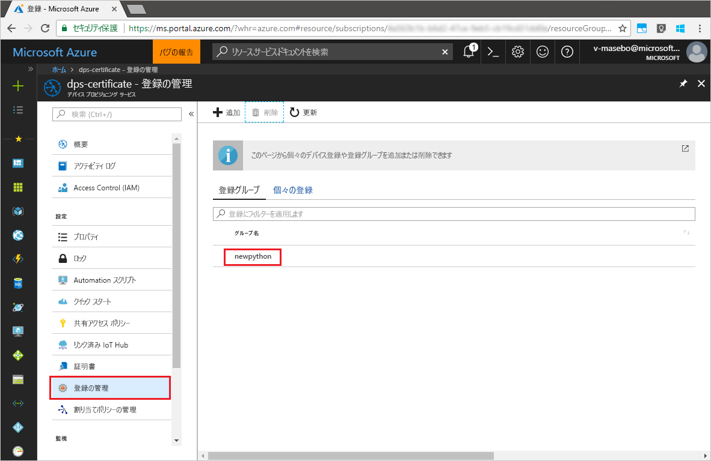

# <a name="quickstart-enroll-x509-devices-to-the-device-provisioning-service-using-python"></a>クイック スタート: Python を使用して X.509 デバイスを Device Provisioning Service に登録する

[!INCLUDE [iot-dps-selector-quick-enroll-device-x509](../../includes/iot-dps-selector-quick-enroll-device-x509.md)]

デバイスは、[登録グループ](concepts-service.md#enrollment-group)または[個々の登録](concepts-service.md#individual-enrollment)の作成によりプロビジョニング サービス インスタンスに登録されます。 このクイック スタートは、Python を使用して中間またはルートの CA の X.509 証明書を使用する[登録グループ](concepts-service.md#enrollment-group)をプログラムで作成する方法を示します。 登録グループでは、証明書チェーン内の共通の署名証明書を共有するデバイスに関してプロビジョニング サービスへのアクセスを制御します。 登録グループは、[Python Provisioning Service SDK](https://github.com/Azure/azure-iot-sdk-python/tree/master/provisioning_service_client) と Python のサンプル アプリケーションを使用して作成されます。 *Python Provisioning Service SDK* を使用した個々の登録はまだ開発中です。 詳細については、「[X.509 証明書を使用してプロビジョニング サービスへのデバイスのアクセスを制御する](./concepts-security.md#controlling-device-access-to-the-provisioning-service-with-x509-certificates)」を参照してください。 Azure IoT Hub と Device Provisioning Service と共に X.509 証明書ベースの公開キー基盤 (PKI) を使用する方法について詳しくは、[X.509 CA 証明書セキュリティの概要](https://docs.microsoft.com/azure/iot-hub/iot-hub-x509ca-overview)に関するページを参照してください。 

このクイック スタートでは、IoT ハブと Device Provisioning Service インスタンスを既に作成していることを前提としています。 これらのリソースをまだ作成していない場合は、この記事を進める前に「[Azure portal で IoT Hub Device Provisioning Service を設定する](./quick-setup-auto-provision.md)」のクイック スタートを完了してください。

この記事の手順は Windows マシンと Linux マシンの両方に利用できますが、この記事は Windows 開発マシン用に作成されています。

[!INCLUDE [quickstarts-free-trial-note](../../includes/quickstarts-free-trial-note.md)]


## <a name="prerequisites"></a>前提条件

- [Python 2.x または 3.x](https://www.python.org/downloads/) のインストール 必ず、セットアップに必要な 32 ビットまたは 64 ビットのインストールを使用してください。 インストール中に求められた場合は、プラットフォーム固有の環境変数に Python を追加します。
- [*pip* (Python パッケージ管理システム) のインストールまたはアップグレード](https://pip.pypa.io/en/stable/installing/)。
- [Git](https://git-scm.com/download/) のインストール。


## <a name="prepare-test-certificates"></a>テスト証明書を準備する

このクイック スタートでは、中間またはルートの X.509 証明書の公開部分が含まれる .pem ファイルまたは .cer が必要です。 この証明書はプロビジョニング サービスにアップロードされ、サービスによって検証される必要があります。 

[Azure IoT C SDK](https://github.com/Azure/azure-iot-sdk-c) には、X.509 証明書チェーンを作成し、そのチェーンからルートまたは中間証明書をアップロードし、サービスで所有証明を実行して証明書を検証するために役立つテスト ツールが含まれています。 SDK ツールで作成される証明書は、**開発テストにのみ**使用するよう設計されています。 これらの証明書は**運用環境では使用しないでください**。 30 日後に有効期限が切れるハード コーディングされたパスワード ("1234") が含まれます。 運用環境での使用に適した証明書の取得について詳しくは、Azure IoT Hub ドキュメントの「[X.509 CA 証明書の入手方法](https://docs.microsoft.com/azure/iot-hub/iot-hub-x509ca-overview#how-to-get-an-x509-ca-certificate)」をご覧ください。

このテスト ツールを使用して証明書を生成するには、次の手順を実行します。 
 
1. コマンド プロンプトまたは Git Bash シェルを開き、お使いのコンピューターの作業フォルダーに変更します。 次のコマンドを実行して、[Azure IoT C SDK](https://github.com/Azure/azure-iot-sdk-c) の GitHub リポジトリを複製します。
    
  ```cmd/sh
  git clone https://github.com/Azure/azure-iot-sdk-c.git --recursive
  ```

  このリポジトリのサイズは現在約 220 MB です。 この操作は、完了するまでに数分かかります。

  テスト ツールはクローンしたリポジトリの *azure-iot-sdk-c/tools/CACertificates* にあります。    

2. 「[Managing test CA certificates for samples and tutorials](https://github.com/Azure/azure-iot-sdk-c/blob/master/tools/CACertificates/CACertificateOverview.md)」(サンプルおよびチュートリアルのためのテスト用 CA 証明書の管理) の手順に従います。 


## <a name="modify-the-python-sample-code"></a>Python のサンプル コードの変更

ここでは、X.509 デバイスのプロビジョニングの詳細をサンプル コードに追加する方法について説明します。 

1. テキスト エディターを使用して、新しい **EnrollmentGroup.py** ファイルを作成します。

1. **TpmEnrollment.py** ファイルの先頭に次の `import` ステートメントと変数を追加します。 その後、`dpsConnectionString` は、**Azure Portal** の **[Device Provisioning Service]** にある **[共有アクセス ポリシー]** で見つかった接続文字列に置き換えます。 証明書のプレースホルダーは、「[テスト証明書を準備する](quick-enroll-device-x509-python.md#prepare-test-certificates)」で既に作成した証明書に置き換えます。 最後に、一意の `registrationid` を作成し、それが小文字の英数字とハイフンのみで構成されていることを確認します。  
   
    ```python
    from provisioningserviceclient import ProvisioningServiceClient
    from provisioningserviceclient.models import EnrollmentGroup, AttestationMechanism

    CONNECTION_STRING = "{dpsConnectionString}"

    SIGNING_CERT = """-----BEGIN CERTIFICATE-----
    XXXXXXXXXXXXXXXXXXXXXXXXXXXXXXXXXXXXXXXXXXXXXXXXXXXXXXXXXXXXXXXX
    XXXXXXXXXXXXXXXXXXXXXXXXXXXXXXXXXXXXXXXXXXXXXXXXXXXXXXXXXXXXXXXX
    XXXXXXXXXXXXXXXXXXXXXXXXXXXXXXXXXXXXXXXXXXXXXXXXXXXXXXXXXXXXXXXX
    XXXXXXXXXXXXXXXXXXXXXXXXXXXXXXXXXXXXXXXXXXXXXXXXXXXXXXXXXXXXXXXX
    XXXXXXXXXXXXXXXXXXXXXXXXXXXXXXXXXXXXXXXXXXXXXXXXXXXXXXXXXXXXXXXX
    XXXXXXXXXXXXXXXXXXXXXXXXXXXXXXXXXXXXXXXXXXXXXXXXXXXXXXXXXXXXXXXX
    XXXXXXXXXXXXXXXXXXXXXXXXXXXXXXXXXXXXXXXXXXXXXXXXXXXXXXXXXXXXXXXX
    XXXXXXXXXXXXXXXXXXXXXXXXXXXXXXXXXXXXXXXXXXXXXXXXXXXXXXXXXXXXXXXX
    XXXXXXXXXXXXXXXXXXXXXXXXXXXXXXXXXXXXXXXXXXXXXXXXXXXXXXXXXXXXXXXX
    XXXXXXXXXXXXXXXXXXXXXXXXXXXXXXXXXXXXXXXXXXXXXXXXXXXXXXXXXXXXXXXX
    XXXXXXXXXXXXXXXXXXXXXXXXXXXXXXXXXXXXXXXXXXXXXXXXXXXXXXXXXXXXXXXX
    XXXXXXXXXXXXXXXXXXXXXXXXXXXXXXXXXXXXXXXXXXXXXXXXXXXXXXXXXXXXXXXX
    XXXXXXXXXXXXXXXXXXXXXXXXXXXXXXXXXXXXXXXXXXXXXXXXXXXXXXXXXXXXXXXX
    XXXXXXXXXXXXXXXXXXXXXXXXXXXXXXXXXXXXXXXXXXXXXXXXXXXXXXXXXXXXXXXX
    XXXXXXXXXXXXXXXXXXXXXXXXXXXXXXXXXXXXXXXXXXXXXXXXXXXXXXXX
    -----END CERTIFICATE-----"""

    GROUP_ID = "{registrationid}"
    ```

1. 次の関数と関数呼び出しを追加して、グループ登録の作成を実装します。
   
    ```python
    def main():
        print ( "Initiating enrollment group creation..." )

        psc = ProvisioningServiceClient.create_from_connection_string(CONNECTION_STRING)
        att = AttestationMechanism.create_with_x509_signing_certs(SIGNING_CERT)
        eg = EnrollmentGroup.create(GROUP_ID, att)

        eg = psc.create_or_update(eg)
    
        print ( "Enrollment group created." )

    if __name__ == '__main__':
        main()
    ```

1. **EnrollmentGroup.py** ファイルを保存して閉じます。
 

## <a name="run-the-sample-group-enrollment"></a>サンプルのグループ登録の実行

1. コマンド プロンプトを開き、次のコマンドを実行して [azure-iot-provisioning-device-client](https://pypi.org/project/azure-iot-provisioning-device-client.) をインストールします。

    ```cmd/sh
    pip install azure-iothub-provisioningserviceclient    
    ```

2. コマンド プロンプトで、スクリプトを実行します。

    ```cmd/sh
    python EnrollmentGroup.py
    ```

3. 登録が成功したかどうか、出力を確認します。

4. Azure Portal でプロビジョニング サービスに移動します。 **[登録を管理します]** をクリックします。 X.509 デバイスのグループが **[登録グループ]** タブに、前に作成した `registrationid` という名前で表示されていることがわかります。 

      


## <a name="clean-up-resources"></a>リソースのクリーンアップ
Java Service のサンプルを調べる予定の場合は、このクイックスタートで作成したリソースをクリーンアップしないでください。 使用する予定がない場合は、次の手順を使用して、このクイックスタートで作成したすべてのリソースを削除してください。

1. マシンに表示されている Java サンプルの出力ウィンドウを閉じます。
1. マシンの _X509 証明書ジェネレーター_のウィンドウを閉じます。
1. Azure Portal で [デバイス プロビジョニング サービス] に移動し、**[登録を管理します]** をクリックし、**[登録グループ]** タブを選択します。このクイックスタートを使用して登録した X.509 デバイスの *GROUP NAME* を選択し、ブレードの上部にある **[削除]** ボタンをクリックします。  


## <a name="next-steps"></a>次の手順
このクイックスタートでは、シミュレートされた X.509 デバイスのグループを Device Provisioning Service に登録しました。 Device Provisioning に関する理解をさらに深めるには、Azure Portal における Device Provisioning Service の設定に関するチュートリアルに進んでください。 

> [!div class="nextstepaction"]
> [Azure IoT Hub Device Provisioning Service のチュートリアル](./tutorial-set-up-cloud.md)
