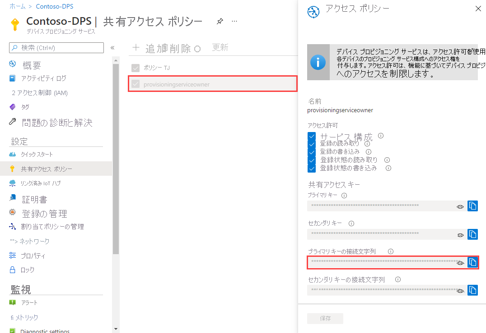
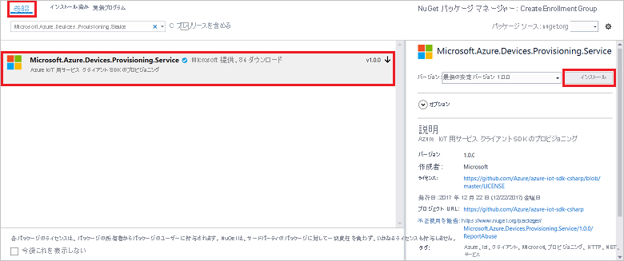
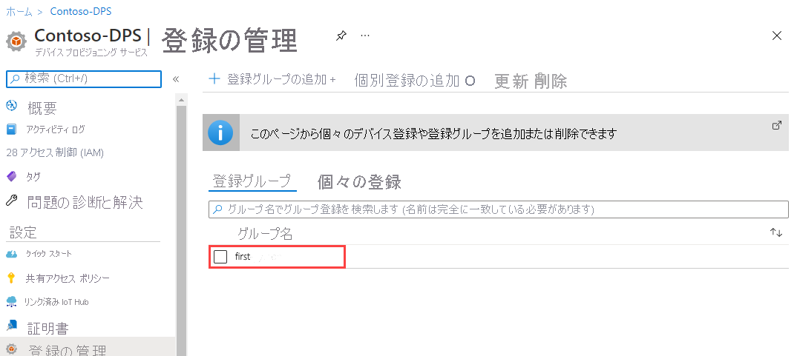

# <a name="quickstart-enroll-a-group-of-devices-to-the-device-provisioning-service-using-x509-certificate-attestation"></a>クイック スタート: X.509 証明書の構成証明 を使用してデバイスのグループを Device Provisioning Service に登録する 

:::zone pivot="programming-language-csharp,programming-language-nodejs, programming-language-python"

このクイック スタートでは、中間またはルート CA の X.509 証明書を使用する[登録グループ](concepts-service.md#enrollment-group)をプログラムで作成する方法を示します。 登録グループは、[Microsoft Azure IoT SDK](../iot-hub/iot-hub-devguide-sdks.md) とサンプル アプリケーションを使用して作成されます。 登録グループでは、証明書チェーン内の共通の署名証明書を共有するデバイスに関してプロビジョニング サービスへのアクセスを制御します。 詳細については、「[X.509 証明書を使用してプロビジョニング サービスへのデバイスのアクセスを制御する](./concepts-x509-attestation.md#controlling-device-access-to-the-provisioning-service-with-x509-certificates)」を参照してください。 Azure IoT Hub と Device Provisioning Service と共に X.509 証明書ベースの公開キー基盤 (PKI) を使用する方法について詳しくは、[X.509 CA 証明書セキュリティの概要](../iot-hub/iot-hub-x509ca-overview.md)に関するページを参照してください。

:::zone-end

:::zone pivot="programming-language-java"

このクイック スタートでは、中間またはルート CA の X.509 証明書を使用する個々の登録と[登録グループ](concepts-service.md#enrollment-group)をプログラムで作成する方法を示します。 登録グループは、[Microsoft Azure IoT SDK](../iot-hub/iot-hub-devguide-sdks.md) とサンプル アプリケーションを使用して作成されます。 登録グループでは、証明書チェーン内の共通の署名証明書を共有するデバイスに関してプロビジョニング サービスへのアクセスを制御します。 詳細については、「[X.509 証明書を使用してプロビジョニング サービスへのデバイスのアクセスを制御する](./concepts-x509-attestation.md#controlling-device-access-to-the-provisioning-service-with-x509-certificates)」を参照してください。 Azure IoT Hub と Device Provisioning Service と共に X.509 証明書ベースの公開キー基盤 (PKI) を使用する方法について詳しくは、[X.509 CA 証明書セキュリティの概要](../iot-hub/iot-hub-x509ca-overview.md)に関するページを参照してください。

:::zone-end

## <a name="prerequisites"></a>前提条件

* Azure サブスクリプションをお持ちでない場合は、開始する前に [無料アカウント](https://azure.microsoft.com/free/?ref=microsoft.com&utm_source=microsoft.com&utm_medium=docs&utm_campaign=visualstudio) を作成してください。

* [Azure portal での IoT Hub Device Provisioning Service の設定](./quick-setup-auto-provision.md)に関するページの手順を完了します。

:::zone pivot="programming-language-csharp"

* [Visual Studio 2019](https://www.visualstudio.com/vs/) をインストールします。

* Windows ベースのマシンに [.NET Core 3.1 SDK 以降](https://dotnet.microsoft.com/download)をインストールします。 次のコマンドを使用してバージョンを確認してください。

    ```bash
    dotnet --info
    ```

:::zone-end

:::zone pivot="programming-language-nodejs"

* コンピューターに [Node.js v4.0 以降](https://nodejs.org)をインストールします。

:::zone-end

:::zone pivot="programming-language-python"

* [Python 2.x または 3.x](https://www.python.org/downloads/) をインストールし、プラットフォーム固有の環境変数に Python を追加します。

    > [!IMPORTANT]
    > この記事は、非推奨となっている V1 Python SDK にのみ適用されます。 V2 では、Iot Hub Device Provisioning Service 用のデバイス クライアントとサービス クライアントはまだ利用できません。 チームは現在、V2 を機能パリティに移行する作業に取り組んでいます。

* [Pip](https://pip.pypa.io/en/stable/installing/) が Python のディストリビューションに既に含まれていない場合は、インストールします。

:::zone-end

:::zone pivot="programming-language-java"

* [Java SE Development Kit 8](/azure/developer/java/fundamentals/java-support-on-azure)。 このクイックスタートの中で、後から [Java Service SDK](https://azure.github.io/azure-iot-sdk-java/master/service/) をインストールします。 Windows と Linux のどちらでも使用できます。 このクイックスタートでは Windows を使用します。

* [Maven 3](https://maven.apache.org/download.cgi)。

:::zone-end

* 最新バージョンの [Git](https://git-scm.com/download/) をインストールします。 コマンド ウィンドウからアクセスできる環境変数に Git が追加されていることを確認します。 *Git Bash* (ローカル Git リポジトリとやりとりする際に使用できるコマンドライン アプリ) を含む、インストールする `git` ツールの最新バージョンについては、[Software Freedom Conservancy の Git クライアント ツール](https://git-scm.com/download/)に関するページを参照してください。

>[!NOTE]
>この記事の手順は Windows コンピューターと Linux コンピューターの両方に利用できますが、この記事では Windows 開発コンピューターを使用します。

## <a name="prepare-test-certificates"></a>テスト証明書を準備する

このクイック スタートでは、中間またはルートの CA の X.509 証明書の公開部分が含まれる *.pem* または *.cer* ファイルが必要です。 この証明書はプロビジョニング サービスにアップロードされ、サービスによって検証される必要があります。

:::zone pivot="programming-language-csharp,programming-language-nodejs, programming-language-python"

### <a name="clone-the-azure-iot-c-sdk"></a>Azure IoT C SDK をクローンする

[Azure IoT C SDK](https://github.com/Azure/azure-iot-sdk-c) には、X.509 証明書チェーンを作成し、そのチェーンからルートまたは中間証明書をアップロードし、サービスで所有証明を行って証明書を検証するために役立つテスト ツールが含まれています。

[Azure IoT C SDK](https://github.com/Azure/azure-iot-sdk-c) GitHub リポジトリの最新リリースを既にクローンしている場合は、[次のセクション](#create-the-test-certificate)に進んでください。

1. Web ブラウザーを開き、[Azure IoT C SDK のリリース ページ](https://github.com/Azure/azure-iot-sdk-c/releases/latest)に移動します。

2. Azure IoT C SDK の最新リリースのタグ名をコピーします。

3. コマンド プロンプトまたは Git Bash シェルを開きます。 次のコマンドを実行して、最新リリースの [Azure IoT C SDK](https://github.com/Azure/azure-iot-sdk-c) GitHub リポジトリを複製します。 (`<release-tag>` を前のステップでコピーしたタグで置き換えます)。

    ```cmd/sh
    git clone -b <release-tag> https://github.com/Azure/azure-iot-sdk-c.git
    cd azure-iot-sdk-c
    git submodule update --init
    ```

    この操作が完了するまでに数分かかる場合があります。

4. テスト ツールはクローンしたリポジトリの *azure-iot-sdk-c/tools/CACertificates* にあるはずです。

:::zone-end

:::zone pivot="programming-language-java"

<a id="javasample"></a>

### <a name="clone-the-azure-iot-java-sdk"></a>Azure IoT Java SDK をクローンする

[Azure IoT Java SDK](https://github.com/Azure/azure-iot-sdk-java) には、X.509 証明書チェーンを作成し、そのチェーンからルートまたは中間証明書をアップロードし、サービスで所有証明を行って証明書を検証するために役立つテスト ツールが含まれています。

1. コマンド プロンプトを開きます。

2. [Java Service SDK](https://azure.github.io/azure-iot-sdk-java/master/service/) を使用して、デバイス登録コード サンプルの GitHub リポジトリを複製します。

    ```cmd\sh
    git clone https://github.com/Azure/azure-iot-sdk-java.git --recursive
    ```

:::zone-end

### <a name="create-the-test-certificate"></a>テスト証明書を作成する

テスト証明書を作成するには:

:::zone pivot="programming-language-csharp,programming-language-nodejs, programming-language-python"

証明書を作成するには、「[サンプルおよびチュートリアルのためのテスト用 CA 証明書の管理](https://github.com/Azure/azure-iot-sdk-c/blob/master/tools/CACertificates/CACertificateOverview.md)」の手順に従います。

>[!TIP]
>C SDK のツールに加えて、*Microsoft Azure IoT SDK for .NET* に含まれている [グループ証明書の検証のサンプル](https://github.com/Azure-Samples/azure-iot-samples-csharp/tree/master/provisioning/Samples/service/GroupCertificateVerificationSample)では、既存の X.509 中間またはルート CA 証明書で C# の所有証明を実行する方法について説明されています。

:::zone-end

:::zone pivot="programming-language-java"

1. コマンド ウィンドウで、フォルダー *_azure-iot-sdk-java/provisioning/provisioning-tools/provisioning-x509-cert-generator_* に移動します。

2. ツールをビルドするには、次のコマンドを実行します。

    ```cmd\sh
    mvn clean install
    ```

3. ツールを実行するには、次のコマンドを使用します。

    ```cmd\sh
    cd target
    java -jar ./provisioning-x509-cert-generator-{version}-with-deps.jar
    ```

4. プロンプトが表示されたら、必要に応じて証明書の _[Common Name]\(共通名\)_ を入力します。

5. このツールで、*クライアント証明書*、*クライアント証明書の秘密キー*、*ルート証明書* がローカルに生成されます。サンプル コードの変更に必要になるため、*ルート証明書* をコピーします。

6. "*確認コード*" の入力を求められたら、コマンド ウィンドウを閉じるか、「**n**」と入力します。

:::zone-end

### <a name="add-and-verify-your-test-certificate"></a>テスト証明書を追加して確認する

Device Provisioning Service に証明書を追加して確認します。

1. 証明書を作成したら、[Azure portal](https://portal.azure.com) にサインインします。

2. 左側のメニューまたはポータル ページで **[すべてのリソース]** を選択します。

3. Device Provisioning Service を選択します。

4. *[設定]* メニューで * **[証明書]** を選択します。

5. 上部のメニューで、 **[+ 追加]** を選択します。

6. 証明書名を入力し、前のセクションで作成した *.pem* ファイルをアップロードします。

7. **[証明書の状態をアップロード時に確認済みに設定する]** を選択します。

8. **[保存]** を選択します。

:::image type="content" source="./media/quick-enroll-device-x509/add-certificate.png" alt-text="検証用の証明書を追加します。":::

## <a name="get-the-connection-string-for-your-provisioning-service"></a>プロビジョニング サービスの接続文字列を取得する

このクイック スタートのサンプルでは、プロビジョニング サービスの接続文字列をコピーする必要があります。

1. [Azure portal](https://portal.azure.com) にサインインします。

2. 左側のメニューまたはポータル ページで **[すべてのリソース]** を選択します。

3. Device Provisioning Service を選択します。

4. **[設定]** メニューから、 **[共有アクセス ポリシー]** を選択します。

5. 使用するアクセス ポリシーを選択します。

6. **[アクセス ポリシー]** パネルで、主キーの接続文字列をコピーして保存します。

    

## <a name="create-the-enrollment-group-sample"></a>登録グループのサンプルを作成する

:::zone pivot="programming-language-csharp"

このセクションでは、登録グループをプロビジョニング サービスに追加する .NET Core コンソール アプリケーションを作成する方法について説明します。

>[!TIP]
>一部変更してこれらの手順に従って、登録グループを追加する [Windows IoT Core](https://developer.microsoft.com/en-us/windows/iot) コンソール アプリを作成できます。 IoT Core での開発について詳しくは、[Windows IoT Core の開発者ドキュメント](/windows/iot-core/)に関するページを参照してください。

1. Visual Studio を開き、 **[新しいプロジェクトの作成]** を選択します。

2. **[新しいプロジェクトの作成]** パネルで、* *[コンソール アプリケーション]* を選択します。

3. **[次へ]** を選択します。

4. **[プロジェクト名]** に、「*CreateEnrollmentGroup*」と入力します。

5. **[次へ]** を選択します。 既定の **[ターゲット フレームワーク]** のままにします。

6. **［作成］** を選択します

7. ソリューションが開いたら、 **[ソリューション エクスプローラー]** ウィンドウで **CreateEnrollmentGroup** プロジェクトを右クリックし、 **[NuGet パッケージの管理]** を選択します。

8. **NuGet パッケージ マネージャー** で、 **[参照]** を選択します。

9. 「*Microsoft.Azure.Devices.Provisioning.Service*」と入力し、選択します。

10. **[インストール]** を選択します。

    

    この手順では、ダウンロードとインストールが行われ、[Azure IoT Provisioning Service クライアント SDK](https://www.nuget.org/packages/Microsoft.Azure.Devices.Provisioning.Service/) NuGet パッケージへの参照とその依存関係が追加されます。

11. 次の `using` ステートメントを、`Program.cs` の先頭にある他の `using` ステートメントの後ろに追加します。

    ```csharp
    using System.Security.Cryptography.X509Certificates;
    using System.Threading.Tasks;
    using Microsoft.Azure.Devices.Provisioning.Service;
    ```

12. `Program` クラスに次のフィールドを追加し、一覧された変更を行います。  

    ```csharp
    private static string ProvisioningConnectionString = "{ProvisioningServiceConnectionString}";
    private static string EnrollmentGroupId = "enrollmentgrouptest";
    private static string X509RootCertPath = @"{Path to a .cer or .pem file for a verified root CA or intermediate CA X.509 certificate}";
    ```

13. `ProvisioningServiceConnectionString` プレースホルダーの値を、前のセクションでコピーしたプロビジョニング サービスの接続文字列に置き換えます。

14. プレースホルダー `X509RootCertPath` の値は、.pem ファイルまたは .cer ファイルへのパスに置き換えます。 このファイルは、プロビジョニング サービスで以前、アップロードされて検証されている中間証明書またはルート CA x.509 証明書の公開部分を表します。

15. `EnrollmentGroupId` の値は、必要に応じて変更することができます。 文字列に含めることができるのは、小文字とハイフンのみです。

    > [!IMPORTANT]
    > 運用コードでは、セキュリティに関する次の考慮事項に注意してください。
    >
    > * プロビジョニング サービス管理者の接続文字列のハードコーディングは、セキュリティのベスト プラクティスに反しています。 代わりに、接続文字列は安全な方法で保持する必要があります (例: セキュリティ保護された構成ファイル内またはレジストリ内)。
    > * 必ず署名証明書の公開部分のみをアップロードしてください。 プロビジョニング サービスへの秘密キーが含まれた .pfx (PKCS12) ファイルまたは .pem ファイルは、決してアップロードしないでください。

16. `Program` クラスに次のメソッドを追加します。 このコードでは、登録グループのエントリを作成してから、`ProvisioningServiceClient` 上で `CreateOrUpdateEnrollmentGroupAsync` メソッドを呼び出して、登録グループをプロビジョニング サービスに追加します。

    ```csharp
    public static async Task RunSample()
    {
        Console.WriteLine("Starting sample...");
    
        using (ProvisioningServiceClient provisioningServiceClient =
                ProvisioningServiceClient.CreateFromConnectionString(ProvisioningConnectionString))
        {
            #region Create a new enrollmentGroup config
            Console.WriteLine("\nCreating a new enrollmentGroup...");
            var certificate = new X509Certificate2(X509RootCertPath);
            Attestation attestation = X509Attestation.CreateFromRootCertificates(certificate);
            EnrollmentGroup enrollmentGroup =
                    new EnrollmentGroup(
                            EnrollmentGroupId,
                            attestation)
                    {
                        ProvisioningStatus = ProvisioningStatus.Enabled
                    };
            Console.WriteLine(enrollmentGroup);
            #endregion
    
            #region Create the enrollmentGroup
            Console.WriteLine("\nAdding new enrollmentGroup...");
            EnrollmentGroup enrollmentGroupResult =
                await provisioningServiceClient.CreateOrUpdateEnrollmentGroupAsync(enrollmentGroup).ConfigureAwait(false);
            Console.WriteLine("\nEnrollmentGroup created with success.");
            Console.WriteLine(enrollmentGroupResult);
            #endregion
    
        }
    }
    ```

17. 最後に、`Main` メソッドを次の行に置き換えます。

    ```csharp
    static async Task Main(string[] args)
    {
        await RunSample();
        Console.WriteLine("\nHit <Enter> to exit ...");
        Console.ReadLine();
    }
    ```

18. ソリューションをビルドします。

:::zone-end

:::zone pivot="programming-language-nodejs"

このセクションでは、登録グループをプロビジョニング サービスに追加する node.js スクリプトを作成する方法を示します。

1. 作業フォルダーのコマンド ウィンドウから次のコマンドを実行します。

     ```cmd\sh
     npm install azure-iot-provisioning-service
     ```  

2. テキスト エディターを使用して、作業フォルダーに **create_enrollment_group.js** ファイルを作成します。 次のコードをファイルに追加して保存します。

    ```javascript
        'use strict';
        var fs = require('fs');
    
        var provisioningServiceClient = require('azure-iot-provisioning-service').ProvisioningServiceClient;
    
        var serviceClient = provisioningServiceClient.fromConnectionString(process.argv[2]);
    
        var enrollment = {
          enrollmentGroupId: 'first',
          attestation: {
            type: 'x509',
            x509: {
              signingCertificates: {
                primary: {
                  certificate: fs.readFileSync(process.argv[3], 'utf-8').toString()
                }
              }
            }
          },
          provisioningStatus: 'disabled'
        };
    
        serviceClient.createOrUpdateEnrollmentGroup(enrollment, function(err, enrollmentResponse) {
          if (err) {
            console.log('error creating the group enrollment: ' + err);
          } else {
            console.log("enrollment record returned: " + JSON.stringify(enrollmentResponse, null, 2));
            enrollmentResponse.provisioningStatus = 'enabled';
            serviceClient.createOrUpdateEnrollmentGroup(enrollmentResponse, function(err, enrollmentResponse) {
              if (err) {
                console.log('error updating the group enrollment: ' + err);
              } else {
                console.log("updated enrollment record returned: " + JSON.stringify(enrollmentResponse, null, 2));
              }
            });
          }
        });
    ```

:::zone-end

:::zone pivot="programming-language-python"

このセクションでは、登録グループをプロビジョニング サービスに追加する Python スクリプトを作成する方法を示します。

1. テキスト エディターを使用して、新しい *EnrollmentGroup.py* ファイルを作成します。

2. 次の Python コードをファイルにコピーします (`{dpsConnectionString}` を以前にコピーした接続文字列に置き換え、証明書プレースホルダーを「[テスト証明書を準備する](#prepare-test-certificates)」で作成した証明書に置き換え、`{registrationid}` を小文字とハイフンのみから構成される一意の `registrationid` に置き換えます)。

    ```python
    from provisioningserviceclient import ProvisioningServiceClient
    from provisioningserviceclient.models import EnrollmentGroup, AttestationMechanism
    
    CONNECTION_STRING = "{dpsConnectionString}"
    
    SIGNING_CERT = """-----BEGIN CERTIFICATE-----
    XXXXXXXXXXXXXXXXXXXXXXXXXXXXXXXXXXXXXXXXXXXXXXXXXXXXXXXXXXXXXXXX
    XXXXXXXXXXXXXXXXXXXXXXXXXXXXXXXXXXXXXXXXXXXXXXXXXXXXXXXXXXXXXXXX
    XXXXXXXXXXXXXXXXXXXXXXXXXXXXXXXXXXXXXXXXXXXXXXXXXXXXXXXXXXXXXXXX
    XXXXXXXXXXXXXXXXXXXXXXXXXXXXXXXXXXXXXXXXXXXXXXXXXXXXXXXXXXXXXXXX
    XXXXXXXXXXXXXXXXXXXXXXXXXXXXXXXXXXXXXXXXXXXXXXXXXXXXXXXXXXXXXXXX
    XXXXXXXXXXXXXXXXXXXXXXXXXXXXXXXXXXXXXXXXXXXXXXXXXXXXXXXXXXXXXXXX
    XXXXXXXXXXXXXXXXXXXXXXXXXXXXXXXXXXXXXXXXXXXXXXXXXXXXXXXXXXXXXXXX
    XXXXXXXXXXXXXXXXXXXXXXXXXXXXXXXXXXXXXXXXXXXXXXXXXXXXXXXXXXXXXXXX
    XXXXXXXXXXXXXXXXXXXXXXXXXXXXXXXXXXXXXXXXXXXXXXXXXXXXXXXXXXXXXXXX
    XXXXXXXXXXXXXXXXXXXXXXXXXXXXXXXXXXXXXXXXXXXXXXXXXXXXXXXXXXXXXXXX
    XXXXXXXXXXXXXXXXXXXXXXXXXXXXXXXXXXXXXXXXXXXXXXXXXXXXXXXXXXXXXXXX
    XXXXXXXXXXXXXXXXXXXXXXXXXXXXXXXXXXXXXXXXXXXXXXXXXXXXXXXXXXXXXXXX
    XXXXXXXXXXXXXXXXXXXXXXXXXXXXXXXXXXXXXXXXXXXXXXXXXXXXXXXXXXXXXXXX
    XXXXXXXXXXXXXXXXXXXXXXXXXXXXXXXXXXXXXXXXXXXXXXXXXXXXXXXXXXXXXXXX
    XXXXXXXXXXXXXXXXXXXXXXXXXXXXXXXXXXXXXXXXXXXXXXXXXXXXXXXX
    -----END CERTIFICATE-----"""
    
    GROUP_ID = "{registrationid}"

    def main():
        print ( "Initiating enrollment group creation..." )

        psc = ProvisioningServiceClient.create_from_connection_string(CONNECTION_STRING)
        att = AttestationMechanism.create_with_x509_signing_certs(SIGNING_CERT)
        eg = EnrollmentGroup.create(GROUP_ID, att)

        eg = psc.create_or_update(eg)
    
        print ( "Enrollment group created." )

    if __name__ == '__main__':
        main()
    ```

3. **EnrollmentGroup.py** ファイルを保存して閉じます。

:::zone-end

:::zone pivot="programming-language-java"

<a id="runjavasample"></a>

1. Azure IoT Java SDK で、サンプル フォルダー *_azure-iot-sdk-java/provisioning/provisioning-samples/service-enrollment-group-sample_* に移動します。

2. 任意のエディターでファイル *_/src/main/java/samples/com/microsoft/azure/sdk/iot/ServiceEnrollmentGroupSample.java_* を開きます。

3. `[Provisioning Connection String]` を、「[プロビジョニング サービスの接続文字列を取得する](#get-the-connection-string-for-your-provisioning-service)」でコピーしておいた接続文字列に置き換えます。

4. `PUBLIC_KEY_CERTIFICATE_STRING` 値を、前のセクションで生成した *ルート証明書** の値に置き換えます。 行 **_-----BEGIN CERTIFICATE-----_** および **_-----END CERTIFICATE-----_** を含めて、サンプル値全体を置き換えてください。

5. サンプル コード内からプロビジョニング サービスを構成するには、次の手順に進みます。 それを構成しない場合は、_ServiceEnrollmentGroupSample.java_ ファイル内の次のステートメントをコメント アウトするか削除してください。

    ```Java
    enrollmentGroup.setIotHubHostName(IOTHUB_HOST_NAME);                // Optional parameter.
    enrollmentGroup.setProvisioningStatus(ProvisioningStatus.ENABLED);  // Optional parameter.
    ```

6. この手順では、サンプル コードでプロビジョニング サービスを構成する方法について説明します。

    1. [Azure ポータル](https://portal.azure.com)にアクセスします。

    2. 左側のメニューまたはポータル ページで **[すべてのリソース]** を選択します。

    3. Device Provisioning Service を選択します。

    4. **[概要]** パネルで、 *サービス エンドポイント* のホスト名をコピーします。  ソース コード サンプルで、`[Host name]` をコピーしたホスト名に置き換えます。

        ```Java
        private static final String IOTHUB_HOST_NAME = "[Host name].azure-devices.net";
        ```

7. サンプル コードの内容を確認します。 このコードは、X.509 デバイスのグループ登録を作成、更新、照会、および削除します。 ポータルで登録が成功したことを確認するには、_ServiceEnrollmentGroupSample.java_ ファイルの末尾にある次のコード行を一時的にコメント アウトします。

    ```Java
    // ************************************** Delete info of enrollmentGroup ***************************************
    System.out.println("\nDelete the enrollmentGroup...");
    provisioningServiceClient.deleteEnrollmentGroup(enrollmentGroupId);
    ```

8. ファイル _ServiceEnrollmentGroupSample.java_ を保存します。

:::zone-end

## <a name="run-the-enrollment-group-sample"></a>登録グループのサンプルを実行する

:::zone pivot="programming-language-csharp"

1. Visual Studio でサンプルを実行して登録グループを作成します。 コマンド ウィンドウが表示され、確認メッセージが表示されます。

2. 作成が正常に完了すると、コマンド ウィンドウに新しい登録グループのプロパティが表示されます。

:::zone-end

:::zone pivot="programming-language-nodejs"

1. コマンド プロンプトを開き、次のコマンドを実行します (コマンドの引数を引用符で囲んで、`<connection string>`を前のセクションでコピーした接続文字列に置き換え、`<certificate .pem file>` を `.pem` ファイルのパスに置き換えます)。

    ```cmd\sh
    node create_enrollment_group.js "<connection string>" "<certificate .pem file>"
    ```

2. 作成が正常に完了すると、コマンド ウィンドウに新しい登録グループのプロパティが表示されます。

:::zone-end

:::zone pivot="programming-language-python"

1. 管理者モードでコマンド プロンプトを開き、次のコマンドを実行して [azure-iot-provisioning-device-client](https://pypi.org/project/azure-iot-provisioning-device-client) をインストールします。

    ```cmd/sh
    pip install azure-iothub-provisioningserviceclient    
    ```

2. コマンド プロンプトで、スクリプトを実行します。

    ```cmd/sh
    python EnrollmentGroup.py
    ```

3. 作成が正常に完了すると、コマンド ウィンドウに新しい登録グループのプロパティが表示されます。

:::zone-end

:::zone pivot="programming-language-java"

1. 管理者モードでコマンド ウィンドウを開き、フォルダー *_azure-iot-sdk-java/provisioning/provisioning-samples/service-enrollment-group-sample_* に移動します。

2. コマンド プロンプトで、このコマンドを実行します。

    ```cmd\sh
    mvn install -DskipTests
    ```

    このコマンドで、Maven パッケージ [`com.microsoft.azure.sdk.iot.provisioning.service`](https://mvnrepository.com/artifact/com.microsoft.azure.sdk.iot.provisioning/provisioning-service-client) がマシンにダウンロードされます。 このパッケージには、サンプル コードのビルドに必要な Java Service SDK のバイナリが含まれています。 前のセクションで _X.509 証明書ジェネレーター_ を実行した場合、このパッケージは既にマシンにダウンロードされています。

3. コマンド プロンプトで、スクリプトを実行します。

    ```cmd\sh
    cd target
    java -jar ./service-enrollment-group-sample-{version}-with-deps.jar
    ```

4. 作成が正常に完了すると、コマンド ウィンドウに新しい登録グループのプロパティが表示されます。

:::zone-end

登録グループが作成されていることを確認するには:

1. Azure portal で Device Provisioning Service を選択します。

2. **[設定]** メニューで **[登録の管理]** を選択します。

3. **[登録グループ]** を選択します。 サンプルで使用した登録 ID に対応する新しい登録エントリが表示されます。

:::zone pivot="programming-language-csharp"

:::image type="content" source="./media/quick-enroll-device-x509/verify-enrollment-csharp.png" alt-text="ポータルで C# グループの登録を確認します。":::

:::zone-end

:::zone pivot="programming-language-nodejs"



:::zone-end

:::zone pivot="programming-language-python"

:::image type="content" source="./media/quick-enroll-device-x509/verify-enrollment-python.png" alt-text="ポータルで Python グループの登録を確認します。":::

:::zone-end

:::zone pivot="programming-language-java"

:::image type="content" source="./media/quick-enroll-device-x509/verify-enrollment-java.png" alt-text="ポータルで Java グループの登録を確認します。":::

:::zone-end

:::zone pivot="programming-language-java"

## <a name="modifications-to-enroll-a-single-x509-device"></a>1 つの X.509 デバイスを登録する場合の変更

1 つの X.509 デバイスを登録するには、「[Enroll TPM device to IoT Hub Device Provisioning Service using Java service SDK](quick-enroll-device-tpm.md)」(Java Service SDK を使用して TPM デバイスを IoT Hub Device Provisioning Service に登録する) で使用した *個々の登録* のサンプル コードを次のように変更します。

1. X.509 クライアント証明書の *共通名* をクリップボードにコピーします。 [前のサンプル コード セクション](#javasample)で説明したように _X.509 証明書ジェネレーター_ を使用する場合は、証明書の _共通名_ を入力するか、既定の **microsoftriotcore** を使用します。 この **共通名** を *REGISTRATION_ID* 変数の値として使用します。

    ```Java
    // Use common name of your X.509 client certificate
    private static final String REGISTRATION_ID = "[RegistrationId]";
    ```

2. 変数 *TPM_ENDORSEMENT_KEY* の名前を *PUBLIC_KEY_CERTIFICATE_STRING* に変更します。 *PUBLIC_KEY_CERTIFICATE_STRING* 変数の値として、クライアント証明書または _X.509 証明書ジェネレーター_ の出力の **Client Cert** をコピーします。

    ```Java
    // Rename the variable *TPM_ENDORSEMENT_KEY* as *PUBLIC_KEY_CERTIFICATE_STRING*
    private static final String PUBLIC_KEY_CERTIFICATE_STRING =
            "-----BEGIN CERTIFICATE-----\n" +
            "XXXXXXXXXXXXXXXXXXXXXXXXXXXXXXXXXXXXXXXXXXXXXXXXXXXXXXXXXXXXXXXX\n" +
            "XXXXXXXXXXXXXXXXXXXXXXXXXXXXXXXXXXXXXXXXXXXXXXXXXXXXXXXXXXXXXXXX\n" +
            "XXXXXXXXXXXXXXXXXXXXXXXXXXXXXXXXXXXXXXXXXXXXXXXXXXXXXXXXXXXXXXXX\n" +
            "XXXXXXXXXXXXXXXXXXXXXXXXXXXXXXXXXXXXXXXXXXXXXXXXXXXXXXXXXXXXXXXX\n" +
            "XXXXXXXXXXXXXXXXXXXXXXXXXXXXXXXXXXXXXXXXXXXXXXXXXXXXXXXXXXXXXXXX\n" +
            "XXXXXXXXXXXXXXXXXXXXXXXXXXXXXXXXXXXXXXXXXXXXXXXXXXXXXXXXXXXXXXXX\n" +
            "XXXXXXXXXXXXXXXXXXXXXXXXXXXXXXXXXXXXXXXXXXXXXXXXXXXXXXXXXXXXXXXX\n" +
            "XXXXXXXXXXXXXXXXXXXXXXXXXXXXXXXXXXXXXXXXXXXXXXXXXXXXXXXXXXXXXXXX\n" +
            "XXXXXXXXXXXXXXXXXXXXXXXXXXXXXXXXXXXXXXXXXXXXXXXXXXXXXXXXXXXXXXXX\n" +
            "XXXXXXXXXXXXXXXXXXXXXXXXXXXXXXXXXXXXXXXXXXXXXXXXXXXXXXXXXXXXXXXX\n" +
            "-----END CERTIFICATE-----\n";
    ```

3. X.509 クライアント証明書を使用するように、**main** 関数の行 `Attestation attestation = new TpmAttestation(TPM_ENDORSEMENT_KEY);` を次のように置き換えます。

    ```Java
    Attestation attestation = X509Attestation.createFromClientCertificates(PUBLIC_KEY_CERTIFICATE_STRING);
    ```

4. 「[個々の登録サンプルを作成する](quick-enroll-device-tpm.md)」の手順を使用して、*個々の登録* のサンプル ファイルを保存し、ビルドして実行します。

:::zone-end

## <a name="clean-up-resources"></a>リソースをクリーンアップする

[Azure IoT Hub Device Provisioning Service のチュートリアル](./tutorial-set-up-cloud.md)を調べる予定がある場合は、このクイック スタートで作成したリソースをクリーンアップしないでください。 それ以外の場合は、次の手順を使用して、このクイックスタートで作成したすべてのリソースを削除してください。

1. コンピューター上のサンプル出力ウィンドウを閉じます。

2. Azure portal の左側のメニューから **[すべてのリソース]** を選択します。

3. Device Provisioning Service を選択します。

4. **[設定]** メニューで **[登録の管理]** を選択します。

5. **[登録グループ]** タブを選択します。

6. このクイック スタートで登録したデバイスの *登録 ID* の横にあるチェック ボックスをオンにします。

7. ページの上部で **[削除]** を選択します。

8. Azure portal の Device Provisioning Service から、 **[証明書]** を選択します。

9. このクイック スタートでアップロードした証明書を選択します。

10. **[証明書の詳細]** の上部で、 **[削除]** を選択します。  

## <a name="next-steps"></a>次のステップ

このクイックスタートでは、Azure IoT Hub Device Provisioning Service を使用して X.509 中間またはルート CA 証明書の登録グループを作成しました。 Device Provisioning に関する理解をさらに深めるには、Azure Portal における Device Provisioning Service の設定に関するチュートリアルに進んでください。

> [!div class="nextstepaction"]
> [Azure IoT Hub Device Provisioning Service のチュートリアル](./tutorial-set-up-cloud.md)

:::zone pivot="programming-language-nodejs"

> [!div class="nextstepaction"]
>[Node.js デバイス プロビジョニング サンプル](https://github.com/Azure/azure-iot-sdk-node/tree/master/provisioning/device/samples)。

:::zone-end