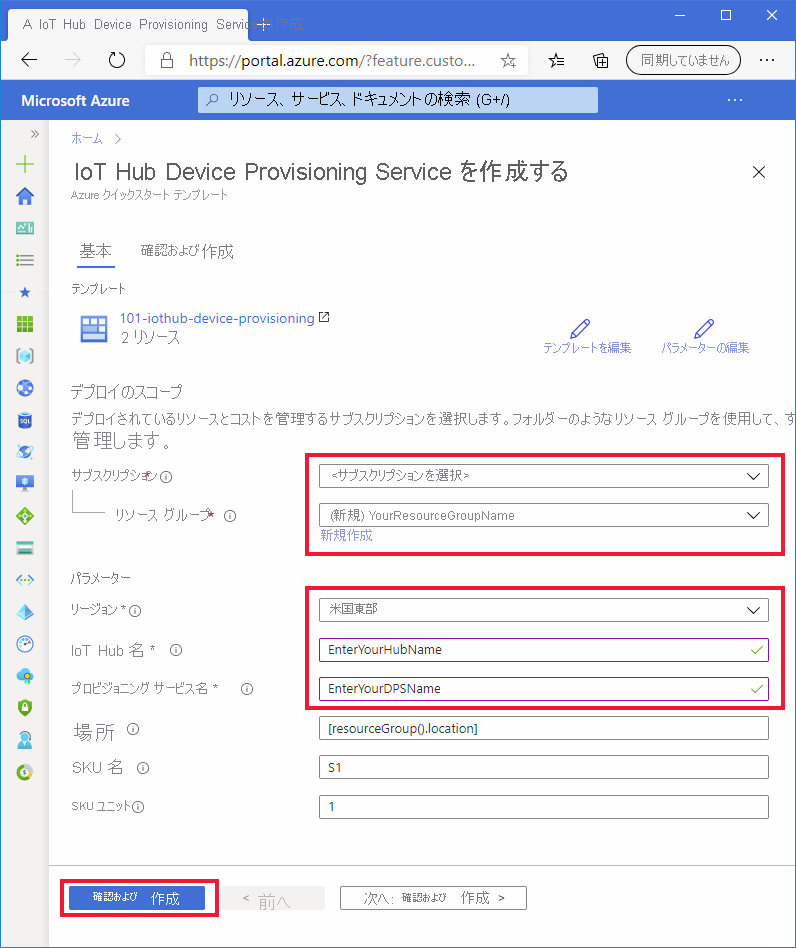

# <a name="quickstart-set-up-the-iot-hub-device-provisioning-service-dps-with-an-arm-template"></a>クイックスタート: ARM テンプレートを使用して IoT Hub デバイス プロビジョニング サービス (DPS) を設定する

[Azure Resource Manager](../azure-resource-manager/management/overview.md) テンプレート (ARM テンプレート) を使用すると、デバイスのプロビジョニングに必要な Azure クラウド リソースをプログラムで設定できます。 これらの手順では、ARM テンプレートを使用して、IoT ハブと新しい IoT Hub デバイス プロビジョニング サービスを作成する方法を示します。 また、この IoT ハブは、テンプレートを使用して DPS リソースにリンクされます。 このリンクにより、DPS リソースは、構成されている割り当てポリシーに基づいてデバイスをハブに割り当てることができます。

[!INCLUDE [About Azure Resource Manager](../../includes/resource-manager-quickstart-introduction.md)]

このクイックスタートでは、[Azure portal](../azure-resource-manager/templates/deploy-portal.md) と [Azure CLI](../azure-resource-manager/templates/deploy-cli.md) を使用して、リソース グループの作成とテンプレートのデプロイに必要なプログラムによる手順を実行しますが、[PowerShell](../azure-resource-manager/templates/deploy-powershell.md)、.NET、Ruby などのプログラミング言語を使用すると、簡単にこれらの手順を実行してテンプレートをデプロイすることができます。 

自分の環境が前提条件を満たしていて、ARM テンプレートを既に使い慣れている場合は、下の **[Deploy to Azure]\(Azure にデプロイ\)** ボタンを選択すると、Azure portal でデプロイ用のテンプレートが開きます。

[![概要の [Deploy to Azure]\(Azure にデプロイ\)](../media/template-deployments/deploy-to-azure.svg)](https://portal.azure.com/#create/Microsoft.Template/uri/https%3a%2f%2fraw.githubusercontent.com%2fAzure%2fazure-quickstart-templates%2fmaster%2f101-iothub-device-provisioning%2fazuredeploy.json)

[!INCLUDE [quickstarts-free-trial-note](../../includes/quickstarts-free-trial-note.md)]

[!INCLUDE [azure-cli-prepare-your-environment.md](../../includes/azure-cli-prepare-your-environment.md)]


## <a name="review-the-template"></a>テンプレートを確認する

このクイックスタートで使用されるテンプレートは [Azure クイックスタート テンプレート](https://azure.microsoft.com/resources/templates/101-iothub-device-provisioning/)からのものです。

> [!NOTE]
> 現在、新しい DPS リソースで加入契約を作成するための ARM テンプレートのサポートはありません。 その機能を希望する声が多く寄せられていることから現在、実装を検討中です。

:::code language="json" source="~/quickstart-templates/101-iothub-device-provisioning/azuredeploy.json":::

上記のテンプレートでは、次の 2 つの Azure リソースが定義されています。

* [**Microsoft.Devices/iothubs**](/azure/templates/microsoft.devices/iothubs): 新しい Azure IoT ハブを作成します。
* [**Microsoft.Devices/provisioningservices**](/azure/templates/microsoft.devices/provisioningservices): 新しい IoT ハブが既にリンクされている新しい Azure IoT Hub デバイス プロビジョニング サービスを作成します。


## <a name="deploy-the-template"></a>テンプレートのデプロイ

#### <a name="deploy-with-the-portal"></a>ポータルでのデプロイ

1. 次の画像を選択して Azure にサインインし、デプロイ用のテンプレートを開きます。 このテンプレートにより、新しい IoT ハブと DPS リソースが作成されます。 ハブは DPS リソースにリンクされます。

    [![ポータルの手順の [Deploy to Azure]\(Azure にデプロイ\)](../media/template-deployments/deploy-to-azure.svg)](https://portal.azure.com/#create/Microsoft.Template/uri/https%3a%2f%2fraw.githubusercontent.com%2fAzure%2fazure-quickstart-templates%2fmaster%2f101-iothub-device-provisioning%2fazuredeploy.json)

2. 次の値を選択または入力し、 **[Review + Create]\(確認および作成\)** をクリックします。

        

    以下で指定されている場合を除き、既定値を使用して IoT ハブと DPS リソースを作成します。

    | フィールド | 説明 |
    | :---- | :---------- |
    | **サブスクリプション** | Azure サブスクリプションを選択します。 |
    | **リソース グループ** | **[新規作成]** をクリックし、リソース グループの一意の名前を入力して、 **[OK]** をクリックします。 |
    | **リージョン** | リソースのリージョンを選択します。 たとえば、**East US** などとします。 |
    | **IoT ハブ名** | IoT ハブの名前を入力します。この名前は、 *.azure-devices.net* 名前空間内でグローバルに一意である必要があります。 このハブ名は、次のセクションでデプロイを検証するときに必要になります。 |
    | **Provisioning Service Name\(プロビジョニング サービス名\)** | 新しいデバイス プロビジョニング サービス (DPS) リソースの名前を入力します。 この名前は、 *.azure-devices-provisioning.net* 名前空間内でグローバルに一意である必要があります。 この DPS 名は、次のセクションでデプロイを検証するときに必要になります。 |
    
3. 次の画面で利用規約を読みます。 すべての条件に同意する場合は、 **[作成]** をクリックします。 

    デプロイが完了するまでに少し時間がかかります。 

    Azure portal だけでなく、Azure PowerShell、Azure CLI、および REST API を使用することもできます。 他のデプロイ方法については、「[テンプレートのデプロイ](../azure-resource-manager/templates/deploy-powershell.md)」を参照してください。


#### <a name="deploy-with-the-azure-cli"></a>Azure CLI を使用してデプロイする

Azure CLI を使用する場合は、バージョン 2.6 以降が必要です。 Azure CLI をローカルで実行している場合は、`az --version` を実行してバージョンを確認します。

Azure アカウントにサインインしてサブスクリプションを選択します。

1. Azure CLI をポータルではなくローカルで実行している場合は、ログインする必要があります。 コマンド プロンプトでログインするには、[ログイン コマンド](/cli/azure/get-started-with-az-cli2)を実行します。
    
    ```azurecli
    az login
    ```

    指示に従って、コードを使用して認証し、Web ブラウザーで Azure アカウントにサインインします。

2. 複数の Azure サブスクリプションがある場合は、Azure にサインインすると、資格情報に関連付けられているすべてのAzure アカウントへのアクセスが許可されます。 以下の、利用できる [Azure アカウントを一覧表示するコマンド](/cli/azure/account)を使用します。
    
    ```azurecli
    az account list -o table
    ```

    次のコマンドを使用して、IoT ハブと DPS リソースを作成するコマンドの実行に使用するサブスクリプションを選択します。 前のコマンドの出力から、サブスクリプション名または ID のいずれかを使用できます。

    ```azurecli
    az account set --subscription {your subscription name or id}
    ```

3. 次のコマンドをコピーして CLI プロンプトに貼り付けます。 その後、**Enter** キーを押してコマンドを実行します。
   
    > [!TIP]
    > このコマンドでは、リソース グループの場所の入力を求められます。 最初に次のコマンドを実行すると、使用可能な場所のリストを表示できます。
    >
    > `az account list-locations -o table`
    >
    >
    
    ```azurecli-interactive
    read -p "Enter a project name that is used for generating resource names:" projectName &&
    read -p "Enter the location (i.e. centralus):" location &&
    templateUri="https://raw.githubusercontent.com/Azure/azure-quickstart-templates/master/101-iothub-device-provisioning/azuredeploy.json" &&
    resourceGroupName="${projectName}rg" &&
    az group create --name $resourceGroupName --location "$location" &&
    az deployment group create --resource-group $resourceGroupName --template-uri  $templateUri &&
    echo "Press [ENTER] to continue ..." &&
    read
    ```

4. このコマンドでは、次の情報の入力を求められます。 各値を入力し、**Enter** キーを押します。

    | パラメーター | 説明 |
    | :-------- | :---------- |
    | **プロジェクト名** | このパラメーターの値は、すべてのリソースを保持するリソース グループの作成に使用されます。 リソース グループ名の値の末尾には、文字列 `rg` が追加されます。 |
    | **location** | この値は、すべてのリソースが配置されるリージョンです。 |
    | **iotHubName** | IoT ハブの名前を入力します。この名前は、 *.azure-devices.net* 名前空間内でグローバルに一意である必要があります。 このハブ名は、次のセクションでデプロイを検証するときに必要になります。 |
    | **provisioningServiceName** | 新しいデバイス プロビジョニング サービス (DPS) リソースの名前を入力します。 この名前は、 *.azure-devices-provisioning.net* 名前空間内でグローバルに一意である必要があります。 この DPS 名は、次のセクションでデプロイを検証するときに必要になります。 |

    テンプレートのデプロイに Azure CLI が使用されます。 Azure CLI だけでなく、Azure PowerShell、Azure portal、REST API を使用することもできます。 他のデプロイ方法については、「[テンプレートのデプロイ](../azure-resource-manager/templates/deploy-powershell.md)」を参照してください。


## <a name="review-deployed-resources"></a>デプロイされているリソースを確認する

1. デプロイを確認するには、次に示す[リソースを一覧表示するコマンド](/cli/azure/resource#az-resource-list)を実行し、その出力で新しいプロビジョニング サービスと IoT ハブを探します。

    ```azurecli
     az resource list -g "${projectName}rg"
    ```

2. ハブが DPS リソースに既にリンクされていることを確認するには、次の [DPS 拡張 show コマンド](/cli/azure/iot/dps#az_iot_dps_show)を実行します。

    ```azurecli
     az iot dps show --name <Your provisioningServiceName>
    ```

    `iotHubs` メンバーにリンクされているハブを確認します。


## <a name="clean-up-resources"></a>リソースをクリーンアップする

このコレクションの他のクイックスタートは、このクイックスタートに基づいています。 引き続きクイックスタートまたはチュートリアルの作業を行う場合は、このクイックスタートで作成したリソースをクリーンアップしないでください。 続行する予定がない場合は、Azure portal または Azure CLI を使用して、リソース グループとそのすべてのリソースを削除してもかまいません。

Azure portal からリソース グループとそのすべてのリソースを削除するには、そのリソース グループを開き、上部の **[リソース グループの削除]** をクリックするだけです。

Azure CLI を使用して、デプロイ済みのリソース グループを削除するには:

```azurecli
az group delete --name "${projectName}rg"
```

また、Azure portal、PowerShell、または REST API のほか、Azure Resource Manager または IoT Hub Device Provisioning Service 向けに公開済みのサポートされているプラットフォーム SDK を使って、リソース グループと個々のリソースを削除することもできます。

## <a name="next-steps"></a>次のステップ

このクイックスタートでは、IoT ハブと Device Provisioning Service インスタンスをデプロイし、この 2 つのリソースをリンクしました。 この設定を使用してデバイスをプロビジョニングする方法については、デバイスの作成に関するクイックスタートに進んでください。

> [!div class="nextstepaction"]
> [デバイスをプロビジョニングするためのクイックスタート](./quick-create-simulated-device-symm-key.md)

