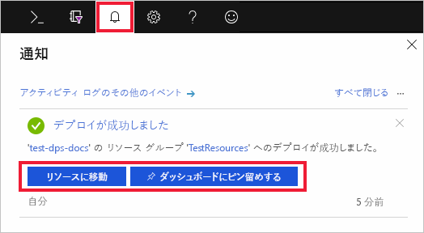

# Azure Portal で IoT Hub Device Provisioning Service を設定する

以下の手順では、デバイスのプロビジョニングに使用する Azure クラウド リソースをポータルから設定する方法について説明しています。 この記事では、IoT ハブの作成と新しい IoT Hub Device Provisioning Service の作成、さらにその 2 つのサービスのリンク操作を行うための手順について説明します。 

Azure サブスクリプションをお持ちでない場合は、開始する前に [無料アカウント](https://azure.microsoft.com/free/?WT.mc_id=A261C142F) を作成してください。

## IoT Hub の作成

[!INCLUDE [iot-hub-include-create-hub](../../includes/iot-hub-include-create-hub.md)]

## IoT Hub Device Provisioning Service の新しいインスタンスを作成する

1. Azure Portal の左上隅にある **[リソースの作成]** ボタンをクリックします。

2. *[Marketplace を検索]* で **Device Provisioning Service** を探します。 **[IoT Hub デバイス プロビジョニング サービス]** を選択し、**[作成]** ボタンをクリックします。 

3. 新しい Device Provisioning サービス インスタンスの次の情報を入力し、**[作成]** をクリックします。

    * **[名前]:** 新しい Device Provisioning サービス インスタンスの一意の名前を指定します。 入力した名前が使用可能な場合は、緑色のチェック マークが表示されます。
    * **[サブスクリプション]:** この Device Provisioning サービス インスタンスを作成するために使用するサブスクリプションを選択します。
    * **[リソース グループ]:** このフィールドでは、新しいリソース グループを作成することも、新しいインスタンスを含める既存のリソース グループを選択することもできます。 先ほど作成した IoT ハブが含まれている同じリソース グループを選択します (たとえば、**TestResources**)。 関連するすべてのリソースを 1 つのグループ内に配置することで、それらを一緒に管理できます。 たとえば、リソース グループを削除すると、そのグループに含まれているすべてのリソースが削除されます。 詳細については、[リソース グループを使用した Azure リソースの管理](../azure-resource-manager/resource-group-portal.md)に関するページを参照してください。
    * **[場所]:** 使用しているデバイスに最も近い場所を選択します。

        

4. 通知ボタンをクリックしてリソース インスタンスの作成を監視します。 サービスが正常にデプロイされたら、**[ダッシュボードにピン留めする]**、**[リソースに移動]** の順にクリックします。

    

## IoT ハブと Device Provisioning サービスとをリンクさせる

このセクションでは、Device Provisioning Service インスタンスに構成を追加します。 この構成では、デバイスをプロビジョニングする IoT ハブを設定します。

1. Azure Portal の左側のメニューにある **[すべてのリソース]** ボタンをクリックします。 前のセクションで作成した Device Provisioning サービス インスタンスを選択します。  

2. Device Provisioning Service の概要ブレードで **[Linked IoT hubs]\(リンクされた IoT ハブ\)** を選択します。 一番上の **[+ 追加]** ボタンをクリックします。 

3. **[IoT Hub へのリンクを追加します]** ページで、次の情報を入力して、新しい Device Provisioning サービス インスタンスを IoT ハブにリンクします。 次に、**[保存]** をクリックします。 

    * **[サブスクリプション]:** 新しい Device Provisioning サービス インスタンスにリンクする IoT ハブが含まれるサブスクリプションを選択します。
    * **[IoT Hub]:** 新しい Device Provisioning サービス インスタンスにリンクする IoT ハブを選択します。
    * **[アクセス ポリシー]:** IoT ハブとのリンクを確立するための資格情報として **[iothubowner]** を選択します。  

        

3. 選択したハブが **[Linked IoT hubs]\(リンクされた IoT ハブ\)** ブレードに表示されます。 **リンクされた IoT ハブ**を表示するには、**[更新]** のクリックが必要な場合があります。

## リソースのクリーンアップ

このコレクションの他のクイックスタートは、このクイックスタートに基づいています。 引き続きクイックスタートまたはチュートリアルの作業を行う場合は、このクイックスタートで作成したリソースをクリーンアップしないでください。 これ以上作業を行わない場合は、次の手順に従って、このクイックスタートで作成したすべてのリソースを Azure Portal で削除してください。

1. Azure Portal の左側のメニューにある **[すべてのリソース]** をクリックし、Device Provisioning サービスを選択します。 **[すべてのリソース]** ブレードの上部にある **[削除]** をクリックします。  
2. Azure Portal の左側のメニューにある **[すべてのリソース]** をクリックし、IoT ハブを選択します。 **[すべてのリソース]** ブレードの上部にある **[削除]** をクリックします。  

## 次の手順

このクイック スタートでは、IoT ハブと Device Provisioning サービス インスタンスをデプロイし、この 2 つのリソースをリンクしました。 ここで行った設定を使用して、シミュレートされたデバイスをプロビジョニングする方法については、シミュレートされたデバイスの作成に関するクイックスタートを参照してください。

> [!div class="nextstepaction"]
> [シミュレートされたデバイスを作成するためのクイックスタート](./quick-create-simulated-device.md)
