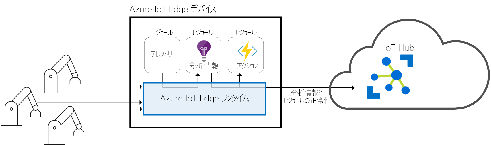
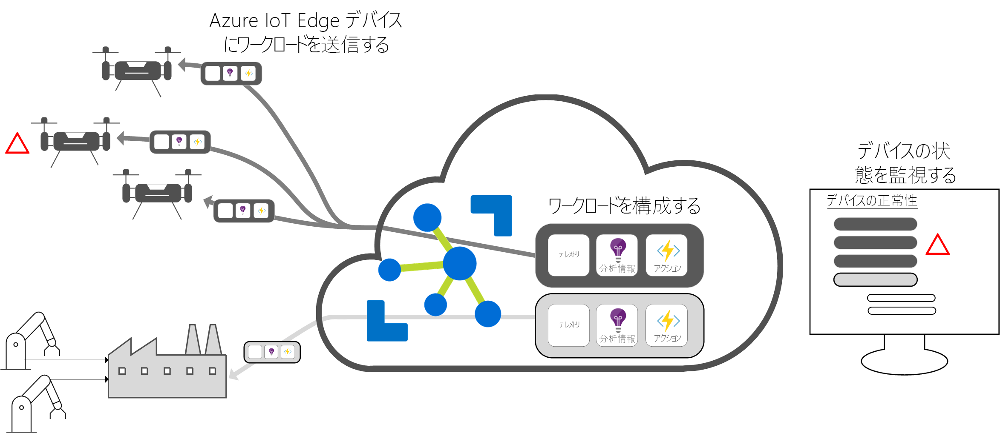

# Azure IoT Edge とは

Azure IoT Edge は、企業がデータの管理に手間取ることなくビジネス インサイトに専念できるよう、これまでクラウドで行っていた分析とカスタム ビジネス ロジックをデバイス側で実行できるようにするものです。 ご利用の IoT ソフトウェアを構成して標準のコンテナーによりそれをデバイスにデプロイし、すべてクラウドから監視することで、カスタム ソリューションに真のスケーラビリティがもたらされます。

>[!NOTE]
>Azure IoT Edge は、IoT Hub の Free および Standard レベルで利用できます。 Free レベルは、テストおよび評価用です。 Basic レベルおよび Standard レベルの詳細については、[適切な IoT Hub レベルの選び方](../iot-hub/iot-hub-scaling.md)に関するページを参照してください。

分析は、IoT ソリューションのビジネス上の価値を決める重要な要素ですが、すべての分析をクラウドで行う必要はありません。 緊急事態に可能な限り速やかに対応することが要求される場合には、異常検出をデバイス側で実行することができます。 同様に、帯域幅コストを抑える必要がある場合や、テラバイト規模の生データを転送することが問題になる場合には、データのクリーニングや集約をローカルで行うことが考えられます。 クラウドには、その結果として得られた洞察を送信します。 

Azure IoT Edge は、次の 3 つのコンポーネントで構成されます。
* IoT Edge モジュール: Azure のサービス、サード パーティのサービス、またはカスタム コードを実行するコンテナーです。 IoT Edge デバイスにデプロイされ、そのデバイス上のローカルで実行されます。 
* IoT Edge ランタイム: 個々の IoT Edge デバイス上で動作し、各デバイスにデプロイされたモジュールを管理します。 
* クラウドベースのインターフェイス: IoT Edge デバイスをリモートから監視して管理します。

## IoT Edge のモジュール

IoT Edge のモジュールは、実行の単位となるもので、現在は Docker 互換のコンテナーとして実装されます。エッジに置かれたビジネス ロジックが、この単位で実行されます。 互いに通信を行う複数のモジュールを構成することで、データ処理のパイプラインを作成することができます。 カスタム モジュールを開発するか、特定の Azure サービスをパッケージ化して、エッジからオフラインで洞察が得られるモジュールとしてまとめることができます。 

### エッジで利用できる人工知能

Azure IoT Edge を使用すると、複合イベント処理や機械学習、画像認識など、高価な AI を自社開発することなくデプロイすることができます。 Azure のサービス、たとえば Azure Functions、Azure Stream Analytics、Azure Machine Learning はいずれも、Azure IoT Edge を介してオンプレミスで実行することができます。しかもそれは Azure のサービスに限定されません。 だれもが AI モジュールを作成して、コミュニティに公開することができます。 

### Bring Your Own Code

デバイスに独自のコードをデプロイする場合にも Azure IoT Edge が役立ちます。 Azure IoT Edge には、他の Azure IoT サービスと同じプログラミング モデルが踏襲されています。 同じコードをデバイスでもクラウドでも実行できます。 コーディングの対象プラットフォームを自由に選べるよう、Azure IoT Edge は Linux と Windows の両方に対応しています。 Java、.NET Core 2.0、Node.js、C、Python がサポートされているため、開発者は既に身に付けた言語でコードを記述できます。また既存のビジネス ロジックを利用できるので、ゼロからコードを記述する必要もありません。

## IoT Edge ランタイム

Azure IoT Edge ランタイムは、カスタム ロジックやクラウド ロジックを IoT Edge デバイスで実行することを可能にするものです。 IoT Edge デバイスに常駐して管理操作や通信処理を実行します。 このランタイムによって実行されるいくつかの機能を次に示します。

* デバイスに対するワークロードのインストールと更新を実行する。
* デバイス上で Azure IoT Edge のセキュリティ標準を維持する。
* IoT Edge モジュールの実行状態を絶えず確保する。
* モジュールの正常性をクラウドに報告してリモートから監視できるようにする。
* ダウンストリームのリーフ デバイスと IoT Edge デバイス間の通信を円滑化する。
* IoT Edge デバイス上のモジュール間の通信を円滑化する。
* IoT Edge デバイスとクラウドとの間の通信を円滑化する。

Azure IoT Edge デバイスをどのように使用するかはすべて開発者次第です。 そのランタイムは多くの場合、他のさまざまなオンプレミス デバイスからのデータを集約して処理するゲートウェイに対して AI をデプロイする目的で使用されますが、それは選択肢の 1 つにすぎません。 ゲートウェイに接続されているリーフ デバイスまたは直接クラウドに接続されているリーフ デバイスが Azure IoT Edge デバイスとなる場合もあります。

Azure IoT Edge ランタイムは、多数の IoT デバイス上で動作することにより、さまざまな利用形態を実現します。 Linux と Windows の両方のオペレーティング システムに対応し、ハードウェアの細部を抽象化する働きを担います。 処理するデータが比較的少ない場合や、リソース消費の激しいワークロードを実行するために産業サーバーにスケールアップする場合は、Raspberry Pi 3 よりも小さいデバイスを使用してください。

## IoT Edge クラウド インターフェイス

エンタープライズ デバイスのソフトウェア ライフサイクルは管理が複雑です。 種類の異なる何百万という IoT デバイスのソフトウェア ライフサイクルを管理するとなれば、なおさら困難が伴います。 ワークロードは、特定の種類のデバイスを想定して作成、構成しなけれなりません。実際のソリューションで存在する何百万台というデバイスに対して大規模にワークロードをデプロイして監視し、デバイスの動作に異常があれば検出する必要があるのです。 これらのアクティビティをデバイス単位で行うことはできないので、一定の規模で実施する必要があります。

Azure IoT Edge は、Azure IoT ソリューション アクセラレータ とシームレスに連携し、実際のソリューションのニーズに合った一元的なコントロール プレーンを提供します。 ユーザーは Cloud Services を通じて次のことを実行できます。

* 特定の種類のデバイス上で動作するワークロードを作成して構成する。
* まとまったデバイスに対してワークロードを送信する。
* 現場のデバイスで実行されるワークロードを監視する。

## 次の手順

ここで説明した概念を、[シミュレートされたデバイスに対して IoT Edge をデプロイする方法](quickstart.md)に関するページで試してみましょう。

 
