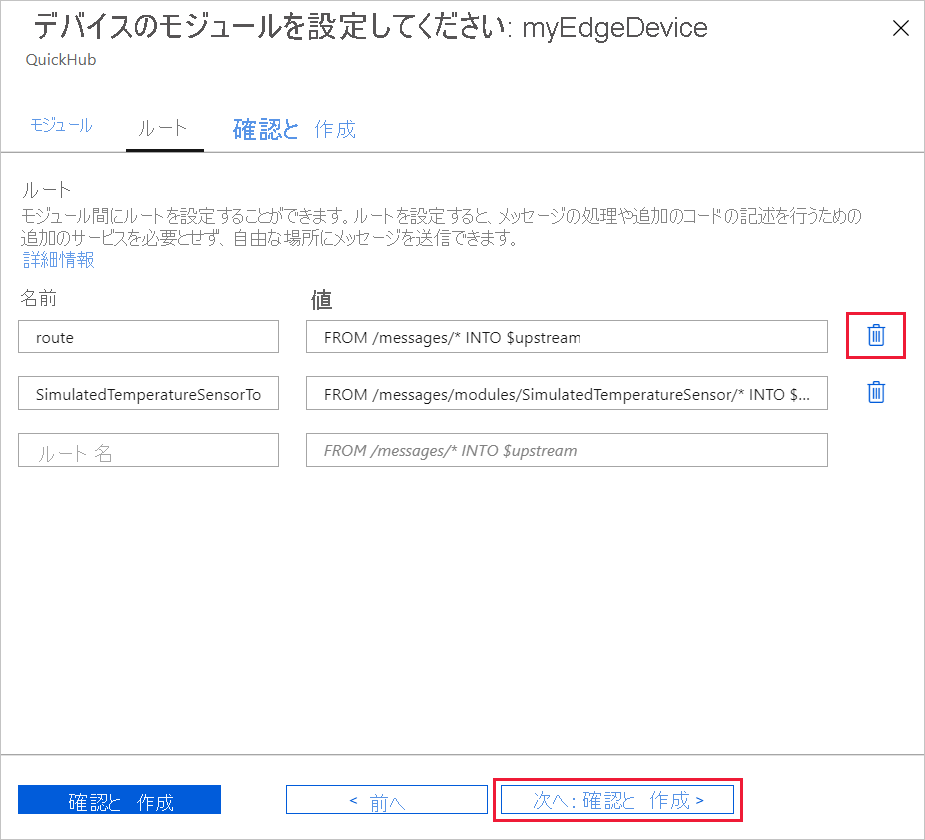
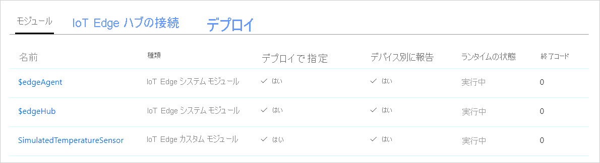

# <a name="quickstart-deploy-your-first-iot-edge-module-to-a-virtual-linux-device"></a>クイック スタート:初めての IoT Edge モジュールを Linux 仮想デバイスにデプロイする

[!INCLUDE [iot-edge-version-201806-or-202011](../../includes/iot-edge-version-201806-or-202011.md)]

このクイックスタートでは、コンテナー化されたコードを Linux IoT Edge 仮想デバイスに配置して、Azure IoT Edge をテストします。 IoT Edge を使用すると、ご利用のデバイス上のコードをリモートで管理できるため、より多くのワークロードをエッジに送信できます。 このクイックスタートでは、IoT Edge デバイス用に Azure 仮想マシンを使用することをお勧めします。これにより、テスト マシンをすばやく作成し、終了したら削除できます。

このクイック スタートでは、次の方法について説明します。

* IoT Hub を作成します。
* IoT Edge デバイスを IoT ハブに登録します。
* IoT Edge ランタイムを仮想デバイスにインストールして開始します。
* モジュールを IoT Edge デバイスにリモートで展開する。


このクイック スタートでは、IoT Edge デバイスとして構成された Linux 仮想マシンを作成する手順について説明します。 その後、Azure portal からご自身のデバイスにモジュールを配置します。 このクイックスタートで使用されているモジュールは、温度、湿度、圧力のデータを生成するシミュレートされたセンサーです。 他の Azure IoT Edge チュートリアルでは、ここで行う作業を基盤としており、ビジネスに関する分析情報を得るためにシミュレートされたデータを分析する追加のモジュールを配置しています。

アクティブな Azure サブスクリプションをお持ちでない場合は、開始する前に[無料アカウント](https://azure.microsoft.com/free)を作成してください。

## <a name="prerequisites"></a>前提条件

Azure CLI の環境を準備します。

[!INCLUDE [azure-cli-prepare-your-environment-no-header.md](../../includes/azure-cli-prepare-your-environment-no-header.md)]

クラウド リソース:

* このクイック スタートで使用するすべてのリソースを管理するためのリソース グループです。 このクイックスタートと以下のチュートリアルでは、リソース グループ名の例 **IoTEdgeResources** を使用しています。

   ```azurecli-interactive
   az group create --name IoTEdgeResources --location westus2
   ```

## <a name="create-an-iot-hub"></a>IoT Hub の作成

このクイック スタートでは、最初に Azure CLI を使用して IoT ハブを作成します。


このクイック スタートでは無料レベルの IoT Hub を使用できます。 IoT Hub を以前に使用したことがあり、ハブを作成済みである場合は、その IoT ハブを使用することができます。

次のコードにより、無料の **F1** ハブがリソース グループ **IoTEdgeResources** に作成されます。 `{hub_name}` は、実際の IoT ハブの一意の名前に置き換えてください。 IoT ハブの作成には数分かかることがあります。

   ```azurecli-interactive
   az iot hub create --resource-group IoTEdgeResources --name {hub_name} --sku F1 --partition-count 2
   ```

   サブスクリプションに無料のハブが既に 1 つあるためにエラーが発生する場合は、SKU を **S1** に変更します。 各サブスクリプションで使用できる無料 IoT ハブは 1 つのみです。 IoT ハブの名前が利用できないというエラーが発生した場合、自分以外のだれかが既にその名前のハブを所有していることを意味します。 新しい名前を試してください。

## <a name="register-an-iot-edge-device"></a>IoT Edge デバイスを登録する

新しく作成された IoT ハブに IoT Edge デバイスを登録します。


お使いの IoT ハブと通信できるように、IoT Edge デバイスのデバイス ID を作成します。 デバイス ID はクラウドに置かれるので、デバイスの一意の接続文字列を使用して、物理デバイスとデバイス ID とを関連付けることになります。

IoT Edge デバイスは、一般的な IoT デバイスとは異なる動作をし、別に管理できるため、この ID は IoT Edge デバイス用として `--edge-enabled` フラグで宣言します。

1. Azure Cloud Shell で、次のコマンドを入力して、**myEdgeDevice** という名前のデバイスをハブに作成します。

   ```azurecli-interactive
   az iot hub device-identity create --device-id myEdgeDevice --edge-enabled --hub-name {hub_name}
   ```

   iothubowner ポリシー キーに関するエラーが表示された場合は、Cloud Shell で最新バージョンの azure-iot 拡張機能が実行されていることを確認してください。

2. デバイスの接続文字列を確認します。この接続文字列により、IoT Hub 内で物理デバイスとその ID をリンクさせます。 これには、IoT ハブの名前、デバイスの名前、2 つの間の接続を認証する共有キーが含まれています。 次のセクションで IoT Edge デバイスを設定するときに、この接続文字列についてもう一度触れます。

   ```azurecli-interactive
   az iot hub device-identity connection-string show --device-id myEdgeDevice --hub-name {hub_name}
   ```

   

## <a name="configure-your-iot-edge-device"></a>IoT Edge デバイスを構成する

Azure IoT Edge ランタイムがインストールされた仮想マシンを作成します。


IoT Edge ランタイムはすべての IoT Edge デバイスに展開されます。 これは 3 つのコンポーネントで構成されます。 *IoT Edge セキュリティ デーモン* は、IoT Edge デバイスが起動するたびに開始され、IoT Edge エージェントを起動してデバイスをブートストラップします。 *IoT Edge エージェント* は、IoT Edge ハブなど、IoT Edge デバイス上のモジュールの展開と監視を容易にします。 *IoT Edge ハブ* は、IoT Edge デバイス上のモジュール間、およびデバイスと IoT ハブの間の通信を管理します。

ランタイムの構成中に、デバイスの接続文字列を入力します。 これは、Azure CLI から取得した文字列です。 この文字列によって、Azure 内の IoT Edge デバイス ID と物理デバイスとが関連付けられます。

### <a name="deploy-the-iot-edge-device"></a>IoT Edge デバイスを展開する

このセクションでは、Azure Resource Manager テンプレートを使用して新しい仮想マシンを作成し、そこに IoT Edge ランタイムをインストールします。 代わりに独自の Linux デバイスを使用する場合は、[Azure IoT Edge ランタイムのインストール](how-to-install-iot-edge.md)に関するページのインストール手順を行ってから、このクイックスタートに戻ることができます。

<!-- 1.1 -->
:::moniker range="iotedge-2018-06"

次の CLI コマンドを使用して、構築済みの [iotedge-vm-deploy](https://github.com/Azure/iotedge-vm-deploy) テンプレートに基づいて IoT Edge デバイスを作成します。

* bash または Cloud Shell ユーザーの場合は、次のコマンドをテキスト エディターにコピーし、プレースホルダーのテキストを実際の情報に置き換えてから、bash または Cloud Shell ウィンドウにコピーします。

   ```azurecli-interactive
   az deployment group create \
   --resource-group IoTEdgeResources \
   --template-uri "https://aka.ms/iotedge-vm-deploy" \
   --parameters dnsLabelPrefix='<REPLACE_WITH_VM_NAME>' \
   --parameters adminUsername='azureUser' \
   --parameters deviceConnectionString=$(az iot hub device-identity connection-string show --device-id myEdgeDevice --hub-name <REPLACE_WITH_HUB_NAME> -o tsv) \
   --parameters authenticationType='password' \
   --parameters adminPasswordOrKey="<REPLACE_WITH_PASSWORD>"
   ```

* PowerShell ユーザーの場合は、次のコマンドを PowerShell ウィンドウにコピーし、プレースホルダーのテキストを実際の情報に置き換えます。

   ```azurecli
   az deployment group create `
   --resource-group IoTEdgeResources `
   --template-uri "https://aka.ms/iotedge-vm-deploy" `
   --parameters dnsLabelPrefix='<REPLACE_WITH_VM_NAME>' `
   --parameters adminUsername='azureUser' `
   --parameters deviceConnectionString=$(az iot hub device-identity connection-string show --device-id myEdgeDevice --hub-name <REPLACE_WITH_HUB_NAME> -o tsv) `
   --parameters authenticationType='password' `
   --parameters adminPasswordOrKey="<REPLACE_WITH_PASSWORD>"
   ```

:::moniker-end
<!-- end 1.1 -->

<!-- 1.2 -->
:::moniker range=">=iotedge-2020-11"

次の CLI コマンドを使用して、構築済みの [iotedge-vm-deploy](https://github.com/Azure/iotedge-vm-deploy/tree/1.2.0) テンプレートに基づいて IoT Edge デバイスを作成します。

* bash または Cloud Shell ユーザーの場合は、次のコマンドをテキスト エディターにコピーし、プレースホルダーのテキストを実際の情報に置き換えてから、bash または Cloud Shell ウィンドウにコピーします。

   ```azurecli-interactive
   az deployment group create \
   --resource-group IoTEdgeResources \
   --template-uri "https://raw.githubusercontent.com/Azure/iotedge-vm-deploy/1.2.0/edgeDeploy.json" \
   --parameters dnsLabelPrefix='<REPLACE_WITH_VM_NAME>' \
   --parameters adminUsername='azureUser' \
   --parameters deviceConnectionString=$(az iot hub device-identity connection-string show --device-id myEdgeDevice --hub-name <REPLACE_WITH_HUB_NAME> -o tsv) \
   --parameters authenticationType='password' \
   --parameters adminPasswordOrKey="<REPLACE_WITH_PASSWORD>"
   ```

* PowerShell ユーザーの場合は、次のコマンドを PowerShell ウィンドウにコピーし、プレースホルダーのテキストを実際の情報に置き換えます。

   ```azurecli
   az deployment group create `
   --resource-group IoTEdgeResources `
   --template-uri "https://raw.githubusercontent.com/Azure/iotedge-vm-deploy/1.2.0/edgeDeploy.json" `
   --parameters dnsLabelPrefix='<REPLACE_WITH_VM_NAME>' `
   --parameters adminUsername='azureUser' `
   --parameters deviceConnectionString=$(az iot hub device-identity connection-string show --device-id myEdgeDevice --hub-name <REPLACE_WITH_HUB_NAME> -o tsv) `
   --parameters authenticationType='password' `
   --parameters adminPasswordOrKey="<REPLACE_WITH_PASSWORD>"
   ```
:::moniker-end
<!-- end 1.2 -->

このテンプレートにより、以下のパラメーターが受け取られます。

| パラメーター | 説明 |
| --------- | ----------- |
| **resource-group** | リソースが作成されるリソース グループ。 この記事全体で使用してきた既定の **IoTEdgeResources** を使用するか、サブスクリプションの既存のリソース グループの名前を指定します。 |
| **template-uri** | 使用している Resource Manager テンプレートへのポインター。 |
| **dnsLabelPrefix** | 仮想マシンのホスト名を作成するために使用される文字列。 プレースホルダー テキストを仮想マシンの名前に置き換えます。 |
| **adminUsername** | 仮想マシンの管理者アカウントのユーザー名。 例の **azureUser** を使用するか、新しいユーザー名を入力します。 |
| **deviceConnectionString** | 仮想マシンで IoT Edge ランタイムを構成するために使用される IoT Hub のデバイス ID の接続文字列。 このパラメーター内の CLI コマンドで、接続文字列を取得します。 プレースホルダーのテキストを実際の IoT ハブ名に置き換えます。 |
| **authenticationType** | 管理者アカウントの認証方法。 このクイックスタートでは **password** 認証を使用しますが、このパラメーターを **sshPublicKey** に設定することもできます。 |
| **adminPasswordOrKey** | 管理者アカウントの SSH キーのパスワードまたは値。 プレースホルダーのテキストをセキュリティで保護されたパスワードに置き換えます。 パスワードは、12 文字以上で、小文字、大文字、数字、特殊文字の 4 つのうち 3 つを使用する必要があります。 |

デプロイが完了すると、仮想マシンに接続するための SSH 情報を含む JSON 形式の出力が CLI で受信されます。 **outputs** セクションの **public SSH** エントリの値をコピーします。

   

### <a name="view-the-iot-edge-runtime-status"></a>IoT Edge ランタイムの状態を確認する

このクイック スタートの残りのコマンドは、IoT Edge デバイス自体で実行します。これにより、デバイスの動作を実際に確認することができます。 仮想マシンを使用している場合は、設定した管理者のユーザー名と、デプロイ コマンドによって出力された DNS 名を使用して、そのマシンに接続します。 DNS 名は、Azure portal の仮想マシンの概要ページでも確認できます。 次のコマンドを使用して、仮想マシンに接続します。 `{admin username}` と `{DNS name}` を独自の値に置き換えます。

   ```console
   ssh {admin username}@{DNS name}
   ```

仮想マシンに接続したら、ランタイムが IoT Edge デバイスに正常にインストールされ、構成されていることを確認します。

<!--1.1 -->
:::moniker range="iotedge-2018-06"

1. IoT Edge セキュリティ デーモンがシステム サービスとして実行されていることを確認します。

   ```bash
   sudo systemctl status iotedge
   ```

   

   >[!TIP]
   >`iotedge` コマンドの実行には、昇格された特権が必要です。 IoT Edge ランタイムのインストール後に初めてマシンにサインインし直すと、アクセス許可は自動的に更新されます。 それまでは、コマンドの前に `sudo` を使用します。

2. サービスのトラブルシューティングが必要な場合は、サービス ログを取得します。

   ```bash
   journalctl -u iotedge
   ```

3. IoT Edge デバイス上で実行されているすべてのモジュールを表示します。 初めてサービスが開始されたので、**edgeAgent** モジュールが実行されていることのみが確認できます。 edgeAgent モジュールが既定で実行され、デバイスにデプロイする追加モジュールのインストールと起動を支援します。

   ```bash
   sudo iotedge list
   ```

   
:::moniker-end
<!-- end 1.1 -->

<!-- 1.2 -->
:::moniker range=">=iotedge-2020-11"

1. IoT Edge が実行されていることを確認します。 次のコマンドを実行すると、IoT Edge が実行されている場合は **[OK]** の状態が返されます。そうでない場合は、サービス エラーが表示されます。

   ```bash
   sudo iotedge system status
   ```

   >[!TIP]
   >`iotedge` コマンドの実行には、昇格された特権が必要です。 IoT Edge ランタイムのインストール後に初めてマシンにサインインし直すと、アクセス許可は自動的に更新されます。 それまでは、コマンドの前に `sudo` を使用します。

2. サービスのトラブルシューティングが必要な場合は、サービス ログを取得します。

   ```bash
   sudo iotedge system logs
   ```

3. IoT Edge デバイス上で実行されているすべてのモジュールを表示します。 初めてサービスが開始されたので、**edgeAgent** モジュールが実行されていることのみが確認できます。 edgeAgent モジュールが既定で実行され、デバイスにデプロイする追加モジュールのインストールと起動を支援します。

   ```bash
   sudo iotedge list
   ```

:::moniker-end
<!-- end 1.2 -->

IoT Edge デバイスの構成はこれで完了です。 クラウドからモジュールをデプロイして実行することができます。

## <a name="deploy-a-module"></a>モジュールを展開する

Azure IoT Edge デバイスをクラウドから管理し、IoT Hub に利用統計情報を送信するモジュールを展開します。


<!-- [!INCLUDE [iot-edge-deploy-module](../../includes/iot-edge-deploy-module.md)]

Include content included below to support versioned steps in Linux quickstart. Can update include file once Windows quickstart supports v1.2 -->

Azure IoT Edge の主要な機能の 1 つは、クラウドからお客様の IoT Edge デバイスにコードをデプロイすることです。 *IoT Edge モジュール* は、コンテナーとして実装されている実行可能ファイルのパッケージです。 このセクションでは、[Azure Marketplace の IoT Edge モジュールのセクション](https://azuremarketplace.microsoft.com/marketplace/apps/category/internet-of-things?page=1&subcategories=iot-edge-modules)のあらかじめ構築されたモジュールを Azure IoT Hub から直接デプロイします。

このセクションでデプロイするモジュールはセンサーをシミュレートし、生成されたデータを送信します。 シミュレートされたデータを開発とテストに使用できるため、このモジュールは IoT Edge の使用を開始する際にコードの一部として役に立ちます。 このモジュールで行われる内容を正確に確認したい場合は、[シミュレートされた温度センサーのソース コード](https://github.com/Azure/iotedge/blob/027a509549a248647ed41ca7fe1dc508771c8123/edge-modules/SimulatedTemperatureSensor/src/Program.cs)をご覧いただけます。

Azure Marketplace から初めてのモジュールをデプロイするには、これらの手順に従って **モジュールの設定** ウィザードを起動します。

1. [Azure portal](https://portal.azure.com) にサインインし、お使いの IoT ハブに移動します。

1. 左側のメニューで、 **[デバイスの自動管理]** の下にある **[IoT Edge]** を選択します。

1. デバイスの一覧でターゲット デバイスのデバイス ID を選択します。

1. 上部のバーで **[モジュールの設定]** を選択します。

   ![[モジュールの設定] の選択を示すスクリーンショット。](./media/quickstart/select-set-modules.png)

### <a name="modules"></a>モジュール

ウィザードの最初の手順は、デバイスで実行するモジュールの選択です。

**[IoT Edge モジュール]** の下で、 **[追加]** ドロップダウン メニューを開き、 **[Marketplace モジュール]** を選択します。

   ![[追加] ドロップダウン メニューを示すスクリーンショット。](./media/quickstart/add-marketplace-module.png)

**[IoT Edge モジュールの Marketplace]** で、`Simulated Temperature Sensor` モジュールを検索して選択します。 モジュールが [IoT Edge モジュール] セクションに追加されており、[必要な状態] が **[実行しています]** になっています。

<!-- 1.2 -->
:::moniker range=">=iotedge-2020-11"

**[ランタイムの設定]** を選択して、edgeHub モジュールと edgeAgent モジュールの設定を開きます。 この設定セクションから、環境変数を追加したり、作成オプションを変更したりすることでランタイム モジュールを管理することができます。

バージョン タグ 1.2 を使用するように、edgeHub と edgeAgent の両方のモジュールの **[イメージ]** フィールドを更新します。 次に例を示します。

* `mcr.microsoft.com/azureiotedge-hub:1.2`
* `mcr.microsoft.com/azureiotedge-agent:1.2`

**[保存]** を選択して、ランタイム モジュールに変更を適用します。

:::moniker-end
<!--end 1.2-->

**次へ:ルート** を選択し、ウィザードの次の手順に進みます。

   

### <a name="routes"></a>ルート

**[ルート]** タブで、既定のルートの **route** を削除し、 **[次へ: 確認と作成]** を選択し、ウィザードの次の手順に進みます。

   >[!Note]
   >ルートは、名前と値のペアを使用して作成されます。 このページには 2 つのルートが表示されるはずです。 既定のルートの **route** では、すべてのメッセージが IoT Hub (名前は `$upstream`) に送信されます。 2 つ目のルート **SimulatedTemperatureSensorToIoTHub** は、Azure Marketplace からモジュールを追加したときに自動的に作成されました。 このルートでは、シミュレートされた温度モジュールから IoT Hub にすべてのメッセージが送信されます。 この場合、既定のルートは冗長となるため、削除できます。

   

### <a name="review-and-create"></a>確認と作成

JSON ファイルを確認し、 **[作成]** を選択します。 この JSON ファイルには、IoT Edge デバイスにデプロイするすべてのモジュールが定義されます。 **SimulatedTemperatureSensor** モジュールに加え、**edgeAgent** と **edgeHub** という 2 つのランタイム モジュールが含まれています。

   >[!Note]
   >IoT Edge デバイスに新しいデプロイを送信しても、デバイスには何もプッシュされません。 代わりに、デバイスから IoT Hub に対して、新しい指示のクエリが定期的に実行されます。 更新されたデプロイ マニフェストがデバイスによって検出されると、新しいデプロイに関する情報が使用されてクラウドからモジュール イメージがプルされ、ローカルでのモジュールの実行が開始されます。 このプロセスには数分かかることがあります。

モジュールのデプロイの詳細が作成されると、ウィザードは [デバイスの詳細] ページに戻ります。 **[モジュール]** タブでデプロイの状態を確認します。

**$edgeAgent**、 **$edgeHub**、および **SimulatedTemperatureSensor** という 3 つのモジュールが表示されています。 **[デバイス別に報告]** ではなく **[デプロイで指定]** の下に **[はい]** となっているモジュールが 1 つ以上ある場合、それらはまだお客様の IoT Edge デバイスによって起動されている途中です。 数分待ってから、ページを更新します。

   

## <a name="view-generated-data"></a>生成されたデータを表示する

このクイック スタートでは、新しい IoT Edge デバイスを作成し、そこに IoT Edge ランタイムをインストールしました。 その後、Azure portal を使用して、IoT Edge モジュールをデプロイし、デバイス自体を変更せずにモジュールをデバイスで実行しました。

この場合、プッシュしたモジュールによって、後でテストするために使用できるサンプル環境データが生成されます。 シミュレートされたセンサーは、マシンと、マシンの周囲の環境の両方を監視します。 たとえば、このセンサーは、サーバー ルーム、工場のフロア、または風力タービンに配置されている可能性があります。 メッセージには、周囲の温度と湿度、機械の温度と圧力、タイムスタンプが含まれます。 IoT Edge のチュートリアルでは、このモジュールによって作成されたデータを分析用のテスト データとして使用します。

再び IoT Edge デバイスでコマンド プロンプトを開くか、Azure CLI から SSH 接続を使用します。 IoT Edge デバイスで、クラウドからデプロイされたモジュールが実行されていることを確認します。

   ```bash
   sudo iotedge list
   ```

<!-- 1.1 -->
:::moniker range="iotedge-2018-06"
   
:::moniker-end

<!-- 1.2 -->
:::moniker range=">=iotedge-2020-11"
   
:::moniker-end

温度センサー モジュールから送信されているメッセージを確認します。

   ```bash
   sudo iotedge logs SimulatedTemperatureSensor -f
   ```

   >[!TIP]
   >IoT Edge のコマンドでは、モジュール名を参照する際に大文字と小文字が区別されます。

   

[Visual Studio Code 用の Azure IoT Hub の拡張機能](https://marketplace.visualstudio.com/items?itemName=vsciot-vscode.azure-iot-toolkit)を使用して、IoT ハブに到着したメッセージを監視することもできます。

## <a name="clean-up-resources"></a>リソースをクリーンアップする

IoT Edge のチュートリアルに進む場合は、このクイック スタートで登録および設定したデバイスを使用できます。 それ以外の場合は、課金されないようにするために、作成した Azure リソースを削除してもかまいません。

新しいリソース グループで仮想マシンと IoT ハブを作成した場合、そのグループと関連するすべてのリソースを削除できます。 リソース グループの内容を再確認して、残しておくべきものがないことを確認してください。 グループ全体を削除したくない場合は、リソースを個別に削除してもかまいません。

> [!IMPORTANT]
> リソース グループを削除すると、元に戻すことができません。

**IoTEdgeResources** グループを削除します。 リソース グループを削除するのに数分かかる場合があります。

```azurecli-interactive
az group delete --name IoTEdgeResources --yes
```

リソース グループが削除されたことは、リソース グループの一覧を表示することによって確認できます。

```azurecli-interactive
az group list
```

## <a name="next-steps"></a>次のステップ

このクイック スタートでは、IoT Edge デバイスを作成し、Azure IoT Edge クラウド インターフェイスを使用してコードをデバイスにデプロイしました。 その環境に関する生データを生成するテスト デバイスができあがりました。

次の手順では、ビジネス ロジックを実行する IoT Edge モジュールの作成を開始できるように、ローカル開発環境を設定します。

> [!div class="nextstepaction"]
> [Linux デバイス用の IoT Edge モジュールの開発を始める](tutorial-develop-for-linux.md)
