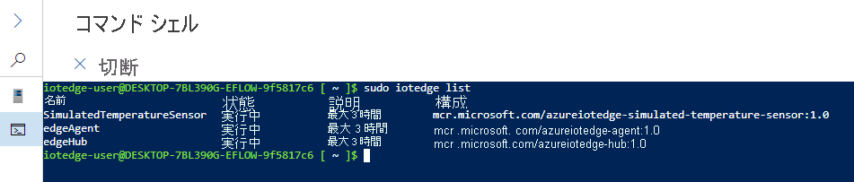

# <a name="quickstart-deploy-your-first-iot-edge-module-to-a-windows-device"></a>クイックスタート:初めての IoT Edge モジュールを Windows デバイスにデプロイする

[!INCLUDE [iot-edge-version-201806](../../includes/iot-edge-version-201806.md)]

このクイックスタートで、コンテナー化されたコードを Linux on Windows IoT Edge デバイスにデプロイして、Azure IoT Edge を試してみましょう。 IoT Edge を使用すると、ご利用のデバイス上のコードをリモートで管理できるため、より多くのワークロードをエッジに送信できます。 Azure IoT Edge for Linux on Windows を使うことがいかに簡単かを知っていただくために、このクイックスタートにはご自身のデバイスを使用することをお勧めします。

このクイック スタートでは、次の方法について説明します。

* IoT Hub を作成します。
* IoT Edge デバイスを IoT ハブに登録します。
* IoT Edge for Linux on Windows ランタイムをデバイスにインストールして起動します。
* IoT Edge デバイスにリモートでモジュールをデプロイし、テレメトリを送信します。


このクイックスタートでは、Azure IoT Edge for Linux on Windows デバイスの設定方法について説明します。 その後、Azure portal からご自身のデバイスにモジュールをデプロイします。 これから使用するモジュールは、温度、湿度、圧力のデータを生成するシミュレートされたセンサーです。 これ以外の Azure IoT Edge チュートリアルは、ここで行う作業を基に作成されており、ビジネスの分析情報を得る目的でシミュレートされたデータを分析するためのモジュールをデプロイします。

アクティブな Azure サブスクリプションをお持ちでない場合は、開始する前に[無料アカウント](https://azure.microsoft.com/free)を作成してください。

## <a name="prerequisites"></a>前提条件

Azure CLI の環境を準備します。

[!INCLUDE [azure-cli-prepare-your-environment-no-header.md](../../includes/azure-cli-prepare-your-environment-no-header.md)]

このクイックスタートで使用するすべてのリソースを管理するためのクラウド リソース グループを作成します。

   ```azurecli-interactive
   az group create --name IoTEdgeResources --location westus2
   ```

ご自身の IoT Edge デバイスが次の要件を満たしていることを確認します。

* システム要件
   * Windows 10¹/11 (Pro、Enterprise、IoT Enterprise)
   * Windows Server 2019¹/2022  
   <sub>¹ 現在のすべての累積更新プログラムがインストールされた Windows 10 および Windows Server 2019 最小ビルド 17763。</sub>

* ハードウェア要件
  * 最小空きメモリ容量: 1 GB
  * 最小空きディスク領域:10 GB

>[!NOTE]
>このクイックスタートでは、PowerShell を使用して、IoT Edge for Linux on Windows 用のデプロイを作成します。 Windows Admin Center を使用することもできます。 Windows Admin Center を使用してデプロイを作成する場合は、[Windows デバイスに Azure IoT Edge for Linux をインストールしてプロビジョニングする方法](how-to-provision-single-device-linux-on-windows-symmetric.md?tabs=windowsadmincenter)に関する攻略ガイドの手順に従ってください。

## <a name="create-an-iot-hub"></a>IoT Hub の作成

最初に Azure CLI を使用して IoT ハブを作成します。


このクイックスタートでは無料レベルの Azure IoT Hub を使用できます。 IoT Hub を以前に使用したことがあり、ハブを作成済みである場合は、その IoT ハブを使用することができます。

次のコードにより、無料の **F1** ハブがリソース グループ `IoTEdgeResources` に作成されます。 `{hub_name}` は、実際の IoT ハブの一意の名前に置き換えてください。 IoT ハブの作成には数分かかることがあります。

```azurecli-interactive
az iot hub create --resource-group IoTEdgeResources --name {hub_name} --sku F1 --partition-count 2
```

ご自分のサブスクリプションに無料のハブが既に 1 つあるためにエラーが発生する場合は、SKU を `S1` に変更します。 IoT ハブの名前が利用できないというエラーが発生した場合、自分以外のだれかが既にその名前のハブを所有しています。 新しい名前を試してください。

## <a name="register-an-iot-edge-device"></a>IoT Edge デバイスを登録する

新しく作成された IoT ハブに IoT Edge デバイスを登録します。


お使いの IoT ハブと通信できるようにシミュレートされたデバイスのデバイス ID を作成します。 デバイス ID はクラウドに置かれるので、デバイスの一意の接続文字列を使用して、物理デバイスとデバイス ID とを関連付けることになります。

IoT Edge デバイスは、通常の IoT デバイスとは異なる方法で動作し、管理方法も異なる場合があります。 `--edge-enabled` フラグを使用して、この ID が IoT Edge デバイス用であることを宣言します。

1. Azure Cloud Shell で、次のコマンドを入力して、**myEdgeDevice** という名前のデバイスをハブに作成します。

     ```azurecli-interactive
     az iot hub device-identity create --device-id myEdgeDevice --edge-enabled --hub-name {hub_name}
     ```

     `iothubowner` ポリシー キーに関するエラーが表示された場合は、Cloud Shell で最新バージョンの Azure IoT 拡張機能が実行されていることを確認してください。

1. デバイスの接続文字列を確認します。この接続文字列により、IoT Hub 内で物理デバイスとその ID をリンクさせます。 これには、IoT ハブの名前、デバイスの名前、そしてそれら 2 つの間の接続を認証する共有キーが含まれています。

     ```azurecli-interactive
     az iot hub device-identity connection-string show --device-id myEdgeDevice --hub-name {hub_name}
     ```

1. JSON 出力から `connectionString` キーの値をコピーして保存します。 この値はデバイスの接続文字列です。 次のセクションで、IoT Edge ランタイムを構成するときにこれを使用します。

     

## <a name="install-and-start-the-iot-edge-runtime"></a>IoT Edge ランタイムをインストールして開始する

IoT Edge for Linux on Windows を自分のデバイスにインストールし、デバイスの接続文字列を使用して構成します。


Azure IoT Edge for Linux on Windows をデプロイするターゲット デバイスで次の PowerShell コマンドを実行します。 PowerShell を使用してリモート ターゲット デバイスにデプロイするには、[リモート PowerShell](/powershell/module/microsoft.powershell.core/about/about_remote) を使用してリモート デバイスへの接続を確立し、そのデバイスでこれらのコマンドをリモートで実行します。

1. 管理者特権の PowerShell セッションで、次の各コマンドを実行し、IoT Edge for Linux on Windows をダウンロードします。

   ```powershell
   $msiPath = $([io.Path]::Combine($env:TEMP, 'AzureIoTEdge.msi'))
   $ProgressPreference = 'SilentlyContinue'
   Invoke-WebRequest "https://aka.ms/AzEflowMSI" -OutFile $msiPath
   ```

1. IoT Edge for Linux on Windows をデバイスにインストールします。

   ```powershell
   Start-Process -Wait msiexec -ArgumentList "/i","$([io.Path]::Combine($env:TEMP, 'AzureIoTEdge.msi'))","/qn"
   ```

1. ターゲット デバイスの実行ポリシーがまだ `AllSigned` に設定されていない場合、これを設定します。 現在の実行ポリシーは、管理者特権の PowerShell プロンプトで次のコマンドを使用して確認できます。

   ```powershell
   Get-ExecutionPolicy -List
   ```

   `local machine` の実行ポリシーが `AllSigned` になっていない場合は、次のようにして実行ポリシーを設定できます。

   ```powershell
   Set-ExecutionPolicy -ExecutionPolicy AllSigned -Force
   ```

1. IoT Edge for Linux on Windows のデプロイを作成します。

   ```powershell
   Deploy-Eflow
   ```

1. ライセンス条項に同意するには、「Y」と入力します。

1. 必要に応じて、「O」または「R」を入力して **[Optional diagnostic data]\(オプションの診断データ\)** をオンまたはオフに切り替えます。 デプロイが成功したときの表示を次に示します。

   ![デプロイが成功すると、メッセージの最後に [Deployment successful]\(デプロイ成功\) と表示されます](./media/quickstart/successful-powershell-deployment.png)

1. 前のセクションで取得したデバイス接続文字列を使用し、デバイスをプロビジョニングします。 プレースホルダー テキストは実際の値に置き換えてください。

   ```powershell
   Provision-EflowVm -provisioningType ManualConnectionString -devConnString "<CONNECTION_STRING_HERE>"
   ```

IoT Edge デバイスの構成はこれで完了です。 クラウドからモジュールをデプロイして実行することができます。

## <a name="deploy-a-module"></a>モジュールを展開する

Azure IoT Edge デバイスをクラウドから管理し、IoT Hub に利用統計情報を送信するモジュールをデプロイします。


<!--
[!INCLUDE [iot-edge-deploy-module](../../includes/iot-edge-deploy-module.md)]

Include content included below to support versioned steps in Linux quickstart. Can update include file once Windows quickstart supports v1.2
-->

Azure IoT Edge の主要な機能の 1 つは、クラウドからお客様の IoT Edge デバイスにコードをデプロイすることです。 *IoT Edge モジュール* は、コンテナーとして実装されている実行可能ファイルのパッケージです。 このセクションでは、[Azure Marketplace の IoT Edge モジュールのセクション](https://azuremarketplace.microsoft.com/marketplace/apps/category/internet-of-things?page=1&subcategories=iot-edge-modules)のあらかじめ構築されたモジュールを Azure IoT Hub から直接デプロイします。

このセクションでデプロイするモジュールはセンサーをシミュレートし、生成されたデータを送信します。 シミュレートされたデータを開発とテストに使用できるため、このモジュールは IoT Edge の使用を開始する際にコードの一部として役に立ちます。 このモジュールで行われる内容を正確に確認したい場合は、[シミュレートされた温度センサーのソース コード](https://github.com/Azure/iotedge/blob/027a509549a248647ed41ca7fe1dc508771c8123/edge-modules/SimulatedTemperatureSensor/src/Program.cs)をご覧いただけます。

Azure Marketplace からお客様の最初のモジュールをデプロイするには、次の手順に従います。

1. [Azure portal](https://portal.azure.com) にサインインし、お使いの IoT ハブに移動します。

1. 左側のメニューで、 **[デバイスの自動管理]** の下にある **[IoT Edge]** を選択します。

1. デバイスの一覧でターゲット デバイスのデバイス ID を選択します。

   新しい IoT Edge デバイスを作成すると、状態コード `417 -- The device's deployment configuration is not set` が Azure portal に表示されます。 この状態は正常であり、デバイスでモジュールのデプロイを受け取る準備ができていることを意味します。


1. 上部のバーで **[モジュールの設定]** を選択します。

   ![[モジュールの設定] の選択を示すスクリーンショット。](./media/quickstart/select-set-modules.png)

1. **[IoT Edge モジュール]** の下で、 **[追加]** ドロップダウン メニューを開き、 **[Marketplace モジュール]** を選択します。

   ![[追加] ドロップダウン メニューを示すスクリーンショット。](./media/quickstart/add-marketplace-module.png)

1. **[IoT Edge モジュールの Marketplace]** で、`Simulated Temperature Sensor` モジュールを検索して選択します。

   モジュールが [IoT Edge モジュール] セクションに追加されており、[必要な状態] が **[実行しています]** になっています。

1. **次へ:ルート** を選択し、ウィザードの次の手順に進みます。

   

1. **[ルート]** タブで、既定のルートの **route** を削除し、 **[次へ: 確認と作成]** を選択し、ウィザードの次の手順に進みます。

   >[!Note]
   >ルートは、名前と値のペアを使用して作成されます。 このページには 2 つのルートが表示されるはずです。 既定のルートの **route** では、すべてのメッセージが IoT Hub (名前は `$upstream`) に送信されます。 2 つ目のルート **SimulatedTemperatureSensorToIoTHub** は、Azure Marketplace からモジュールを追加したときに自動的に作成されました。 このルートでは、シミュレートされた温度モジュールから IoT Hub にすべてのメッセージが送信されます。 この場合、既定のルートは冗長となるため、削除できます。

   

1. JSON ファイルを確認し、 **[作成]** を選択します。 この JSON ファイルには、IoT Edge デバイスにデプロイするすべてのモジュールが定義されます。 **SimulatedTemperatureSensor** モジュールに加え、**edgeAgent** と **edgeHub** という 2 つのランタイム モジュールが含まれています。

   >[!Note]
   >IoT Edge デバイスに新しいデプロイを送信しても、デバイスには何もプッシュされません。 代わりに、デバイスから IoT Hub に対して、新しい指示のクエリが定期的に実行されます。 更新されたデプロイ マニフェストがデバイスによって検出されると、新しいデプロイに関する情報が使用されてクラウドからモジュール イメージがプルされ、ローカルでのモジュールの実行が開始されます。 このプロセスには数分かかることがあります。

1. モジュールのデプロイの詳細が作成されると、ウィザードは [デバイスの詳細] ページに戻ります。 **[モジュール]** タブでデプロイの状態を確認します。

   **$edgeAgent**、 **$edgeHub**、および **SimulatedTemperatureSensor** という 3 つのモジュールが表示されています。 **[デバイス別に報告]** ではなく **[デプロイで指定]** の下に **[はい]** となっているモジュールが 1 つ以上ある場合、それらはまだお客様の IoT Edge デバイスによって起動されている途中です。 数分待ってから、ページを更新します。

   

## <a name="view-the-generated-data"></a>生成されたデータを表示する

このクイック スタートでは、新しい IoT Edge デバイスを作成し、そこに IoT Edge ランタイムをインストールしました。 その後、Azure portal を使用して、IoT Edge モジュールをデプロイし、デバイス自体に変更を加えずにモジュールをデバイスで実行しました。

プッシュしたモジュールによって、後でテストするために使用できるサンプル環境データが生成されます。 シミュレートされたセンサーは、マシンと、マシンの周囲の環境の両方を監視します。 たとえば、このセンサーは、サーバー ルーム、工場のフロア、または風力タービンに配置されている可能性があります。 送信されるメッセージには、周囲の温度と湿度、機械の温度と圧力、タイムスタンプが含まれます。 IoT Edge のチュートリアルでは、このモジュールによって作成されたデータを分析用のテスト データとして使用します。

1. PowerShell セッションで次のコマンドを使用して、お使いの IoT Edge for Linux on Windows 仮想マシンにログインします。

   ```powershell
   Connect-EflowVm
   ```

   >[!NOTE]
   >仮想マシンへの SSH 接続が許可されるアカウントは、それを作成したユーザーだけです。

1. ログインすると、次の Linux コマンドを使用して、実行中の IoT Edge モジュールの一覧を確認できます。

   ```bash
   sudo iotedge list
   ```

   

1. 次の Linux コマンドを使用し、温度センサー モジュールからクラウドに送信されているメッセージを確認します。

   ```bash
   sudo iotedge logs SimulatedTemperatureSensor -f
   ```

   >[!IMPORTANT]
   >IoT Edge のコマンドでは、モジュール名を参照する際に大文字と小文字が区別されます。

   

[Visual Studio Code 用の Azure IoT Hub の拡張機能](https://marketplace.visualstudio.com/items?itemName=vsciot-vscode.azure-iot-toolkit)を使用して、自分の IoT ハブに到着したメッセージを監視することもできます。

## <a name="clean-up-resources"></a>リソースをクリーンアップする

IoT Edge チュートリアルを続行する場合、この手順はスキップしてください。 このクイックスタートで登録して設定したデバイスを使用することができます。 それ以外の場合は、課金されないようにするために、作成した Azure リソースを削除してもかまいません。

新しいリソース グループで仮想マシンと IoT ハブを作成した場合、そのグループと関連するすべてのリソースを削除できます。 グループ全体を削除したくない場合は、リソースを個別に削除してもかまいません。

> [!IMPORTANT]
> リソース グループの内容を確認して、残しておくべきものがないことを確認してください。 リソース グループを削除すると、元に戻すことができません。

次のコマンドを使用して **IoTEdgeResources** グループを削除します。 削除には数分かかることがあります。

```azurecli-interactive
az group delete --name IoTEdgeResources
```

リソース グループが削除されたことは、このコマンドを使用してリソース グループの一覧を表示することによって確認できます。

```azurecli-interactive
az group list
```

### <a name="remove-azure-iot-edge-for-linux-on-windows"></a>IoT Edge for Linux on Windows を削除する

Windows Admin Center のダッシュボード拡張機能を使用して、Azure IoT Edge for Linux on Windows をアンインストールします。

1. Windows Admin Center の Azure IoT Edge デバイスに接続します。 Azure ダッシュボード ツール拡張機能が読み込まれます。

1. **[アンインストール]** を選択します。 Azure IoT Edge が削除されると、Windows Admin Center の **[開始]** ページから Azure IoT Edge デバイスの接続エントリが削除されます。

>[!Note]
>また、ご自身の IoT Edge デバイスで **[スタート]** 、 **[設定]** 、 **[アプリ]** 、 **[Azure IoT Edge LTS]** 、 **[アンインストール]** の順に選択することで、Windows システムから Azure IoT Edge を削除することもできます。 この方法では、Azure IoT Edge が IoT Edge デバイスから削除されますが、その接続は Windows Admin Center に残ったままとなります。 削除を完了するには、 **[設定]** メニューから Windows Admin Center もアンインストールします。

## <a name="next-steps"></a>次のステップ

このクイック スタートでは、IoT Edge デバイスを作成し、Azure IoT Edge クラウド インターフェイスを使用してコードをデバイスにデプロイしました。 これで、環境に関する生データを生成するテスト デバイスができあがりました。

次のチュートリアルでは、Azure portal からデバイスのアクティビティと正常性を監視する方法について説明します。

> [!div class="nextstepaction"]
> [IoT Edge デバイスを監視する](tutorial-monitor-with-workbooks.md)
