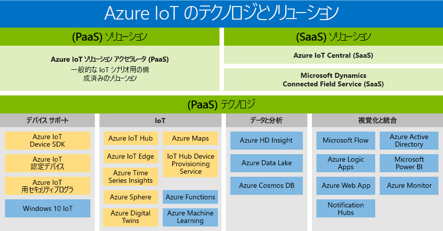

# モノのインターネット (IoT) テクノロジとソリューション: PaaS と SaaS

Microsoft には、デジタル変換の特典へのアクセスを有効にして、すべての顧客のニーズをサポートするポートフォリオが構築されています。 Azure IoT 製品群は、使用可能な PaaS/SaaS テクノロジとソリューションの概要です。 これには、独自のソリューションをビルドするために使用できる 2 つのパスが表示されます:

- サービスとしてのプラットフォーム (PaaS): 次のいずれかのサービスを使用するアプリケーションをビルドします。
    - [Azure IoT ソリューション アクセラレータ](https://www.azureiotsolutions.com/)。これらは、カスタム IoT ソリューションの開発を高速化するための、エンタープライズ レベルのあらかじめ構成されたソリューションのコレクションです。 
    - [Azure Digital Twins](https://azure.microsoft.com/services/digital-twins/) サービス。このサービスを使用すると、物理環境をモデル化し、空間インテリジェンス グラフとドメイン固有のオブジェクト モデルを使用して、コンテキスト認識の IoT ソリューションを作成することができます。

- サービスとしてのソフトウェア(SaaS): 高速で、開始[Azure IoT Central](https://azure.microsoft.com/services/iot-central/)、新しい SaaS ソリューションは、IoT ソリューションの複雑さにさらされることがなく IoT アプリケーションを開発します。 組織にIoT ソリューションをビルドするリソースが不足している場合、Azure IoT Central は、コード不要で数分以内にデバイス モデル、ダッシュ ボード、およびルールを作成できるIoT ソリューションです。

## 解決方法

ソリューション アクセラレータと SaaS サービスですばやく作業を開始します。 リモートの監視、予測の保守、および接続されているファクトリを完全にカスタマイズ可能なソリューションを作成するなど、一般的な IoT シナリオを有効にする構成済みのソリューションから選択します。 または、Azure IoT Central では、クラウド ソリューションに関する専門知識を必要としない、強力な IoT シナリオを実現するフル マネージドの、エンド ツー エンド ソリューションを使用します。

### Azure IoT ソリューション アクセラレータ (PaaS)

Azure IoT ソリューション アクセラレータは、高レベルの IoT ソリューションに制御を提供するカスタマイズ可能な PaaS ソリューションです。 企業が接続された操作のために IoT を実装する場合、または接続済み製品への特定のカスタマイズ要件がある場合は、Azure IoT ソリューション アクセラレータが必要なコントロールを提供します。 

多数のデバイスまたはデバイス モデルのある組織や、コネクテッド ファクトリ ソリューションを必要としている製造業者は、Azure IoT ソリューション アクセラレータから利点を活用できる会社の例です。 IoT ソリューション アクセラレータは、複雑なニーズに対応する高度なカスタマイズソリューションを作り出すことで、次のものを提供します。 

- 事前構築済みのソリューション
    - リモート監視
    - コネクテッド ファクトリ
    - 予測的なメンテナンス
    - デバイスのシミュレーション
- 数分でデプロイする性能
- 価値実現までを短縮した時間
- 最高のコントロールを提供するソリューション 
 
### Azure IoT Central (SaaS)

Azure IoT Central (SaaS) はフル マネージドの SaaS ソリューションで、最小限の IoT エクスペリエンスで簡単に開始できます。 ビジネスが、カスタマイズの速度を追求している場合、SaaS モデルは IoT 実装のニーズに最適にです。 

より少ないデバイスモデルで、より多くの予期できるシナリオを持ち、限られたIoT/IT 性能を持つ組織は、これからSaaS アプローチを通して IoTの利点を生かすことができます。 以前は接続済み製品を開発するための時間、資金、専門知識を持ち合わせていなかったビジネスは、今、Azure IoT Central で簡単に始めることができます。 Microsoft は、共通するIoT 実行の要件に応えた完成度の高い SaaS ソリューションを提供する先端企業です。 

- フル マネージドの IoT SaaS
- クラウドソリューション開発の専門知識を必要としない
- ニーズに合わせて構成可能
- 単純なIoT ニーズに最適

### Azure IoT ソリューション アクセラレータと Azure IoT Central の比較

一般的な [IoT ソリューションアーキテクチャ](/azure/iot-fundamentals/iot-introduction)を実装するため、Azure IoT は、[Azure IoT ソリューション アクセラレータ](/azure/iot-suite)や [Azure IoT Central](https://www.microsoft.com/internet-of-things/iot-central-saas-solutions)などの複数のオプションを提供しており、顧客のさまざまな要求のセットのそれぞれに対応しています。

[Azure IoT Hub](https://azure.microsoft.com/services/iot-hub/) は、Azure IoT Central と Azure IoT ソリューション アクセラレータの両方によって使用されるコア Azure PaaS です。 IoT Hub によって、何百万もの IoT デバイスとクラウド ソリューションの間で、安全かつ信頼性の高い双方向通信が実現します。 IoT Hub は、以下の IoT 実装の課題に対応するうえで役立ちます。

* 大量のデバイスの接続と管理。
* 大量のテレメトリ インジェスト。
* コマンドとデバイスの制御。
* デバイスに対するセキュリティの強制。

IoT ソリューションを計画するうえで、Azure IoT 製品の選択は重要です。 IoT Hub は、単独ではエンド ツー エンドの IoT ソリューションを提供することができない単一の Azure サービスです。 IoT Hub は、任意の IoT ソリューションの開始点として使用でき、これを使用するために Azure IoT ソリューション アクセラレータや Azure IoT Central を使用する必要はありません。 Azure IoT ソリューション アクセラレータと Azure IoT Central はどちらも、他の Azure サービスと共に IoT Hub を使用します。 要件に合わせていずれかを適切に選択できるように、Azure IoT ソリューション アクセラレータと Azure IoT Central の主な違いを次の表にまとめます。

|                        | Azure IoT ソリューション アクセラレータ | Azure IoT Central |
| ---------------------- | --------- | ----------- |
| 主な用途 | 最大限の柔軟性が求められるカスタム IoT ソリューションの開発を加速します。 | サービスの細かなカスタマイズを必要としないシンプルな IoT ソリューションの市場投入時間を短縮します。 |
| 基になる PaaS サービスへのアクセス          | 基になる Azure サービスにアクセスして管理します。または、必要に応じてサービスを置き換えます。 | SaaS。 フル マネージドのソリューション。基になるサービスは公開されません。 |
| 柔軟性            | 高。 マイクロサービスのコードはオープン ソースであるため、必要に応じて、どのようにも変更できます。 また、デプロイ インフラストラクチャをカスタマイズすることもできます。| 中。 組み込みのブラウザー ベースのユーザー エクスペリエンスを使用して、ソリューション モデルやさまざまな UI 要素をカスタマイズできます。 各種コンポーネントが公開されないため、インフラストラクチャをカスタマイズすることはできません。|
| 難易度                 | 中/高。 ソリューション バックエンドをカスタマイズするには、Java または .NET のスキルが必要です。 視覚化をカスタマイズするには、JavaScript のスキルが必要です。 | 低。 ソリューションをカスタマイズするには、モデリングのスキルが必要です。 コーディングのスキルは必要ありません。 |
| 開始 | ソリューション アクセラレータによって一般的な IoT シナリオが実装されます。 数分でデプロイできます。 | アプリケーション テンプレートとデバイス テンプレートには、既製のモデルが用意されています。 数分でデプロイできます。 |
| 価格                | サービスを細かく調整してコストを制御できます。 | シンプルで予測可能な料金体系です。 |

最終的には以下を検討して、どの製品を使って IoT ソリューションを構築するかを決定します。

* ビジネス要件
* 構築するソリューションの種類。
* ソリューションを構築し、長期にわたって保守管理するための組織のスキル セット

## テクノロジ (PaaS)

プラットフォーム サービスの最も包括的な IoT ポートフォリオは、Azure プラットフォームに配置されているサービスとしてのプラットフォーム (PaaS) テクノロジを使用すると、簡単に作成、カスタマイズでき、 IoT ソリューションのすべての側面をコントロールできます。 10億単位の IoT デバイスとの双方向通信を確立して、スケールで IoT デバイスを管理します。 Azure Cosmos DB や Azure Time Series Insights など、他のプラットフォーム サービスと IoT デバイスのデータを統合して、ソリューション全体のインサイトを強化します。 

### デバイスのサポート

[Azure IoT スタート キット](https://catalog.azureiotsolutions.com/kits)を活用したり、[デバイス カタログ](https://catalog.azureiotsolutions.com/)に掲載された数百もの Certified for IoT デバイスから選択することで、IoT プロジェクトを自信を持って始めることができます。 すべてのデバイスはどのプラットフォームでも使用可能であり、IoT Hub へシームレスに接続できることをテスト済みです。
オープン ソース [デバイス SDK](/azure/iot-hub/iot-hub-devguide-sdks) を使用すれば、すべてのデバイスを Azure IoT に接続できます。 SDK は複数のオペレーティング システム (Linux、Windows など)、リアルタイム オペレーティング システム、および複数のプログラミング言語 ([C](https://github.com/Azure/azure-iot-sdk-c)、[Node.js](https://github.com/Azure/azure-iot-sdk-node)、[Java](https://github.com/Azure/azure-iot-sdk-java)、[.NET](https://github.com/Azure/azure-iot-sdk-csharp)、[Python](https://github.com/Azure/azure-iot-sdk-python) など) をサポートしています。

### IoT 
[Azure IoT Hub](https://azure.microsoft.com/services/iot-hub/) は、何百万もの IoT デバイスとソリューション バックエンド間で、セキュリティで保護された信頼性のある双方向通信を実現する、フル マネージドのサービスです。 Azure IoT Hub Device Provisioning Service は、適切な IoT ハブへのゼロタッチでジャストインタイムなプロビジョニングを可能にする、IoT Hub のヘルパー サービスです。人間の介入を必要とせず、安全かつスケーラブルな方法で何百万というデバイスをプロビジョニングできます。

### Edge
[Azure IoT Edge](https://azure.microsoft.com/services/iot-edge/) は、IoT サービスです。 このサービスは、クラウド内ではなく、デバイスで (つまり "エッジで") データを分析したいお客様を対象としています "エッジで。" エッジをワークロードの部品を移動することによって、待機時間の削減が発生してオフライン シナリオのオプションができます。

### 空間インテリジェンス
[Azure Digital Twins](https://azure.microsoft.com/services/digital-twins/) は、物理環境のモデルを作成できるようにする IoT サービスです。 人、空間、およびデバイス間の関係をモデル化する空間インテリジェンス グラフを提供します。 デジタル世界と物理世界をまたいでデータを関連付けることで、コンテキスト認識ソリューションを作成することができます。  

### データと分析
Azure データと お使いのIoT ソリューションの分析 PaaS サービスを活用すれば、クラウドインテリジェンスの始めから、Azure Machine Learning でエッジ、Azure Data Lake でコスト効果のある強力なIoT デバイスデータ、[Azure Time Series Insights](https://azure.microsoft.com/services/time-series-insights/)でIoT デバイスから大量のデータを視覚することまでできます。

### 視覚化と統合
Microsoft Azure は完全なクラウド ソリューションを提供します。このソリューションは、統合した常に成長しているクラウド サービスのコレクションを、データの保護とプライバシーに関する業界最高水準のコミットメントと組み合わせたものです。 [Microsoft Azure](https://azure.microsoft.com/)の詳細はこちらをご覧ください。

## 次の手順

迅速かつ簡単に IoT 機能を試してみるには、[IoT Hub ドキュメントの開始](/azure/iot-hub/iot-hub-get-started)セクションを参照してください。 より詳しい実際の作業については、いずれかの [IoT Edge チュートリアル](/azure/iot-edge/tutorial-simulate-device-windows)をお試しください。
