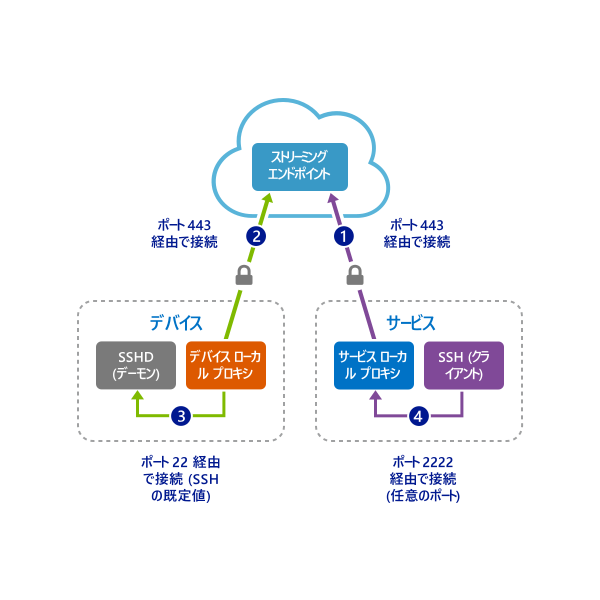

# <a name="quickstart-enable-ssh-and-rdp-over-an-iot-hub-device-stream-by-using-a-c-proxy-application-preview"></a>クイック スタート:C プロキシ アプリケーションを使用して IoT Hub デバイス ストリーム経由で SSH および RDP を有効にする (プレビュー)

[!INCLUDE [iot-hub-quickstarts-4-selector](../../includes/iot-hub-quickstarts-4-selector.md)]

Azure IoT Hub は現在、[プレビュー機能](https://azure.microsoft.com/support/legal/preview-supplemental-terms/)としてデバイス ストリームをサポートしています。

[IoT Hub デバイス ストリーム](./iot-hub-device-streams-overview.md)を使用すると、サービス アプリケーションとデバイス アプリケーションが、安全でファイアウォールに対応した方法で通信できます。 設定の概要については、[ローカル プロキシのサンプルに関するページ](./iot-hub-device-streams-overview.md#local-proxy-sample-for-ssh-or-rdp)を参照してください。

このクイックスタートでは、デバイス ストリームを通じて Secure Shell (SSH) トラフィック (ポート 22 を使用) をトンネリングするための設定について説明します。 リモート デスクトップ プロトコル (RDP) トラフィック用の設定も同様ですが、簡単な構成変更が必要です。 デバイス ストリームはアプリケーションやプロトコルに依存しないため、このクイックスタートを他の種類のアプリケーション トラフィックに対応するように変更できます。

## <a name="how-it-works"></a>動作のしくみ

次の図は、デバイスローカルおよびサービスローカルのプロキシ プログラムで、SSH クライアントと SSH デーモン プロセスの間のエンドツーエンド接続を可能にする方法を示しています。 パブリック プレビュー中、C SDK ではデバイス側のみのデバイス ストリームがサポートされます。 そのため、このクイックスタートでは、デバイスローカルのプロキシ アプリケーションのみを実行する手順について説明しています。 以下のサービス側のクイックスタートのいずれかを実行する必要があります。

* [C# プロキシを使用した IoT Hub デバイス ストリーム経由の SSH または RDP](./quickstart-device-streams-proxy-csharp.md)
* [NodeJS プロキシを使用した IoT Hub デバイス ストリーム経由の SSH または RDP](./quickstart-device-streams-proxy-nodejs.md)



1. サービスローカルのプロキシによって IoT ハブへの接続が行われ、ターゲット デバイスへのデバイス ストリームが開始されます。

2. デバイスローカルのプロキシによって、ストリームの開始ハンドシェイクが完了され、サーバー側への IoT ハブのストリーミング エンドポイントを通じてエンドツーエンドのストリーミング トンネルが確立されます。

3. デバイスローカル プロキシは、デバイス上のポート 22 をリッスンする SSH デーモンに接続されます。 「デバイスローカルのプロキシ アプリケーションの実行」セクションで説明されているように、この設定は構成可能です。

4. サービスローカルのプロキシは、指定されたポート (この場合はポート 2222) をリッスンして、ユーザーからの新しい SSH 接続を待機します。 「デバイスローカルのプロキシ アプリケーションの実行」セクションで説明されているように、この設定は構成可能です。 ユーザーが SSH クライアントを介して接続すると、トンネルによって SSH アプリケーション トラフィックが SSH クライアントとサーバー プログラムの間で転送されるようになります。

> [!NOTE]
> デバイス ストリームを介して送信される SSH トラフィックは、サービスとデバイスの間で直接送信されるのではなく、IoT ハブのストリーミング エンドポイントを介してトンネリングされます。 詳細については、[IoT Hub デバイス ストリームを使用する利点](iot-hub-device-streams-overview.md#benefits)に関するページを参照してください。 さらに、図ではデバイスローカルのプロキシと同じデバイス (またはマシン) 上で実行されている SSH デーモンが示されています。 このクイックスタートでは、SSH デーモンの IP アドレスを指定することで、デバイスローカルのプロキシとデーモンを異なるマシン上で実行することもできます。

[!INCLUDE [cloud-shell-try-it.md](../../includes/cloud-shell-try-it.md)]

Azure サブスクリプションがない場合は、開始する前に[無料アカウント](https://azure.microsoft.com/free/?WT.mc_id=A261C142F)を作成してください。

## <a name="prerequisites"></a>前提条件

* デバイス ストリームのプレビューは現在、以下のリージョンで作成された IoT ハブに対してのみサポートされています。

  * 米国中部
  * 米国中部 EUAP

* [C++ によるデスクトップ開発](https://www.visualstudio.com/vs/support/selecting-workloads-visual-studio-2017/)ワークロードを有効にした [Visual Studio 2019](https://www.visualstudio.com/vs/) をインストールします。
* 最新バージョンの [Git](https://git-scm.com/download/) をインストールします。

* 次のコマンドを実行して、Azure IoT Extension for Azure CLI を Cloud Shell インスタンスに追加します。 IoT Hub、IoT Edge、IoT Device Provisioning Service (DPS) 固有のコマンドが Azure CLI に追加されます。

   ```azurecli-interactive
   az extension add --name azure-cli-iot-ext
   ```

## <a name="prepare-the-development-environment"></a>開発環境の準備

このクイックスタートでは、[C 用 Azure IoT device SDK](iot-hub-device-sdk-c-intro.md) を使用します。[Azure IoT C SDK](https://github.com/Azure/azure-iot-sdk-c) を GitHub から複製してビルドするために使用される開発環境を準備します。 GitHub 上の SDK には、このクイックスタートで使用されるサンプル コードが含まれています。

1. [CMake ビルド システム](https://cmake.org/download/)をダウンロードします。

    CMake のインストールを開始する "*前*" に、Visual Studio の前提条件 (Visual Studio と "*C++ によるデスクトップ開発*" ワークロード) がマシンにインストールされていることが重要です。 前提条件を満たし、ダウンロードを検証したら、CMake ビルド システムをインストールできます。

1. コマンド プロンプトまたは Git Bash シェルを開きます。 次のコマンドを実行して、[Azure IoT C SDK](https://github.com/Azure/azure-iot-sdk-c) の GitHub リポジトリを複製します。

    ```
    git clone https://github.com/Azure/azure-iot-sdk-c.git --recursive -b public-preview
    ```

    この操作には数分かかります。

1. 次のコマンドで示されているように、Git リポジトリのルート ディレクトリに *cmake* サブディレクトリを作成し、そのフォルダーに移動します。

    ```
    cd azure-iot-sdk-c
    mkdir cmake
    cd cmake
    ```

1. *cmake* ディレクトリから次のコマンドを実行して、開発クライアント プラットフォームに固有の SDK のバージョンをビルドします。

   * Linux の場合:

      ```bash
      cmake ..
      make -j
      ```

   * Windows では、Visual Studio 2015 または 2017 用の開発者コマンド プロンプトで、次のコマンドを実行します。 シミュレートされたデバイスの Visual Studio ソリューションが *cmake* ディレクトリに生成されます。

      ```cmd
      rem For VS2015
      cmake .. -G "Visual Studio 14 2015"

      rem Or for VS2017
      cmake .. -G "Visual Studio 15 2017"

      rem Then build the project
      cmake --build . -- /m /p:Configuration=Release
      ```

## <a name="create-an-iot-hub"></a>IoT Hub の作成

[!INCLUDE [iot-hub-include-create-hub-device-streams](../../includes/iot-hub-include-create-hub-device-streams.md)]

## <a name="register-a-device"></a>デバイスの登録

デバイスを IoT ハブに接続するには、あらかじめ IoT ハブに登録しておく必要があります。 このセクションでは、[IoT 拡張機能](https://docs.microsoft.com/cli/azure/ext/azure-cli-iot-ext/iot?view=azure-cli-latest)と共に Azure Cloud Shell を使用して、シミュレートされたデバイスを登録します。

1. Cloud Shell で次のコマンドを実行してデバイス ID を作成します。

   > [!NOTE]
   > * *YourIoTHubName* プレースホルダーを、IoT ハブ用に選択した名前に置き換えます。
   > * 示されているように、*MyDevice* を使用します。 これは、登録済みデバイスに付けられた名前です。 デバイスに別の名前を選択した場合は、この記事全体でその名前を使用し、サンプル アプリケーションを実行する前に、アプリケーション内のデバイス名を更新します。

    ```azurecli-interactive
    az iot hub device-identity create --hub-name YourIoTHubName --device-id MyDevice
    ```

1. 先ほど登録したデバイスの "*デバイス接続文字列*" を取得するには、Cloud Shell で次のコマンドを実行します。

   > [!NOTE]
   > *YourIoTHubName* プレースホルダーを、IoT ハブ用に選択した名前に置き換えます。

    ```azurecli-interactive
    az iot hub device-identity show-connection-string --hub-name YourIoTHubName --device-id MyDevice --output table
    ```

    このクイックスタートの後の方で使用できるように、デバイス接続文字列を書き留めておきます。 次の例のようになります。

   `HostName={YourIoTHubName}.azure-devices.net;DeviceId=MyDevice;SharedAccessKey={YourSharedAccessKey}`

## <a name="ssh-to-a-device-via-device-streams"></a>デバイス ストリームを介したデバイスへの SSH 接続

このセクションでは、SSH トラフィックをトンネリングするためのエンドツーエンド ストリームを確立します。

### <a name="run-the-device-local-proxy-application"></a>デバイスローカルのプロキシ アプリケーションの実行

1. *iothub_client/samples/iothub_client_c2d_streaming_proxy_sample* フォルダーの *iothub_client_c2d_streaming_proxy_sample.c* ソース ファイルを編集して、デバイス接続文字列、ターゲット デバイス IP またはホスト名、SSH ポート 22 を指定します。

   ```C
   /* Paste in your iothub connection string  */
   static const char* connectionString = "[Connection string of IoT Hub]";
   static const char* localHost = "[IP/Host of your target machine]"; // Address of the local server to connect to.
   static const size_t localPort = 22; // Port of the local server to connect to.
   ```

1. サンプルをコンパイルします。

   ```bash
   # In Linux
   # Go to the sample's folder cmake/iothub_client/samples/iothub_client_c2d_streaming_proxy_sample
   make -j
   ```

   ```cmd
   rem In Windows
   rem Go to cmake at root of repository
   cmake --build . -- /m /p:Configuration=Release
   ```

1. デバイス上で、コンパイル済みプログラムを実行します。

   ```bash
   # In Linux
   # Go to the sample's folder cmake/iothub_client/samples/iothub_client_c2d_streaming_proxy_sample
   ./iothub_client_c2d_streaming_proxy_sample
   ```

   ```cmd
   rem In Windows
   rem Go to the sample's release folder cmake\iothub_client\samples\iothub_client_c2d_streaming_proxy_sample\Release
   iothub_client_c2d_streaming_proxy_sample.exe
   ```

### <a name="run-the-service-local-proxy-application"></a>サービスローカルのプロキシ アプリケーションの実行

「動作のしくみ」セクションで説明したように、SSH トラフィックをトンネリングするためにエンドツーエンドのストリームを確立するには、両端 (サービスとデバイスの両側) にローカル プロキシが必要です。 パブリック プレビュー中、IoT Hub C SDK ではデバイス側のみのデバイス ストリームがサポートされます。 サービスローカル プロキシをビルドして実行するには、次のいずれかのクイックスタートの手順に従ってください。

   * [C# プロキシ アプリを使用した IoT Hub デバイス ストリーム経由の SSH または RDP](./quickstart-device-streams-proxy-csharp.md)
   * [Node.js プロキシ アプリを使用した IoT Hub デバイス ストリーム経由の SSH または RDP](./quickstart-device-streams-proxy-nodejs.md)

### <a name="establish-an-ssh-session"></a>SSH セッションの確立

デバイスローカルとサービスローカルの両方のプロキシが実行されていると、お客様の SSH クライアント プログラムを使用して、(SSH デーモンに直接ではなく) ポート 2222 でサービスローカルのプロキシに接続します。

```cmd/sh
ssh <username>@localhost -p 2222
```

この時点で、SSH サインイン ウィンドウで資格情報の入力を求められます。

次の図は、`IP_address:22` の SSH デーモンに接続するデバイスローカルのプロキシのコンソール出力を示しています。


次の図は、SSH クライアント プログラムのコンソール出力を示しています。 SSH クライアントは、サービスローカルのプロキシがリッスンしているポート 22 に接続することで、SSH デーモンと通信します。


## <a name="clean-up-resources"></a>リソースのクリーンアップ

[!INCLUDE [iot-hub-quickstarts-clean-up-resources](../../includes/iot-hub-quickstarts-clean-up-resources-device-streams.md)]

## <a name="next-steps"></a>次の手順

このクイックスタートでは、IoT ハブの設定、デバイスの登録、デバイスローカルおよびサービスローカルのプロキシ プログラムのデプロイによる IoT Hub を通じたデバイス ストリームの確立、およびプロキシの使用による SSH トラフィックのトンネリングを行いました。

デバイス ストリームについて詳しく学習するには、次を参照してください。

> [!div class="nextstepaction"]
> [デバイス ストリームの概要](./iot-hub-device-streams-overview.md)
