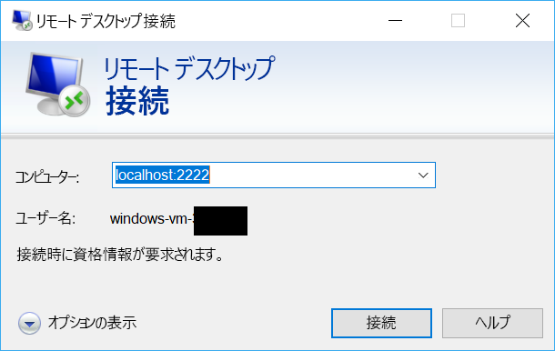

# <a name="quickstart-sshrdp-over-iot-hub-device-streams-using-c-proxy-applications-preview"></a>クイック スタート:C# プロキシ アプリケーションを使用した IoT Hub デバイス ストリーム経由の SSH または RDP (プレビュー)

[!INCLUDE [iot-hub-quickstarts-4-selector](../../includes/iot-hub-quickstarts-4-selector.md)]

Microsoft Azure IoT Hub は現在、[プレビュー機能](https://azure.microsoft.com/support/legal/preview-supplemental-terms/)としてデバイス ストリームをサポートしています。

[IoT Hub デバイス ストリーム](./iot-hub-device-streams-overview.md)を使用すると、サービス アプリケーションとデバイス アプリケーションが、安全でファイアウォールに対応した方法で通信できます。 このクイック スタート ガイドには、IoT Hub を通じて確立されたデバイス ストリームを介してクライアント/サーバー アプリケーション トラフィック (SSH、RDP など) を送信できるようにする、2 つの C# プログラムが含まれています。 設定の概要については、[こちら](./iot-hub-device-streams-overview.md#local-proxy-sample-for-ssh-or-rdp)を参照してください。

まず、SSH (ポート 22 を使用) の設定について説明します。 その後、設定の RDP 用のポートを変更する方法を説明します。 デバイス ストリームはアプリケーションやプロトコルに依存しないため、同じサンプルを他の種類のアプリケーション トラフィックに対応するように変更できます。 通常、この操作は、通信ポートを目的のアプリケーションで使用されるものに変更するだけで済みます。

## <a name="how-it-works"></a>動作のしくみ

次の図は、このサンプルのデバイスローカルおよびサービスローカルのプロキシ プログラムで、SSH クライアントと SSH デーモンの間のエンド ツー エンド接続を可能にする設定を示しています。 ここでは、デーモンがデバイスローカルのプロキシと同じデバイス上で実行されていると仮定します。


1. サービスローカルのプロキシが IoT ハブに接続し、そのデバイス ID を使用してターゲット デバイスへのデバイス ストリームを開始します。

2. デバイスローカルのプロキシによって、ストリームの開始ハンドシェイクが完了され、サーバー側への IoT Hub のストリーミング エンドポイントを通じてエンドツーエンドのストリーミング トンネルが確立されます。

3. デバイスローカルのプロキシが、デバイス上のポート 22 をリッスンする SSH デーモン (SSHD) に接続します ([以下](#run-the-device-local-proxy)で説明するように、このポートは構成可能です)。

4. サービスローカルのプロキシは、指定されたポート (この場合はポート 2222) をリッスンして、ユーザーからの新しい SSH 接続を待機します ([以下](#run-the-service-local-proxy)で説明するように、これも構成可能です)。 ユーザーが SSH クライアントを介して接続すると、トンネルによってアプリケーション トラフィックが SSH クライアントとサーバー プログラムの間で交換されるようになります。

> [!NOTE]
> ストリームを介して送信される SSH トラフィックは、サービスとデバイスの間で直接送信されるのではなく、IoT Hub のストリーミング エンドポイントを介してトンネリングされます。 このことには、[これらの利点](./iot-hub-device-streams-overview.md#benefits)があります。

[!INCLUDE [cloud-shell-try-it.md](../../includes/cloud-shell-try-it.md)]

Azure サブスクリプションがない場合は、開始する前に[無料アカウント](https://azure.microsoft.com/free/?WT.mc_id=A261C142F)を作成してください。

## <a name="prerequisites"></a>前提条件

デバイス ストリームのプレビューは現在、次のリージョンで作成された IoT Hub に対してのみサポートされています。

  - **米国中部**
  - **米国中部 EUAP**

このクイック スタートで実行する 2 つのサンプル アプリケーションは、C# を使って書かれています。 開発用コンピューター上に .NET Core SDK 2.1.0 以降が必要です。

複数のプラットフォームに対応する .NET Core SDK を [.NET](https://www.microsoft.com/net/download/all) からダウンロードできます。

開発コンピューターに現在インストールされている C# のバージョンは、次のコマンドを使って確認できます。

```
dotnet --version
```

次のコマンドを実行して、Microsoft Azure IoT Extension for Azure CLI を Cloud Shell インスタンスに追加します。 IoT Hub、IoT Edge、IoT Device Provisioning Service (DPS) 固有のコマンドが Azure CLI に追加されます。

```azurecli-interactive
az extension add --name azure-cli-iot-ext
```

https://github.com/Azure-Samples/azure-iot-samples-csharp/archive/master.zip からサンプル C# プロジェクトをダウンロードし、ZIP アーカイブを抽出します。

## <a name="create-an-iot-hub"></a>IoT Hub の作成

[!INCLUDE [iot-hub-include-create-hub](../../includes/iot-hub-include-create-hub-device-streams.md)]

## <a name="register-a-device"></a>デバイスの登録

デバイスを IoT ハブに接続するには、あらかじめ IoT ハブに登録しておく必要があります。 このクイック スタートでは、Azure Cloud Shell を使用して、シミュレートされたデバイスを登録します。

1. Azure Cloud Shell で次のコマンドを実行してデバイス ID を作成します。

   **YourIoTHubName**: このプレースホルダーは、実際の IoT ハブに対して選んだ名前に置き換えてください。

   **MyDevice**: これは、登録済みデバイスに付けられた名前です。 示されているように、MyDevice を使用します。 デバイスに別の名前を選択した場合は、この記事全体でその名前を使用する必要があります。また、サンプル アプリケーションを実行する前に、アプリケーション内のデバイス名を更新してください。

    ```azurecli-interactive
    az iot hub device-identity create --hub-name YourIoTHubName --device-id MyDevice
    ```

2. Azure Cloud Shell で次のコマンドを実行して、登録したデバイスの "_デバイス接続文字列_" を取得します。

   **YourIoTHubName**: このプレースホルダーは、実際の IoT ハブに対して選んだ名前に置き換えてください。

    ```azurecli-interactive
    az iot hub device-identity show-connection-string --hub-name YourIoTHubName --device-id MyDevice --output table
    ```

    次の例のような、デバイスの接続文字列をメモしておきます。

   `HostName={YourIoTHubName}.azure-devices.net;DeviceId=MyDevice;SharedAccessKey={YourSharedAccessKey}`

    この値は、このクイック スタートの後の方で使います。

3. また、サービス側アプリケーションが IoT ハブに接続してデバイス ストリームを確立できるようにするには、IoT ハブの "_サービス接続文字列_" も必要です。 次のコマンドを実行すると、自分の IoT ハブのこの値が取得されます。

   **YourIoTHubName**: このプレースホルダーは、実際の IoT ハブに対して選んだ名前に置き換えてください。

    ```azurecli-interactive
    az iot hub show-connection-string --policy-name service --name YourIoTHubName
    ```

    次のような戻り値をメモしておきます。

   `"HostName={YourIoTHubName}.azure-devices.net;SharedAccessKeyName=service;SharedAccessKey={YourSharedAccessKey}"`
    

## <a name="ssh-to-a-device-via-device-streams"></a>デバイス ストリームを介したデバイスへの SSH 接続

### <a name="run-the-device-local-proxy"></a>デバイスローカルのプロキシの実行

解凍したプロジェクト フォルダーの `device-streams-proxy/device` に移動します。 以下の情報が必要になります。

| 引数名 | 引数値 |
|----------------|-----------------|
| `deviceConnectionString` | 前に作成したデバイスの接続文字列。 |
| `targetServiceHostName` | SSH サーバーがリッスンしている IP アドレス (デバイスローカルのプロキシが実行されているのと同じ IP の場合、これは `localhost` になります)。 |
| `targetServicePort` | アプリケーション プロトコルによって使用されるポート (既定では、これは SSH 用のポート 22)。  |

次のようにコードをコンパイルして実行します。

```
cd ./iot-hub/Quickstarts/device-streams-proxy/device/

# Build the application
dotnet build

# Run the application
# In Linux/MacOS
dotnet run $deviceConnectionString localhost 22

# In Windows
dotnet run %deviceConnectionString% localhost 22
```

### <a name="run-the-service-local-proxy"></a>サービスローカルのプロキシの実行

解凍したプロジェクト フォルダーの `device-streams-proxy/service` に移動します。 以下の情報が必要になります。

| パラメーター名 | パラメーター値 |
|----------------|-----------------|
| `iotHubConnectionString` | IoT Hub のサービス接続文字列。 |
| `deviceId` | 前に作成したデバイスの識別子。 |
| `localPortNumber` | SSH クライアントの接続先のローカル ポート。 このサンプルではポート 2222 を使用していますが、これを他の任意の数に変更できます。 |

次のようにコードをコンパイルして実行します。

```
cd ./iot-hub/Quickstarts/device-streams-proxy/service/

# Build the application
dotnet build

# Run the application
# In Linux/MacOS
dotnet run $serviceConnectionString MyDevice 2222

# In Windows
dotnet run %serviceConnectionString% MyDevice 2222
```

### <a name="run-ssh-client"></a>SSH クライアントを実行する

次に SSH クライアント プログラムを使用してポート 2222 でサービスローカルのプロキシに接続します (SSH デーモンに直接ではなく)。 

```
ssh <username>@localhost -p 2222
```

この時点で、お客様の資格情報を入力するための SSH ログイン プロンプトが表示されます。

サービス側のコンソール出力 (サービスローカルのプロキシはポート 2222 をリッスンします):


`IP_address:22` の SSH デーモンに接続するデバイスローカルのプロキシのコンソール出力:


SSH クライアント プログラムのコンソール出力 (SSH クライアントは、サービスローカルのプロキシがリッスンしているポート 22 に接続することで、SSH デーモンと通信します):


## <a name="rdp-to-a-device-via-device-streams"></a>デバイス ストリームを介したデバイスへの RDP 接続

RDP の設定は、SSH (上記) によく似ています。 基本的には、代わりに RDP 接続先 IP とポート 3389 を使用し、RDP クライアントを使用する必要があります (SSH クライアントではなく)。

### <a name="run-the-device-local-proxy-rdp"></a>デバイスローカルのプロキシを実行する (RDP)

解凍したプロジェクト フォルダーの `device-streams-proxy/device` に移動します。 以下の情報が必要になります。

| 引数名 | 引数値 |
|----------------|-----------------|
| `DeviceConnectionString` | 前に作成したデバイスの接続文字列。 |
| `targetServiceHostName` | RDP サーバーが実行されているホストの名前または IP アドレス (デバイスローカルのプロキシが実行されているのと同じ IP の場合、これは `localhost` になります)。 |
| `targetServicePort` | アプリケーション プロトコルによって使用されるポート (既定では、これは RDP 用のポート 3389)。  |

次のようにコードをコンパイルして実行します。

```
cd ./iot-hub/Quickstarts/device-streams-proxy/device

# Run the application
# In Linux/MacOS
dotnet run $DeviceConnectionString localhost 3389

# In Windows
dotnet run %DeviceConnectionString% localhost 3389
```

### <a name="run-the-service-local-proxy-rdp"></a>サービスローカルのプロキシを実行する (RDP)

解凍したプロジェクト フォルダーの `device-streams-proxy/service` に移動します。 以下の情報が必要になります。

| パラメーター名 | パラメーター値 |
|----------------|-----------------|
| `iotHubConnectionString` | IoT Hub のサービス接続文字列。 |
| `deviceId` | 前に作成したデバイスの識別子。 |
| `localPortNumber` | SSH クライアントの接続先のローカル ポート。 このサンプルではポート 2222 を使用していますが、これを他の任意の数に変更できます。 |

次のようにコードをコンパイルして実行します。

```
cd ./iot-hub/Quickstarts/device-streams-proxy/service/

# Build the application
dotnet build

# Run the application
# In Linux/MacOS
dotnet run $serviceConnectionString MyDevice 2222

# In Windows
dotnet run %serviceConnectionString% MyDevice 2222
```

### <a name="run-rdp-client"></a>RDP クライアントを実行する

次に、RDP クライアント プログラムを使用し、ポート 2222 (これは、前に選択した任意の使用可能なポートです) でサービスローカルのプロキシに接続します。



## <a name="clean-up-resources"></a>リソースのクリーンアップ

[!INCLUDE [iot-hub-quickstarts-clean-up-resources](../../includes/iot-hub-quickstarts-clean-up-resources-device-streams.md)]

## <a name="next-steps"></a>次の手順

このクイック スタートでは、IoT ハブの設定、デバイスの登録、デバイスローカルおよびサービスローカルのプロキシ プログラムのデプロイによる IoT Hub を通じたデバイス ストリームの確立、およびプロキシの使用による SSH または RDP トラフィックのトンネリングを行いました。 同じパラダイムで、他のクライアント/サーバー プロトコル (SSH デーモンのように、デバイス上でサーバーが実行される) に対応できます。

以下のリンクを使用して、デバイス ストリームについてさらに詳しく学習します。

> [!div class="nextstepaction"]
> [デバイス ストリームの概要](./iot-hub-device-streams-overview.md)
