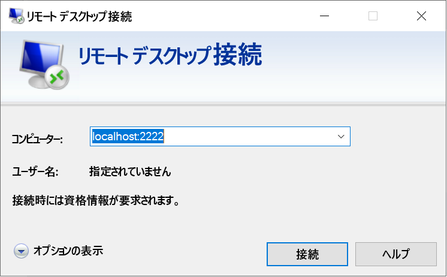

# <a name="quickstart-enable-ssh-and-rdp-over-an-iot-hub-device-stream-by-using-a-c-proxy-application-preview"></a>クイック スタート:C# プロキシ アプリケーションを使用して IoT Hub デバイス ストリーム経由で SSH および RDP を有効にする (プレビュー)

[!INCLUDE [iot-hub-quickstarts-4-selector](../../includes/iot-hub-quickstarts-4-selector.md)]

Microsoft Azure IoT Hub は現在、[プレビュー機能](https://azure.microsoft.com/support/legal/preview-supplemental-terms/)としてデバイス ストリームをサポートしています。

[IoT Hub デバイス ストリーム](iot-hub-device-streams-overview.md)を使用すると、サービス アプリケーションとデバイス アプリケーションが、安全でファイアウォールに対応した方法で通信できます。 このクイックスタート ガイドには、IoT ハブを通じて確立されたデバイス ストリームを介してクライアント/サーバー アプリケーション トラフィック (Secure Shell (SSH)、リモート デスクトップ プロトコル (RDP) など) を送信できるようにする、2 つの C# アプリケーションが含まれています。 設定の概要については、[SSH または RDP 用のローカル プロキシ アプリケーションのサンプル](iot-hub-device-streams-overview.md#local-proxy-sample-for-ssh-or-rdp)に関するページを参照してください。

この記事では、まず SSH (ポート 22 を使用) の設定について説明し、次に設定のポートを RDP 用に変更する方法について説明します。 デバイス ストリームはアプリケーションやプロトコルに依存しないため、同じサンプルを他の種類のアプリケーション トラフィックに対応するように変更できます。 通常、この変更は、通信ポートを目的のアプリケーションで使用されるものに変更するだけで済みます。

## <a name="how-it-works"></a>しくみ

次の図は、この例でデバイスローカルおよびサービスローカルのプロキシ アプリケーションで、SSH クライアントと SSH デーモン プロセスの間のエンドツーエンド接続を可能にする設定を示しています。 ここでは、デーモンがデバイスローカルのプロキシ アプリケーションと同じデバイス上で実行されていると仮定します。


1. サービスローカルのプロキシ アプリケーションが IoT ハブに接続し、ターゲット デバイスへのデバイス ストリームを開始します。

1. デバイスローカルのプロキシ アプリケーションによって、ストリームの開始ハンドシェイクが完了され、サーバー側への IoT ハブのストリーミング エンドポイントを通じてエンドツーエンドのストリーミング トンネルが確立されます。

1. デバイスローカルのプロキシ アプリケーションは、デバイス上のポート 22 をリッスンする SSH デーモンに接続されます。 「デバイスローカルのプロキシ アプリケーションの実行」セクションで説明されているように、この設定は構成可能です。

1. サービスローカルのプロキシ アプリケーションは、指定されたポート (この場合はポート 2222) をリッスンして、ユーザーからの新しい SSH 接続を待機します。 「サービスローカルのプロキシ アプリケーションの実行」セクションで説明されているように、この設定は構成可能です。 ユーザーが SSH クライアントを介して接続すると、トンネルによって SSH アプリケーション トラフィックが SSH クライアントとサーバー アプリケーションの間で転送されるようになります。

> [!NOTE]
> デバイス ストリームを介して送信される SSH トラフィックは、サービスとデバイスの間で直接送信されるのではなく、IoT ハブのストリーミング エンドポイントを介してトンネリングされます。 詳細については、[IoT Hub デバイス ストリームを使用する利点](iot-hub-device-streams-overview.md#benefits)に関するページを参照してください。

[!INCLUDE [cloud-shell-try-it.md](../../includes/cloud-shell-try-it.md)]

Azure サブスクリプションがない場合は、開始する前に[無料アカウント](https://azure.microsoft.com/free/?WT.mc_id=A261C142F)を作成してください。

## <a name="prerequisites"></a>前提条件

* デバイス ストリームのプレビューは現在、以下のリージョンで作成された IoT ハブに対してのみサポートされています。

  * 米国中部
  * 米国中部 EUAP
  * 東南アジア
  * 北ヨーロッパ

* このクイックスタートで実行する 2 つのサンプル アプリケーションは、C# を使って書かれています。 開発マシン上に .NET Core SDK 2.1.0 以降が必要です。

  [複数のプラットフォームに対応する .NET Core SDK を .NET から](https://www.microsoft.com/net/download/all)ダウンロードできます。

* 次のコマンドを使用して、開発マシンの C# の現在のバージョンを確認します。

    ```
    dotnet --version
    ```

* 次のコマンドを実行して、Azure IoT Extension for Azure CLI を Cloud Shell インスタンスに追加します。 IoT Hub、IoT Edge、IoT Device Provisioning Service (DPS) 固有のコマンドが Azure CLI に追加されます。

   ```azurecli-interactive
   az extension add --name azure-cli-iot-ext
   ```

* [Azure IoT C# サンプルをダウンロード](https://github.com/Azure-Samples/azure-iot-samples-csharp/archive/master.zip)し、ZIP アーカイブを展開します。

* ユーザーを認証するために使用されるデバイスの有効なユーザー アカウントと資格情報 (Windows または Linux)。

## <a name="create-an-iot-hub"></a>IoT Hub の作成

[!INCLUDE [iot-hub-include-create-hub-device-streams](../../includes/iot-hub-include-create-hub-device-streams.md)]

## <a name="register-a-device"></a>デバイスの登録

デバイスを IoT Hub に接続するには、あらかじめ IoT Hub に登録しておく必要があります。 このクイックスタートでは、Azure Cloud Shell を使用して、シミュレートされたデバイスを登録します。

1. Cloud Shell で次のコマンドを実行してデバイス ID を作成します。

   > [!NOTE]
   > * *YourIoTHubName* プレースホルダーを、IoT ハブ用に選択した名前に置き換えます。
   > * 登録しているデバイスの名前については、示されているように、*MyDevice* を使用することをお勧めします。 デバイスに別の名前を選択した場合は、この記事全体でその名前を使用し、サンプル アプリケーションを実行する前に、アプリケーション内のデバイス名を更新します。

    ```azurecli-interactive
    az iot hub device-identity create --hub-name {YourIoTHubName} --device-id MyDevice
    ```

1. 先ほど登録したデバイスの "*デバイス接続文字列*" を取得するには、Cloud Shell で次のコマンドを実行します。

   > [!NOTE]
   > *YourIoTHubName* プレースホルダーを、IoT ハブ用に選択した名前に置き換えます。

    ```azurecli-interactive
    az iot hub device-identity show-connection-string --hub-name {YourIoTHubName} --device-id MyDevice --output table
    ```

    このクイックスタートの後の方で使用できるように、返されたデバイス接続文字列を書き留めておきます。 次の例のようになります。

   `HostName={YourIoTHubName}.azure-devices.net;DeviceId=MyDevice;SharedAccessKey={YourSharedAccessKey}`

1. また、サービス側アプリケーションが IoT ハブに接続してデバイス ストリームを確立できるようにするには、ご自分の IoT ハブの "*サービス接続文字列*" も必要です。 次のコマンドを実行すると、自分の IoT ハブのこの値が取得されます。

   > [!NOTE]
   > *YourIoTHubName* プレースホルダーを、IoT ハブ用に選択した名前に置き換えます。

    ```azurecli-interactive
    az iot hub show-connection-string --policy-name service --name {YourIoTHubName} --output table
    ```

    このクイックスタートの後の方で使用できるように、返されたサービス接続文字列を書き留めておきます。 次の例のようになります。

   `"HostName={YourIoTHubName}.azure-devices.net;SharedAccessKeyName=service;SharedAccessKey={YourSharedAccessKey}"`

## <a name="ssh-to-a-device-via-device-streams"></a>デバイス ストリームを介したデバイスへの SSH 接続

このセクションでは、SSH トラフィックをトンネリングするためのエンドツーエンド ストリームを確立します。

### <a name="run-the-device-local-proxy-application"></a>デバイスローカルのプロキシ アプリケーションの実行

ローカル ターミナル ウィンドウで、解凍したプロジェクト フォルダーの `device-streams-proxy/device` ディレクトリに移動します。 以下の情報を手元に用意しておいてください。

| 引数名 | 引数値 |
|----------------|-----------------|
| `DeviceConnectionString` | 前に作成したデバイスのデバイス接続文字列。 |
| `targetServiceHostName` | SSH サーバーがリッスンする IP アドレス。 デバイスローカルのプロキシ アプリケーションが実行されているのと同じ IP である場合、アドレスは `localhost` です。 |
| `targetServicePort` | アプリケーション プロトコルによって使用されるポート (SSH の場合、既定ではポート 22)。  |

以下のコマンドを使用して、コードをコンパイルし、実行します。

```
cd ./iot-hub/Quickstarts/device-streams-proxy/device/

# Build the application
dotnet build

# Run the application
# In Linux or macOS
dotnet run ${DeviceConnectionString} localhost 22

# In Windows
dotnet run {DeviceConnectionString} localhost 22
```

### <a name="run-the-service-local-proxy-application"></a>サービスローカルのプロキシ アプリケーションの実行

別のローカル ターミナル ウィンドウで、解凍したプロジェクト フォルダーの `iot-hub/quickstarts/device-streams-proxy/service` に移動します。 以下の情報を手元に用意しておいてください。

| パラメーター名 | パラメーター値 |
|----------------|-----------------|
| `ServiceConnectionString` | IoT Hub のサービス接続文字列。 |
| `MyDevice` | 前に作成したデバイスの識別子。 |
| `localPortNumber` | SSH クライアントの接続先のローカル ポート。 このサンプルではポート 2222 を使用していますが、他の任意の数を使用することもできます。 |

以下のコマンドを使用して、コードをコンパイルし、実行します。

```
cd ./iot-hub/Quickstarts/device-streams-proxy/service/

# Build the application
dotnet build

# Run the application
# In Linux or macOS
dotnet run ${ServiceConnectionString} MyDevice 2222

# In Windows
dotnet run {ServiceConnectionString} MyDevice 2222
```

### <a name="run-the-ssh-client"></a>SSH クライアントの実行

次に SSH クライアント アプリケーションを使用してポート 2222 でサービスローカルのプロキシ アプリケーションに接続します (SSH デーモンに直接ではなく)。

```
ssh {username}@localhost -p 2222
```

この時点で、SSH サインイン ウィンドウで資格情報の入力を求められます。

サービス側のコンソール出力 (サービスローカルのプロキシ アプリケーションはポート 2222 をリッスンします):


*IP_address:22* の SSH デーモンに接続するデバイスローカルのプロキシ アプリケーションのコンソール出力:


SSH クライアント アプリケーションのコンソール出力。 SSH クライアントは、サービスローカルのプロキシ アプリケーションがリッスンしているポート 22 に接続することで、SSH デーモンと通信します。


## <a name="rdp-to-a-device-via-device-streams"></a>デバイス ストリームを介したデバイスへの RDP 接続

RDP の設定は、SSH の設定 (上記) に似ています。 代わりに RDP 接続先 IP とポート 3389 を使用し、(SSH クライアントではなく) RDP クライアントを使用します。

### <a name="run-the-device-local-proxy-application-rdp"></a>デバイスローカルのプロキシ アプリケーション (RDP) の実行

ローカル ターミナル ウィンドウで、解凍したプロジェクト フォルダーの `device-streams-proxy/device` ディレクトリに移動します。 以下の情報を手元に用意しておいてください。

| 引数名 | 引数値 |
|----------------|-----------------|
| `DeviceConnectionString` | 前に作成したデバイスのデバイス接続文字列。 |
| `targetServiceHostName` | RDP サーバーが実行されているホスト名または IP アドレス。 デバイスローカルのプロキシ アプリケーションが実行されているのと同じ IP である場合、アドレスは `localhost` です。 |
| `targetServicePort` | アプリケーション プロトコルによって使用されるポート (RDP の場合、既定ではポート 3389)。  |

以下のコマンドを使用して、コードをコンパイルし、実行します。

```
cd ./iot-hub/Quickstarts/device-streams-proxy/device

# Run the application
# In Linux or macOS
dotnet run ${DeviceConnectionString} localhost 3389

# In Windows
dotnet run {DeviceConnectionString} localhost 3389
```

### <a name="run-the-service-local-proxy-application-rdp"></a>サービスローカルのプロキシ アプリケーション (RDP) の実行

別のローカル ターミナル ウィンドウで、解凍したプロジェクト フォルダーの `device-streams-proxy/service` に移動します。 以下の情報を手元に用意しておいてください。

| パラメーター名 | パラメーター値 |
|----------------|-----------------|
| `ServiceConnectionString` | IoT Hub のサービス接続文字列。 |
| `MyDevice` | 前に作成したデバイスの識別子。 |
| `localPortNumber` | SSH クライアントの接続先のローカル ポート。 このサンプルではポート 2222 を使用していますが、これを他の任意の数に変更できます。 |

以下のコマンドを使用して、コードをコンパイルし、実行します。

```
cd ./iot-hub/Quickstarts/device-streams-proxy/service/

# Build the application
dotnet build

# Run the application
# In Linux or macOS
dotnet run ${ServiceConnectionString} MyDevice 2222

# In Windows
dotnet run {ServiceConnectionString} MyDevice 2222
```

### <a name="run-rdp-client"></a>RDP クライアントを実行する

次に、RDP クライアント アプリケーションを使用し、ポート 2222 (これは、前に選択した任意の使用可能なポートです) でサービスローカルのプロキシ アプリケーションに接続します。



## <a name="clean-up-resources"></a>リソースをクリーンアップする

[!INCLUDE [iot-hub-quickstarts-clean-up-resources](../../includes/iot-hub-quickstarts-clean-up-resources-device-streams.md)]

## <a name="next-steps"></a>次のステップ

このクイックスタートでは、IoT ハブの設定、デバイスの登録、デバイスローカルおよびサービスローカルのプロキシ アプリケーションのデプロイによる IoT ハブを通じたデバイス ストリームの確立、およびプロキシ アプリケーションの使用による SSH または RDP トラフィックのトンネリングを行いました。 同じパラダイムで、他のクライアント/サーバー プロトコル (SSH デーモンのように、デバイス上でサーバーが実行される) に対応できます。

デバイス ストリームについて詳しく学習するには、次を参照してください。

> [!div class="nextstepaction"]
> [デバイス ストリームの概要](./iot-hub-device-streams-overview.md)
