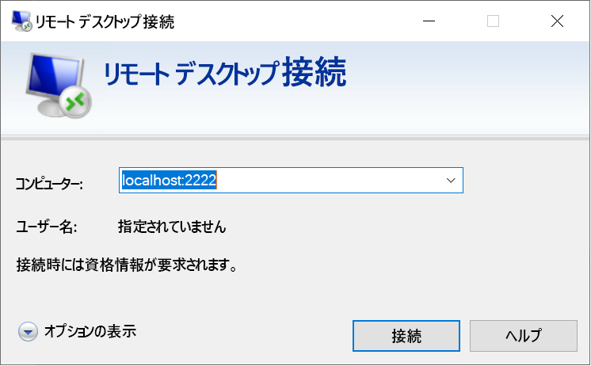

# <a name="quickstart-enable-ssh-and-rdp-over-an-iot-hub-device-stream-by-using-a-nodejs-proxy-application-preview"></a>クイック スタート:Node.js プロキシ アプリケーションを使用して IoT Hub デバイス ストリーム経由で SSH および RDP を有効にする (プレビュー)

[!INCLUDE [iot-hub-quickstarts-4-selector](../../includes/iot-hub-quickstarts-4-selector.md)]

このクイックスタートでは、デバイス ストリームを介して Secure Shell (SSH) およびリモート デスクトップ プロトコル (RDP) トラフィックをデバイスに送信できるようにします。 Azure IoT Hub デバイス ストリームを使用すると、サービス アプリケーションとデバイス アプリケーションが、安全でファイアウォールに対応した方法で通信できます。 このクイックスタートでは、サービス側での Node.js プロキシ アプリケーションの実行について説明します。 パブリック プレビュー中、Node.js SDK ではサービス側のみでデバイス ストリームがサポートされます。 そのため、このクイックスタートでは、サービスローカルのプロキシ アプリケーションのみを実行する手順について説明しています。

## <a name="prerequisites"></a>前提条件

* [C プロキシ アプリケーションを使用して IoT Hub デバイス ストリーム経由で SSH および RDP を有効にする](./quickstart-device-streams-proxy-c.md)クイックスタートまたは [C# プロキシ アプリケーションを使用して IoT Hub デバイス ストリーム経由で SSH および RDP を有効にする](./quickstart-device-streams-proxy-csharp.md)クイックスタートが完了していること。

* アクティブなサブスクリプションが含まれる Azure アカウント。 [無料で作成できます](https://azure.microsoft.com/free/?ref=microsoft.com&utm_source=microsoft.com&utm_medium=docs&utm_campaign=visualstudio)。

* [Node.js 10 以上](https://nodejs.org)。

* [サンプル Node.js プロジェクト](https://github.com/Azure-Samples/azure-iot-samples-node/archive/streams-preview.zip)。

開発マシンに現在インストールされている Node.js のバージョンは、次のコマンドを使って確認できます。

```cmd/sh
node --version
```

Microsoft Azure IoT Hub は現在、[プレビュー機能](https://azure.microsoft.com/support/legal/preview-supplemental-terms/)としてデバイス ストリームをサポートしています。

> [!IMPORTANT]
> デバイス ストリームのプレビューは現在、次のリージョンで作成された IoT Hub に対してのみサポートされています。
>
> * 米国中部
> * 米国中部 EUAP
> * 北ヨーロッパ
> * 東南アジア
  
[!INCLUDE [cloud-shell-try-it.md](../../includes/cloud-shell-try-it.md)]

### <a name="add-azure-iot-extension"></a>Azure IoT 拡張機能を追加する

次のコマンドを実行して、Azure IoT Extension for Azure CLI を Cloud Shell インスタンスに追加します。 IoT Hub、IoT Edge、IoT Device Provisioning Service (DPS) 固有のコマンドが Azure CLI に追加されます。

```azurecli-interactive
az extension add --name azure-iot
```

[!INCLUDE [iot-hub-cli-version-info](../../includes/iot-hub-cli-version-info.md)]

## <a name="create-an-iot-hub"></a>IoT Hub の作成

前出の[デバイスから IoT ハブへの利用統計情報の送信に関するクイック スタート](quickstart-send-telemetry-node.md)を完了した場合は、この手順を省略できます。

[!INCLUDE [iot-hub-include-create-hub](../../includes/iot-hub-include-create-hub.md)]

## <a name="register-a-device"></a>デバイスの登録

「[クイックスタート: ](quickstart-send-telemetry-node.md)を完了した場合は、この手順を省略できます。

デバイスを IoT Hub に接続するには、あらかじめ IoT Hub に登録しておく必要があります。 このセクションでは、Azure Cloud Shell を使用して、シミュレートされたデバイスを登録します。

1. Cloud Shell で次のコマンドを実行してデバイス ID を作成します。

   > [!NOTE]
   > * *YourIoTHubName* プレースホルダーを、IoT ハブ用に選択した名前に置き換えます。
   > * 登録しているデバイスの名前については、示されているように、*MyDevice* を使用することをお勧めします。 デバイスに別の名前を選択した場合は、この記事全体でその名前を使用し、サンプル アプリケーションを実行する前に、アプリケーション内のデバイス名を更新します。

    ```azurecli-interactive
    az iot hub device-identity create --hub-name {YourIoTHubName} --device-id MyDevice
    ```

1. また、バックエンド アプリケーションが IoT ハブに接続してメッセージを取得できるようにするには、"*サービス接続文字列*" も必要です。 次のコマンドを実行すると、自分の IoT ハブの文字列が取得されます。

   > [!NOTE]
   > *YourIoTHubName* プレースホルダーを、IoT ハブ用に選択した名前に置き換えます。

    ```azurecli-interactive
    az iot hub show-connection-string --policy-name service --name {YourIoTHubName} --output table
    ```

   このクイックスタートの後の方で使用できるように、返されたサービス接続文字列を書き留めておきます。 次の例のようになります。

   `"HostName={YourIoTHubName}.azure-devices.net;SharedAccessKeyName=service;SharedAccessKey={YourSharedAccessKey}"`

## <a name="ssh-to-a-device-via-device-streams"></a>デバイス ストリームを介したデバイスへの SSH 接続

このセクションでは、SSH トラフィックをトンネリングするためのエンドツーエンド ストリームを確立します。

### <a name="run-the-device-local-proxy-application"></a>デバイスローカルのプロキシ アプリケーションの実行

前述のとおり、IoT Hub Node.js SDK ではサービス側のデバイス ストリームのみがサポートされます。 デバイスローカルのアプリケーションでは、次のクイックスタートのいずれかに記載されているデバイス プロキシ アプリケーションを使用します。

   * [C プロキシ アプリケーションを使用して IoT Hub デバイス ストリーム経由で SSH および RDP を有効にする](./quickstart-device-streams-proxy-c.md)
   * [C# プロキシ アプリケーションを使用して IoT Hub デバイス ストリーム経由で SSH および RDP を有効にする](./quickstart-device-streams-proxy-csharp.md) 

次の手順に進む前に、デバイスローカルのプロキシ アプリケーションが実行されていることを確認します。 設定の概要については、[ローカル プロキシのサンプル](./iot-hub-device-streams-overview.md#local-proxy-sample-for-ssh-or-rdp)に関するページを参照してください。

### <a name="run-the-service-local-proxy-application"></a>サービスローカルのプロキシ アプリケーションの実行

この記事では、SSH の設定 (ポート 22 を使用) について説明し、次に RDP の設定 (ポート 3389 を使用) を変更する方法について説明します。 デバイス ストリームはアプリケーションやプロトコルに依存しないため、通常は通信ポートを変更することによって、同じサンプルを他の種類のクライアント/サーバー アプリケーション トラフィックに対応するように変更できます。

デバイスローカルのプロキシ アプリケーションを実行しつつ、ローカル ターミナル ウィンドウで次の手順に従って、Node.js で記述されたサービスローカルのプロキシ アプリケーションを実行します。

1. 環境変数として、サービス資格情報、SSH デーモンが実行されているターゲット デバイスの ID、およびデバイスで実行されているプロキシのポート番号を指定します。

   ```
   # In Linux
   export IOTHUB_CONNECTION_STRING="{ServiceConnectionString}"
   export STREAMING_TARGET_DEVICE="MyDevice"
   export PROXY_PORT=2222

   # In Windows
   SET IOTHUB_CONNECTION_STRING={ServiceConnectionString}
   SET STREAMING_TARGET_DEVICE=MyDevice
   SET PROXY_PORT=2222
   ```

   ServiceConnectionString プレースホルダーを、サービス接続文字列に一致するように変更します。また、**MyDevice** を、これ以外の名前を指定した場合は、デバイス ID に一致するように変更します。

1. 解凍したプロジェクト フォルダーの `Quickstarts/device-streams-service` ディレクトリに移動します。 次のコードを使用して、サービスローカルのプロキシ アプリケーションを実行します。

   ```
   cd azure-iot-samples-node-streams-preview/iot-hub/Quickstarts/device-streams-service

   # Install the preview service SDK, and other dependencies
   npm install azure-iothub@streams-preview
   npm install

   # Run the service-local proxy application
   node proxy.js
   ```

### <a name="ssh-to-your-device-via-device-streams"></a>デバイス ストリームを介したデバイスへの SSH 接続

Linux では、ターミナルで `ssh $USER@localhost -p 2222` を使用して SSH を実行します。 Windows では、任意の SSH クライアント (PuTTY など) を使用します。

SSH セッションが確立された後のサービスローカルのコンソール出力 (サービスローカルのプロキシ アプリケーションはポート 2222 をリッスンします):


SSH クライアント アプリケーションのコンソール出力 (SSH クライアントは、サービスローカルのプロキシ アプリケーションがリッスンしているポート 22 に接続することで、SSH デーモンと通信します):


### <a name="rdp-to-your-device-via-device-streams"></a>デバイス ストリームを介したデバイスへの RDP 接続

次に、RDP クライアント アプリケーションを使用し、ポート 2222 (前に選択した任意のポート) でサービス プロキシに接続します。

> [!NOTE]
> デバイス プロキシが RDP 用に正しく構成され、RDP ポートが 3389 で構成されていることを確認してください。



## <a name="clean-up-resources"></a>リソースをクリーンアップする

[!INCLUDE [iot-hub-quickstarts-clean-up-resources](../../includes/iot-hub-quickstarts-clean-up-resources-device-streams.md)]

## <a name="next-steps"></a>次のステップ

このクイックスタートでは、IoT ハブの設定、デバイスの登録、およびサービス プロキシ アプリケーションのデプロイによる IoT デバイスへの RDP および SSH の有効化を行いました。 RDP および SSH トラフィックは、IoT ハブを介したデバイス ストリームを通じてトンネリングされます。 このプロセスにより、デバイスへの直接接続の必要性がなくなります。

デバイス ストリームについて詳しく学習するには、次を参照してください。

> [!div class="nextstepaction"]
> [デバイス ストリームの概要](./iot-hub-device-streams-overview.md)
