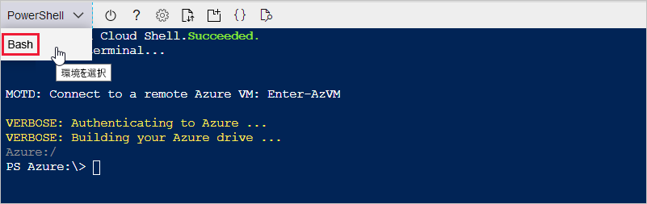
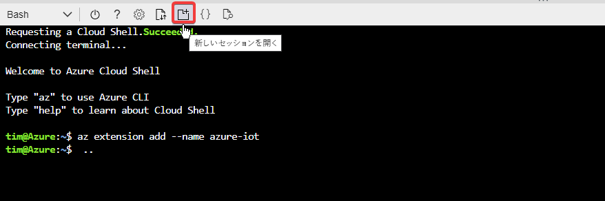
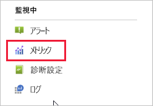
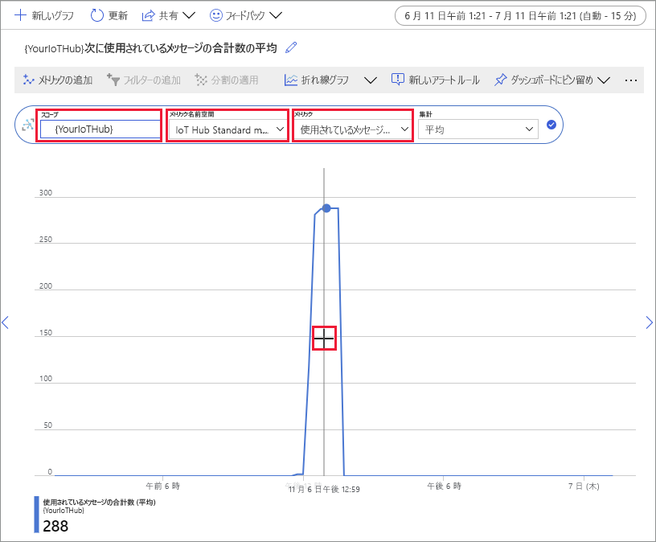

# <a name="quickstart-send-telemetry-from-a-device-to-an-iot-hub-and-monitor-it-with-the-azure-cli"></a>クイック スタート:デバイスから IoT ハブに利用統計情報を送信して Azure CLI で監視する

[!INCLUDE [iot-hub-quickstarts-1-selector](../../includes/iot-hub-quickstarts-1-selector.md)]

IoT Hub は、保管や処理のために IoT デバイスから大量のテレメトリをクラウドに取り込むことを可能にする Azure サービスです。 このクイックスタートでは、Azure CLI を使用して、IoT Hub とシミュレートされたデバイスを作成、デバイスのテレメトリをハブに送信、cloud-to-device メッセージを送信します。 また、Azure portal を使用して、デバイス メトリックを視覚化します。 これは、CLI を使用して IoT Hub アプリケーションとやり取りする開発者のための基本的なワークフローです。

## <a name="prerequisites"></a>前提条件
- Azure サブスクリプションをお持ちでない場合は、開始する前に [無料でアカウントを 1 つ](https://azure.microsoft.com/free/?WT.mc_id=A261C142F)作成してください。
- Azure CLI。 このクイックスタートのすべてのコマンドは、ブラウザーで実行されるインタラクティブ CLI シェルである Azure Cloud Shell を使用して実行できます。 Cloud Shell を使用する場合は、何もインストールする必要はありません。 CLI をローカルで使用する場合、このクイックスタートでは、Azure CLI バージョン 2.0.76 以降が必要です。 バージョンを確認するには、az --version を実行します。 インストールまたはアップグレードする必要には、「[Azure CLI のインストール]( /cli/azure/install-azure-cli)」をご覧ください。

## <a name="sign-in-to-the-azure-portal"></a>Azure portal にサインインする
Azure Portal ( https://portal.azure.com ) にサインインします。

CLI をローカルで実行するか Cloud Shell で実行するかにかかわらず、ポータルをブラウザーで開いたままにしておきます。  後ほど、このクイックスタートで使用します。

## <a name="launch-the-cloud-shell"></a>Cloud Shell を起動する
このセクションでは、Azure Cloud Shell のインスタンスを起動します。 CLI をローカルで使用する場合は、「[2 つの CLI セッションを準備する](#prepare-two-cli-sessions)」のセクションに進んでください。

Cloud Shell を起動するには以下を行います。

1. Azure portal の右上にあるメニュー バーの **[Cloud Shell]** ボタンを選択します。 

    ![Azure portal の [Cloud Shell] ボタン](media/quickstart-send-telemetry-cli/cloud-shell-button.png)

    > [!NOTE]
    > Cloud Shell を初めて使用する場合は、Cloud Shell を使用するために必要なストレージを作成するように求められます。  ストレージ アカウントと Microsoft Azure ファイル共有を作成するためのサブスクリプションを選択します。 

2. **[環境の選択]** ドロップダウンで、優先する CLI 環境を選択します。 このクイックスタートでは、**Bash** 環境を使用します。 次の CLI コマンドはすべて、Powershell 環境でも動作します。 

    

## <a name="prepare-two-cli-sessions"></a>2 つの CLI セッションを準備する

このセクションでは、2 つの Azure CLI セッションを準備します。 Cloud Shell を使用している場合は、2 つのセッションを別々のブラウザータブで実行します。 ローカル CLI クライアントを使用している場合は、2 つの異なる CLI インスタンスを実行します。 最初のセッションをシミュレートされたデバイスとして使用し、2 番目のセッションでメッセージの監視と送信を行います。 コマンドを実行するには、 **[コピー]** を選択してこのクイックスタートのコード ブロックをコピーし、シェル セッションに貼り付けて実行します。

Azure CLI を使用するには、Azure アカウントにログインする必要があります。 Azure CLI シェル セッションと IoT hub の間のすべての通信は認証および暗号化されます。 そのため、このクイックスタートでは、接続文字列などの実際のデバイスで使用する追加の認証は必要ありません。

*  [az extension add](https://docs.microsoft.com/cli/azure/extension?view=azure-cli-latest#az-extension-add) コマンドを実行して、Microsoft Azure IoT Extension for Azure CLI を CLI シェルに追加します。 IoT Hub、IoT Edge、IoT Device Provisioning Service (DPS) 固有のコマンドが Azure CLI に追加されます。

   ```azurecli
   az extension add --name azure-iot
   ```
   
   Azure IOT 拡張機能をインストールした後は、Cloud Shell セッションで再度インストールする必要はありません。 

   [!INCLUDE [iot-hub-cli-version-info](../../includes/iot-hub-cli-version-info.md)]

*  2 つ目の CLI セッションを開きます。  Cloud Shell を使用している場合は、 **[新しいセッションを開く]** を選択します。 CLI をローカルで使用している場合は、2 つ目のインスタンスを開きます。 

    >[!div class="mx-imgBorder"]
    >

## <a name="create-an-iot-hub"></a>IoT Hub の作成
このセクションでは、Azure CLI を使用してリソース グループと IoT ハブを作成します。  Azure リソース グループとは、Azure リソースのデプロイと管理に使用する論理コンテナーです。 IoT Hub は、IoT アプリケーションとデバイスの間の双方向通信に対する中央メッセージ ハブとして機能します。 

> [!TIP]
> 必要に応じて、[Azure portal](iot-hub-create-through-portal.md)、[Visual Studio Code](iot-hub-create-use-iot-toolkit.md)、またはその他のプログラムによる方法を使用して、Azure リソース グループ、IoT Hub、その他のリソースを作成することもできます。  

1. [az group create](https://docs.microsoft.com/cli/azure/group?view=azure-cli-latest#az-group-create) コマンドを実行してリソース グループを作成します。 次のコマンドは、*myResourceGroup* という名前のリソース グループを *eastus* という場所に作成します。 

    ```azurecli
    az group create --name MyResourceGroup --location eastus
    ```

1. [az iot hub create](https://docs.microsoft.com/cli/azure/iot/hub?view=azure-cli-latest#az-iot-hub-create) コマンドを実行して、IoT ハブを作成します。 IoT ハブの作成には数分かかることがあります。 

    *YourIotHubName*: このプレースホルダーは、実際の IoT Hub に対して選んだ名前に置き換えてください。 IoT ハブ名は Azure でグローバルに一意である必要があります。 このプレースホルダーは、このクイックスタートの残りの部分で、IoT ハブの名前を表すために使用されます。

    ```azurecli
    az iot hub create --resource-group MyResourceGroup --name {YourIoTHubName}
    ```

## <a name="create-and-monitor-a-device"></a>デバイスの作成と監視
このセクションでは、最初の CLI セッションでシミュレートされたデバイスを作成します。 シミュレートされたデバイスは、デバイスのテレメトリを IoT ハブ に送信します。 2 つ目の CLI セッションでは、イベントとテレメトリを監視し、cloud-to-device メッセージをシミュレートされたデバイスに送信します。

シミュレートされたデバイスを作成し開始するには以下を行います。
1. 最初の CLI セッションで [az iot hub device-identity create](https://docs.microsoft.com/cli/azure/ext/azure-iot/iot/hub/device-identity?view=azure-cli-latest#ext-azure-iot-az-iot-hub-device-identity-create) コマンドを実行します。 これにより、シミュレートされたデバイスを作成します。 

    *YourIotHubName*: このプレースホルダーは、実際の IoT Hub に対して選んだ名前に置き換えてください。 

    *simDevice*。 このクイックスタートの残りの部分では、この名前をシミュレートされたデバイスに対して直接使用できます。 別の名前を使用することもできます。 

    ```azurecli
    az iot hub device-identity create --device-id simDevice --hub-name {YourIoTHubName} 
    ```

1. 最初の CLI セッションで [az iot device simulate](https://docs.microsoft.com/cli/azure/ext/azure-iot/iot/device?view=azure-cli-latest#ext-azure-iot-az-iot-device-simulate) コマンドを実行します。  これにより、シミュレートされたデバイスが起動します。 デバイスは、IoT ハブにテレメトリを送信し、そこからメッセージを受信します。  

    *YourIotHubName*: このプレースホルダーは、実際の IoT Hub に対して選んだ名前に置き換えてください。 

    ```azurecli
    az iot device simulate -d simDevice -n {YourIoTHubName}
    ```

デバイスを監視するには以下を行います。
1. 2 つ目の CLI セッションで、[az iot hub monitor-events](https://docs.microsoft.com/cli/azure/ext/azure-iot/iot/hub?view=azure-cli-latest#ext-azure-iot-az-iot-hub-monitor-events) コマンドを実行します。 これにより、シミュレートされたデバイスの監視が開始されます。 出力には、シミュレートされたデバイスから IoT hub に送信されたテレメトリが表示されます。

    *YourIotHubName*: このプレースホルダーは、実際の IoT Hub に対して選んだ名前に置き換えてください。 

    ```azurecli
    az iot hub monitor-events --output table --hub-name {YourIoTHubName}
    ```

    

1. 2 つ目の CLI セッションでシミュレートされたデバイスを監視した後、Ctrl+C キーを押して監視を停止します。 

## <a name="use-the-cli-to-send-a-message"></a>CLI を使用してメッセージを送信する
このセクションでは、2 つ目の CLI セッションを使用して、シミュレートされたデバイスにメッセージを送信します。

1. 最初の CLI セッションで、シミュレートされたデバイスが実行されていることを確認します。 デバイスが停止している場合は、次のコマンドを実行して開始します。

    *YourIotHubName*: このプレースホルダーは、実際の IoT Hub に対して選んだ名前に置き換えてください。 

    ```azurecli
    az iot device simulate -d simDevice -n {YourIoTHubName}
    ```

1. 2 つ目の CLI セッションで、[az iot device c2d-message send](https://docs.microsoft.com/cli/azure/ext/azure-iot/iot/device/c2d-message?view=azure-cli-latest#ext-azure-iot-az-iot-device-c2d-message-send) コマンドを実行します。 これにより、cloud-to-device メッセージが IoT ハブからシミュレートされたデバイスに送信されます。 メッセージには、文字列と 2 つのキー/値ペアが含まれます。  

    *YourIotHubName*: このプレースホルダーは、実際の IoT Hub に対して選んだ名前に置き換えてください。 

    ```azurecli
    az iot device c2d-message send -d simDevice --data "Hello World" --props "key0=value0;key1=value1" -n {YourIoTHubName}
    ```
    必要に応じて、Azure portal を使用して、cloud-to-device メッセージを送信できます。 これを行うには、IoT Hub の 概要 ページに移動し、**IoT デバイス** を選択して、シミュレートされたデバイスを選択し、**デバイスへのメッセージ** を選択します。 

1. 最初の CLI セッションで、シミュレートされたデバイスがメッセージを受信したことを確認します。 

    

1. メッセージを表示した後、2 つ目の CLI セッションを閉じます。 最初の CLI セッションを開いたままにします。 後の手順でリソースをクリーン アップするために使用します。

## <a name="view-messaging-metrics-in-the-portal"></a>ポータルでメッセージング メトリックを表示する
Azure portal を使用すると、IoT Hub とデバイスのすべての側面を管理できます。 デバイスからテレメトリを取り込む一般的な IoT Hub アプリケーションでは、デバイスを監視したり、デバイスのテレメトリに関するメトリックを表示したい場合があります。 

Azure portal でメッセージング メトリックを視覚化するには以下を行います。
1. ポータルの左側のナビゲーション メニューで **[すべてのリソース]** を選択します。 これにより、作成した IoT ハブを含む、サブスクリプション内のすべてのリソースが一覧表示されます。 

1. 作成した IoT ハブのリンクを選択します。 ポータルにはハブの [概要] ページが表示されます。

1. IoT Hub の左側のウィンドウで **[メトリック]** を選択します。 

    

1. **スコープ**に IoT ハブの名前を入力します。

2. **[メトリック名前空間]** で、[*Iot Hub 標準メトリック*] を選択します。

3. **[メトリック]** で、[*使用されているメッセージの合計数*] を選択します。 

4. デバイスがメッセージを送信したタイムラインの領域上にマウス ポインターを置きます。 特定の時点におけるメッセージの合計数は、タイムラインの左下隅に表示されます。

    

5. 必要に応じて、 **[メトリック]** ドロップダウンを使用して、シミュレートされたデバイスの他のメトリックを表示します。 たとえば、[*C2d message deliveries completed*] (完了した C2d メッセージ配信) または [*デバイスの合計数 (プレビュー)* ]。 

## <a name="clean-up-resources"></a>リソースをクリーンアップする
このクイックスタートで作成した Azure リソースが不要になった場合は、Azure CLI を使用して削除できます。

次の推奨記事に進む場合は、既に作成したリソースを維持して、再利用することができます。 

> [!IMPORTANT]
> リソース グループを削除すると、元に戻すことができません。 リソース グループとそこに含まれるすべてのリソースは完全に削除されます。 間違ったリソース グループやリソースをうっかり削除しないようにしてください。 

名前でリソース グループを削除するには、以下の手順を実行します。
1. [az group delete](https://docs.microsoft.com/cli/azure/group?view=azure-cli-latest#az-group-delete) コマンドを実行します。 これにより、作成したリソース グループ、IoT Hub、デバイスの登録が削除されます。

    ```azurecli
    az group delete --name MyResourceGroup
    ```
1. [az group list](https://docs.microsoft.com/cli/azure/group?view=azure-cli-latest#az-group-list) コマンドを実行して、リソース グループが削除されていることを確認します。  

    ```azurecli
    az group list
    ```

## <a name="next-steps"></a>次のステップ
このクイックスタートでは、Azure CLI を使用して、IoT ハブとシミュレートされたデバイスを作成、テレメトリを送信、cloud-to-device メッセージを送信、リソースのクリーン アップしました。 Azure portal を使用して、デバイス上のメッセージング メトリックを視覚化しました。

デバイス開発者の場合、C 用 Azure IoT Device SDK を使用するテレメトリのクイックスタートを参照することをお勧めします。必要に応じて、Azure IoT Hub テレメトリのクイックスタートに関する利用可能な記事のいずれかをお好みの言語または SDK で参照してください。

> [!div class="nextstepaction"]
> [クイック スタート: デバイスから IoT ハブへの利用統計情報の送信 (C)](quickstart-send-telemetry-c.md)
