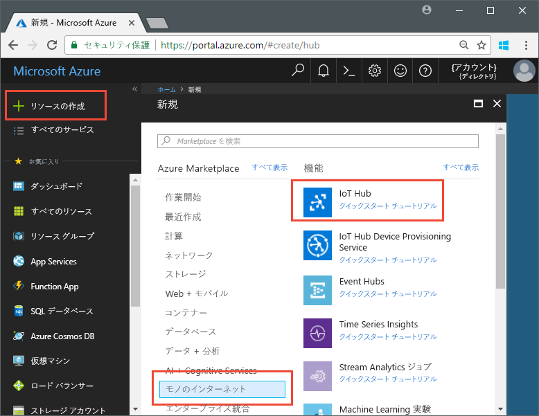
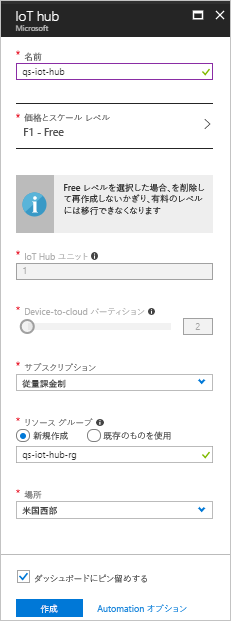

# <a name="send-telemetry-from-a-device-to-an-iot-hub-swift"></a>デバイスから IoT ハブへの利用統計情報の送信 (Swift)

IoT Hub は、保管や処理のために IoT デバイスから大量の利用統計情報をクラウドに取り込むことを可能にする Azure サービスです。 この記事では、シミュレートされたデバイス アプリケーションから IoT Hub に利用統計情報を送信します。 その後、バックエンド アプリケーションからデータを表示できます。 

この記事では、事前に作成済みの Swift アプリケーションを使用して利用統計情報を送信し、CLI ユーティリティを使用して IoT Hub から利用統計情報を読み取ります。 

[!INCLUDE [cloud-shell-try-it.md](../../includes/cloud-shell-try-it.md)]

Azure サブスクリプションがない場合は、開始する前に[無料アカウント](https://azure.microsoft.com/free/?WT.mc_id=A261C142F)を作成してください。

## <a name="prerequisites"></a>前提条件

- [Azure サンプル](https://github.com/Azure-Samples/azure-iot-samples-ios/archive/master.zip)のページからコード サンプルをダウンロードします 
- iOS SDK の最新バージョンを実行している最新バージョンの [XCode](https://developer.apple.com/xcode/)。 このクイック スタートは、XCode 9.3 と iOS 11.3 でテストされました。
- [CocoaPods](https://guides.cocoapods.org/using/getting-started.html) の最新バージョン。
- IoT Hub から利用統計情報を読み取る iothub-explorer CLI ユーティリティ。 インストールするには、[Node.js](https://nodejs.org) v4.x.x 以上をインストールした後に次のコマンドを実行します。 

   ```sh
   sudo npm install -g iothub-explorer
   ```

## <a name="create-an-iot-hub"></a>IoT Hub の作成

最初の手順では、Azure Portal を使用して、サブスクリプションに IoT Hub を作成します。 IoT Hub を使用すると、多くのデバイスからクラウドに大量の利用統計情報を取り込むことができます。 ハブにより、クラウド内で実行されている 1 つまたは複数のバックエンド サービスがその利用統計情報を読み取って処理することが可能になります。

1. [Azure ポータル](http://portal.azure.com)にサインインします。

1. **[リソースの作成]** > **[モノのインターネット]** > **[IoT Hub]** を選択します。 

   

1. IoT Hub を作成するには、次の表の値を使用します。

    | Setting | 値 |
    | ------- | ----- |
    | Name | ハブの一意の名前 |
    | 価格とスケール ティア | F1 Free |
    | IoT Hub ユニット | 1 |
    | Device-to-cloud パーティション | 2 個のパーティション |
    | [サブスクリプション] | Azure サブスクリプション。 |
    | リソース グループ | 新規作成。 リソース グループの名前を入力します。 |
    | 場所 | ユーザーに最も近い場所。 |
    | [ダッシュボードにピン留めする] | [はい] |

1. **Create** をクリックしてください。  

   

1. IoT ハブとリソース グループの名前をメモしておきます。 これらの値はこのクイック スタートの後の方で使用します。

## <a name="register-a-device"></a>デバイスの登録

デバイスを IoT ハブに接続するには、あらかじめ IoT ハブに登録しておく必要があります。 このクイック スタートでは、Azure CLI を使用して、シミュレートされたデバイスを登録します。

1. IoT Hub CLI 拡張機能を追加し、デバイス ID を作成します。 `{YourIoTHubName}` を IoT ハブの名前に置き換えます。

   ```azurecli-interactive
   az extension add --name azure-cli-iot-ext
   az iot hub device-identity create --hub-name {YourIoTHubName} --device-id myiOSdevice
   ```

    デバイスに別の名前を選択した場合は、サンプル アプリケーションを実行する前に、その中でデバイス名を更新してください。

1. 次のコマンドを実行して、登録したデバイスの "_デバイス接続文字列_" を取得します。

   ```azurecli-interactive
   az iot hub device-identity show-connection-string --hub-name {YourIoTHubName} --device-id myiOSdevice --output table
   ```

   `Hostname=...=` のようなデバイス接続文字列をメモしておきます。 この値は、この記事の後の方で使用します。

1. また、バックエンド アプリケーションが IoT ハブに接続し、デバイスからクラウドへのメッセージを取得できるようにするには、"_サービス接続文字列_" が必要です。 次のコマンドを実行すると、IoT ハブのサービス接続文字列が取得されます。

   ```azurecli-interactive
   az iot hub show-connection-string --hub-name {YourIoTHubName} --output table
   ```

   `Hostname=...=` のようなサービス接続文字列をメモしておきます。 この値は、この記事の後の方で使用します。

## <a name="send-simulated-telemetry"></a>シミュレートされた利用統計情報の送信

このサンプル アプリケーションは、iOS デバイス上で実行されます。サンプル アプリケーションは、IoT ハブ上のデバイスに固有のエンドポイントに接続し、シミュレートされた温度および湿度利用統計情報を送信します。 

### <a name="install-cocoapods"></a>CocoaPods のインストール

CocoaPods は、サードパーティ製のライブラリを使用する iOS プロジェクトの依存関係を管理します。

ターミナル ウィンドウで、前提条件としてダウンロードした Azure-IoT-Samples-iOS フォルダーに移動します。 その後、サンプル プロジェクトに移動します。

```sh
cd quickstart/sample-device
```

XCode が終了していることを確認し、次のコマンドを実行して、**podfile** ファイルで宣言されている CocoaPods をインストールします。

```sh
pod install
```

インストール コマンドでは、プロジェクトに必要なポッドをインストールすると共に、依存関係にポッドを使用するように既に構成されている XCode ワークスペース ファイルも作成されます。 

### <a name="run-the-sample-application"></a>サンプル アプリケーションの実行 

1. XCode で、サンプル ワークスペースを開きます。

   ```sh
   open "MQTT Client Sample.xcworkspace"
   ```

2. **MQTT Client Sample**  プロジェクトを展開し、次に同じ名前のフォルダーを展開します。  
3. XCode で編集するために **ViewController.swift** を開きます。 
4. **connectionString** 変数を検索し、前の手順でメモしたデバイス接続文字列で値を更新します。
5. 変更を保存します。 
6. デバイス エミュレーターで、**[ビルド/実行]** ボタンまたは **Command + r** キーの組み合わせを使用してプロジェクトを実行します。 

   

7. エミュレーターが開いたら、サンプル アプリで **[Start]** を選択します。

次のスクリーンショットは、アプリケーションが IoT ハブにシミュレートされた利用統計情報を送信する際の出力例を示しています。

   

## <a name="read-the-telemetry-from-your-hub"></a>ハブから利用統計情報を読み取る

XCode エミュレーターで実行したサンプル アプリは、デバイスから送信されたメッセージに関するデータを表示します。 データの受信時に IoT ハブを経由するデータを表示することもできます。 `iothub-explorer` CLI ユーティリティは、IoT Hub のサービス側 **Events** エンドポイントに接続します。 

新しいターミナル ウィンドウを開きます。 次のコマンドを実行します。このとき、{your hub service connection string} を、この記事の冒頭で取得したサービス接続文字列に置き換えます。

```sh
iothub-explorer monitor-events myiOSdevice --login "{your hub service connection string}"
```

次のスクリーンショットは、ターミナル ウィンドウに表示される利用統計情報の種類を示しています。


iothub-explorer コマンドを実行したときにエラーが発生した場合は、IoT デバイスの "*デバイス接続文字列*" ではなく、IoT デバイスの "*サービス接続文字列*" を使用していることを再確認してください。 どちらの接続文字列も **Hostname={iothubname}** で始まりますが、サービス接続文字列には **SharedAccessKeyName** プロパティが含まれ、デバイス接続文字列には **DeviceID** が含まれます。 

## <a name="clean-up-resources"></a>リソースのクリーンアップ

他の記事に従って IoT Hub のテストを続行する場合は、リソース グループと IoT ハブを残して、後でそれらを再利用してください。

IoT ハブが必要でなくなった場合は、ポータルを使用して IoT ハブとリソース グループを削除します。 これを行うには、IoT ハブを含むリソース グループを選択し、**[削除]** をクリックします。

## <a name="next-steps"></a>次の手順

この記事では、IoT ハブを設定し、デバイスを登録し、iOS デバイスからハブにシミュレートされた利用統計情報を送信し、ハブから利用統計情報を読み取りました。 

iOS デバイスが IoT Hub でどのように動作するかを引き続き学習するには、「[Send cloud-to-device messages with iOS (Swift) (iOS での cloud-to-device メッセージの送信 (Swift))](iot-hub-ios-swift-c2d.md)」を参照してください

<!-- Links -->
[lnk-process-d2c-tutorial]: iot-hub-csharp-csharp-process-d2c.md
[lnk-device-management]: iot-hub-node-node-device-management-get-started.md
[lnk-iot-edge]: ../iot-edge/tutorial-simulate-device-linux.md
[lnk-connect-device]: https://azure.microsoft.com/develop/iot/
