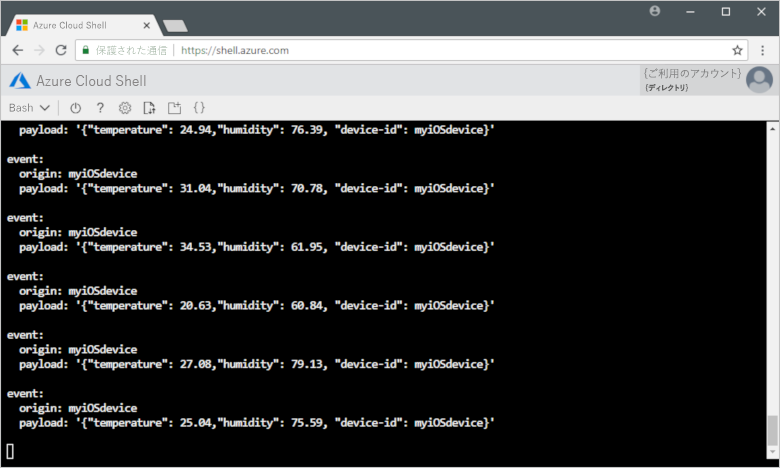

# <a name="quickstart-send-telemetry-from-a-device-to-an-iot-hub-ios"></a>クイック スタート:デバイスから IoT ハブへのテレメトリの送信 (iOS)

[!INCLUDE [iot-hub-quickstarts-1-selector](../../includes/iot-hub-quickstarts-1-selector.md)]

IoT Hub は、保管や処理のために IoT デバイスから大量のテレメトリをクラウドに取り込むことを可能にする Azure サービスです。 この記事では、シミュレートされたデバイス アプリケーションから IoT Hub に利用統計情報を送信します。 その後、バックエンド アプリケーションからデータを表示できます。

この記事では、事前に作成済みの Swift アプリケーションを使用して利用統計情報を送信し、CLI ユーティリティを使用して IoT Hub から利用統計情報を読み取ります。

[!INCLUDE [cloud-shell-try-it.md](../../includes/cloud-shell-try-it.md)]

Azure サブスクリプションがない場合は、開始する前に[無料アカウント](https://azure.microsoft.com/free/?WT.mc_id=A261C142F)を作成してください。

## <a name="prerequisites"></a>前提条件

- [Azure サンプル](https://github.com/Azure-Samples/azure-iot-samples-ios/archive/master.zip)のページからコード サンプルをダウンロードします
- iOS SDK の最新バージョンを実行している最新バージョンの [XCode](https://developer.apple.com/xcode/)。 このクイック スタートは、XCode 10.2 と iOS 12.2 でテストされました。
- 最新バージョンの [CocoaPods](https://guides.cocoapods.org/using/getting-started.html)。
- 次のコマンドを実行して、Microsoft Azure IoT Extension for Azure CLI を Cloud Shell インスタンスに追加します。 IoT Hub、IoT Edge、IoT Device Provisioning Service (DPS) 固有のコマンドが Azure CLI に追加されます。

   ```azurecli-interactive
   az extension add --name azure-cli-iot-ext
   ```

- ポート 8883 がファイアウォールで開放されていることを確認してください。 このクイックスタートのデバイス サンプルでは、ポート 8883 を介して通信する MQTT プロトコルを使用しています。 このポートは、企業や教育用のネットワーク環境によってはブロックされている場合があります。 この問題の詳細と対処方法については、「[IoT Hub への接続 (MQTT)](iot-hub-mqtt-support.md#connecting-to-iot-hub)」を参照してください。

## <a name="create-an-iot-hub"></a>IoT Hub の作成

[!INCLUDE [iot-hub-include-create-hub](../../includes/iot-hub-include-create-hub.md)]

## <a name="register-a-device"></a>デバイスの登録

デバイスを IoT Hub に接続するには、あらかじめ IoT Hub に登録しておく必要があります。 このクイック スタートでは、Azure Cloud Shell を使用して、シミュレートされたデバイスを登録します。

1. Azure Cloud Shell で次のコマンドを実行してデバイス ID を作成します。

   **YourIoTHubName**: このプレースホルダーは、実際の IoT Hub に対して選んだ名前に置き換えてください。

   **myiOSdevice**: これは、登録するデバイスの名前です。 示されているように、**myiOSdevice** を使用することをお勧めします。 デバイスに別の名前を選択した場合は、この記事全体でその名前を使用する必要があります。また、サンプル アプリケーションを実行する前に、アプリケーション内のデバイス名を更新してください。

   ```azurecli-interactive
   az iot hub device-identity create --hub-name {YourIoTHubName} --device-id myiOSdevice
   ```

1. Azure Cloud Shell で次のコマンドを実行して、登録したデバイスの "_デバイス接続文字列_" を取得します。

   **YourIoTHubName**: このプレースホルダーは、実際の IoT Hub に対して選んだ名前に置き換えてください。

   ```azurecli-interactive
   az iot hub device-identity show-connection-string --hub-name {YourIoTHubName} --device-id myiOSdevice --output table
   ```

   次のようなデバイス接続文字列をメモしておきます。

   `HostName={YourIoTHubName}.azure-devices.net;DeviceId=myiOSdevice;SharedAccessKey={YourSharedAccessKey}`

    この値は、このクイックスタートの後の方で使用します。

## <a name="send-simulated-telemetry"></a>シミュレートされたテレメトリの送信

このサンプル アプリケーションは、iOS デバイス上で実行されます。サンプル アプリケーションは、IoT ハブ上のデバイスに固有のエンドポイントに接続し、シミュレートされた温度および湿度利用統計情報を送信します。 

### <a name="install-cocoapods"></a>CocoaPods のインストール

CocoaPods は、サードパーティ製のライブラリを使用する iOS プロジェクトの依存関係を管理します。

ローカル ターミナル ウィンドウで、前提条件としてダウンロードした Azure-IoT-Samples-iOS フォルダーに移動します。 その後、サンプル プロジェクトに移動します。

```sh
cd quickstart/sample-device
```

XCode が終了していることを確認し、次のコマンドを実行して、**podfile** ファイルで宣言されている CocoaPods をインストールします。

```sh
pod install
```

インストール コマンドでは、プロジェクトに必要なポッドをインストールすると共に、依存関係にポッドを使用するように既に構成されている XCode ワークスペース ファイルも作成されます。 

### <a name="run-the-sample-application"></a>サンプル アプリケーションの実行 

1. XCode で、サンプル ワークスペースを開きます。

   ```sh
   open "MQTT Client Sample.xcworkspace"
   ```

2. **MQTT Client Sample**  プロジェクトを展開し、次に同じ名前のフォルダーを展開します。  
3. XCode で編集するために **ViewController.swift** を開きます。 
4. **connectionString** 変数を検索し、前にメモしたデバイス接続文字列で値を更新します。
5. 変更を保存します。 
6. デバイス エミュレーターで、 **[ビルド/実行]** ボタンまたは **Command + r** キーの組み合わせを使用してプロジェクトを実行します。 

   

7. エミュレーターが開いたら、サンプル アプリで **[Start]** を選択します。

次のスクリーンショットは、アプリケーションが IoT ハブにシミュレートされた利用統計情報を送信する際の出力例を示しています。

   

## <a name="read-the-telemetry-from-your-hub"></a>Hub からテレメトリを読み取る

XCode エミュレーターで実行したサンプル アプリは、デバイスから送信されたメッセージに関するデータを表示します。 データの受信時に IoT ハブを経由するデータを表示することもできます。 IoT Hub CLI 拡張機能は、IoT Hub 上のサービス側 **Events** エンドポイントに接続できます。 この拡張機能は、シミュレートされたデバイスから送信されたデバイスとクラウドの間のメッセージを受信します。 通常、IoT Hub のバックエンド アプリケーションはクラウド内で実行され、デバイスとクラウドの間のメッセージを受信して処理します。

Azure Cloud Shell で、以下のコマンドを実行します。`YourIoTHubName` は実際の IoT Hub の名前に置き換えます。

```azurecli-interactive
az iot hub monitor-events --device-id myiOSdevice --hub-name {YourIoTHubName}
```

次のスクリーンショットは、シミュレートされたデバイスから Hub に送信されたテレメトリを拡張機能が受信したときの出力を示しています。

次のスクリーンショットは、ローカル ターミナル ウィンドウに表示される利用統計情報の種類を示しています。



## <a name="clean-up-resources"></a>リソースをクリーンアップする

[!INCLUDE [iot-hub-quickstarts-clean-up-resources](../../includes/iot-hub-quickstarts-clean-up-resources.md)]

## <a name="next-steps"></a>次のステップ

このクイックスタートでは、IoT ハブを設定し、デバイスを登録し、iOS デバイスからハブにシミュレートされた利用統計情報を送信し、ハブから利用統計情報を読み取りました。 

バックエンド アプリケーションからシミュレートされたデバイスを制御する方法を学習するには、次のクイック スタートに進んでください。

> [!div class="nextstepaction"]
> [クイック スタート: IoT ハブに接続されたデバイスを制御する](quickstart-control-device-node.md)
