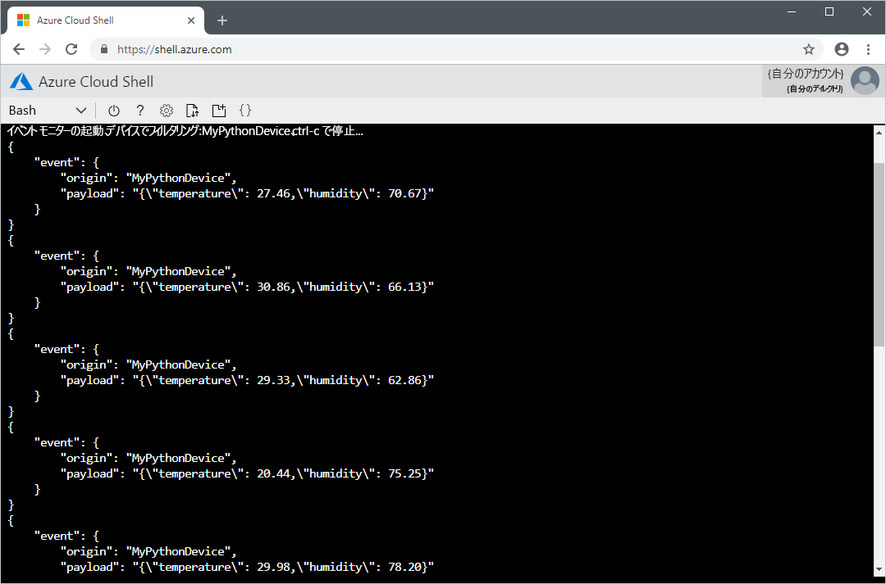

# <a name="quickstart-send-telemetry-from-a-device-to-an-iot-hub-and-read-it-with-a-back-end-application-python"></a>クイック スタート:デバイスから IoT ハブに利用統計情報を送信してバックエンド アプリケーションで読み取る (Python)

[!INCLUDE [iot-hub-quickstarts-1-selector](../../includes/iot-hub-quickstarts-1-selector.md)]

このクイックスタートでは、シミュレートされたデバイス アプリケーションから、Azure IoT Hub を経由して、処理のためのバックエンド アプリケーションに、テレメトリを送信します。 IoT Hub は、保管や処理のために IoT デバイスから大量のテレメトリをクラウドに取り込むことを可能にする Azure サービスです。 このクイックスタートでは、あらかじめ作成されている Python アプリケーションを使ってテレメトリを送信し、CLI ユーティリティを使って Hub からテレメトリを読み取ります。 これら 2 つのアプリケーションを実行する前に、IoT Hub を作成し、デバイスを Hub に登録します。

## <a name="prerequisites"></a>前提条件

* アクティブなサブスクリプションが含まれる Azure アカウント。 [無料で作成できます](https://azure.microsoft.com/free/?ref=microsoft.com&utm_source=microsoft.com&utm_medium=docs&utm_campaign=visualstudio)。

* [Python 3.7 以上](https://www.python.org/downloads/)。 サポートされる他のバージョンの Python については、「[Azure IoT デバイスの機能](https://github.com/Azure/azure-iot-sdk-python/tree/master/azure-iot-device#azure-iot-device-features)」を参照してください。

* [サンプル Python プロジェクト](https://github.com/Azure-Samples/azure-iot-samples-python/archive/master.zip)。

* ファイアウォールでポート 8883 が開放されていること。 このクイックスタートのデバイス サンプルでは、ポート 8883 を介して通信する MQTT プロトコルを使用しています。 このポートは、企業や教育用のネットワーク環境によってはブロックされている場合があります。 この問題の詳細と対処方法については、[IoT Hub への接続 (MQTT)](iot-hub-mqtt-support.md#connecting-to-iot-hub) に関するセクションを参照してください。

[!INCLUDE [cloud-shell-try-it.md](../../includes/cloud-shell-try-it.md)]

### <a name="add-azure-iot-extension"></a>Azure IoT 拡張機能を追加する

次のコマンドを実行して、Microsoft Azure IoT Extension for Azure CLI を Cloud Shell インスタンスに追加します。 IoT Hub、IoT Edge、IoT Device Provisioning Service (DPS) 固有のコマンドが Azure CLI に追加されます。

```azurecli-interactive
az extension add --name azure-cli-iot-ext
```

## <a name="create-an-iot-hub"></a>IoT Hub の作成

[!INCLUDE [iot-hub-include-create-hub](../../includes/iot-hub-include-create-hub.md)]

## <a name="register-a-device"></a>デバイスの登録

デバイスを IoT Hub に接続するには、あらかじめ IoT Hub に登録しておく必要があります。 このクイック スタートでは、Azure Cloud Shell を使用して、シミュレートされたデバイスを登録します。

1. Azure Cloud Shell で次のコマンドを実行してデバイス ID を作成します。

    **YourIoTHubName**: このプレースホルダーは、実際の IoT Hub に対して選んだ名前に置き換えてください。

    **MyPythonDevice**: これは、登録するデバイスの名前です。 示されているように、**MyPythonDevice** を使用することをお勧めします。 デバイスに別の名前を選択した場合は、この記事全体でその名前を使用する必要があります。また、サンプル アプリケーションを実行する前に、アプリケーション内のデバイス名を更新してください。

    ```azurecli-interactive
    az iot hub device-identity create --hub-name {YourIoTHubName} --device-id MyPythonDevice
    ```

1. Azure Cloud Shell で次のコマンドを実行して、登録したデバイスの _デバイス接続文字列_ を取得します。

    **YourIoTHubName**: このプレースホルダーは、実際の IoT Hub に対して選んだ名前に置き換えてください。

    ```azurecli-interactive
    az iot hub device-identity show-connection-string --hub-name {YourIoTHubName} --device-id MyPythonDevice --output table
    ```

    次のようなデバイス接続文字列をメモしておきます。

   `HostName={YourIoTHubName}.azure-devices.net;DeviceId=MyPythonDevice;SharedAccessKey={YourSharedAccessKey}`

    この値は、このクイックスタートの後の方で使用します。

## <a name="send-simulated-telemetry"></a>シミュレートされたテレメトリの送信

シミュレートされたデバイス アプリケーションは、IoT Hub 上のデバイスに固有のエンドポイントに接続し、シミュレートされた温度と湿度のテレメトリを送信します。

1. ローカル ターミナル ウィンドウで、サンプルの Python プロジェクトのルート フォルダーに移動します。 **iot-hub\Quickstarts\simulated-device** フォルダーに移動します。

1. 適当なテキスト エディターで **SimulatedDevice.py** ファイルを開きます。

    `CONNECTION_STRING` 変数の値を、前にメモしたデバイス接続文字列に置き換えます。 その後、変更を **SimulatedDevice.py** に保存します。

1. ローカル ターミナル ウィンドウで次のコマンドを実行して、シミュレートされたデバイス アプリケーションに必要なライブラリをインストールします。

    ```cmd/sh
    pip install azure-iot-device
    ```

1. ローカル ターミナル ウィンドウで次のコマンドを実行して、シミュレートされたデバイス アプリケーションを実行します。

    ```cmd/sh
    python SimulatedDevice.py
    ```

    次のスクリーンショットは、シミュレートされたデバイス アプリケーションが IoT Hub にテレメトリを送信したときの出力を示しています。

    


## <a name="read-the-telemetry-from-your-hub"></a>Hub からテレメトリを読み取る

IoT Hub CLI 拡張機能は、IoT Hub 上のサービス側 **Events** エンドポイントに接続できます。 この拡張機能は、シミュレートされたデバイスから送信されたデバイスとクラウドの間のメッセージを受信します。 通常、IoT Hub のバックエンド アプリケーションはクラウド内で実行され、デバイスとクラウドの間のメッセージを受信して処理します。

Azure Cloud Shell で、以下のコマンドを実行します。`YourIoTHubName` は実際の IoT Hub の名前に置き換えます。

```azurecli-interactive
az iot hub monitor-events --hub-name {YourIoTHubName} --device-id MyPythonDevice 
```

次のスクリーンショットは、シミュレートされたデバイスから Hub に送信されたテレメトリを拡張機能が受信したときの出力を示しています。



## <a name="clean-up-resources"></a>リソースをクリーンアップする

[!INCLUDE [iot-hub-quickstarts-clean-up-resources](../../includes/iot-hub-quickstarts-clean-up-resources.md)]

## <a name="next-steps"></a>次のステップ

このクイックスタートでは、IoT ハブを設定し、デバイスを登録し、Python アプリケーションを使用してシミュレートされた利用統計情報をハブに送信し、簡単なバックエンド アプリケーションを使用してハブから利用統計情報を読み取りました。

バックエンド アプリケーションからシミュレートされたデバイスを制御する方法を学習するには、次のクイック スタートに進んでください。

> [!div class="nextstepaction"]
> [クイック スタート: IoT ハブに接続されたデバイスを制御する](quickstart-control-device-python.md)
