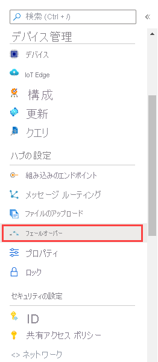

# チュートリアル: IoT ハブの手動フェールオーバーを実行する (パブリック プレビュー)

手動フェールオーバーとは、お客様がハブの操作をプライマリ リージョンから対応する geo ペア リージョンに[フェールオーバー](https://en.wikipedia.org/wiki/Failover)できるようにする、IoT Hub サービスの機能です。 手動フェールオーバーは、リージョンの障害が発生した場合や、サービスが長時間にわたって停止した場合に実行できます。 また、ディザスター リカバリーの機能をテストするために、計画されたフェールオーバーを実行することもできます (ただし、実稼働環境で実行している IoT ハブではなく、テスト用の IoT ハブを使用することをお勧めします)。 手動フェールオーバー機能は、追加コストなしでお客様に提供されます。

このチュートリアルでは、以下のタスクを実行します。

> [!div class="checklist"]
> * Azure portal を使用して IoT ハブを作成する。 
> * フェールオーバーを実行する。 
> * ハブがセカンダリ ロケーションで実行されていることを確認する。
> * フェールバックを実行して、プライマリ ロケーションに IoT ハブの操作を戻す。 
> * ハブが正しい場所で正しく実行されていることを確認する。

## 前提条件

- Azure サブスクリプション。 Azure サブスクリプションをお持ちでない場合は、開始する前に [無料アカウント](https://azure.microsoft.com/free/?WT.mc_id=A261C142F) を作成してください。

## IoT Hub の作成

1. [Azure Portal](https://portal.azure.com) にログインします。 

2. **[+ Create a resource]\(+ リソースの作成\)** をクリックし、**[モノのインターネット]**、**[IoT Hub]** の順に選択します。

   

3. **[基本]** タブを選択します。次のフィールドに入力します。

    **[サブスクリプション]**: 使用する Azure サブスクリプションを選択します。

    **[リソース グループ]**: で、**[新規作成]** をクリックし、リソース グループ名として **[ManlFailRG]** を指定します。

    **[リージョン]**: プレビューに含まれている、近くのリージョンを選択します。 このチュートリアルでは `westus2` を使用します。 フェールオーバーは Azure の geo ペア リージョン間でのみ実行できます。 westus2 の geo ペア リージョンは WestCentralUS です。
    
   > [!NOTE]
   > 手動フェールオーバーは現在パブリック プレビュー中であり、[米国東部]、[米国西部]、[北ヨーロッパ]、[西ヨーロッパ]、[ブラジル南部]、および [米国中南部] Azure リージョンでは*利用できません*。

   **[IoT Hub 名]**: Iot ハブの名前を指定します。 このハブ名はグローバルに一意である必要があります。 

   ![IoT ハブを作成するための [基本] ウィンドウを示すスクリーンショット](./media/tutorial-manual-failover/create-hub-02-basics.png)

   **[Review + create]\(レビュー + 作成\)** をクリックします。 (サイズとスケールには既定値を使用します。) 

4. 情報を確認し、**[作成]** をクリックして IoT ハブを作成します。 

   

## 手動フェールオーバーの実行

1 つの IoT ハブに対して、1 日あたり 2 回のフェールオーバーと 2 回のフェールバックまでに制限されていることに注意してください。

1. **[リソース グループ]** をクリックして、リソース グループ **[ManlFailRG]** を選択します。 リソースの一覧で、対象のハブをクリックします。 

2. [IoT Hub] ウィンドウの **[回復性]** で、**[Manual failover (preview)]\(手動フェールオーバー (プレビュー)\)** をクリックします。 ハブが有効なリージョンに設定されていない場合、手動フェールオーバー オプションは無効になります。

   

3. [手動フェールオーバー] ウィンドウに、**[IoT Hub Primary Location]\(IoT Hub のプライマリ ロケーション\)** と **[IoT Hub Secondary Location]\(IoT Hub のセカンダリ ロケーション\)** が表示されます。 プライマリ ロケーションは、初期状態では IoT ハブの作成時に指定した場所に設定され、ハブが現在アクティブになっている場所を常に示します。 セカンダリ ロケーションは、プライマリ ロケーションとペアになっている標準の [Azure geo ペア リージョン](../best-practices-availability-paired-regions.md)です。 ロケーションの値は変更できません。 このチュートリアルでは、プライマリ ロケーションは `westus2` で、セカンダリ ロケーションは `WestCentralUS` です。

   ![[手動フェールオーバー] ウィンドウを示すスクリーンショット](./media/tutorial-manual-failover/trigger-failover-02.png)

3. [手動フェールオーバー] ウィンドウの上部で、**[フェールオーバーの開始]** をクリックします。 **[Confirm manual failover]\(手動フェールオーバーの確認\)** ウィンドウが表示されます。 IoT ハブの名前を入力して、フェールオーバーを実行する IoT ハブであることを確認します。 その後、**[OK]** をクリックしてフェールオーバーを開始します。

   手動フェールオーバーの実行にかかる時間は、ハブに登録されているデバイスの数に比例します。 たとえば、デバイスが 10 万台の場合は 15 分ですが、500 万台の場合は 1 時間以上かかる可能性があります。

4. **[Confirm manual failover]\(手動フェールオーバーの確認\)** ウィンドウで、IoT ハブの名前を入力して、フェールオーバーを実行する IoT ハブであることを確認します。 その後、[OK] をクリックしてフェールオーバーを開始します。 

   ![[手動フェールオーバー] ウィンドウを示すスクリーンショット](./media/tutorial-manual-failover/trigger-failover-03-confirm.png)

   手動フェールオーバー プロセスの実行中は、[手動フェールオーバー] ウィンドウに、手動フェールオーバーが進行中であることを示すバナーが表示されます。 

   

   [IoT Hub] ウィンドウを閉じた後に、[リソース グループ] ウィンドウでクリックして再び開くと、ハブがアクティブでないことを示すバナーが表示されます。 

   

   完了すると、[手動フェールオーバー] ページ上のプライマリ リージョンとセカンダリ リージョンが逆になり、ハブが再度アクティブになります。 この例では、プライマリ ロケーションが `WestCentralUS` に、セカンダリ ロケーションが `westus2` になります。 

   

## フェールバックの実行 

手動フェールオーバーを実行した後で、ハブの操作を元のプライマリ リージョンに切り替えることができます。これをフェールバックと呼びます。 フェールオーバーを実行した直後の場合は、約 1 時間待ってからフェールバックを要求する必要があります。 それより前にフェールバックを実行しようとすると、エラー メッセージが表示されます。

フェールバックは、手動フェールオーバーと同じように実行されます。 手順は次のとおりです。 

1. フェールバックを実行するには、IoT ハブの [Iot Hub] ウィンドウに戻ります。

2. [IoT Hub] ウィンドウの **[回復性]** で、**[Manual failover (preview)]\(手動フェールオーバー (プレビュー)\)** をクリックします。 

3. [手動フェールオーバー] ウィンドウの上部で、**[フェールオーバーの開始]** をクリックします。 **[Confirm manual failover]\(手動フェールオーバーの確認\)** ウィンドウが表示されます。 

4. **[Confirm manual failover]\(手動フェールオーバーの確認\)** ウィンドウで、IoT ハブの名前を入力して、フェールバックを実行する IoT ハブであることを確認します。 その後、[OK] をクリックしてフェールバックを開始します。 

   

   [フェールオーバーの実行](#perform-a-failover)に関するセクションで説明したように、バナーが表示されます。 フェールバックが完了すると、最初に設定されたように、再度 `westus2` がプライマリ ロケーション、`WestCentralUS` がセカンダリ ロケーションとして表示されます。

## リソースのクリーンアップ 

このチュートリアル用に作成したリソースを削除するには、リソース グループを削除します。 これにより、そのグループ内に含まれているすべてのリソースも削除されます。 この場合は、IoT ハブとリソース グループ自体が削除されます。 

1. **[リソース グループ]** をクリックします。 

2. **ManlFailRG** リソース グループを見つけて選択します。 そのストレージ アカウントをクリックして開きます。 

3. **[リソース グループの削除]** をクリックします。 プロンプトが表示されたら、確認のためにリソース グループの名前を入力し、**[削除]** をクリックします。 

## 次の手順

このチュートリアルでは、以下のタスクを実行して、手動フェールオーバーの構成とフェールバックの要求を行う方法について学習しました。

> [!div class="checklist"]
> * Azure portal を使用して IoT ハブを作成する。 
> * フェールオーバーを実行する。 
> * ハブがセカンダリ ロケーションで実行されていることを確認する。
> * フェールバックを実行して、プライマリ ロケーションに IoT ハブの操作を戻す。 
> * ハブが正しい場所で正しく実行されていることを確認する。

次のチュートリアルに進み、IoT デバイスの状態を管理する方法を学習してください。 

> [!div class="nextstepaction"]
[IoT デバイスの状態を管理する](tutorial-device-twins.md)