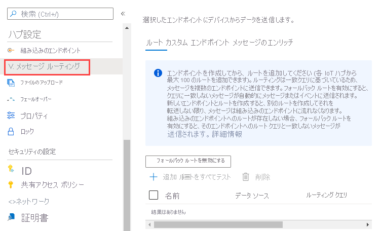

# <a name="tutorial-use-azure-iot-hub-message-enrichments"></a>チュートリアル:Azure IoT Hub のメッセージ エンリッチメントを使用する

"*メッセージ エンリッチメント*" は、指定されたエンドポイントに送信される前のメッセージに対し、追加情報を含んだ "*スタンプ*" を適用する Azure IoT Hub の機能です。 メッセージ エンリッチメントを使用する理由の 1 つは、ダウンストリームの処理を単純化するために用いることのできるデータを追加することです。 たとえば、デバイス ツイン タグを使用してデバイスのテレメトリ メッセージのエンリッチメントを行えば、この情報のために顧客側でデバイス ツイン API を呼び出す負担を軽減することができます。 詳細については、[メッセージ エンリッチメントの概要](iot-hub-message-enrichments-overview.md)に関するページを参照してください。

このチュートリアルでは、IoT ハブ用のメッセージ エンリッチメントをテストするために必要なリソースを作成し、構成する 2 つの方法について説明します。 リソースの 1 つであるストレージ アカウントには、2 つのストレージ コンテナーが含まれます。 1 つのコンテナーにはエンリッチされたメッセージが格納され、別のコンテナーは元のメッセージが保持されます。 また、メッセージを受信し、メッセージがエンリッチされているかどうかに基づいて適切なストレージ コンテナーにメッセージをルーティングするための IoT ハブも含まれています。

* 最初の方法では、Azure CLI を使用してリソースを作成し、メッセージ ルーティングを構成します。 次に、[Azure portal](https://portal.azure.com) を使用して手動でエンリッチメントを定義します。

* 2 番目の方法では、Azure Resource Manager テンプレートを使用してリソースを作成し、メッセージ ルーティングとメッセージ エンリッチメントの構成*も*作成します。

メッセージ ルーティングとメッセージ エンリッチメントの構成が完了したら、アプリケーションを使用してメッセージを IoT ハブに送信します。 その後、ハブによって両方のストレージ コンテナーにルーティングされます。 **enriched** ストレージ コンテナーのエンドポイントに送信されるメッセージだけがエンリッチされます。

このチュートリアルを完了するために行うタスクは次のとおりです。

**IoT Hub のメッセージ エンリッチメントを使用する**
> [!div class="checklist"]
> * 第 1 の方法: Azure CLI を使用してリソースを作成し、メッセージ ルーティングを構成します。 [Azure portal](https://portal.azure.com) を使用して、手動でメッセージ エンリッチメントを構成します。
> * 第 2 の方法: Resource Manager テンプレートを使用して、リソースを作成し、メッセージ ルーティングとメッセージ エンリッチメントを構成します。 
> * IoT デバイスをシミュレートするアプリを実行し、ハブにメッセージを送信します。
> * その結果を表示して、メッセージ エンリッチメントが想定どおりに機能していることを確認します。

## <a name="prerequisites"></a>前提条件

* Azure サブスクリプションが必要です。 Azure サブスクリプションをお持ちでない場合は、開始する前に [無料アカウント](https://azure.microsoft.com/free/?WT.mc_id=A261C142F) を作成してください。
* [Visual Studio](https://www.visualstudio.com/) のインストール。

* ポート 8883 がファイアウォールで開放されていることを確認してください。 このチュートリアルのデバイス サンプルでは、ポート 8883 を介して通信する MQTT プロトコルを使用しています。 このポートは、企業や教育用のネットワーク環境によってはブロックされている場合があります。 この問題の詳細と対処方法については、「[IoT Hub への接続 (MQTT)](iot-hub-mqtt-support.md#connecting-to-iot-hub)」を参照してください。


[!INCLUDE [cloud-shell-try-it.md](../../includes/cloud-shell-try-it.md)]

## <a name="retrieve-the-iot-c-samples-repository"></a>IoT C# サンプル リポジトリを取得する

GitHub から [IoT C# サンプル](https://github.com/Azure-Samples/azure-iot-samples-csharp/archive/master.zip)をダウンロードして解凍します。 このリポジトリには、いくつかのアプリケーション、スクリプト、および Resource Manager テンプレートが含まれています。 このチュートリアルで使用するものは次のとおりです。

* 手動による方法では、リソースの作成に使用される CLI スクリプトがあります。 このスクリプトは /azure-iot-samples-csharp/iot-hub/Tutorials/Routing/SimulatedDevice/resources/iothub_msgenrichment_cli.azcli にあります。 このスクリプトは、リソースを作成し、メッセージ ルーティングを構成します。 このスクリプトを実行した後、[Azure portal](https://portal.azure.com) を使用して、手動でメッセージ エンリッチメントを作成します。
* 自動化された方法では、Azure Resource Manager テンプレートがあります。 テンプレートは /azure-iot-samples-csharp/iot-hub/Tutorials/Routing/SimulatedDevice/resources/template_msgenrichments.json にあります。 このテンプレートは、リソースを作成し、メッセージ ルーティングを構成した後、メッセージ エンリッチメントを構成します。
* 使用する 3 番目のアプリケーションは Device Simulation アプリで、これを使用して IoT ハブにメッセージを送信し、メッセージ エンリッチメントをテストします。

## <a name="manually-set-up-and-configure-by-using-the-azure-cli"></a>Azure CLI を使用して手動でセットアップおよび構成する

この Azure CLI スクリプトは、必要なリソースを作成することに加え、別個のストレージ コンテナーであるエンドポイントへの 2 つのルートを構成します。 メッセージ ルーティングの構成方法について詳しくは、[ルーティングのチュートリアル](tutorial-routing.md)をご覧ください。 リソースのセットアップ後、[Azure portal](https://portal.azure.com) を使用して各エンドポイントのメッセージ エンリッチメントを構成します。 その後、テスト手順に進みます。

> [!NOTE]
> メッセージはすべて両方のエンドポイントにルーティングされますが、エンリッチされるのは、メッセージ エンリッチメントが構成されたエンドポイントに向かうメッセージだけです。
>

以下のスクリプトを使用するか、ダウンロードしたリポジトリの /resources フォルダーにあるスクリプトを開くことができます。 スクリプトでは、次の手順が実行されます。

* IoT Hub を作成します。
* ストレージ アカウントを作成します。
* ストレージ アカウントに 2 つのコンテナーを作成します。 1 つのコンテナーはエンリッチされたメッセージ用で、もう 1 つのコンテナーはエンリッチされていないメッセージ用です。
* 2 つの異なるストレージ アカウントに対するルーティングが設定されます。
    * 各ストレージ アカウント コンテナーのエンドポイントを作成します。
    * 各ストレージ アカウント コンテナーのエンドポイントに対するルートを作成します。

IoT ハブ名やストレージ アカウント名など、グローバルに一意であることが必要なリソース名がいくつかあります。 スクリプトを実行しやすいように、これらのリソース名の末尾には、ランダムな英数字の値 (*randomValue*) が追加されます。 ランダムな値は、スクリプトの先頭で 1 回生成されます。 スクリプト全体を通し、必要に応じてそれがリソース名に追加されます。 値をランダムにしたくない場合は、空の文字列または特定の値に設定できます。

まだ行っていない場合は、Azure [Cloud Shell ウィンドウ](https://shell.azure.com)を開き、Bash に設定されていることを確認します。 解凍したリポジトリ内のスクリプトを開き、Ctrl + A キーを押して全体を選択し、Ctrl + C キーを押してそれをコピーします。 または、以下の CLI スクリプトをコピーするか、Cloud Shell で直接開いてもかまいません。 Cloud Shell ウィンドウのコマンド ラインを右クリックし、 **[貼り付け]** を選択してスクリプトを貼り付けます。 スクリプトは一度に 1 ステートメントずつ実行します。 スクリプトの実行が停止したら、**Enter** キーを押して最後のコマンドを確実に実行します。 以下のコード ブロックは、使用されているスクリプトとその実行内容を説明するコメントを示したものです。

次に示したのは、このスクリプトによって作成されるリソースです。 *Enriched* と表示されているリソースは、エンリッチメントが適用されたメッセージ用であることを意味します。 *Original* と表示されているリソースは、エンリッチメントが適用されていないメッセージ用であることを意味します。

| Name | Value |
|-----|-----|
| resourceGroup | ContosoResourcesMsgEn |
| container name | original  |
| container name | enriched  |
| IoT device name | Contoso-Test-Device |
| IoT Hub 名 | ContosoTestHubMsgEn |
| storage Account Name | contosostorage |
| endpoint Name 1 | ContosoStorageEndpointOriginal |
| endpoint Name 2 | ContosoStorageEndpointEnriched|
| route Name 1 | ContosoStorageRouteOriginal |
| route Name 2 | ContosoStorageRouteEnriched |

```azurecli-interactive
# This command retrieves the subscription id of the current Azure account.
# This field is used when setting up the routing queries.
subscriptionID=$(az account show --query id -o tsv)

# Concatenate this number onto the resources that have to be globally unique.
# You can set this to "" or to a specific value if you don't want it to be random.
# This retrieves a random value.
randomValue=$RANDOM

# This command installs the IOT Extension for Azure CLI.
# You only need to install this the first time.
# You need it to create the device identity.
az extension add --name azure-cli-iot-ext

# Set the values for the resource names that
#   don't have to be globally unique.
location=westus2
resourceGroup=ContosoResourcesMsgEn
containerName1=original
containerName2=enriched
iotDeviceName=Contoso-Test-Device

# Create the resource group to be used
#   for all the resources for this tutorial.
az group create --name $resourceGroup \
    --location $location

# The IoT hub name must be globally unique,
#   so add a random value to the end.
iotHubName=ContosoTestHubMsgEn$randomValue
echo "IoT hub name = " $iotHubName

# Create the IoT hub.
az iot hub create --name $iotHubName \
    --resource-group $resourceGroup \
    --sku S1 --location $location

# You need a storage account that will have two containers
#   -- one for the original messages and
#   one for the enriched messages.
# The storage account name must be globally unique,
#   so add a random value to the end.
storageAccountName=contosostorage$randomValue
echo "Storage account name = " $storageAccountName

# Create the storage account to be used as a routing destination.
az storage account create --name $storageAccountName \
    --resource-group $resourceGroup \
    --location $location \
    --sku Standard_LRS

# Get the primary storage account key.
#    You need this to create the containers.
storageAccountKey=$(az storage account keys list \
    --resource-group $resourceGroup \
    --account-name $storageAccountName \
    --query "[0].value" | tr -d '"')

# See the value of the storage account key.
echo "storage account key = " $storageAccountKey

# Create the containers in the storage account.
az storage container create --name $containerName1 \
    --account-name $storageAccountName \
    --account-key $storageAccountKey \
    --public-access off

az storage container create --name $containerName2 \
    --account-name $storageAccountName \
    --account-key $storageAccountKey \
    --public-access off

# Create the IoT device identity to be used for testing.
az iot hub device-identity create --device-id $iotDeviceName \
    --hub-name $iotHubName

# Retrieve the information about the device identity, then copy the primary key to
#   Notepad. You need this to run the device simulation during the testing phase.
# If you are using Cloud Shell, you can scroll the window back up to retrieve this value.
az iot hub device-identity show --device-id $iotDeviceName \
    --hub-name $iotHubName

##### ROUTING FOR STORAGE #####

# You're going to have two routes and two endpoints.
# One route points to the first container ("original") in the storage account
#   and includes the original messages.
# The other points to the second container ("enriched") in the same storage account
#   and includes the enriched versions of the messages.

endpointType="azurestoragecontainer"
endpointName1="ContosoStorageEndpointOriginal"
endpointName2="ContosoStorageEndpointEnriched"
routeName1="ContosoStorageRouteOriginal"
routeName2="ContosoStorageRouteEnriched"

# for both endpoints, retrieve the messages going to storage
condition='level="storage"'

# Get the connection string for the storage account.
# Adding the "-o tsv" makes it be returned without the default double quotes around it.
storageConnectionString=$(az storage account show-connection-string \
  --name $storageAccountName --query connectionString -o tsv)

# Create the routing endpoints and routes.
# Set the encoding format to either avro or json.

# This is the endpoint for the first container, for endpoint messages that are not enriched.
az iot hub routing-endpoint create \
  --connection-string $storageConnectionString \
  --endpoint-name $endpointName1 \
  --endpoint-resource-group $resourceGroup \
  --endpoint-subscription-id $subscriptionID \
  --endpoint-type $endpointType \
  --hub-name $iotHubName \
  --container $containerName1 \
  --resource-group $resourceGroup \
  --encoding json

# This is the endpoint for the second container, for endpoint messages that are enriched.
az iot hub routing-endpoint create \
  --connection-string $storageConnectionString \
  --endpoint-name $endpointName2 \
  --endpoint-resource-group $resourceGroup \
  --endpoint-subscription-id $subscriptionID \
  --endpoint-type $endpointType \
  --hub-name $iotHubName \
  --container $containerName2 \
  --resource-group $resourceGroup \
  --encoding json

# This is the route for messages that are not enriched.
# Create the route for the first storage endpoint.
az iot hub route create \
  --name $routeName1 \
  --hub-name $iotHubName \
  --source devicemessages \
  --resource-group $resourceGroup \
  --endpoint-name $endpointName1 \
  --enabled \
  --condition $condition

# This is the route for messages that are enriched.
# Create the route for the second storage endpoint.
az iot hub route create \
  --name $routeName2 \
  --hub-name $iotHubName \
  --source devicemessages \
  --resource-group $resourceGroup \
  --endpoint-name $endpointName2 \
  --enabled \
  --condition $condition
```

この時点で、リソースはすべてセットアップされ、メッセージ ルーティングが構成されました。 ポータルでメッセージのルーティング構成を確認し、**enriched** ストレージ コンテナーに向かうメッセージに対するエンリッチメントを設定することができます。

### <a name="manually-configure-the-message-enrichments-by-using-the-azure-portal"></a>Azure portal を使用してメッセージ エンリッチメントを手動で構成する

1. **[リソース グループ]** を選択して、お使いの IoT ハブに移動します。 このチュートリアル用に設定されたリソース グループ (**ContosoResourcesMsgEn**) を選択します。 一覧で IoT ハブを探して選択します。 IoT ハブの **[メッセージ ルーティング]** を選択します。

   

   メッセージ ルーティング ペインには、 **[ルート]** 、 **[カスタム エンドポイント]** 、 **[メッセージのエンリッチ]** の 3 つのタブがあります。 スクリプトによって設定された構成を確認するには、最初の 2 つのタブを参照します。 メッセージ エンリッチメントは、3 つ目のタブを使用して追加します。 **enriched** というストレージ コンテナーのエンドポイントに向かうメッセージをエンリッチしてみましょう。 名前と値を入力した後、ドロップダウン リストからエンドポイント **ContosoStorageEndpointEnriched** を選択します。 IoT ハブの名前をメッセージに追加するエンリッチメントを設定する例を次に示します。

   

2. ContosoStorageEndpointEnriched エンドポイントのリストに次の値を追加します。

   | Key | Value | エンドポイント (ドロップダウン リスト) |
   | ---- | ----- | -------------------------|
   | myIotHub | $iothubname | AzureStorageContainers > ContosoStorageEndpointEnriched |
   | DeviceLocation | $twin.tags.location | AzureStorageContainers > ContosoStorageEndpointEnriched |
   |customerID | 6ce345b8-1e4a-411e-9398-d34587459a3a | AzureStorageContainers > ContosoStorageEndpointEnriched |

   > [!NOTE]
   > デバイスにツインが存在しない場合、メッセージ エンリッチメントの値には、ここに入力した値が文字列のスタンプとして適用されます。 デバイス ツインの情報を見るには、ポータルでお使いのハブに移動し、 **[IoT デバイス]** を選択します。 デバイスを選択してから、ページの上部にある **[デバイス ツイン]** を選択します。
   >
   > ツイン情報を編集して場所などのタグを追加し、特定の値に設定することができます。 詳細については、「[IoT Hub のデバイス ツインの理解と使用](iot-hub-devguide-device-twins.md)」を参照してください。

3. 作業が完了すると、ウィンドウは次の画像のようになります。

   

4. **[適用]** を選択して変更を保存します。 「[メッセージ エンリッチメントをテストする](#test-message-enrichments)」までスキップします。

## <a name="create-and-configure-by-using-a-resource-manager-template"></a>Resource Manager テンプレートを使用して作成および構成する
Resource Manager テンプレートを使用して、リソース、メッセージ ルーティング、メッセージ エンリッチメントを作成および構成できます。

1. Azure portal にサインインします。 **[+ リソースの作成]** を選択して、検索ボックスを表示します。 「*template deployment*」と入力して検索します。 結果ウィンドウで、 **[Template deployment (deploy using custom template)]\(テンプレートのデプロイ (カスタム テンプレートを使用してデプロイ)\)** を選択します。

   

1. **[テンプレートのデプロイ]** ウィンドウで **[作成]** を選択します。

1. **[カスタム デプロイ]** ペインで、 **[エディターで独自のテンプレートを作成する]** を選択します。

1. **[テンプレートの編集]** ペインで、 **[ファイルの読み込み]** を選択します。 エクスプローラーが表示されます。 **/iot-hub/Tutorials/Routing/SimulatedDevice/resources** にある解凍されたリポジトリ ファイルから **template_messageenrichments.json** ファイルを見つけます。 

   

1. **[開く]** を選択して、ローカル コンピューターからテンプレート ファイルを読み込みます。 読み込まれて編集ペインに表示されます。

   このテンプレートは、既定の名前の末尾にランダムな値を追加することによって、グローバルに一意の IoT ハブ名とストレージ アカウント名を使用するように設定されているため、何も変更することなくテンプレートを使用できます。

   次に示すのは、テンプレートを読み込むことによって作成されるリソースです。 **Enriched** と表示されているリソースは、エンリッチメントが適用されたメッセージ用であることを意味します。 **Original** と表示されているリソースは、エンリッチメントが適用されていないメッセージ用であることを意味します。 これらは、Azure CLI スクリプトで使用される値と同じです。

   | Name | Value |
   |-----|-----|
   | resourceGroup | ContosoResourcesMsgEn |
   | container name | original  |
   | container name | enriched  |
   | IoT device name | Contoso-Test-Device |
   | IoT Hub 名 | ContosoTestHubMsgEn |
   | storage Account Name | contosostorage |
   | endpoint Name 1 | ContosoStorageEndpointOriginal |
   | endpoint Name 2 | ContosoStorageEndpointEnriched|
   | route Name 1 | ContosoStorageRouteOriginal |
   | route Name 2 | ContosoStorageRouteEnriched |

1. **[保存]** を選択します。 **[カスタム デプロイ]** ペインが表示され、テンプレートで使用されているすべてのパラメーターが示されます。 設定する必要があるフィールドは **[リソース グループ]** だけです。 新しいものを作成するか、ドロップダウン リストから選択します。

   次に示すのは、 **[カスタム デプロイ]** ペインの上半分です。 リソース グループを入力する場所を確認できます。

   ![[カスタム デプロイ] ペインの上半分](./media/tutorial-message-enrichments/template-deployment-top.png)

1. 次に示すのは、 **[カスタム デプロイ]** ペインの下半分です。 残りのパラメーターと使用条件を確認できます。 

   ![[カスタム デプロイ] ペインの下半分](./media/tutorial-message-enrichments/template-deployment-bottom.png)

1. チェック ボックスをオンにして、使用条件に同意します。 次に、 **[購入]** を選択して、テンプレートのデプロイを続けます。

1. テンプレートが完全にデプロイされるまで待ちます。 進行状況を確認するには、画面の上部にあるベルのアイコンを選択します。 完了したら、「[メッセージ エンリッチメントをテストする](#test-message-enrichments)」セクションに進みます。

## <a name="test-message-enrichments"></a>メッセージ エンリッチメントをテストする

メッセージ エンリッチメントを表示するには、 **[リソース グループ]** を選択します。 次に、このチュートリアルで使用しているリソース グループを選択します。 リソースの一覧から IoT ハブを選択して、 **[メッセージング]** に移動します。 メッセージ ルーティングの構成と、構成されたエンリッチメントが表示されます。

メッセージ エンリッチメントはエンドポイントに対して構成されているので、シミュレートされたデバイスのアプリケーションを実行して、IoT ハブにメッセージを送信します。 ハブは、次のタスクを実行するように設定されています。

* ストレージ エンドポイント ContosoStorageEndpointOriginal にルーティングされたメッセージはエンリッチされず、ストレージ コンテナー `original` に格納されます。

* ストレージ エンドポイント ContosoStorageEndpointEnriched にルーティングされたメッセージはエンリッチされて、ストレージ コンテナー `enriched` に格納されます。

シミュレートされたデバイスのアプリケーションは、解凍後のダウンロードに含まれているアプリケーションの 1 つです。 このアプリケーションでは、[ルーティングのチュートリアル](tutorial-routing.md)で説明されているさまざまなメッセージ ルーティング方法でメッセージが送信され、それには Azure Storage が含まれます。

ソリューション ファイル **IoT_SimulatedDevice.sln** をダブルクリックしてコードを Visual Studio で開いた後、**Program.cs** を開きます。 マーカー `{your hub name}` を IoT ハブ名で置き換えます。 IoT ハブのホスト名の形式は、 **{自分のハブ名}.azure-devices.net** です。 このチュートリアルでのハブのホスト名は、ContosoTestHubMsgEn.azure-devices.net です。 次に、マーカー `{your device key}` を、先にスクリプトを実行してリソースを作成したときに保存したデバイス キーに置き換えます。

デバイス キーがない場合は、ポータルから取得できます。 サインインした後、 **[リソース グループ]** に移動し、お使いのリソース グループを選択して、目的の IoT ハブを選択します。 テスト デバイスに対する **[IoT デバイス]** で、該当するデバイスを選択します。 **[プライマリ キー]** の横にあるコピー アイコンを選択して、クリップボードにコピーします。

   ```csharp
        private readonly static string s_myDeviceId = "Contoso-Test-Device";
        private readonly static string s_iotHubUri = "ContosoTestHubMsgEn.azure-devices.net";
        // This is the primary key for the device. This is in the portal.
        // Find your IoT hub in the portal > IoT devices > select your device > copy the key.
        private readonly static string s_deviceKey = "{your device key}";
   ```

### <a name="run-and-test"></a>実行してテストする

数分間、コンソール アプリケーションを実行します。 送信中のメッセージがアプリケーションのコンソール画面に表示されます。

アプリは、1 秒おきにデバイスからクラウドへの新しいメッセージを IoT ハブに送信します。 メッセージには、デバイス ID、温度、湿度、およびメッセージ レベル (既定値は `normal`) を含む、JSON でシリアル化されたオブジェクトが含まれます。 `critical` または `storage` のレベルがランダムに割り当てられているので、メッセージはストレージ アカウントまたは既定のエンドポイントにルーティングされます。 ストレージ アカウント内の **enriched** コンテナーに送信されたメッセージがエンリッチされます。

ストレージ メッセージがいくつか送信されたら、データを確認します。

1. **[リソース グループ]** を選択します。 対象のリソース グループ **ContosoResourcesMsgEn** を探して選択します。

2. 該当するストレージ アカウント **contosostorage** を選択します。 次に、左側のペインで **[Storage Explorer (プレビュー)]** を選択します。

   

   **[BLOB コンテナー]** を選択すると、使用可能な 2 つのコンテナーが表示されます。

   

**enriched** というコンテナー内のメッセージには、メッセージ エンリッチメントが適用されています。 **original** コンテナー内のメッセージには、エンリッチメントが適用されていない生のメッセージが格納されます。 コンテナーの 1 つをドリルダウンして下端まで移動し、最新のメッセージ ファイルを開きます。 その後、他のコンテナーに対しても同じ操作を実行し、そのコンテナー内のメッセージにエンリッチメントが追加されていないことを確認します。

エンリッチされたメッセージを見ると、次のように、"my IoT Hub" とハブ名、場所、顧客 ID が含まれているはずです。

```json
{"EnqueuedTimeUtc":"2019-05-10T06:06:32.7220000Z","Properties":{"level":"storage","my IoT Hub":"contosotesthubmsgen3276","devicelocation":"$twin.tags.location","customerID":"6ce345b8-1e4a-411e-9398-d34587459a3a"},"SystemProperties":{"connectionDeviceId":"Contoso-Test-Device","connectionAuthMethod":"{\"scope\":\"device\",\"type\":\"sas\",\"issuer\":\"iothub\",\"acceptingIpFilterRule\":null}","connectionDeviceGenerationId":"636930642531278483","enqueuedTime":"2019-05-10T06:06:32.7220000Z"},"Body":"eyJkZXZpY2VJZCI6IkNvbnRvc28tVGVzdC1EZXZpY2UiLCJ0ZW1wZXJhdHVyZSI6MjkuMjMyMDE2ODQ4MDQyNjE1LCJodW1pZGl0eSI6NjQuMzA1MzQ5NjkyODQ0NDg3LCJwb2ludEluZm8iOiJUaGlzIGlzIGEgc3RvcmFnZSBtZXNzYWdlLiJ9"}
```

次はエンリッチされていないメッセージです。 "my IoT Hub"、"devicelocation"、"customerID" の各フィールドは、エンリッチメントによって追加されるため、ここには示されていないことに注意してください。 このエンドポイントにはエンリッチメントはありません。

```json
{"EnqueuedTimeUtc":"2019-05-10T06:06:32.7220000Z","Properties":{"level":"storage"},"SystemProperties":{"connectionDeviceId":"Contoso-Test-Device","connectionAuthMethod":"{\"scope\":\"device\",\"type\":\"sas\",\"issuer\":\"iothub\",\"acceptingIpFilterRule\":null}","connectionDeviceGenerationId":"636930642531278483","enqueuedTime":"2019-05-10T06:06:32.7220000Z"},"Body":"eyJkZXZpY2VJZCI6IkNvbnRvc28tVGVzdC1EZXZpY2UiLCJ0ZW1wZXJhdHVyZSI6MjkuMjMyMDE2ODQ4MDQyNjE1LCJodW1pZGl0eSI6NjQuMzA1MzQ5NjkyODQ0NDg3LCJwb2ludEluZm8iOiJUaGlzIGlzIGEgc3RvcmFnZSBtZXNzYWdlLiJ9"}
```

## <a name="clean-up-resources"></a>リソースをクリーンアップする

このチュートリアルで作成したリソースをすべて削除するには、リソース グループを削除します。 これにより、そのグループ内に含まれているすべてのリソースも削除されます。 この場合は、IoT ハブ、ストレージ アカウント、リソース グループ自体が削除されます。

### <a name="use-the-azure-cli-to-clean-up-resources"></a>Azure CLI を使用してリソースをクリーンアップする

リソース グループを削除するには、[az group delete](https://docs.microsoft.com/cli/azure/group?view=azure-cli-latest#az-group-delete) コマンドを使います。 `$resourceGroup` は、このチュートリアルの最初で **ContosoResourcesMsgEn** に設定されたことを思い出してください。

```azurecli-interactive
az group delete --name $resourceGroup
```

## <a name="next-steps"></a>次のステップ

このチュートリアルでは、次の手順を使用して、IoT Hub メッセージへのメッセージ エンリッチメントの追加を構成、テストしました。

**IoT Hub のメッセージ エンリッチメントを使用する**
> [!div class="checklist"]
> * 第 1 の方法: Azure CLI を使用してリソースを作成し、メッセージ ルーティングを構成します。 [Azure portal](https://portal.azure.com) を使用して、手動でメッセージ エンリッチメントを構成します。
> * 第 2 の方法: Azure Resource Manager テンプレートを使用して、リソースを作成し、メッセージ ルーティングとメッセージ エンリッチメントを構成します。
> * IoT デバイスをシミュレートするアプリを実行し、ハブにメッセージを送信します。
> * その結果を表示して、メッセージ エンリッチメントが想定どおりに機能していることを確認します。

メッセージ エンリッチメントの詳細については、[メッセージ エンリッチメントの概要](iot-hub-message-enrichments-overview.md)に関するページを参照してください。

メッセージ ルーティングの詳細については、次の記事を参照してください。

* [IoT Hub メッセージ ルーティングを使用して device-to-cloud メッセージを別のエンドポイントに送信する](iot-hub-devguide-messages-d2c.md)
* [チュートリアル:IoT Hub のルーティング](tutorial-routing.md)
