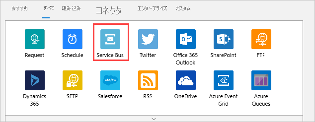
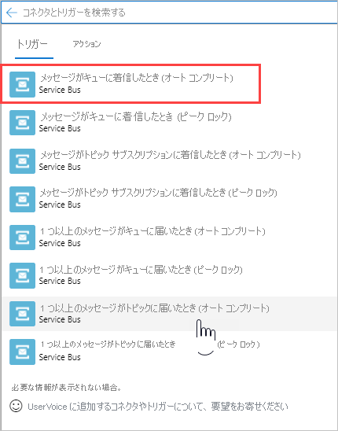
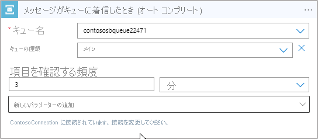
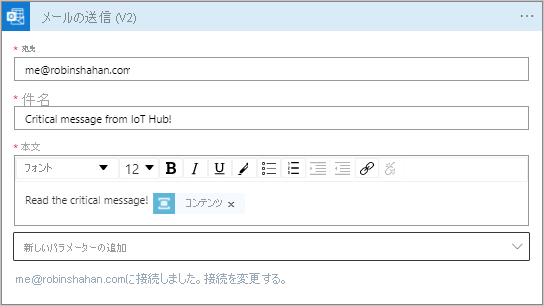
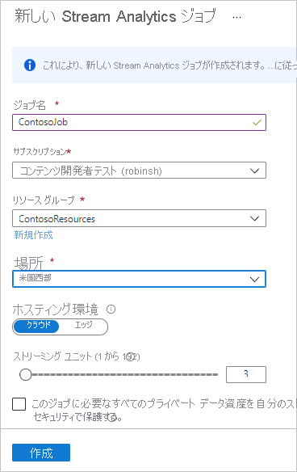
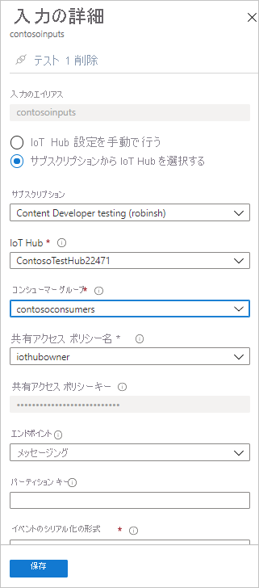
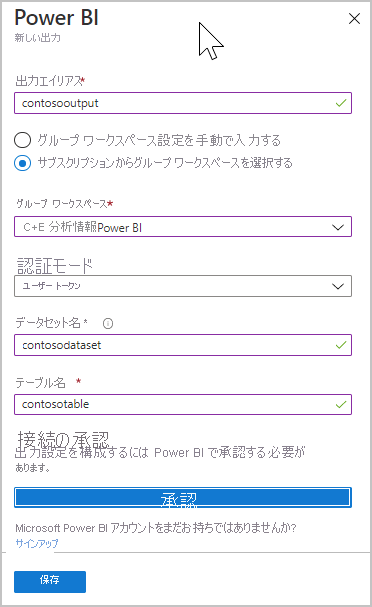
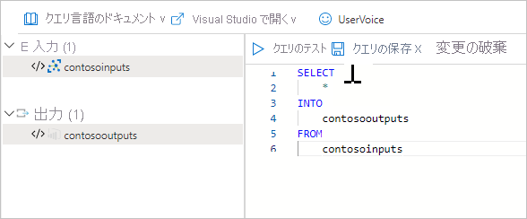

# <a name="tutorial-part-2---view-the-routed-messages"></a>チュートリアル:パート 2 - ルーティングされたメッセージを表示する

[!INCLUDE [iot-hub-include-routing-intro](../../includes/iot-hub-include-routing-intro.md)]

[!INCLUDE [updated-for-az](../../includes/updated-for-az.md)]

## <a name="rules-for-routing-the-messages"></a>メッセージ ルーティングの規則

以下に示すのは、メッセージ ルーティングの規則です。これらはこのチュートリアルのパート 1 で設定したものです。このパート 2 では、これらが機能することを確認します。

|value |結果|
|------|------|
|level="storage" |Azure Storage に書き込みます。|
|level="critical" |Service Bus キューに書き込みます。 ロジック アプリがキューからメッセージを取得し、Office 365 を使ってメールでメッセージを送信します。|
|default |Power BI を使ってこのデータを表示します。|

次にメッセージのルーティング先となるリソースを作成し、アプリを実行してメッセージをハブに送信し、稼働中のルーティングを確認しましょう。

## <a name="create-a-logic-app"></a>ロジック アプリの作成  

Service Bus キューは、critical と指定されているメッセージを受信するために使います。 Service Bus キューを監視してメッセージがキューに追加されたらメールを送信する、ロジック アプリを設定します。

1. [Azure portal](https://portal.azure.com) で **[+ リソースの作成]** を選択します。 検索ボックスに「**ロジック アプリ**」と入力して、Enter キーを押します。 表示される検索結果で、ロジック アプリを選び、 **[作成]** を選択して **[ロジック アプリの作成]** ウィンドウに進みます。 フィールドに入力します。

   **[名前]** :このフィールドはロジック アプリの名前です。 このチュートリアルでは、**ContosoLogicApp** を使います。

   **サブスクリプション**:Azure サブスクリプションを選択します。

   **[リソース グループ]** : **[既存のものを使用]** を選択して、リソース グループを選びます。 このチュートリアルでは、**ContosoResources** を使います。

   **場所**:自分の場所を使用します。 このチュートリアルでは、 **[米国西部]** を使います。

   **Log Analytics**:このトグルはオフにする必要があります。

   ![[ロジック アプリの作成] 画面](./media/tutorial-routing-view-message-routing-results/create-logic-app.png)

   **作成** を選択します。

2. ロジック アプリに移動します。 ロジック アプリに最も簡単に移動するには、 **[リソース グループ]** を選択し、お使いのリソース グループ (このチュートリアルでは **ContosoResources** を使っています) を選び、リソースの一覧からロジック アプリを選びます。 [Logic Apps デザイナー] ページが表示されます (ページ全体を見るには右にスクロールする必要がある場合があります)。 [Logic Apps デザイナー] ページで、下にスクロールして **[空のロジック アプリ +]** タイルを選択します。 既定のタブは [おすすめ] です。 このウィンドウに何も表示されない場合は、 **[すべて]** を選択すると、利用できるすべてのコネクタとトリガーが表示されます。

3. コネクタの一覧から **[Service Bus]** を選択します。

   

4. トリガーの一覧が表示されます。 **[メッセージがキューに着信したとき (オート コンプリート) / Service Bus]** を選びます。

   

5. 次の画面で、[接続名] を入力します。 このチュートリアルでは、**ContosoConnection** を使います。

   

   Service Bus 名前空間を選択します。 このチュートリアルでは、**ContosoSBNamespace** を使います。 名前空間を選ぶと、ポータルは Service Bus 名前空間を照会してキーを取得します。 **RootManageSharedAccessKey** を選び、 **[作成]** を選択します。

   

6. 次の画面で、ドロップダウン リストからキューの名前を選びます (このチュートリアルでは **contososbqueue**)。 残りのフィールドは既定値のままでかまいません。

   

7. 次に、キューでメッセージを受け取ったときにメールを送信するアクションを設定します。 Logic Apps デザイナーで **[+ 新しいステップ]** を選択してステップを追加し、 **[すべて]** を選択して、利用できるオプションをすべて表示します。 **[アクションの選択]** ウィンドウで、 **[Office 365 Outlook]** を探して選択します。 トリガー画面で、 **[メールの送信 / Office 365 Outlook]** を選びます。  

   

8. Office 365 アカウントにサインインして接続を設定します。 タイムアウトになった場合は、もう一度やり直してください。 メールの受信者のメール アドレスを指定します。 また、件名を指定し、受信者が見るメッセージ本文を入力します。 テストでは、受信者として自分のメール アドレスを入力します。

   **[動的なコンテンツの追加]** を選択して、含めることができるメッセージの内容を表示します。 **[コンテンツ]** を選びます。メッセージがメールに追加されます。

   

9. **[保存]** を選択します。 Logic Apps デザイナーを閉じます。

## <a name="set-up-azure-stream-analytics"></a>Azure Stream Analytics を設定する

Power BI の視覚エフェクトにデータを表示するには、最初に、データを取得するように Stream Analytics ジョブを設定します。 既定のエンドポイントに送信されるのは **level** が **normal** のメッセージだけであり、メッセージは Power BI の視覚エフェクトのために Stream Analytics ジョブによって取得されることに注意してください。

### <a name="create-the-stream-analytics-job"></a>Stream Analytics ジョブを作成する

1. [Azure portal](https://portal.azure.com) で、 **[リソースの作成]**  >  **[モノのインターネット (IoT)]**  >  **[Stream Analytics ジョブ]** の順に選択します。

2. 次の情報をジョブに入力します。

   **ジョブ名**:ジョブの名前。 名前はグローバルに一意である必要があります。 このチュートリアルでは、**contosoJob** を使います。

   **サブスクリプション**:このチュートリアルで自分が使用している Azure サブスクリプション。

   **[リソース グループ]** :IoT ハブで使用されるのと同じリソース グループを使います。 このチュートリアルでは、**ContosoResources** を使います。

   **場所**:セットアップ スクリプトで使用されるのと同じ場所を使います。 このチュートリアルでは、 **[米国西部]** を使います。

   

3. **[作成]** を選択してジョブを作成します。 ジョブに戻るには、 **[リソース グループ]** を選択します。 このチュートリアルでは、**ContosoResources** を使います。 リソース グループを選択し、リソースの一覧で Stream Analytics ジョブを選択します。

### <a name="add-an-input-to-the-stream-analytics-job"></a>Stream Analytics ジョブへの入力の追加

4. **[ジョブ トポロジ]** で、 **[入力]** を選択します。

5. **[入力]** ウィンドウで、 **[ストリーム入力の追加]** を選択して [IoT Hub] を選びます。 表示される画面で、次のフィールドを入力します。

   **入力のエイリアス**:このチュートリアルでは、**contosoinputs** を使います。

   **サブスクリプションから IoT Hub を選択する**: このラジオ ボタン オプションを選択します。

   **サブスクリプション**:このチュートリアルに使用している Azure サブスクリプションを選択します。

   **IoT Hub**:IoT ハブを選びます。 このチュートリアルでは、**ContosoTestHub** を使います。

   **エンドポイント**: **[メッセージング]** を選びます。 ([操作の監視] を選ぶと、チュートリアルで送信しているデータではなく、IoT ハブに関する利用統計情報が取得されます)。 

   **共有アクセス ポリシー名**: **[サービス]** を選択します。 [共有アクセス ポリシー キー] はポータルによって自動的に設定されます。

   **コンシューマー グループ**:このチュートリアルの手順 1. で設定したコンシューマー グループを選択します。 このチュートリアルでは、**contosoconsumers** を使います。
   
   その他のフィールドについては、既定値を指定できます。 

   

6. **[保存]** を選択します。

### <a name="add-an-output-to-the-stream-analytics-job"></a>Stream Analytics ジョブへの出力の追加

1. **[ジョブ トポロジ]** で、 **[出力]** を選択します。

2. **[出力]** ウィンドウで **[追加]** を選択し、 **[Power BI]** を選びます。 表示される画面で、次のフィールドを入力します。

   **出力のエイリアス**:出力の一意のエイリアス。 このチュートリアルでは、**contosooutputs** を使います。 

   **データセット名**:Power BI で使用されるデータセットの名前。 このチュートリアルでは、**contosodataset** を使います。 

   **テーブル名**:Power BI で使用されるテーブルの名前。 このチュートリアルでは、**contosotable** を使います。

   その他のフィールドについては、既定値を指定できます。

3. **[承認]** を選択して、自分の Power BI アカウントにサインインします。 再試行が必要になる場合があります。

   

4. **[保存]** を選択します。

### <a name="configure-the-query-of-the-stream-analytics-job"></a>Stream Analytics ジョブのクエリの構成

1. **[ジョブ トポロジ]** で、 **[クエリ]** を選択します。

2. `[YourInputAlias]` をジョブの入力エイリアスに置き換えます。 このチュートリアルでは、**contosoinputs** を使います。

3. `[YourOutputAlias]` をジョブの出力エイリアスに置き換えます。 このチュートリアルでは、**contosooutputs** を使います。

   

4. **[保存]** を選択します。

5. [クエリ] ウィンドウを閉じます。 [リソース グループ] のリソースの表示に戻ります。 Stream Analytics ジョブを選択します。 このチュートリアルでは **contosoJob** という名前です。

### <a name="run-the-stream-analytics-job"></a>Stream Analytics ジョブの実行

Stream Analytics ジョブで、 **[開始]**  >  **[現在]**  >  **[開始]** の順に選択します。 ジョブが正常に開始されると、ジョブの状態が **[停止済み]** から **[実行中]** に変わります。

Power BI レポートを設定するにはデータが必要なので、デバイスを作成し、デバイス シミュレーション アプリケーションを実行した後で、Power BI を設定します。

## <a name="run-simulated-device-app"></a>シミュレートされたデバイス アプリを実行する

このチュートリアルのパート 1 では、IoT デバイスの使用をシミュレートするデバイスを設定しました。 このセクションでは、このチュートリアルのパート 1 でアプリとリソースをまだダウンロードしていないと仮定して、device-to-cloud メッセージを IoT ハブに送信するデバイスをシミュレートする .NET コンソール アプリをダウンロードします。

このアプリケーションは、異なるメッセージ ルーティング方法ごとにメッセージを送信します。 ダウンロード内のフォルダーには、Azure Resource Manager テンプレートとパラメーター ファイル一式のほか、Azure CLI と PowerShell のスクリプトも含まれています。

このチュートリアルの手順 1. でリポジトリからファイルをダウンロードしなかった場合は、ここで [IoT デバイス シミュレーション](https://github.com/Azure-Samples/azure-iot-samples-csharp/archive/master.zip)からダウンロードしてください。 このリンクを選択すると、いくつかのアプリケーションを含むリポジトリがダウンロードされます。探しているソリューションは、iot-hub/Tutorials/Routing/IoT_SimulatedDevice.sln です。 

ソリューション ファイル (IoT_SimulatedDevice.sln) をダブルクリックしてコードを Visual Studio で開いてから、Program.cs を開きます。 `{iot hub hostname}` を、IoT ハブのホスト名で置き換えます。 IoT ハブのホスト名の形式は、 **{iot-hub-name}.azure-devices.net** です。 このチュートリアルでのハブのホスト名は、**ContosoTestHub.azure-devices.net** です。 次に、`{device key}` を、シミュレートされたデバイスを設定するときに保存したデバイス キーに置き換えます。 

   ```csharp
        static string myDeviceId = "contoso-test-device";
        static string iotHubUri = "ContosoTestHub.azure-devices.net";
        // This is the primary key for the device. This is in the portal. 
        // Find your IoT hub in the portal > IoT devices > select your device > copy the key. 
        static string deviceKey = "{your device key here}";
   ```

## <a name="run-and-test"></a>実行してテストする

コンソール アプリケーションを実行します。 数分待ちます。 アプリケーションのコンソール画面で、メッセージが送信されていることを確認できます。

アプリは、1 秒おきにデバイスからクラウドへの新しいメッセージを IoT ハブに送信します。 メッセージには、デバイス ID、温度、湿度、およびメッセージ レベル (既定値は `normal`) を含む、JSON でシリアル化されたオブジェクトが含まれます。 アプリはランダムにレベル `critical` または `storage` を割り当てるので、メッセージはストレージ アカウントまたは Service Bus キュー (ロジック アプリによるメールの送信がトリガーされます) にルーティングされます。 既定値 (`normal`) は、次に設定する BI レポートに表示されます。

すべてが正しく設定されている場合、この時点で次の結果が表示されるはずです。

1. 重大メッセージに関するメールの受信が始まります。

   

   この結果から次のことがわかります。 

   * Service Bus キューへのルーティングは、正常に動作しています。
   * Service Bus キューからメッセージを取得するロジック アプリは、正常に動作しています。
   * Outlook へのロジック アプリ コネクタは、正常に動作しています。 

2. [Azure portal](https://portal.azure.com) で **[リソース グループ]** を選択し、自分のリソース グループを選びます。 このチュートリアルでは、**ContosoResources** を使います。 ストレージ アカウントを選び、 **[BLOB]** を選択して、コンテナーを選びます。 このチュートリアルでは、**contosoresults** を使います。 フォルダーが表示され、ファイルが表示されるまでディレクトリをドリルダウンできます。 ファイルの 1 つを開くと、ストレージ アカウントにルーティングされたエントリが含まれています。 

   

この結果から次のことがわかります。

   * ストレージ アカウントへのルーティングは、正常に動作しています。

アプリケーションをまだ実行したまま、既定のルーティングで送られたメッセージを表示するように、Power BI の視覚エフェクトを設定します。

## <a name="set-up-the-power-bi-visualizations"></a>Power BI の視覚化の設定

1. [Power BI](https://powerbi.microsoft.com/) アカウントにサインインします。

2. **[ワークスペース]** に移動し、Stream Analytics ジョブの出力を作成するときに設定したワークスペースを選びます。 このチュートリアルでは、**マイ ワークスペース**を使います。 

3. **[データセット]** を選択します。 データセットがない場合は、数分待ってからもう一度確認してください。

   Stream Analytics ジョブの出力を作成したときに指定したデータセットが一覧で表示されます。 このチュートリアルでは、**contosodataset** を使います。 (データセットが初めて表示されるまでに、5 ～ 10 分かかる場合があります。)

4. **[アクション]** の左端のアイコンを選択し、レポートを作成します。

   

5. 時間の経過に伴う温度の変化を示す折れ線グラフを作成します。

   * レポート作成ページで、折れ線グラフ アイコンを選択して折れ線グラフを追加します。

     

   * **[フィールド]** ウィンドウで、Stream Analytics ジョブの出力を作成したときに指定したテーブルを展開します。 このチュートリアルでは、**contosotable** を使います。

   * **EventEnqueuedUtcTime** を、 **[視覚化]** ウィンドウの **[軸]** にドラッグします。

   * **temperature** を **[値]** にドラッグします。

   折れ線グラフが作成されます。 x 軸は日付と時刻 (UTC タイム ゾーン) を示し、 y 軸はセンサーから取得した温度を示します。

6. 時間の経過に伴う湿度の変化を示す、別の折れ線グラフを作成します。 2 番目のグラフを設定するには、上記と同じ手順を行ったうえで、**EventEnqueuedUtcTime** を x 軸、**humidity** を y 軸に設定します。

   

7. **[保存]** を選択してレポートを保存します。

両方のグラフにデータを表示できます。 この結果から次のことがわかります。

   * 既定のエンドポイントへのルーティングは、正常に動作しています。
   * Azure Stream Analytics ジョブは、正常にストリーミングしています。
   * Power BI の視覚エフェクトは、正しく設定されています。

Power BI ウィンドウの上部にある [最新の情報に更新] ボタンを選択することで、グラフを更新して最新のデータを表示できます。 

## <a name="clean-up-resources"></a>リソースのクリーンアップ 

このチュートリアルの両パートを通じて作成したリソースをすべて削除するには、リソース グループを削除します。 これにより、そのグループ内に含まれているすべてのリソースも削除されます。 この例では、IoT ハブ、Service Bus の名前空間とキュー、ロジック アプリ、ストレージ アカウント、およびリソース グループ自体が削除されます。 

### <a name="clean-up-resources-in-the-power-bi-visualization"></a>Power BI の視覚エフェクトのリソースをクリーンアップする

[Power BI](https://powerbi.microsoft.com/) アカウントにサインインします。 ワークスペースに移動します。 このチュートリアルでは、**マイ ワークスペース**を使います。 Power BI の視覚化を削除するには、[データセット] に移動し、ごみ箱アイコンを選択してデータセットを削除します。 このチュートリアルでは、**contosodataset** を使います。 データセットを削除すると、レポートも削除されます。

### <a name="use-the-azure-cli-to-clean-up-resources"></a>Azure CLI を使用してリソースをクリーンアップする

リソース グループを削除するには、[az group delete](https://docs.microsoft.com/cli/azure/group?view=azure-cli-latest#az-group-delete) コマンドを使います。 `$resourceGroup` は、このチュートリアルの開始時に **ContosoResources** に設定されました。

```azurecli-interactive
az group delete --name $resourceGroup
```

### <a name="use-powershell-to-clean-up-resources"></a>PowerShell を使用してリソースをクリーンアップする

リソース グループを削除するには、[Remove-AzResourceGroup](https://docs.microsoft.com/powershell/module/az.resources/remove-azresourcegroup) コマンドを使います。 `$resourceGroup` は、このチュートリアルの開始時に **ContosoResources** に設定されました。

```azurepowershell-interactive
Remove-AzResourceGroup -Name $resourceGroup
```

## <a name="next-steps"></a>次の手順

この 2 部構成のチュートリアルでは、以下のタスクを実行することにより、メッセージ ルーティングを使って IoT Hub メッセージをさまざまな宛先にルーティングする方法を学習しました。  

**パート I: リソースを作成してメッセージ ルーティングを設定する**
> [!div class="checklist"]
> * リソースを作成する (IoT ハブ、ストレージ アカウント、Service Bus キュー、シミュレートされたデバイス)。
> * ストレージ アカウントと Service Bus キューに対するエンドポイントとメッセージ ルートを IoT Hub で構成する。

**パート II: メッセージをハブに送信して、ルーティングされた結果を表示する**
> [!div class="checklist"]
> * メッセージが Service Bus キューに追加されるとトリガーされてメールを送信するロジック アプリを作成します。
> * 異なるルーティング オプションでハブにメッセージを送信する IoT デバイスをシミュレートするアプリをダウンロードして実行します。
> * 既定のエンドポイントに送信されたデータに対する Power BI の視覚エフェクトを作成します。
> * 結果を表示します ...
> * ... Service Bus キューおよびメール内の結果。
> * ... ストレージ アカウント内の結果。
> * ... Power BI の視覚エフェクト内の結果。

次のチュートリアルに進み、IoT デバイスの状態を管理する方法を学習してください。 

> [!div class="nextstepaction"]
> [IoT ハブのメトリックと診断を設定して使用する](tutorial-use-metrics-and-diags.md)
