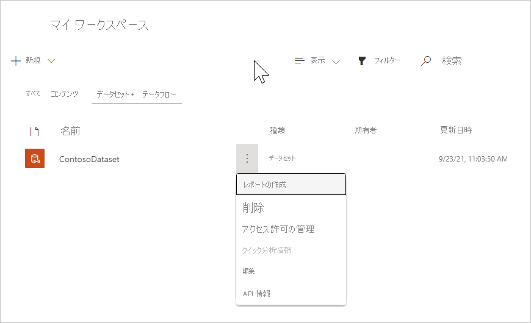

# <a name="tutorial-part-2---view-the-routed-messages"></a>チュートリアル:パート 2 - ルーティングされたメッセージを表示する

[!INCLUDE [iot-hub-include-routing-intro](../../includes/iot-hub-include-routing-intro.md)]

[!INCLUDE [updated-for-az](../../includes/updated-for-az.md)]

## <a name="rules-for-routing-the-messages"></a>メッセージ ルーティングの規則

以下に示すのは、このチュートリアルのパート 1 で設定したメッセージ ルーティングの規則です。このパート 2 では、これらが機能することを確認します。

|値 |結果|
|------|------|
|level="storage" |Azure Storage に書き込みます。|
|level="critical" |Service Bus キューに書き込みます。 ロジック アプリでは、キューからメッセージを取得し、 
 Office 365 を使用してメッセージを電子メールで配信します。|
|既定値 (default) |Power BI を使ってこのデータを表示します。|

次にメッセージのルーティング先となるリソースを作成し、アプリを実行してメッセージをハブに送信し、稼働中のルーティングを確認しましょう。

## <a name="create-a-logic-app"></a>ロジック アプリの作成  

Service Bus キューは、critical と指定されているメッセージを受信するために使います。 Service Bus キューを監視してメッセージがキューに追加されたらメールを送信する、ロジック アプリを設定します。

1. [Azure portal](https://portal.azure.com) で **[+ リソースの作成]** を選択します。 検索ボックスに「**ロジック アプリ**」と入力して、Enter キーを押します。 表示される検索結果で、ロジック アプリを選び、 **[作成]** を選択して **[ロジック アプリの作成]** ウィンドウに進みます。 フィールドに入力します。

   **サブスクリプション**:Azure サブスクリプションを選択します。

   **リソース グループ**: [リソース グループ] フィールドの下の **[新規作成]** を選択します。 リソース グループの名前として、**ContosoResources** を指定します。 

   **インスタンスの詳細**
   **種類**: インスタンスの [種類] では、 **[従量課金プラン]** を選択します。 

   **[ロジック アプリ名]** では、ロジック アプリの名前を指定します。 このチュートリアルでは、**ContosoLogicApp** を使います。 

   **リージョン**: 最も近いデータセンターの場所を使用します。 このチュートリアルでは、 **[米国西部]** を使います。

   **Enable Log Analytics\(Log Analytics を有効にする\)** : Log Analytics を有効にしない場合は、このトグル ボタンを設定します。 

   ![[ロジック アプリの作成] 画面](./media/tutorial-routing-view-message-routing-results/create-logic-app.png)

   **[確認および作成]** を選択します。 アプリがデプロイされるまで、数分かかる場合があります。 完了すると、デプロイの概要を示す画面が表示されます。 

2. ロジック アプリに移動します。 まだデプロイ ページが表示されていれば、 **[リソースに移動]** を選択できます。 ロジック アプリに移動するもう 1 つの方法として、 **[リソース グループ]** を選択し、お使いのリソース グループ (このチュートリアルでは **ContosoResources** を使用しています) を選び、リソースの一覧からロジック アプリを選択します。 

    下にスクロールして、 **[空のロジック アプリ +]** という名前のほとんど空のタイルが表示されたら、それを選択します。 この画面の既定のタブは、[おすすめ] です。 このウィンドウに何も表示されない場合は、 **[すべて]** を選択すると、利用できるコネクタとトリガーが表示されます。

3. コネクタの一覧から **[Service Bus]** を選択します。

   

4. 次のスクリーンショットは、トリガーの一覧を示しています。 **[メッセージがキューに着信したとき (オートコンプリート)]** と書かれたトリガーを選択します。

   

5. 次の画面のフィールドに接続情報を入力します。

   **接続名**: ContosoConnection
   
   Service Bus 名前空間を選択します。 このチュートリアルでは、**ContosoSBNamespace** を使います。 キーの名前 (RootManageSharedAccessKey) と権限 (リッスン、管理、送信) が取得され、読み込まれます。 **[RootManageSharedAccessKey]** を選択します。 **[作成]** ボタンが青色 (アクティブ) に変わります。 それを選択します。キューの選択画面が表示されます。  

6. 次に、キューに関する情報を求めるメッセージが表示されます。  

   

   **キュー名:** このフィールドは、メッセージの送信元のキューの名前です。 このドロップダウン リストをクリックして、セットアップ手順で設定したキュー名を選択します。 このチュートリアルでは、**contososbqueue** を使います。

   **キューの種類:** キューの種類。 ドロップダウン リストから **[メイン]** を選択します。

   他のフィールドでは既定値を使用します。 **[保存]** を選択して、ロジック アプリ デザイナーの構成を保存します。

7. **[+ 新しいステップ]** を選択します。 **[操作を選択してください]** ウィンドウが表示されます。 **[Office 365 Outlook]** を選択します。 一覧で、 **[電子メールの送信 (V2)]** を探して選択します。 Office 365 アカウントにサインインします。   

8. キュー内のメッセージに関する電子メールを送信するときに使用されるフィールドに入力します。 

    

   **宛先:** 警告を送信する電子メール アドレスを入力します。

   **件名:** 電子メールの件名を入力します。

   **本文**: 本文のテキストを入力します。 **[動的なコンテンツの追加]** をクリックすると、電子メールに含めるために選択できるフィールドが表示されます。 何も表示されない場合は、 **[もっと見る]** を選択して、他のオプションを表示します。 **[コンテンツ]** を選択すると、電子メールの本文がエラー メッセージに表示されます。

9. **[保存]** をクリックして変更を保存します。 ロジック アプリ デザイナーを閉じます。 

## <a name="set-up-azure-stream-analytics"></a>Azure Stream Analytics を設定する

Power BI の視覚エフェクトにデータを表示するには、最初に、データを取得するように Stream Analytics ジョブを設定します。 既定のエンドポイントに送信されるのは **level** が **normal** のメッセージだけであり、メッセージは Power BI の視覚エフェクトのために Stream Analytics ジョブによって取得されることに注意してください。

### <a name="create-the-stream-analytics-job"></a>Stream Analytics ジョブを作成する

1. [Azure portal](https://portal.azure.com) の検索ボックスに、「**stream** **analytics** **ジョブ**」と入力し、**Enter** キーを押します。 **[作成]** を選択して Stream Analytics ジョブ画面にアクセスし、 **[作成]** を再度選択して、作成画面にアクセスします。 

2. 次の情報をジョブに入力します。

   **ジョブ名**:ジョブの名前。 名前はグローバルに一意である必要があります。 このチュートリアルでは、**contosoJob** を使います。

   **サブスクリプション**:このチュートリアルで自分が使用している Azure サブスクリプション。

   **[リソース グループ]** :IoT ハブで使用されるのと同じリソース グループを使います。 このチュートリアルでは、**ContosoResources** を使います。

   **[場所]** :セットアップ スクリプトで使用されるのと同じ場所を使います。 このチュートリアルでは、 **[米国西部]** を使います。

   

3. **[作成]** を選択してジョブを作成します。 デプロイに数分かかることがあります。

    ジョブに戻るには、 **[リソースに移動]** を選択します。 また、 **[リソース グループ]** を選択することもできます。 このチュートリアルでは、**ContosoResources** を使います。 次に、リソース グループを選択し、リソースに一覧で Stream Analytics ジョブを選択します。

### <a name="add-an-input-to-the-stream-analytics-job"></a>Stream Analytics ジョブへの入力の追加

1. **[ジョブ トポロジ]** で、 **[入力]** を選択します。

2. **[入力]** ウィンドウで、 **[ストリーム入力の追加]** を選択して [IoT Hub] を選びます。 表示される画面で、次のフィールドを入力します。

   **入力のエイリアス**:このチュートリアルでは、**contosoinputs** を使います。

   **[サブスクリプションから IoT Hub を選択する]** を選択し、ドロップダウン リストからお使いのサブスクリプションを選択します。
   
   **IoT Hub**:IoT ハブを選択します。 このチュートリアルでは、**ContosoTestHub** を使います。

   **コンシューマー グループ**:このチュートリアルのパート 1 で設定したコンシューマー グループを選択します。 このチュートリアルでは、**contosoconsumers** を使います。

   **共有アクセス ポリシー名**: **[サービス]** を選択します。 [共有アクセス ポリシー キー] はポータルによって自動的に設定されます。

   **エンドポイント**: **[メッセージング]** を選びます。 ([操作の監視] を選ぶと、チュートリアルで送信しているデータではなく、IoT ハブに関する利用統計情報が取得されます)。 

   その他のフィールドについては、既定値を指定できます。 

   

3. **[保存]** を選択します。

### <a name="add-an-output-to-the-stream-analytics-job"></a>Stream Analytics ジョブへの出力の追加

1. **[ジョブ トポロジ]** で、 **[出力]** を選択します。

2. **[出力]** ウィンドウで **[追加]** を選択し、 **[Power BI]** を選びます。 表示される画面で、次のフィールドを入力します。

   **出力のエイリアス**:出力の一意のエイリアス。 このチュートリアルでは、**contosooutputs** を使います。 

   **[Select Group workspace from your subscriptions]\(サブスクリプションからグループ ワークスペースを選択する\)** を選択します。 **[グループ ワークスペース]** で、 **[マイ ワークスペース]** を指定します。

   **認証モード**: **[ユーザー トークン]** を選択します。 

   **データセット名**:Power BI で使用されるデータセットの名前。 このチュートリアルでは、**contosodataset** を使います。 

   **テーブル名**:Power BI で使用されるテーブルの名前。 このチュートリアルでは、**contosotable** を使います。

3. **[承認]** を選択して、自分の Power BI アカウントにサインインします。 (サインインを複数回試行することが必要な場合があります)。

   

4. **[保存]** を選択します。

### <a name="configure-the-query-of-the-stream-analytics-job"></a>Stream Analytics ジョブのクエリの構成

1. **[ジョブ トポロジ]** で、 **[クエリ]** を選択します。

2. `[YourInputAlias]` をジョブの入力エイリアスに置き換えます。 このチュートリアルでは、**contosoinputs** を使います。

3. `[YourOutputAlias]` をジョブの出力エイリアスに置き換えます。 このチュートリアルでは、**contosooutputs** を使います。

   

4. **[保存]** を選択します。

5. [クエリ] ウィンドウを閉じます。 [リソース グループ] のリソースの表示に戻ります。 Stream Analytics ジョブを選択します。 このチュートリアルでは **contosoJob** という名前です。

### <a name="run-the-stream-analytics-job"></a>Stream Analytics ジョブの実行

Stream Analytics ジョブで、 **[開始]**  >  **[現在]**  >  **[開始]** の順に選択します。 ジョブが正常に開始されると、ジョブの状態が **[停止済み]** から **[実行中]** に変わります。

Power BI レポートを設定するにはデータが必要であるため、デバイスを作成し、デバイス シミュレーション アプリケーションを実行してデータを生成した後、Power BI を設定します。

## <a name="run-simulated-device-app"></a>シミュレートされたデバイス アプリを実行する

このチュートリアルのパート 1 では、IoT デバイスの使用をシミュレートするデバイスを設定しました。 device-to-cloud メッセージを IoT ハブに送信するデバイスをシミュレートする .NET コンソール アプリをまだダウンロードしていない場合は、ここでダウンロードします。

このアプリケーションは、異なるメッセージ ルーティング方法ごとにメッセージを送信します。 ダウンロード内のフォルダーには、Azure Resource Manager テンプレートとパラメーター ファイル一式のほか、Azure CLI と PowerShell のスクリプトも含まれています。

このチュートリアルのパート 1 でリポジトリからファイルをダウンロードしなかった場合は、ここで [IoT デバイス シミュレーション](https://github.com/Azure-Samples/azure-iot-samples-csharp/archive/main.zip)からダウンロードしてください。 このリンクを選択すると、いくつかのアプリケーションを含むリポジトリがダウンロードされます。探しているソリューションは、iot-hub/Tutorials/Routing/IoT_SimulatedDevice.sln です。 

ソリューション ファイル (IoT_SimulatedDevice.sln) をダブルクリックしてコードを Visual Studio で開いてから、Program.cs を開きます。 `{your hub name}` を、IoT ハブのホスト名で置き換えます。 IoT ハブのホスト名の形式は、 **{iot-hub-name}.azure-devices.net** です。 このチュートリアルでのハブのホスト名は、**ContosoTestHub.azure-devices.net** です。 次に、`{your device key}` を、シミュレートされたデバイスを設定するときに保存したデバイス キーに置き換えます。 

   ```csharp
        static string s_myDeviceId = "Contoso-Test-Device";
        static string s_iotHubUri = "ContosoTestHub.azure-devices.net";
        // This is the primary key for the device. This is in the portal. 
        // Find your IoT hub in the portal > IoT devices > select your device > copy the key. 
        static string s_deviceKey = "{your device key}";
   ```

## <a name="run-and-test"></a>実行してテストする

コンソール アプリケーションを実行します。 数分待ちます。 アプリケーションのコンソール画面で、メッセージが送信されていることを確認できます。

アプリは、1 秒おきにデバイスからクラウドへの新しいメッセージを IoT ハブに送信します。 メッセージには、デバイス ID、温度、湿度、およびメッセージ レベル (既定値は `normal`) を含む、JSON でシリアル化されたオブジェクトが含まれます。 アプリはランダムにレベル `critical` または `storage` を割り当てるので、メッセージはストレージ アカウントまたは Service Bus キュー (ロジック アプリによるメールの送信がトリガーされます) にルーティングされます。 既定値 (`normal`) は、BI レポートに表示されます。 

すべてが正しく設定されている場合、この時点で次の結果が表示されるはずです。

1. 重大メッセージに関するメールの受信が始まります。

   

   この結果から次のことがわかります。 

   * Service Bus キューへのルーティングは、正常に動作しています。
   * Service Bus キューからメッセージを取得するロジック アプリは、正常に動作しています。
   * Outlook へのロジック アプリ コネクタは、正常に動作しています。 

2. [Azure portal](https://portal.azure.com) で **[リソース グループ]** を選択し、自分のリソース グループを選びます。 このチュートリアルでは、**ContosoResources** を使います。 

    ストレージ アカウントを選択し、 **[コンテナー]** を選択して、結果を格納するコンテナーを選択します。 このチュートリアルでは、**contosoresults** を使います。 フォルダーが表示され、ファイルが表示されるまでディレクトリをドリルダウンできます。 ファイルの 1 つを開くと、ストレージ アカウントにルーティングされたエントリが含まれています。 

   

この結果から次のことがわかります。

   * ストレージ アカウントへのルーティングは、正常に動作しています。

アプリケーションをまだ実行したまま、既定のエンドポイント経由で送られたメッセージを表示するように、Power BI の視覚化を設定します。

## <a name="set-up-the-power-bi-visualizations"></a>Power BI の視覚化の設定

1. [Power BI](https://powerbi.microsoft.com/) アカウントにサインインします。

2. **[マイ ワークスペース]** を選択します。 作成されたデータセットが少なくとも 1 つ表示されます。 何も表示されない場合は、さらに 5 から 10 分間 **シミュレートされたデバイス** アプリケーションを実行して、ストリーミングするデータを増やします。 ワークスペースが表示されると、ContosoDataset という名前のデータセットが作成されています。 データセット名の右側にある縦に並んだ 3 つのドットを右クリックします。 ドロップダウン リストで、 **[レポートの作成]** を選択します。

     

3. 右側の **[視覚化]** セクションで、 **[折れ線グラフ]** を選択して、BI レポート ページで折れ線グラフを使用することを選択します。 スペースを水平方向に埋めるようにグラフィックをドラッグします。 次に、右側の **[フィールド]** セクションで、ContosoTable を開きます。 **[EventEnqueuedUtcTime]** を選択します。 X 軸に沿って配置する必要があります。 **[temperature]** を選択し、気温の **[値]** フィールドにドラッグします。 これにより、気温がグラフに追加されます。 次の図のようになります。

     

4. グラフ領域の下半分をクリックします。 **[折れ線グラフ]** を再度選択します。 最初のグラフの下にグラフが作成されます。

5. テーブルで、 **[EventQueuedTime]** を選択すると、[軸] フィールドに配置されます。 **[humidity]** を [値] フィールドにドラッグします。 以上で、両方のグラフが表示されます。

     

   IoT Hub の既定のエンドポイントから Azure Stream Analytics にメッセージを送信しました。 次に、データを表示する Power BI レポートを追加し、気温と湿度を表す 2 つのグラフを追加しました。 

7. **[ファイル] > [保存]** の順に選択して、レポートを保存します。プロンプトが表示されたら、レポートの名前を入力します。 ワークスペースにレポートを保存します。

両方のグラフにデータを表示できます。 この結果から次のことがわかります。

   * 既定のエンドポイントへのルーティングは、正常に動作しています。
   * Azure Stream Analytics ジョブは、正常にストリーミングしています。
   * Power BI の視覚エフェクトは、正しく設定されています。

Power BI ウィンドウの上部にある [最新の情報に更新] ボタンを選択することで、グラフを更新して最新のデータを表示できます。 

## <a name="clean-up-resources"></a>リソースをクリーンアップする 

このチュートリアルの両パートを通じて作成した Azure リソースをすべて削除するには、リソース グループを削除します。 これにより、そのグループ内に含まれているすべてのリソースも削除されます。 この例では、IoT ハブ、Service Bus の名前空間とキュー、ロジック アプリ、ストレージ アカウント、およびリソース グループ自体が削除されます。 また、Power BI リソースを削除することや、チュートリアル中に送信された電子メールをクリアすることもできます。

### <a name="clean-up-resources-in-the-power-bi-visualization"></a>Power BI の視覚エフェクトのリソースをクリーンアップする

[Power BI](https://powerbi.microsoft.com/) アカウントにサインインします。 ワークスペースに移動します。 このチュートリアルでは、**マイ ワークスペース** を使います。 Power BI の視覚化を削除するには、[データセット] に移動し、ごみ箱アイコンを選択してデータセットを削除します。 このチュートリアルでは、**contosodataset** を使います。 データセットを削除すると、レポートも削除されます。

### <a name="use-the-azure-cli-to-clean-up-resources"></a>Azure CLI を使用してリソースをクリーンアップする

リソース グループを削除するには、[az group delete](/cli/azure/group#az_group_delete) コマンドを使います。 `$resourceGroup` は、このチュートリアルの開始時に **ContosoResources** に設定されました。

```azurecli-interactive
az group delete --name $resourceGroup
```

### <a name="use-powershell-to-clean-up-resources"></a>PowerShell を使用してリソースをクリーンアップする

リソース グループを削除するには、[Remove-AzResourceGroup](/powershell/module/az.resources/remove-azresourcegroup) コマンドを使います。 `$resourceGroup` は、このチュートリアルの開始時に **ContosoResources** に設定されました。

```azurepowershell-interactive
Remove-AzResourceGroup -Name $resourceGroup
```

### <a name="clean-up-test-emails"></a>テスト電子メールのクリーンアップ

デバイス アプリケーションの実行中にロジック アプリから生成された、受信トレイ内の多数の電子メールを削除することもできます。

## <a name="next-steps"></a>次のステップ

この 2 部構成のチュートリアルでは、以下のタスクを実行することにより、メッセージ ルーティングを使って IoT Hub メッセージをさまざまな宛先にルーティングする方法を学習しました。  

**パート I: リソースを作成してメッセージ ルーティングを設定する**
> [!div class="checklist"]
> * リソースを作成する (IoT ハブ、ストレージ アカウント、Service Bus キュー、シミュレートされたデバイス)。
> * ストレージ アカウントと Service Bus キューに対するエンドポイントとメッセージ ルートを IoT Hub で構成する。

**パート II: メッセージをハブに送信して、ルーティングされた結果を表示する**
> [!div class="checklist"]
> * メッセージが Service Bus キューに追加されるとトリガーされてメールを送信するロジック アプリを作成します。
> * 異なるルーティング オプションでハブにメッセージを送信する IoT デバイスをシミュレートするアプリをダウンロードして実行します。
>
> * 既定のエンドポイントに送信されたデータに対する Power BI の視覚エフェクトを作成します。
>
> * 結果を表示します ...
> * ... Service Bus キューおよびメール内の結果。
> * ... ストレージ アカウント内の結果。
> * ... Power BI の視覚エフェクト内の結果。


次のチュートリアルに進み、IoT デバイスの状態を管理する方法を学習してください。 

> [!div class="nextstepaction"]
> [IoT ハブのメトリックと診断を設定して使用する](tutorial-use-metrics-and-diags.md)
