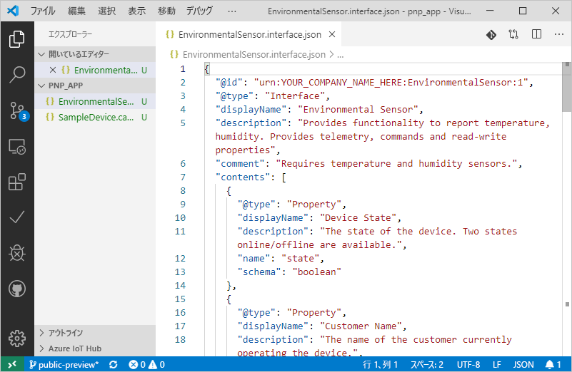
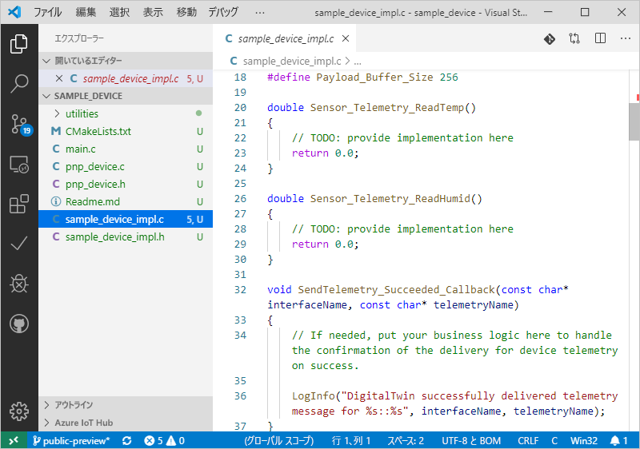

# <a name="quickstart-use-a-device-capability-model-to-create-an-iot-plug-and-play-preview-device-linux"></a>クイック スタート:デバイス機能モデルを使用して IoT プラグ アンド プレイ プレビュー デバイスを作成する (Linux)

"_デバイス機能モデル_" (DCM) には、IoT プラグ アンド プレイ デバイスの機能が記述されています。 DCM は多くの場合、製品 SKU に関連付けられています。 DCM で定義されている機能は、再利用可能なインターフェイスにまとめられています。 DCM からスケルトン デバイス コードを生成できます。 このクイックスタートでは、Ubuntu Linux 上で VS Code を使用して DCM を利用した IoT プラグ アンド プレイ デバイスを作成する方法について説明します。

## <a name="prerequisites"></a>前提条件

このクイックスタートは、デスクトップ環境で Ubuntu Linux を使用していることを前提としています。 このチュートリアルの手順は、Ubuntu 18.04 を使用してテストされました。

このクイックスタートを完了するには、ご利用のローカルの Linux マシンに次のソフトウェアをインストールする必要があります。

* `apt-get` コマンドを使用して、**GCC**、**Git**、**cmake**、およびすべての依存関係をインストールします。

    ```sh
    sudo apt-get update
    sudo apt-get install -y git cmake build-essential curl libcurl4-openssl-dev libssl-dev uuid-dev
    ```

    `cmake` のバージョンが **2.8.12** より大きく、**GCC** のバージョンが **4.4.7** より大きいことを確認します。

    ```sh
    cmake --version
    gcc --version
    ```

* [Visual Studio Code](https://code.visualstudio.com/)。

### <a name="install-azure-iot-tools"></a>Azure IoT Tools のインストール

[VS Code 用の Azure IoT Tools](https://marketplace.visualstudio.com/items?itemName=vsciot-vscode.azure-iot-tools) 拡張機能パックをインストールするには、次の手順に従います。

1. VS Code で、 **[拡張機能]** タブを選択します。
1. **Azure IoT Tools** を検索します。
1. **[インストール]** を選択します。

### <a name="get-the-connection-string-for-your-company-model-repository"></a>ご利用の会社モデル リポジトリの接続文字列を取得する

Microsoft の職場または学校アカウントを使用するか、Microsoft パートナー ID (所持している場合) を使用してサインインすると、[Azure Certified for IoT](https://preview.catalog.azureiotsolutions.com) ポータルに、ご利用の "_会社モデル リポジトリ接続文字列_" が表示されます。 サインインしたら、 **[Company repository]\(会社リポジトリ\)** 、 **[接続文字列]** の順に選択します。

[!INCLUDE [cloud-shell-try-it.md](../../includes/cloud-shell-try-it.md)]

## <a name="prepare-an-iot-hub"></a>IoT ハブを準備する

また、このクイックスタートを完了するには、ご利用の Azure サブスクリプション内に Azure IoT ハブが必要です。 Azure サブスクリプションをお持ちでない場合は、開始する前に [無料アカウント](https://azure.microsoft.com/free/?WT.mc_id=A261C142F) を作成してください。 使用する IoT ハブがまだない場合は、このセクションの残りの部分に従って作成してください。

Azure CLI をローカルで使用している場合、`az` のバージョンは **2.0.75** 以降である必要があります。Azure Cloud Shell には最新バージョンが使用されています。 マシンにインストールされているバージョンを確認するには、`az --version` コマンドを使用します。

次のコマンドを実行して、Microsoft Azure IoT Extension for Azure CLI を Cloud Shell インスタンスに追加します。

```azurecli-interactive
az extension add --name azure-cli-iot-ext
```

このクイックスタートの手順を行うには、バージョン **0.8.5** 以降の拡張機能が必要です。 インストールされているバージョンを確認するには `az extension list` コマンドを、必要に応じて更新するには `az extension update` コマンドを使用します。

IoT ハブがない場合は、次のコマンドを使用して作成します。`<YourIoTHubName>` は任意の一意の名前に置き換えます。 これらのコマンドをローカルで実行している場合は、まず `az login` を使用して Azure サブスクリプションにサインインします。 Azure Cloud Shell で次のコマンドを実行している場合は、自動的にサインインされます。

  ```azurecli-interactive
  az group create --name pnpquickstarts_rg --location centralus
  az iot hub create --name <YourIoTHubName> \
    --resource-group pnpquickstarts_rg --sku S1
  ```

上記のコマンドを実行すると、`pnpquickstarts_rg` という名前のリソース グループと IoT ハブが米国中部リージョンに作成されます。

> [!IMPORTANT]
> パブリック プレビュー中、IoT プラグ アンド プレイ機能は、**米国中部**、**北ヨーロッパ**、および**東日本**の各リージョンで作成された IoT ハブでのみご利用いただけます。

次のコマンドを実行して、ご利用の IoT ハブにデバイス ID を作成します。 **YourIoTHubName** および **YourDeviceID** のプレースホルダーを、お使いの "_IoT Hub 名_" および "_デバイス ID_" に置き換えます。

```azurecli-interactive
az iot hub device-identity create --hub-name <YourIoTHubName> --device-id <YourDeviceID>
```

次のコマンドを実行して、登録したデバイスの "_デバイス接続文字列_" を取得します (後で使用するためにメモします)。

```azurecli-interactive
az iot hub device-identity show-connection-string --hub-name <YourIoTHubName> --device-id <YourDevice> --output table
```

## <a name="prepare-the-development-environment"></a>開発環境の準備

このクイックスタートでは、[Vcpkg](https://github.com/microsoft/vcpkg) ライブラリ マネージャーを使用して、開発環境に Azure IoT C デバイス SDK をインストールします。

シェルを開きます。 次のコマンドを実行して Vcpkg をインストールします。

```bash
cd ~
git clone https://github.com/microsoft/vcpkg
cd vcpkg
./bootstrap-vcpkg.sh
./vcpkg install azure-iot-sdk-c[public-preview,use_prov_client]
```

この操作は、完了するまでに数分かかります。

## <a name="author-your-model"></a>モデルを作成する

このクイックスタートでは、既存のサンプル デバイス機能モデルおよび関連するインターフェイスを使用します。

1. ローカル ドライブに `pnp_app` ディレクトリを作成します。 デバイス モデル ファイルとデバイス コード スタブには、このフォルダーを使用します。

    ```bash
    cd ~
    mkdir pnp_app
    ```

1. デバイスの機能モデルとインターフェイスのサンプル ファイルを `pnp_app` フォルダーにダウンロードします。

    ```bash
    cd pnp_app
    curl -O -L https://raw.githubusercontent.com/Azure/IoTPlugandPlay/master/samples/SampleDevice.capabilitymodel.json
    curl -O -L https://raw.githubusercontent.com/Azure/IoTPlugandPlay/master/samples/EnvironmentalSensor.interface.json
    ```

1. VS Code を使用して `pnp_app` フォルダーを開きます。 IntelliSense を使用してファイルを表示できます。

    

1. ダウンロードしたファイル内で、`@id` フィールド `schema` とフィールド内の `<YOUR_COMPANY_NAME_HERE>` を一意の値に置き換えます。 英数字 (a-z、A-Z、0-9) とアンダースコアのみを使用してください。 詳細については、[デジタル ツイン識別子の形式](https://github.com/Azure/IoTPlugandPlay/tree/master/DTDL#digital-twin-identifier-format)に関するページを参照してください。

## <a name="generate-the-c-code-stub"></a>C コード スタブを生成する

DCM とそれに関連するインターフェイスの用意ができたので、モデルを実装するデバイス コードを生成できます。 VS Code 上で C コード スタブを生成するには:

1. VS Code で `pnp_app` フォルダーを開き、**Ctrl + Shift + P** キーを押してコマンド パレットを開きます。「**IoT プラグ アンド プレイ**」と入力し、 **[Generate Device Code Stub]\(デバイス コード スタブを生成する\)** を選択します。

    > [!NOTE]
    > IoT プラグ アンド プレイ コード ジェネレーター ユーティリティを初めて使用するときは、自動によるダウンロードとインストールに数秒かかります。

1. デバイス コード スタブの生成に使用する **SampleDevice.capabilitymodel.json** ファイルを選択します。

1. プロジェクト名「**sample_device**」を入力します。 これは、デバイス アプリケーションの名前になります。

1. 使用する言語として、 **[ANSI C]** を選択します。

1. 接続方法として **[Via IoT Hub device connection string]\(IoT Hub デバイス接続文字列による\)** を選択します。

1. プロジェクト テンプレートとして **[CMake Project on Linux]\(Linux 上の CMake テンプレート\)** を選択します。

1. デバイス SDK を含める方法として、 **[Via Vcpkg]\(Vcpkg 経由\)** を選択します。

1. DCM ファイルと同じ場所に **sample_device** という名前の新しいフォルダーが作成され、生成されたデバイス コード スタブ ファイルがそこに格納されます。 VS Code によって、これらを表示する新しいウィンドウが開かれます。
    

## <a name="build-and-run-the-code"></a>コードのビルドと実行

デバイス SDK のソース コードを使用して、生成されたデバイス コード スタブをビルドします。 ビルドしたアプリケーションでは、IoT ハブに接続するデバイスのシミュレーションが行われます。 アプリケーションによりテレメトリとプロパティが送信され、コマンドが受け取られます。

1. **sample_device** アプリケーションの **CMake** ビルド フォルダーを作成します。

    ```bash
    cd ~/pnp_app/sample_device
    mkdir cmake
    cd cmake
    ```

1. CMake を実行し、SDK を使用してアプリをビルドします。 次のコマンドでは、ホーム フォルダーに **vcpkg** がインストールされていることを前提としています。

    ```bash
    cmake .. -DCMAKE_TOOLCHAIN_FILE=~/vcpkg/scripts/buildsystems/vcpkg.cmake -Duse_prov_client=ON -Dhsm_type_symm_key:BOOL=ON
    cmake --build .
    ```

1. ビルドが正常に完了したら、IoT ハブ デバイス接続文字列をパラメーターとして渡すアプリケーションを実行します。

    ```sh
    cd ~/pnp_app/sample_device/cmake
    ./sample_device "<YourDeviceConnectionString>"
    ```

1. そのデバイス アプリケーションによって IoT Hub へのデータの送信が開始されます。

    

## <a name="validate-the-code"></a>コードを検証する

### <a name="publish-device-model-files-to-model-repository"></a>デバイス モデル ファイルをモデル リポジトリに発行する

**az** CLI を使用してデバイス コードを検証するには、モデル リポジトリにファイルを発行する必要があります。

1. VS Code で `pnp_app` フォルダーを開き、**Ctrl + Shift + P** キーを使用してコマンド パレットを開きます。「**IoT プラグ アンド プレイ: モデル リポジトリにファイルを送信する**」と入力して選択します。

1. `SampleDevice.capabilitymodel.json` と `EnvironmentalSensor.interface.json` ファイルを選択します。

1. ご利用の会社モデル リポジトリ接続文字列を入力します。

    > [!NOTE]
    > 接続文字列は、初めてリポジトリに接続するときにのみ必要です。

1. VS Code の出力ウィンドウと通知では、ファイルが正常に発行されたことを確認できます。

    > [!NOTE]
    > デバイス モデル ファイルの発行に関するエラーが発生した場合は、コマンド **[IoT プラグ アンド プレイ: モデル リポジトリからサインアウトする]** を使用してサインアウトし、再度手順を行ってみてください。

### <a name="use-the-azure-iot-cli-to-validate-the-code"></a>Azure IoT CLI を使用してコードを検証する

デバイス クライアント サンプルを起動したら、Azure CLI を使って動作していることを確認できます。

次のコマンドを使用して、サンプル デバイスから送信されているテレメトリを表示します。 出力にテレメトリが表示されるまで、状況に応じて 1、2 分待つ必要があります。

```azurecli-interactive
az iot dt monitor-events --hub-name <YourIoTHubNme> --device-id <YourDevice>
```

デバイスから送信されたすべてのプロパティを表示するには、次のコマンドを使用します。

```azurecli-interactive
az iot dt list-properties --device-id <YourDevice> --hub-name <YourIoTHubNme> --source private --repo-login "<YourCompanyModelRepositoryConnectionString>"
```

[!INCLUDE [iot-pnp-clean-resources.md](../../includes/iot-pnp-clean-resources.md)]

## <a name="next-steps"></a>次の手順

このクイックスタートでは、DCM を使用して IoT プラグ アンド プレイ デバイスを作成する方法について学習しました。

DCM と独自のモデルの作成方法の詳細については、次のチュートリアルに進んでください。

> [!div class="nextstepaction"]
> [チュートリアル:Visual Studio Code を使用してデバイス機能モデルを作成し、テストする](tutorial-pnp-visual-studio-code.md)
